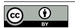

# Abstract

Computing attention is the backbone of transformer-based models like large language models. However, the increasing diversity of attention algorithms presents significant challenges for unleashing hardware performance. State-of-theart variants like FlashAttention target a specific attention algorithm or hardware platform, which fail to generalize to other algorithms and platforms.

We present MetaAttention, a framework that automatically derives the optimal implementation of an attention algorithm given a hardware platform. Our key insight is that variants of attention can be abstracted into two operations: relevance scoring and aggregation, complemented by customizable functions and configurations like the input shape. Based on it, we systematically design a cross-backend attention runtime around these operations that generalizes to variants of attention with customizable operators. To unleash the hardware performance, we further propose an IntermediateTensor-based search method to find the optimal tiling strategy and the parallelism scheme according to the attention customization and hardware features. MetaAttention delivers up to a 10.4× speedup for configurations

[This work is licensed under a Creative Commons Attribution 4.0 Interna](https://creativecommons.org/licenses/by/4.0)[tional License.](https://creativecommons.org/licenses/by/4.0)

PPoPP '26, Sydney, NSW, Australia © 2026 Copyright held by the owner/author(s). ACM ISBN 979-8-4007-2310-0/2026/01 <https://doi.org/10.1145/3774934.3786444>

previously unsupported by state-of-the-art systems. Additionally, MetaAttention achieves performance comparable to manually-optimized libraries such as FlashMLA while significantly reducing the amount of code required.

CCS Concepts: • Computing methodologies → Parallel computing methodologies; • Computer systems organization → Parallel architectures.

Keywords: Attention mechanism, GPU acceleration, Kernel optimization, Cross-platform, Large language models

### ACM Reference Format:

Feiyang Chen, Yu Cheng, Lei Wang, Yuqing Xia, Ziming Miao, Lingxiao Ma, Fan Yang, Jilong Xue, Zhi Yang, Mao Yang, Xingda Wei, and Haibo Chen. 2026. MetaAttention: A Unified and Performant Attention Framework across Hardware Backends. In Proceedings of the 31st ACM SIGPLAN Annual Symposium on Principles and Practice of Parallel Programming (PPoPP '26), January 31 – February 4, 2026, Sydney, NSW, Australia. ACM, New York, NY, USA, [13](#page-12-0) pages. <https://doi.org/10.1145/3774934.3786444>

