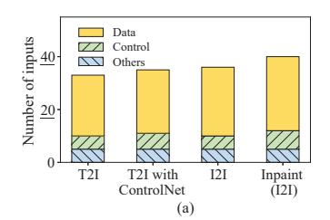
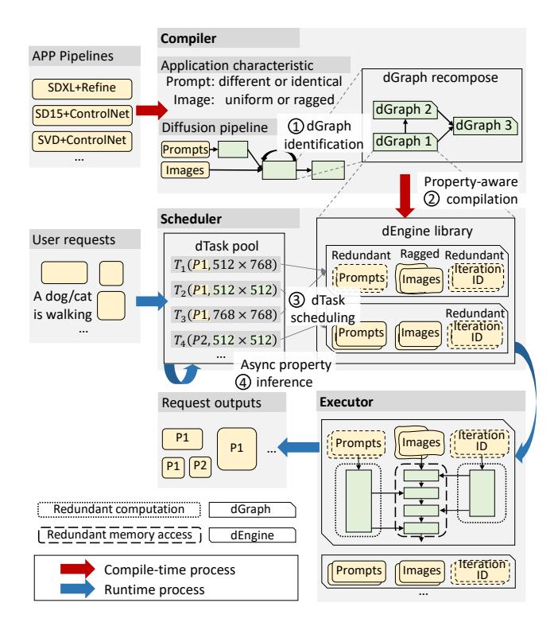

# 2 Background and Motivation

### 2.1 Diffusion Models

Diffusion models generate data by simulating a denoising process that transforms random noise into a target distribution. Figure 3 illustrates the pipeline of diffusion-based applications such as text-to-image and image-to-image generation. Prompts are first embedded by CLIP [50], then used to guide a U-Net [16] base model that iteratively denoises a latent

 $^1\mathrm{The}$  prefix "d" signifies diffusion, data properties, and decomposition.

| Prompt                                    | Guidance scale | Shape   |
|-------------------------------------------|----------------|---------|
|                                           | 8              | 512×896 |
| Concept Art of cinematography of Terrence | 1              | 512×896 |
|                                           | 5              | 512×896 |
|                                           | 8              | 512×768 |
|                                           | 8              | 512×832 |

**Figure 2.** (a) The count of inputs of SDXL-based diffusion pipelines. T2I and I2I represent the text-to-image and image-to-image tasks, respectively. Inpainting means image partial repaint in the selected area. Control inputs influence the pipeline control flow, such as iteration counts. (b) Consecutive text-to-image requests in DiffusionDB [62], a request database of an online text-to-image service. (c) Duplicate prompt occurrences in DiffusionDB counting by prompts and requests. (d) Shape distribution of the top 300 popular generative images in Civitai [17], which contain 112 different shapes. Only images with generation settings attached are included.

Figure 3. Application pipelines based on the SDXL model.

image initialized from random noise or an input image. A U-Net refiner further enhances the result through additional denoising rounds, and the final latent is decoded into a visible image, optionally followed by super-resolution [24, 25, 54].

While U-Net architectures dominate traditional diffusion models, transformer-based designs are gaining traction. Models such as DiT [46], SD3 [9], Hunyuan series models [40, 57] and FLUX [34, 35] leverage self-attention for improved generation quality, and extensions like DiT-3D [44], DiT-MoE [69], RFDiffusion [63] and TerDiT [42] further adapt this paradigm to 3D modeling, efficient scaling, protein structure prediction and resource-constrained deployment.

#### 2.2 Motivation

Resulting from the distinct computation patterns of diffusion models, their complex structures and unique data properties provide new optimization opportunities.

Complex pipelines with flexible customization. Diffusion models exhibit high flexibility, necessitating numerous configurable inputs such as positive and negative prompts, one or more reference images, guidance strength, plug-and-play extensions, etc. As shown in Figure 2(a), a single diffusion pipeline based on the SDXL model is able to take more than 20 inputs for a generation request.

To meet the requirements of different applications, diffusion pipelines are extensively customized to achieve flexible functionalities. For example, the image-to-image pipeline in Figure 3 extends the basic text-to-image pipeline by incorporating a VAE encoder model to encode input images into latent space. Additionally, application designers and users can apply various extensions, such as ControlNet [67] and LoRA [31], to generate results in different visual effects and artistic styles. Consequently, varied input data across applications offers unique optimization chances, necessitating effective application-specific optimization strategies.

**Diverse Data Characteristics in Requests** Diffusion model serving systems must accommodate requests with diverse data characteristics. These mainly manifest as *correlative requests with partial redundancy* and *variability in generation shapes*, arising from both application and user sides.

On the application side, diffusion models are inherently flexible with numerous input parameters, but deployments often fix certain values for specific use cases. In addition, generation shapes strongly affect output quality [47], such as the posture of individuals in generated images.

From the user side, correlative requests with varied generation shapes are common, as users cannot anticipate input effects without execution. They often submit multiple related requests for grid searches, producing several correlated inputs and manually selecting the best results. Unlike conventional vision tasks, diffusion models cannot simply crop or pad inputs for batching. This workflow, supported by mainstream frameworks [3–5], improves productivity. Figure 2(b–c) shows that most prompts generate more than five correlated requests in a public text-to-image trace.

Figure 2(d) shows that generation shapes are highly diverse: over 30% of requests use 512×768, yet more than 100 distinct shapes appear among the 300 most popular images. Naive batching by identical shapes leaves many requests unbatchable, reducing efficiency. While requests

**Figure 4.** Overview of ChituDiffusion.

often share inputs and intermediate results—creating optimization opportunities—batching strategies face inherent trade-offs: kernels for varied shapes enable parallelism but incur overhead for uniform shapes. Consequently, neither approach alone achieves ideal performance.

#### 3 Overview

Figure 4 illustrates the workflow of ChituDiffusion on an image generation pipeline. ChituDiffusion accelerates it in four steps. At compile time, ChituDiffusion optimizes pipelines with the knowledge of application characteristics, i.e., requests probably have identical prompts but varied image resolutions.

- **1. dGraph identification (§4.1):** CHITUDIFFUSION performs symbolic data property analysis to infer potential optimization opportunities, taking application characteristics as the initial input properties. According to the propagating results, diffusion pipelines are recomposed into dGraphs which share the same optimization enabling conditions.
- **2.** Data-property-specialized compilation (§4.2): By inferring possible input data properties for each dGraph, ChituDiffusion compiles it into a series of dEngines, each of which is specially optimized for certain data properties. For example, dEngine 1 is optimized for the scenario where inputs are redundant (§4.2) and ragged (§6.1).

At runtime, ChituDiffusion recomposes user requests into dTasks according to the dGraph-level pipeline.

- **3. dTask scheduling (§5.1):** To efficiently execute requests with heterogeneous data properties, ChituDiffusion leverages dynamic programming to pack dTasks with conforming data properties into a batch, which is dispatched to the matched dEngines for efficient execution. In Figure 4, ChituDiffusion packs four dTasks into two batches to exploit the same prompt and the uniform generation shape.
- **4. Asynchronous property inference (§5.2):** CHITUDIFFUSION infers the data properties of dTask outputs without actual execution. Therefore, CHITUDIFFUSION is able to overlap dTask scheduling with actual execution, avoiding scheduling overhead.

