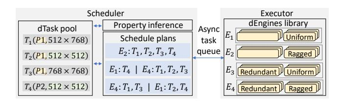
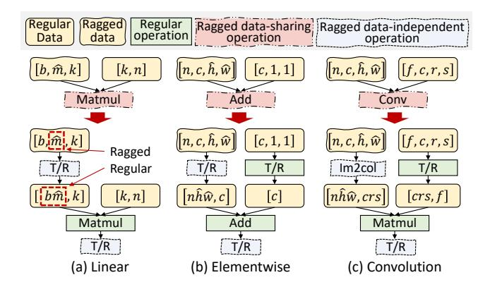
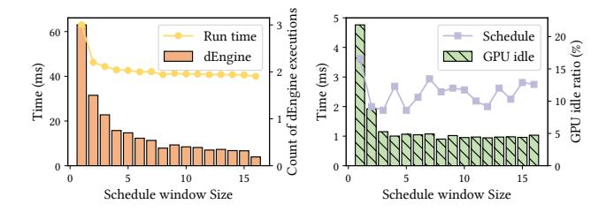

# 4 Compile-Time Optimizations

Due to the large number of inputs associated with diffusion models, directly optimizing a pipeline for all possible scenarios leads to an impractically large number of optimized execution engines. Taking a pipeline with n inputs for example, merely accounting for the presence or absence of tensor dimensional redundancy can yield up to  $2^n$  execution engines, incurring prohibitive optimization costs.

CHITUDIFFUSION'S *compiler* recomposes a pipeline into a set of dGraphs to enable fine-grained optimizations (§4.1) and then compiles each dGraph into multiple dEngines via property-aware optimizations (§4.2).

#### <span id="page-3-1"></span>4.1 Symbolic dGraph Identification

To infer how properties are propagated within the dGraph structure, Chitudiffusion is equipped with a set of symbolic data property propagation rules tailored for tensor operations. For conciseness, this section takes dimensional redundancy as a running example(§2.2). Examples include a batch of requests with partially duplicate inputs (redundancy in the batch dimension) and identical data in gray-scale images (redundancy in the color channel dimension). The method can also be extended to deal with other data properties as well, such as dynamic tensor shapes.

Symbolic property propagation. CHITUDIFFUSION utilizes application characteristics to initialize propagation. Diffusion pipelines are usually tailored to a specific usages, developers have prior knowledge about pipeline inputs. Some inputs usually vary between requests, while certain inputs are intended to be the same for all requests (e.g., a fixed prompt in style transfer or a shared backbone in protein generation). Additionally, there are inputs that may potentially be the same but can only be determined by the incoming request. To deal with the dynamics and complexity of data in diffusion models, ChituDiffusion leverages symbolic data properties to perform analysis. Figure 5(a) shows a simplified example of a image generation task with gray scale image controlnet and LoRAs. CHITUDIFFUSION assigns symbolic variables to the data properties of inputs, notated as  $\alpha$ ,  $\beta$ , and  $\gamma$ . For inputs with a fixed property determined

<span id="page-4-1"></span>

**Figure 5.** (a) Partitioning a DFG into dGraphs according to property expressions.  $\alpha$ ,  $\beta$ , and  $\gamma$  are symbolic property variables. T and F are true and false.  $\wedge$  means logical AND. (b) Property condition expressions of dGraph (g-h). (c) dEngines with input property requirements of dGraph (d-e).

by application characteristics, actual values are provided. In the tensor redundancy propagation, we use a boolean value to represent if a dimension is duplicate, such as T (i.e., true) for input C in Figure 5(a).

To identify various forms of data properties propagated by tensor algebra, ChituDiffusion utilizes symbolic propagation rules. Table 1 presents typical dimension redundancy rules derived from boolean algebra. Due to the complexity of tensor operators, both input and output are represented as vectors, with each element denoting a per-dimension propery. For example, in 2D convolution, if both input tensors exhibit redundant length and width dimensions, the redundancy propagates to the output. To accommodate new operators, ChituDiffusion also supports user-defined propagation rules.

During the propagation, ChituDiffusion maintains symbolic expressions for tensor properties. As illustrated in in Figure 5(a), nodes (a-c) generate outputs with redundancy if tensor A is redundant.

CHITUDIFFUSION takes a whole pipeline as a single data flow graph (DFG) for effective recomposition. In diffusion pipelines, denoising loops enable later updates to affect earlier tensors. To avoid conflicting expressions, CHITUDIFFUSION unrolls initial iterations until loop inputs stabilize, which converges within a few steps since such loops are neither nested nor overlapping.

**dGraph identification.** Based on symbolic propagation, ChituDiffusion partitions the pipeline into dGraphs by grouping consecutive operators with identical output property expressions, as common properties indicate shared optimization opportunities. As shown in Figure 5(a), each operator belongs to a dGraph delineated by red lines.

CHITUDIFFUSION employs output properties as the recompose criterion, since input properties usually enable only operator-specific optimization. For example, node g in

Figure 5(a) can be optimized if  $\alpha \wedge \beta$  or  $\beta$  are redundant, but the condition does not extend beyond this operator. ChituDiffusion considers these fine-grained optimization opportunities during dGraph compilations in §4.2. To avoid scheduling overhead, small dGraphs —such as the single-node f—are merged into subsequent dGraphs during post-processing.

<span id="page-4-2"></span>**Table 1.** Tensor redundancy propagation rules.  $a_i$  and  $b_i$  represent the redundancy properties of i-th dimensions (starting from 1) of the first and second inputs, respectively.  $\land$  means logical AND.

| Category           | Operators [Layout] |             | Output redundancy                                     |  |
|--------------------|--------------------|-------------|-------------------------------------------------------|--|
| Unary elementwise  | ReLU, Tanh [2D]    |             | $[a_1, a_2]$                                          |  |
| Binary elementwise | +, -, ×, ÷ [2D]    |             | $[a_1 \wedge b_1, a_2 \wedge b_2]$                    |  |
| Linear             | Batch Matmul [NHW] |             | $[a_1 \wedge b_1, a_2, b_3]$                          |  |
| Convolution        | Conv2D w           | w/o padding | $\boxed{[a_1,b_1,a_3\wedge a_4\wedge b_3\wedge b_4,}$ |  |
|                    | [NCHW]             |             | $a_3 \wedge a_4 \wedge b_3 \wedge b_4$                |  |
|                    | [MCIIW]            | w/ padding  | $[a_1,b_1,N,N]$                                       |  |

#### <span id="page-4-0"></span>4.2 Data-Property-Specialized Compilation

By analyzing property expressions, ChituDiffusion selectively compiles a dGraph into several execution engines, which are named dEngines. Each dEngine is specially optimized for one specific input data property.

Selective dEngine generation. For each dGraph, CHITUDIFFUSION optimizes dEngines by enumerating potential property expressions of the dGraph inputs. For example, dGraph (d-e) in Figure 5(a) can be optimized when its inputs are redundant. CHITUDIFFUSION identifies its property condition is  $\beta$ , which have two possible values, as shown in Figure 5(b). By optimizing a dGraph under two property conditions, CHITUDIFFUSION generates two dEngines covering all optimization scenarios, and combining suitable dEngines achieves the same effect as monolithic pipeline-level optimization.

Furthermore, as a single dEngine can be reused across diffusion model requests with different data properties, it avoids the expensive cost of monolithic optimization of entire pipelines. However, not all dEngines are necessary, as certain condition combinations are rare or yield limited performance benefits. For instance, the third condition of dGraph (f-h) in Figure 5(c),  $\alpha \wedge \beta = T$ ,  $\gamma = T$ ,  $\beta = F$ , is unsatisfiable since  $\beta$  can not be both redundant and not redundant. Chitudiffusion prunes two categories of dEngines. For conciseness, we discuss a dEngine with condition expressions  $e_1 \wedge e_2$ .

The first is conflicting conditions. If  $e_1 \wedge e_2$  is unsatisfiable for all input properties, the dEngine is never used and thus pruned. Naive enumeration of tensor properties often generates such cases by ignoring constraints from pipeline inputs and application semantics. For example, tensors B and E in

<span id="page-5-1"></span>

(a) Original with redundant K and V (b) Eliminate redundant memory access

**Figure 6.** Eliminating redundant memory access for the attention operation.  $\sigma$  denotes Softmax. Element-wise operations are omitted.

Figure 5(a) always share the same property, so optimizations assuming them to differ are invalid.

The second is inessential conditions. If a condition  $e_1 \land e_2$  enables only marginal optimizations, ChituDiffusion prunes it to reduce both optimization overhead and runtime scheduling cost. The importance of each condition is determined by its optimization speedup, and those below a threshold (5% in the current implementation) are discarded. For example, the condition  $\alpha \land \beta = T, \gamma = F, \beta = F$  is pruned in dGraph (f–h) because it affects only a single operator. Users may also define more sophisticated pruning criteria, such as leveraging performance models to estimate dEngine speedup.

**Redundancy elimination.** To optimize dGraphs under different inputs automatically, ChituDiffusion adopts the rule-based optimization method.ChituDiffusion is equipped with dimension-level redundant elimination rules tailored for each tensor operator. To eliminates redundant computations by analyzing operator inputs in execution order and applying optimization rules. Redundant dimensions are marked and later restored through broadcasting, ensuring maximal elimination while preserving equivalence.

For redundant memory access, ChituDiffusion utilizes the equivalent transformations of linear algebra to transform them into redundancy-free computations based on existing kernels. Figure 6(a) shows an attention operation with redundant K and V tensors. To optimize it, ChituDiffusion compresses the K and V tensors along the redundant batch dimension and concatenates the Q tensors from different requests into a single one.

#### 5 Runtime Design

At runtime, CHITUDIFFUSION's scheduler dynamically groups dTasks with uniform data properties into batches, dispatches the corresponding pre-compiled dEngines to the *executor*, and asynchronously infers data properties to overlap scheduling with execution (§5.1, §5.2).

## <span id="page-5-0"></span>5.1 Heterogeneous dTask Scheduling

To handle heterogeneous requests efficiently, ChituDiffusion aggregates requests within a scheduling window

### <span id="page-5-3"></span>Algorithm 1 Data-aware execution plan generation.

```
1: Input: dGraph g, dTask pool \mathcal{D}, dEngine library \mathcal{L}
 2: Output: Execution plan &
 3: \mathcal{T} = \{\emptyset : 0\}
                                            ▶ Initialize the map of execution time
 4: \mathcal{E} = \{\emptyset : \emptyset\}
                                           ▶ Initialize the map of execution plans
 5: \mathcal{R} = \text{Unique}(\mathcal{D}[g])
                                          ▶ Unique dTasks of the given dGraph
 6: Search(\mathcal{G}, \mathcal{R})
 7: return \mathcal{E}[\mathcal{R}]
      procedure Search(g, R)
                                                          \triangleright \mathcal{R} is the remaining dTasks
            if \mathcal{R} \in \mathcal{T} then
                  return \mathcal{T}[\mathcal{R}]
                                                                        ▶ Memorized results
11:
12:
            t_{min} = \infty
13:
            for S \in \mathcal{L}[g] do
                                                                     ▶ Enumerate dEngines
14:
                  \mathcal{B} = \text{GetLargestBatch}(\mathcal{R}, \mathcal{S})
                  t_{new} = \text{Search}(g, \mathcal{R} - \mathcal{B}) + \text{EstTime}(g, \mathcal{S})
15:
                  if t_{new} < t_{min} then
16.
17:
                       t_{min} = t_{new}
                        \mathcal{P} = \mathcal{E}[\mathcal{R} - \mathcal{B}] \cup \{(\mathcal{B}, \mathcal{S})\}
                                                                                   ▶ Partial plan
18:
19:
            \mathcal{T}[\mathcal{R}] = t_{min}
                                                                                ▶ Memorization
20:
            \mathcal{E}[\mathcal{R}] = \mathcal{P}
            return t_{min}
21:
```

<span id="page-5-7"></span><span id="page-5-6"></span><span id="page-5-5"></span><span id="page-5-2"></span>

**Figure 7.** Scheduling on dTasks and dEngines of a dGraph. dEngine inputs are non-redundant with uniform shapes at default without annotation.

(parameterized by window size), decomposes them into finegrained dTasks, and stores them in a shared task pool (Figure 7). It then schedules dTasks from different dGraphs independently, following their execution order in the dGraphlevel pipelines.

For dTasks based on the same dGraph, the heterogeneity of data properties carried by user requests provides a large scheduling space. For example, Figure 7 shows four dTasks of the same dGraph, each taking two inputs. We can batch all dTasks and run dEngine  $E_2$ , which is most general but less efficient since data properties are not used. Alternatively, we can execute  $T_1$ ,  $T_2$ , and  $T_3$  with  $E_4$  to exploit the identical prompt, or execute  $T_2$  and  $T_4$  with  $E_1$  to create a batch of uniform shape. Similar trade-offs exist for dTasks with more inputs and diverse data properties.

To determine an efficient batching plan for dTasks, CHITUDIFFUSION employs a dynamic programming approach. Algorithm 1 details this workflow. For each dGraph, CHITUDIFFUSION merges dTasks with identical inputs into a single dTask (Algorithm 1) and broadcasts the results after

<span id="page-6-1"></span>

**Figure 8.** Optimizations on the core structure of a SDXL layer. The blue circle in (d) shows the entry of the denoising loop.

execution. Then, CHITUDIFFUSION explores different combinations of batches by enumerating properties required by dEngines (Algorithm 1). For a given property requirement, CHITUDIFFUSION finds the largest batch satisfying it (Algorithm 1).

To avoid duplicate searches, ChituDiffusion always includes the first remaining dTask in the current batch. Since a plain dEngine with the most general requirements always exists, legal plans are guaranteed. Each batch's execution time is estimated using a performance model tailored to its dEngine, and the remaining dTasks are recursively combined into batches in the same manner. After enumerating all dEngines for a given search state, ChituDiffusion records the estimated optimal execution time and batching plan to accelerate subsequent scheduling (Algorithm 1).

Chitudiffusion adopts a lightweight performance model tailored for diffusion models to achieve both efficiency and accuracy. Since compute-intensive operations dominate execution, their costs scale either linearly with input size (e.g., convolution, linear layers) or quadratically (e.g., attention). To capture this behavior, Chitudiffusion applies ordinary least squares regression between input-related metrics and execution time, using a dataset constructed from example inputs of varying sizes and their batch prefixes. For models that involve complex computations such as temporal and spatial attentions in video generation models, Chitudiffusion replaces the total tensor size in the performance model with the corresponding dimension sizes, allowing for a more precise estimation of the execution time.

#### <span id="page-6-0"></span>5.2 Asynchronous Data Property Inference

In ChituDiffusion, the scheduler and executor operate asynchronously to hide decomposition and scheduling overhead, but the absence of data properties for unexecuted dTask inputs poses a key challenge.

To address this problem, CHITUDIFFUSION uses data property expressions in §4.1 to infer data properties for each

dTask. By evaluating output property expressions with real input properties, ChituDiffusion efficiently infers data properties of each dTask output separately.

To infer redundancy across multiple requests, ChituDiffusion develops a tensor *fingerprint* technique to recognize redundant tensors without real execution. For request inputs, ChituDiffusion uses a lightweight hash function to calculate their fingerprint in a time complexity that is linear to the number of elements in tensors. Additionally, applications and users are also able to directly mark duplicate inputs in correlative requests, in which case ChituDiffusion assigns the same unique values to them as fingerprints without hashing.

CHITUDIFFUSION calculates fingerprints on each dGraph in the execution order. Calculating fingerprints operator-by-operator can be time-consuming for complex dGraphs. Since dGraphs perform deterministic computation, their outputs are only dependent on inputs. According to the DFG of a dGraph, CHITUDIFFUSION records which inputs impose influence on outputs for each operator and propagate this information through the data-flow equation. This enables us to directly derive output fingerprints from the input fingerprints. To calculate output fingerprints, CHITUDIFFUSION uses

$$\mathsf{FP}[output_i] = \Phi(\mathsf{FP}_q, \mathsf{FP}[input_{dep_{i,0}}], \dots, \mathsf{FP}[input_{dep_{i,n}}])$$

, where  $\Phi$  is an operand-commutative hash function,  $\mathsf{FP}_g$  is a unique identifier of the current dGraph to distinguish computations of different dGraphs, and  $input_{dep_{i,0}},\ldots,input_{dep_{i,n}}$  have influence on  $output_i$ . Thus, ChituDiffusion can identify redundant dTask inputs by simple fingerprint comparison without actual tensor comparisons.

## 6 Implementation

Figure 8 illustrates how CHITUDIFFUSION applies data-property-aware optimizations to the core SDXL layer. Given requests with ragged image shapes but identical prompts and fine-tuning weights, CHITUDIFFUSION firstly detects two

<span id="page-7-2"></span>

**Figure 9.** Ragged operation regularization.  $\hat{x}$  denote a ragged dimension x. If dimension  $\hat{x}$  is merged with the batch dimension, the new merged dimension is a regular dimension. T/R represents transpose and reshape operators.

dGraphs and optimizes them independently, eliminating redundant computation and memory accesses from shared inputs (Figure 8b). It then applies ragged operation regularization (§6.1) to transform irregular operations into kernel-compatible equivalents (Figure 8c). Finally, Chitudiffusion identifies invariant tensors within the pipeline (§6.2).

## <span id="page-7-0"></span>6.1 Ragged Operation Regularization

To enable data-property-aware optimizations for ragged requests(input with various shapes), ChituDiffusion must both identify dGraphs with common raggedness patterns for compile-time dEngine construction and infer output shapes efficiently at runtime. Building on the symbolic shape propagation, CHITUDIFFUSION represents ragged dimensions as symbolic variables and substitutes actual inputs at runtime to obtain final output shapes. Since Handcrafting ragged kernels for all operators is costly and challenging for existing automatic kernel generators [19, 66], CHITUDIFFUSION employs ragged operation regularization. Operations are classified as data-sharing operations with shared inputs or weights (e.g., convolution, linear layers) and data-independent operations without shared weights (e.g., transpose, reduce). Ragged operations are opportunistically transformed into standard operators and ragged data-independent operations, enabling efficient execution using existing kernel libraries with minimal effort.

Since data-independent operations do not share data across requests in a batch, embarrassingly parallel execution is efficient for each request. Based on existing tiling plans and computing microkernels for regular (non-ragged) operators, Chitudiffusion partitions each request into a set of tiles, which are mapped to GPU thread blocks with a round-robin policy during batched execution.

CHITUDIFFUSION supports ragged data-sharing operations by transforming them into equivalent regular operators with the help of ragged data-independent operations. For instance, a ragged Matmul can be regularized by fusing the batch dimension b and ragged dimension  $\hat{m}$  via transpose and reshape, similar to concatenating matrix heights (Figure 6(b)). Other operations, such as ragged elementwise ops and convolutions, can be handled with transpose and image to column [60] (Figure 9(bc)). These transformations are feasible because shared weights have fixed dimensions, allowing ragged inputs to be flattened across shared data. Chitudiffusion thus applies a set of graph transformation rules to regularize ragged data-sharing operations, supplemented with a few ragged data-independent operations, and can flexibly extend this rule set for new models.

#### <span id="page-7-1"></span>6.2 Invariant Tensor Elimination

Diffusion models contain two types of *invariant tensors*: constants, predetermined by applications, and loop-invariants resulting from iterative denoising.

CHITUDIFFUSION employs a lightweight four-state detection algorithm (constant, loop-invariant, loop-variant, unknown) to identify them. Properties are initialized from tensor definitions and iteratively propagated along operators with a priority hierarchy.

Detected constants are precomputed at compile time, while loop-invariants are hoisted outside loops. ChituDiffusion further supports multi-value constants, allowing selective input fixing to trade off performance and generation diversity.

### 6.3 Extensibility and Architecture Agnosticism

CHITUDIFFUSION achieves architecture-agnostic support for diverse diffusion models—spanning from pure Transformers to mixed Transformer-Convolutional structures—through two core mechanisms:

- Universal Intermediate Representation: By utilizing Data Flow Graphs (DFGs) as a universal IR, ChituDiffusion expresses arbitrary pipelines uniformly. This approach decouples optimization logic from specific neural network layouts, enabling the system to exploit broad optimization opportunities derived from high-level application requirements (§2.2) rather than being limited by architectural specifics.
- Operator-Centric Optimization: CHITUDIFFUSION performs analysis and transformations at the operator level. Its optimization rules target individual computational steps rather than monolithic network blocks. Integrating novel operators requires only minimal, localized effort: (1) defining symbolic propagation rules for data properties, and (2) providing corresponding optimized kernels.

Once these definitions are provided, the ChituDiffusion scheduler automatically orchestrates the rest of the workflow—applying existing optimization rules and compiling the DFG into high-performance *dEngines* without further manual intervention.

<span id="page-8-1"></span>

Figure 10. Throughput improvement on multiple diffusion model applications.

#### 7 Evaluation

#### 7.1 Experiment Setup

**CHITUDIFFUSION implementation.** We implement CHITUDIFFUSION based on both C++ and Python, and reuse some components from Diffusers [61], Triton [59], Stable Fast [1], and FlashAttention [21, 22]. Users are able to customize diffusion model pipelines in CHITUDIFFUSION to support various applications. To support ragged batching, we implement four ragged data-independent operation kernels based on Triton and CUDA.

**Platform.** The evaluation was conducted across two server configurations: one equipped with an NVIDIA A100 40GB PCIe GPU and another with an NVIDIA H100 80GB PCIe GPU. Experiments involving UNet-structured models were evaluated using CUDA 12.1. For the DiT series models, the evaluation utilized CUDA 12.8. The open-source release features a comprehensive infrastructure upgrade, now fully supporting and leveraging PyTorch 2.9 for enhanced performance and compatibility.

**Workloads.** We evaluate CHITUDIFFUSION on 5 UNet-based diffusion model applications (Table 2) built upon SD1.5 [51], SDXL [47], and SVD [11]. We also conduct the three evaluations on DiT structure diffusion generation scenarios built upon Hunyuan series modelsl[40, 57] and FLUX[34, 35].

The applications cover image and video synthesis, with or without controlled generation extensions. To emulate real-world usage, we synthesize non-correlated request traces using default settings unless otherwise noted. Prompt distributions and ragged input shapes follow DiffusionDB [62] and Civitai [17] (Figure 2c-d). Each application adopts its default denoising steps, and random seeds are uniformly sampled.

#### 7.2 Throughput Improvement

We evaluate ChituDiffusion against PyTorch v2.1, PyTorch-Inductor v2.1, TensorRT v8.6, and the diffusion-specific framework Stable Fast v1.0 [1], all tuned to saturate GPU throughput. The applications in Table 2 include both correlative

<span id="page-8-0"></span>**Table 2.** Evaluated applications and shapes of generation results. T, I, and V in the type column represent text, image, and video, respectively. The shapes indicate the height and width of the generated images, as well as the frames, height, and width of the generated videos.

| Name       | Type | Brief description                                          | Model and extention                    | Shape         |
|------------|------|------------------------------------------------------------|----------------------------------------|---------------|
| refine     | T2I  | Generate images refined by different prompts               | SDXL, SDXL refiner                     | [1024,1024]   |
| edit       | I2I  | Transfer images into multiple styles                       | SDXL, LoRA,<br>ControlNet              | [512,512]     |
| video      | I2V  | Generate videos from images with different control effects | SVD, ControlNet                        | [14,576,1024] |
| venti      | T2I  | Generate images from texts                                 | SDXL                                   | Ragged        |
| grande     | T2I  | Generate images from texts                                 | SD1.5                                  | Ragged        |
| refine-mix | T2I  | Generate images refined by different prompts               | FLUX.1 S, SDXL refiner                 | [1024,1024]   |
| refine-dit | T2I  | Generate images refined by different prompts               | Hunyuanimage,<br>Hunyuanimage refiner  | [1024,1024]   |
| edit-dit   | T2I  | Generate images with different control stages              | Hunyuan-DiT,<br>Hunyuan-DiT ControlNet | [1024,1024]   |

requests and standard text-to-image services. As shown in Figure 10, ChituDiffusion delivers up to 2.13× speedup (1.58× on average) over the best baseline. For refine, edit, and video, where users issue correlative requests and manually select the best generations for efficient image and video creation [3–5].(e.g., prompt grid search or varying ControlNet periods), baselines process each request independently, missing the awareness of redundancies. TensorRT fails on video due to oversized tensors. By detecting shared inputs, ChituDiffusion eliminates redundant computation, yielding up to 2.2× on H100 and 2.1× on A100.

For venti (SD1.5) and grande (SDXL), which provide standard text-to-image services, redundancy is minimal since requests are independent. Nevertheless, ChituDiffusion still captures optimizations from shared prompts and iteration IDs and the potentially same prompt shown in Figure 4, while effectively batching ragged requests that existing frameworks cannot. The scheduler balancing the efficiency of the uniform-shape dEngines and the larger batch size enabled by the ragged-shape dEngines, which will be further studied in §7.7, yielding 1.4× speedup on venti and 1.1× on


**Figure 11.** Throughput improvement on DiT based diffusion model applications.

grande since SDXL is a much larger model and gains less speedup from batching.

We further evaluate Katz [37], a state-of-the-art diffusion serving system that supports ControlNet-as-a-service, in the edit application. For fairness, we only test ControlNet (since Katz's LoRA serving is mathematically inequivalent). In contrast to Chitudiffusion's single-GPU deployment, we evaluate Katz with 4 H100 GPUs, which is the minimal hardware requirement for Katz to serve a single ControlNet. To fairly compare these two works we normalized the metric as throughput per GPU. As shown in the table, Katz achieves ~0.03s latency per request by serving sequentially, but its throughput per GPU is significantly lower than Chitudiffusion. In the edit scenario, which involves only one iteration with SDXL-Turbo, Katz's multi-GPU communication overhead severely limits its end-to-end throughput.

#### 7.3 Generalization on DiT-based Models

To demonstrate the generality of ChituDiffusion, we extend our data-aware optimization to Diffusion Transformer (DiT) architectures. As ChituDiffusion operates at the operator level rather than relying on specific model topologies, it is inherently architecture-agnostic. DiT components—such as QKV projections, MHSA, and MLPs—are naturally identified as dGraphs within our DFG, allowing the system to decompose and execute common computations across requests efficiently. Figure 12 illustrates the performance on DiT-based applications. ChituDiffusion achieves a 2.2–3.0× speedup in refine scenarios and a 1.4× speedup in edit scenarios.

Specifically, in refine scenarios, while static compilation baselines like stable-fast failed to support the HunyuanImage refiner pipeline due to inflexible compilation rules, Chitudiffusion leveraged the torch.compile backend, gaining a 3.0× speedup through our data-aware dGraph scheduling. In edit scenarios, dealing with DiT-based ControlNets presents challenges due to varying architectural implementations (e.g., FLUX vs. Hunyuan). We evaluated a dynamic scenario where ControlNet is active only during specific iteration stages (controlled by control\_guidance\_start/end in diffusers). Unlike static approaches, Chitudiffusion effectively handles these ragged control flows. While emerging

<span id="page-9-0"></span>

**Figure 12.** Optimizations of application edit. Data *I*, *L*, *C*, *S* in dTasks represent input image, latent image, U-Net conditioning, and style LoRA, respectively. The data marked in bold is redundant across requests.

DiT models introduce complex pipelines and evolving ControlNet support, ChituDiffusion's flexible design allows it to adapt to these new challenges effectively.

#### 7.4 Ablation Study

Application edit provides style transfer services by generating multiple candidate images for each user-input image, preserving object positions but varying visual styles. It leverages SDXL Turbo [55], a variant of SDXL requiring only one denoising step, along with two fine-tuning extensions: ControlNet [67] for spatial control via Canny edges [12], and LoRA for diverse styles. To produce multiple stylized outputs, the application fixes latent noise and U-Net conditioning while applying 16 different LoRA weights.

As shown in Figure 12, Chitudiffusion exploits these characteristics by recomposing the pipeline into 3 dGraphs at compile time, which are then compiled into dEngines. For example, U-Net is partitioned into input-dependent and input-independent layers, where  $dGraph_2$  encapsulates the input-independent computations, enabling reuse across different images and styles.

At compile time, ChituDiffusion decomposes the pipeline into three dGraphs, compiled into dEngines. U-Net is split into input-dependent and input-independent parts, with  $dGraph_2$  containing the latter. At runtime, ChituDiffusion detects only 2 unique dTasks for  $dGraph_1$  and 3 for  $dGraph_2$ , and executes them with data-aware batching to exploit shared inputs (Figure 12). Moreover, invariant tensor elimination identifies  $dGraph_2$  outputs as constant, enabling compile-time caching with multi-value support(§6.2).

Figure 13(a) shows the results of an ablation study. We create a baseline named ChituDiffusion-base by disabling all data-aware optimizations in ChituDiffusion, which achieves comparable performance to the other baseline system. By progressively enabling dTask scheduling, multiversion dEngine compilation, and invariant tensor elimination, the throughput is improved to 1.29×, 1.56×, and

<span id="page-10-1"></span>

**Figure 13.** Ablation study of application edit. SCH, COMP, and IRE mean dGraph scheduling, dEngine property-aware compilation, and invariant redundancy elimination optimizations, respectively.

1.71×. Figure 13(b) presents the request latency when sequentially serving requests without batching, which disables inter-request optimizations in scheduling and multiversioned dEngines. ChituDiffusion achieves a speedup of 1.3× compared to the best baseline with the help of invariant tensor elimination. This demonstrates that while ChituDiffusion primarily focuses on throughput optimization, its techniques also provide benefits in latency-critical scenarios. ChituDiffusion is also able to achieve consistent speedup over baselines with different batch sizes (§7.6).

#### 7.5 dGraph Recomposition Analysis

To demonstrate dGraph decomposition, Table 3 reports redundancy optimization for SDXL U-Net. Without decomposition, the monolithic strategy produces numerous engines for all input property combinations, incurring high compilation cost. By symbolic property analysis, Chitudiffusion identifies inputs such as time embeddings and prompt conditions to form dGraphs, then optimizes them separately while pruning unsatisfiable cases, significantly reducing overhead. Fine-tuning extensions further exacerbate the problem. As

<span id="page-10-3"></span>**Table 3.** Compilation statistics for SDXL U-Net. The monolithic strategy treats U-Net as a whole with dGraph recomposition disabled.

| Model         | Strategy   | # Inputs | # dGraphs | # Engines | Estimated compilation time |
|---------------|------------|----------|-----------|-----------|----------------------------|
| SDXL UNet     | Monolithic | 4        | 1 (N/A)   | 16        | 16 min                     |
|               | dGraph     | 4        | 3         | 4         | 4 min                      |
| SDXL UNet     | Monolithic | 14       | 1 (N/A)   | 16384     | 11 d                       |
| w\ ControlNet | dGraph     | 14       | 4         | 7         | 7 min                      |

Table 3 shows, enabling ControlNet adds ten inputs to U-Net. The monolithic strategy must enumerate 2<sup>14</sup> input property combinations, leading to prohibitive compilation time. In contrast, ChituDiffusion leverages symbolic analysis to verify that ControlNet inputs share identical optimization conditions, treating them as one and exponentially reducing specialized dEngines, thus mitigating overhead.

<span id="page-10-4"></span>

**Figure 14.** Performance of an edit request under different scheduling window sizes.

<span id="page-10-5"></span>

**Figure 15.** Throughput under requests of different raggedness ratios on text-to-image diffusion pipelines.

#### <span id="page-10-2"></span>7.6 Scheduling Window Size and Overhead

Figure 14(a) shows that ChituDiffusion achieves higher performance with larger scheduling windows, as more dTasks are batched into fewer dEngine executions, exposing greater inter-request optimization. Figure 14(b) shows that scheduling cost is under 10% of dEngine runtime due to efficient dynamic programming, and further hidden with larger windows by improved batching and overlap, leaving less than 5% GPU idle time including cold start.

## <span id="page-10-0"></span>7.7 Data-Aware Batching

To show the effectiveness of data-aware batching, we create two baselines without it for ragged requests. ChituDiffusion-uniform only batches uniform-shape requests with uniform dEngines, while ChituDiffusion-ragged always batches all requests with ragged dEngines. Figure 15 shows the evaluation results. At raggedness ratio 0%, ChituDiffusion-uniform outperforms ChituDiffusion-ragged since ragged dEngines have more overhead than regular ones, such as index computation. As raggedness increases, ChituDiffusion-ragged achieves up to 1.5× higher throughput, benefiting from increased parallelism and reduced redundant memory access to model weights.

The baselines are not always optimal. In contrast, Chitudiffusion uses data-aware scheduling to select appropriate dEngines, achieving the best performance across all raggedness ratios. For raggedness from 25% to 50%, Chitudiffusion combines regular and ragged dEngines, yielding up to 10% higher throughput.

Performance model. We evaluate the model on SDXL U-Net dEngines with varied batch sizes between 1 to 16 and shapes between 256 to 768. By profiling 16 samples as inputs for the performance model, it achieves a 0.998 coefficient of determination. A 96-sample evaluation set generated in the same method yields a 0.996 coefficient and an RMSE less than 3, showing high prediction accuracy. As ChituDiffusion usually batches requests to fully utilize hardware, the performance model presents enough ability to estimate execution time for diffusion models, which are majorly composed of compute-intensive DNNs.

