# 1 Introduction

Over recent years, Text-to-Image (T2I) diffusion models have become increasingly popular [\[11\]](#page-11-0) and have been instrumental for many companies, including Google Imagen [\[52\]](#page-13-0), Adobe Firefly [\[1\]](#page-11-1), OpenAI DALLE [\[42\]](#page-13-1), etc. Users have exploited diffusion models for various purposes, such as designing scenes [\[5,](#page-11-2) [12,](#page-11-3) [24,](#page-12-0) [64\]](#page-13-2), characters [\[54,](#page-13-3) [58\]](#page-13-4), or posters [\[6,](#page-11-4) [17,](#page-12-1) [37\]](#page-12-2), primarily due to their ability to generate images with superior quality. T2I diffusion models synthesize images from Gaussian noise by iteratively denoising, adopting both ResNet [\[20\]](#page-12-3) and Transformer [\[55\]](#page-13-5) architectures.

Unlike LLMs, which can efficiently handle variable sequence lengths through KV caching [\[26\]](#page-12-4), diffusion models require multiple steps of computation-intensive attention without reusable KV caches. Consequently, heterogeneity in tensor shapes propagates throughout the entire diffusion pipeline, limiting parallel execution opportunities and preventing the system from scaling batch size. For example, generating three SDXL requests of different resolutions (512×512, 768×768, and 1024×1024) on H100 executes in 9.5s when processing them concurrently in a batch, compared to 17.8s when executed sequentially. In real-world serving scenarios, users frequently request images of different resolutions for diverse application needs [\[18,](#page-12-5) [30,](#page-12-6) [31,](#page-12-7) [42,](#page-13-1) [46\]](#page-13-6), leading to long waiting times as disability to handle mixed resolution requests simultaneously.

<span id="page-1-0"></span>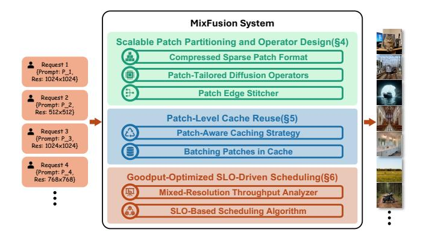

Figure 2. Overview of MixFusion.

Prior studies have explored optimizing the performance of diffusion models. Some works [\[14,](#page-11-5) [15,](#page-11-6) [28\]](#page-12-8) exploit patch parallelism to reduce latency on multiple GPUs. Another category of studies seek to reuse the cache to accelerate inference [\[2,](#page-11-7) [10,](#page-11-8) [21,](#page-12-9) [39,](#page-12-10) [47,](#page-13-7) [61,](#page-13-8) [67\]](#page-14-1). While these methods effectively reduce request latency and mitigate waiting times, they remain insufficient to achieve a high Service Level Objective (SLO) which is necessary in building a strong serving system, as they overlook the complexities introduced by mixed-resolution configurations.

With the above insights, we propose a patch-level parallelization strategy that restructures heterogeneous diffusion workloads into uniform computational units. Our key observation is that most operations in diffusion models (e.g., Linear, FeedForward, and Cross Attention) primarily operate on "local" (pixel level) rather than "global" (image level) information. Although originally designed to process full images, these operations can be decomposed into smaller sub-operations over individual patches. Once patches share identical shapes, heterogeneous requests can be combined as a single batch, converting resolution diversity into parallelizable work. For a simple illustration (Figure [1\)](#page--1-0), there are 3 requests with different resolutions. Without customization, these requests must be processed sequentially due to mismatched input shapes (Figure [1\(](#page--1-0)a)), leading to underutilized GPUs. In contrast, by segmenting the requests into finegrained patches with uniform shapes, they can be processed concurrently in a single batch (Figure [1\(](#page--1-0)b)), significantly improving parallel efficiency.

Despite patch-level decomposition enables higher degrees of parallelism, several challenges still prevent us from fully achieving these benefits. First, partitioning an image introduces cross-patch dependencies. For example, Convolution operator in U-Net based diffusion models aggregates information from adjacent pixels at each location. If we split images naively, computations near patch boundaries become inaccurate because each patch lacks the adjacent pixels that

<span id="page-1-1"></span>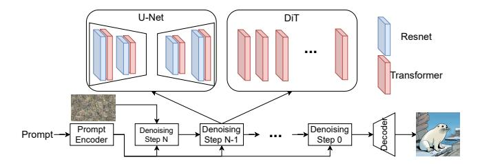

Figure 3. Latent Diffusion Model Structure. Two main types of backbones in the Diffusion model: U-Net and Diffusion Transformer (DiT).

would normally be included if the entire image were processed as a whole. Second, patch-level locality leveraging can introduce severe overhead. Cache-based mechanisms can further enhance the performance of diffusion models. However, combining patch-level processing with caching is challenging due to the additional overhead introduced by fine-grained cache management online. Specifically, the reuse decisions must be made for each patch in every iteration, resulting in hundreds of decisions for a single image generation. And cache management operations (e.g., insert, delete, query) also require careful design. Third, diverse SLO requirements further complicate scheduling. In practice, service vendors schedule tasks by their deadline to maximize SLO satisfaction. However, the scheduling algorithm is hard to design due to challenging latency prediction, which depends on both batch size and resolution combinations, leading to substantial search space.

To address these problems, we propose MixFusion, a serving system that exploits fine-grained patch-level parallelism to enable efficient batching of mixed-resolution requests (Figure [2\)](#page-1-0). The design of Mixfusion comprises several key components: (1) A Patched inference mechanism ([§4\)](#page-4-0). To enhance batch size, we first identify operations that require cross-patch context and then introduce two mechanisms that enable patched inference without hurting quality. MixFusion utilizes a novel patch management format to efficiently determine patch positions. Additionally, it incorporates a boundary stitcher to overlap memory movement overhead. (2) A patch level cache manager ([§5\)](#page-5-0). To fully exploit the locality inherent in diffusion models, MixFusion employs a cache manager that determines reuse selection at the patch granularity. The manager coalesces fine-grained cache operations into batches for simultaneous execution, thereby improving parallel throughput. (3) An SLO-aware scheduling algorithm ([§6\)](#page-6-0). MixFusion integrates an SLO-aware scheduler that maximizes SLO satisfaction under heterogeneous workloads. To support optimal decisions based on task latency, we further introduce a precise latency predictor. To sum up, we make the following contributions:

<span id="page-2-0"></span>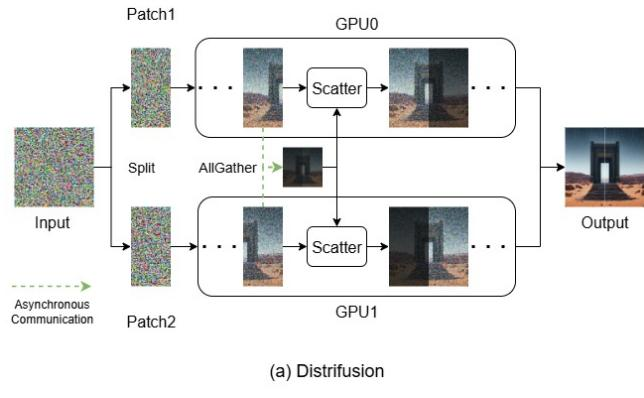

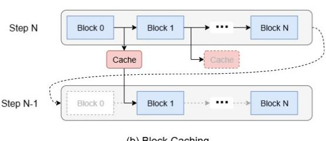

Figure 4. Two T2I diffusion optimization techniques. (a) Distrifusion splits the image into multiple patches and dispatches them to different GPUs. (b) Block Caching leverages the locality, reusing block output from the previous step, and skipping the corresponding block in the current step.

- We propose a novel patch-based decomposition and batching strategy for mixed-resolution diffusion workloads. This approach not only enhances parallelism but also preserves critical context information.
- We introduce a patch-specific online cache management policy tailored to fully exploit the abundant patchlevel locality efficiently.
- We design a patch-aware scheduling algorithm that coalesces patch tasks with online latency prediction, achieving superior SLO satisfaction and goodput.
- Evaluation demonstrates that MixFusion improves parallel efficiency and achieves higher SLO satisfaction compared to existing approaches.

## 2 Background

## 2.1 Diffusion Models

Text-to-Image (T2I) diffusion models [\[13,](#page-11-9) [46\]](#page-13-6) are generative models that take a prompt and Gaussian noise as input and generate a realistic image aligned with the prompt. Figure [3](#page-1-1) depicts the structure of diffusion model. The Prompt Encoder converts the prompt into embeddings used by every denoising iteration. The model then progressively predicts and removes noise, gradually transforming the noisy input into a high-quality image. The denoising component typically adopts one of two architectures: U-Net [\[42,](#page-13-1) [46,](#page-13-6) [50,](#page-13-9) [63\]](#page-13-10)

<span id="page-2-1"></span>Table 1. Communication cost comparison between tensor parallelism (TP) and patch parallelism (Distrifusion).

| Model | TP     | Distrifusion |
|-------|--------|--------------|
| SDXL  | 1.33G  | 0.42G        |
| SD3   | 25.05G | 12.52G       |

or Diffusion Transformer (DiT) [\[13,](#page-11-9) [31,](#page-12-7) [45\]](#page-13-11). U-Net combines ResNet blocks and Transformer blocks, while DiT only has Transformer blocks. The Transformer blocks apply selfattention to refine visual details and cross-attention to enhance text–image alignment. After completing all denoising steps, a decoder upsamples the output to the target resolution. Although DiT models are generally considered more powerful, U-Net–based models remain widely adopted due to their lightweight architecture [\[62\]](#page-13-12) and strong capability in condition alignment. In fact, most auto-regressive image processing [\[8,](#page-11-10) [23,](#page-12-11) [33\]](#page-12-12) services employ U-Net–based diffusion models as decoders, leveraging their efficiency to produce images with sharper details and clearer text.

Although diffusion models are capable of synthesizing high-quality images, they incur substantial overhead due to the iterative generation process. This challenge becomes even more severe in mixed-resolution serving, where diversity between the input and output shapes obstructs batchlevel optimization, thereby limiting overall efficiency.

## <span id="page-2-2"></span>2.2 System Optimizations for GenAI Applications

To mitigate the heavy overhead in the T2I diffusion model, prior studies have primarily pursued two directions: Parallelism and Locality Exploration.

Parallelism Exploration with Patching. One promising direction for accelerating diffusion is to patchify images and distribute the patches evenly across multiple GPUs [\[14,](#page-11-5) [15,](#page-11-6) [28\]](#page-12-8). Figure [4\(](#page-2-0)a) illustrates this approach: each image is partitioned into two patches, which are then assigned to separate GPUs for concurrent processing. To mitigate synchronization overhead, the system performs the AllGather operation asynchronously and scatters cached states to each GPU. Compared to Tensor Parallelism (TP), this Patch Parallelism also reduces the communication cost by utilizing AllGather over AllReduce. Table [1](#page-2-1) demonstrates that Patch Parallelism reduces at least twice communication costs compared to TP.While this strategy enhances parallelism, it still lacks support for mixed-resolution serving. Specifically, it constrains each request to a fixed number of patches determined by the number of GPUs, which hinders patch size unification, failing to batch requests with diverse resolutions. Moreover, it only exchanges stale cross-GPU context for approximation rather than sharing up-to-date information, further exacerbating accuracy degradation.

Locality Exploration with Caching Another optimization technique is caching. Prior studies have observed that

<span id="page-3-0"></span>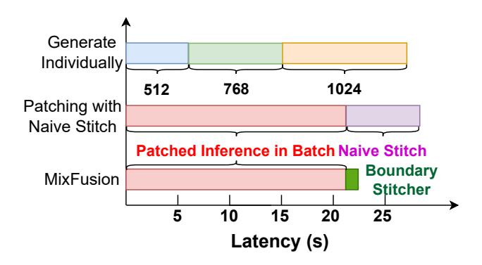

**Figure 5.** Latency Comparison with generation individually, naive stitching and Patch Edge Stitcher.

block outputs evolve gradually across denoising steps, enabling the reuse of previously computed results [38, 39, 61]. Figure 4(b) illustrates the central idea: the caching technique records the output of each block and selectively reuses it in subsequent steps. To keep a balance between efficiency and quality, prior works typically rely on offline profiling to determine the skipped blocks in each step. While this method reduces computation overhead, it enforces a static model configuration in which reuse decisions are predefined, limiting adaptability to dynamic input shape variations.

Beyond these two categories of optimization, several other research directions have been explored. Some studies identify inefficiencies in the iterative denoising process and propose reducing the number of denoising steps [2, 34–36, 53, 62]. Others focus on structural redundancy within diffusion models, advocating the introduction of sparsity to enhance efficiency [29, 66, 68, 69]. These approaches are orthogonal to our work, and advanced techniques from these directions can be seamlessly integrated into MIXFUSION to further boost performance.

## 3 Challenges and Motivations

While prior work leverages patching to hide communication overhead across multiple GPUs [14, 15, 28] (discussed in Section 2.2), our approach aggregates multiple patches to maximize parallel throughput and incorporates caching to reduce computational overhead. However, this design introduces several key challenges: *Inefficient Context Exchanging*, *Mismatched Skipped Blocks*, and *Explosive Combination*.

Inefficient Context Exchanging: Enabling patch-level parallelism in heterogeneous diffusion workloads requires coordinating and integrating the results of concurrent patch processing. We identify two critical inefficiencies in existing patching methods [14, 15, 28] that prevent successful scaling and accurate generation. (a) Complex Cross-Patch Context Exchange and Stitching. Existing methods process requests sequentially, failing to exchange the necessary cross-patch context within a batch of concurrent requests.

<span id="page-3-1"></span>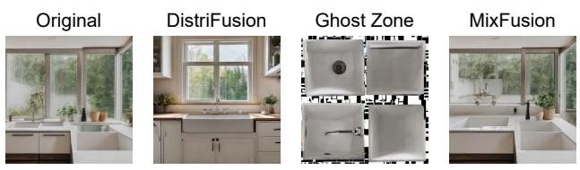

Prompt: Two sinks that are in a kitchen near a window.

**Figure 6.** Image quality with three patch management methods. Distrifusion generates a clear image but is far from original. Ghost Zone has low quality and is separated into 4 parts. MIXFUSION generates good quality and is close to the original one.

When context is exchanged to enable heterogeneous processing, it results in complex, multi-directional patch placements. Figure 5 demonstrates that naively stitching will degrade performance (details in Section 4.3). (b) **Degraded quality due to stale KV cache**. Figure 6 shows the image generated from the same prompt. Although Distrifusion generates clear images, the content is far from the original generation. Consequently, efficient context completion is critical for ensuring both accuracy and scalability.

Mismatched Skipped Blocks: Prior work has introduced caching mechanisms to reduce redundant computation in diffusion models [38, 61], typically by reusing outputs from designated blocks across denoising steps. However, these solutions rely on fixed caching patterns that fail to adapt to resolution changes, making them unsuitable for mixed-resolution serving scenarios. To highlight this limitation, we evaluate the model at resolutions 512, 768, and 1024 across 1,000 runs with random seeds, applying the Block Caching strategy [61] to measure the distribution of skipped blocks. Figure 7 demonstrates that the set of skipped blocks varies substantially across different resolutions, indicating the inefficiency of applying a single caching strategy uniformly.

**Explosive Combination:** Prior work often relies on offline latency profiling [3, 4, 7, 51] to schedule requests under SLO constraints. However, this strategy becomes infeasible in the presence of an explosive combination of resolutions. We demonstrate this by measuring latency across all resolution combinations with 3 requests, using the mixed-resolution batching method described in Section 4. With three resolutions, there are eight possible combinations. Figure 8 reports the average latency for each. "LMH" denotes a batch with one request each at low, medium, and high resolutions. The results exhibit substantial variability--batches composed entirely of high resolution requests can be up to 68 % slower than those with only low resolution requests. To capture this variability, all combinations need profiling. If a GPU supports up to *M* concurrent requests and there are *N* resolutions, the number of unique combinations is  $\sum_{i=1}^{M} C_{N-1}^{i+N-1}$ , which

<span id="page-4-1"></span>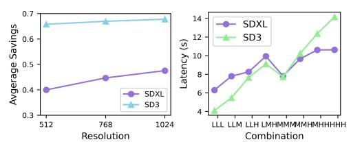

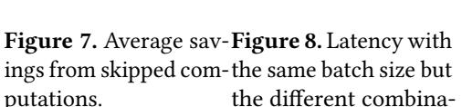

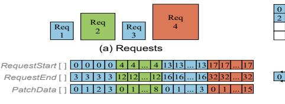

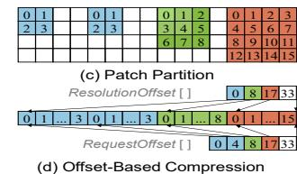

**Figure 9.** Patch management policy. (a) Requests with various resolutions. (b) Naive Patch Management. (c) Reorder and consider the patches as sparse arrays. (d) Exploit offset to record position.

<span id="page-4-3"></span>**Table 2.** Quality Comparison: Replicate vs. Patch Edge Stitcher (PES)

| Method               | PSNR(↑) | SSIM(↑) |
|----------------------|---------|---------|
| Replicate, 4 Patches | 9.54    | 0.45    |
| PES, 64 Patches      | 22.13   | 0.77    |
| PES, 16 Patches      | 24.84   | 0.81    |
| PES, 4 Patches       | 28.82   | 0.88    |

grows rapidly with *M* and *N*. Consequently, efficient latency estimation without full profiling is essential.

## <span id="page-4-0"></span>4 Patched Inference with Batching

In this section, we first introduce how we manage the patches. Next, we describe our approach for addressing missing context during inference.

## 4.1 Compressed Sparse Patch Format

Unlike prior work [14, 15, 28], which primarily targets distributing computation across multiple GPUs, our patching mechanism partitions images along both the height and width dimensions, selecting the patch size as the greatest common divisor of all resolutions in the corresponding dimension. This approach allows patches to be processed concurrently and leverages up-to-date data. However, operations such as *Convolution* and *Self-Attention* exhibit dependencies across patches, making efficient patch localization critical.

Inspired by the *Compressed Sparse Row* (CSR) format commonly employed for irregular data structures, we introduce a novel *Compressed Sparse Patch* (CSP) representation to efficiently manage image patches (Figure 9). CSP performs a similar structure as block compressed sparse matrix. The main difference is, CSP supports diverse block sizes, and the block is always at the left-top of the total matrix, while block compressed sparse matrix configures a fixed-size block, and one sparse matrix may contain multiple blocks. Consider four pending requests sorted by arrival time (Figure 9(a)). Naively storing latent information for each patch individually (Figure 9(b)) results in memory inefficiency and obstructs recovering images by resolution (Section 4.2). To mitigate this, we first reorder requests by resolution and treat patch

data as sparse arrays (Figure 9(c)). Owing to the locally dense distribution of patches within a single image, we only record request and resolution metadata for each patch. After compressing the sparse batch, we log the offset of the first patch per request (Figure 9(d)) and the resolution offsets needed for *Self-Attention* (details in Section 4.2). Each patch identifies corresponding request via the *index*, allowing it to traverse all associated patches by scanning from *RequestOffset* [*index*] to *RequestOffset* [*index* + 1].

## <span id="page-4-2"></span>4.2 Patch-Tailored Diffusion Operators

Most operators in diffusion models, including Linear, Feed-Forward, and Cross Attention, operate independently for each pixel and can thus be considered "pixel-wise" operators. In contrast, certain operators require context from other patches; otherwise, the output would be fragmented. Typically, two operators require context information for consistent image generation: *Self-Attention* and *Convolution*.

Patch-based Self-Attention Module: Despite some Self-Attention in vision transformer models having causal masks, almost all Self-Attention in text-to-image diffusion models are processed without a mask [13, 31, 36, 45, 46] and aggregate each pixel with all other pixels within the same image. It operates on three inputs: query, key, and value. The query token computes with all keys, applies a Softmax, and performs another dot product with all values. Although this process is straightforward for unpatched image, it becomes significantly more complex with patched image. As illustrated in Figure 10(a), accurate Self-Attention computation in patched configuration requires each patch to compute with all other patches, forming a Cartesian product of interactions. This complexity makes it difficult to implement efficient GPU kernels. To address this, we reconstruct patches back into the full image before executing Self-Attention. To further enable parallel execution, we group requests by resolution, which can be achieved simply and efficiently by exploiting CSP format, to achieve efficient batched attention.

**Patch-based Convolution:** Convolution operator applies a small kernel to aggregate features from neighboring pixels. The kernel size ranges from 1 to 3 in T2I diffusion

<span id="page-5-2"></span>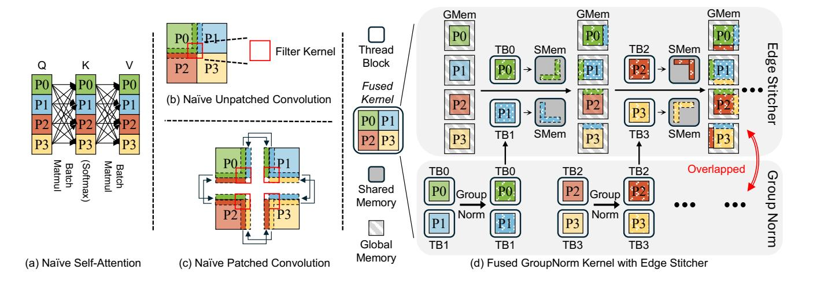

**Figure 10.** Patch based operators in T2I diffusion model. (a) Naive Self-Attention operation, which computes interactions across all patches. (b) Unpatched Convolution. (c) Naive convolution after patching, which gathers boundaries from neighboring patches (d) Patch Edge Stitcher, which enables boundary stitching combined with GroupNorm.

models [41, 46, 50]. When the kernel size exceeds 1, computation requires adjacent pixel values, introducing crosspatch dependencies. As illustrated in Figure 10 (b), unpatched convolution proceeds seamlessly across the image, whereas patched convolution encounters boundary issues. For example, processing the bottom-right corner of  $P_0$  requires boundary data from  $P_1$  and  $P_2$ , while  $P_0$  simultaneously provides its boundaries to these patches. These dependencies are complicated by two forms of diversity: (a) Direction Diversity. Patches must stitch both row and column boundaries. Row boundaries align with memory layout, but column stitching incurs irregular memory access. (b) Position Diversity. Each patch has different neighbor positions, for example,  $P_0$ stitches on the right and bottom, while  $P_3$  stitches on the top and left (Figure 10(c)). To enhance parallelism, we record each patch's adjacent neighbors during splitting and pad with 0 when a neighbor is absent. This metadata supports uniform and efficient boundary stitching across all patches. Additionally, we employ a tailored stitcher to overlap memory movement overhead arising from these diversities.

#### <span id="page-5-1"></span>4.3 Patch Edge Stitcher

We conduct an experiment to quantify the overhead of stitching. Each resolution is assigned four requests in our evaluation. Figure 5 demonstrates that naive stitching (fetching all required boundaries and concatenating them with target patches) offsets the performance gains of patch-level parallelism, highlighting the necessity for an efficient stitcher. Ghost Zone is another technique that is widely adopted by prior scientific computations to solve the patch boundary problem, such as stencil. It simply replicates the boundaries for each patch. Although it works for high-quality images, which exhibit locality among adjacent pixels, this feature

does not exist in diffusion models because diffusion generates images from noise, where the adjacent boundaries have no similarities. Figure 6 displays the image generated by ghost zone. Obviously, the ghost zone generates low-quality images with clear boundaries between patches. In contrast, we propose a lightweight patch edge stitcher that exploits the boundaries from other patches while reducing the memory footprint. The key observation is that convolution in diffusion models typically follow a GroupNorm operation [41, 46, 50]. Therefore, we fuse the stitching operation into the GroupNorm kernel. As illustrated in Figure 10 (d), we relocate boundary pixels during normalization operations, mitigating redundant memory footprint. Specifically, each GPU thread block (TB) normalizes one patch and checks whether its boundary pixels are required by other patches. Such dependencies are prepared during patch splitting. The boundary pixels required by other patches are temporarily saved in shared memory. After completing all normalizations in the current TB, the TB then locate the target patches of those boundaries and write them back to global memory. This design overlaps edge stitching with other normalizations, ensuring the convolution's accuracy without additional synchronization. The result in Figure 5 demonstrates the minimal overhead from our stitcher, allowing patched execution to achieve its intended parallel throughput. We also evaluate the quality comparison between ghost zone (replicate) and Patch Edge Stitcher. Table 2 indicates that Patch Edge Stitcher generates much better quality compared to simply replicating the boundaries.

## <span id="page-5-0"></span>5 Exploiting Patch-Level Locality

To maintain image quality and reduce computational overhead, we propose a patch-level cache reuse strategy. We

<span id="page-6-1"></span>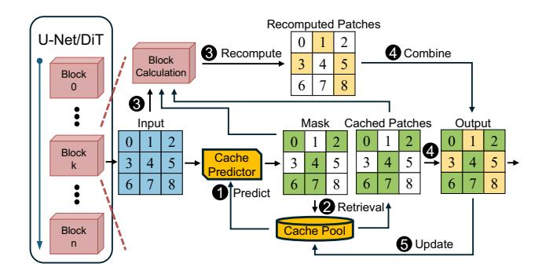

Figure 11. Patch-level cache reuse system overview.

determine whether to reuse the cache dynamically before each block in each step, ensuring that only patches with significant deviations from cached data are recomputed. To minimize the overhead from cache operations, we coalesce multiple cache operations to process them simultaneously.

## 5.1 Patch-aware Caching Strategy

Figure [11](#page-6-1) depicts the workflow of patch-level caching, which is applied before every blocks in T2I diffusion models. When a new input comes, Cache Reuse Predictor (Later discussed in Section [7\)](#page-7-0) compares input and cache from the previous step ( 1 ). The predictor generates a mask determining the reusability for each patch. ( 2 ). The input and generated mask are subsequently forwarded to the current block ( 3 ). For pixel-wise operators, recomputing only the unmasked patches is sufficient. However, as discussed in Section [4.2,](#page-4-2) certain operations rely on features from other patches to preserve quality. If masked patch values are directly used as inputs for such operations, the result may mismatch in shapes or output with significant errors. Fortunately, prior studies [\[14,](#page-11-5) [28\]](#page-12-8) observe that the outputs of operators from adjacent steps are sufficiently similar, allowing us to reuse the results from the previous step to fill the masked patches. After the block execution, part of the output is imprecise due to the masked processing pattern. Therefore, we use the mask again to replace the masked patches with cache, which is generated from the last step ( 4 ). Finally, the system updates the input and output of this block for the next step ( 5 ).

## 5.2 Batching Patches in Cache

Since we should access cache every single operation to load or save data, it is obvious that cache management affects the extent of benefit from caching. In SD3 [\[13\]](#page-11-9), it takes 40 to 50 ms to process one step with 24 blocks, which means we have to use less than 2 ms to complete all the cache operations for a single block, otherwise we cannot gain any profits even if all blocks can be skipped. To achieve this, the cache system should support three fundamental operators: query, delete, and update/insert.

<span id="page-6-2"></span>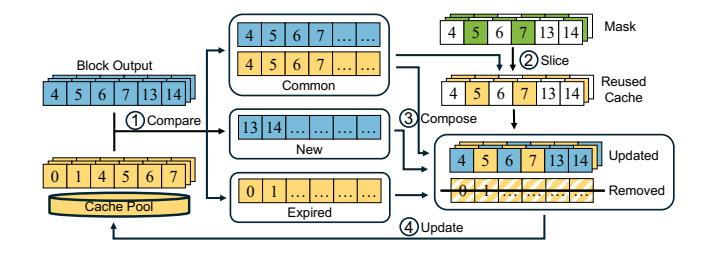

Figure 12. Batching Patches in Cache.

To efficiently manage the cache system, we adopt a batching strategy to amortize the cache overhead by processing them concurrently. We employ a map to store cache data, where each patch is assigned a unique identifier, and each block maintains an independent cache. Figure [12](#page-6-2) depicts the overall design. When a block needs to generate a mask or compute a masked output, it submits indices which consist of each patch's unique ID along with intermediate results to the cache system as input. By comparing these indices with the entries stored in the cache, the system identifies three distinct sets ( 1 ): Common Set: IDs present in both the cache and the input indices. When receiving new data, the cache system verifies whether the cache should replace the masked patched in the input ( 2 ). New Set: IDs present only in the input indices, which will be inserted into the cache. Unmasked regions are recomputed and then updated in the cache, while the New Set provides missing indices and coalesces them for updating ( 3 ). Expired Set: IDs present only in the cache. Since preemption is not allowed in MixFusion, each patch will stay on GPU until it finishes. Once the cache system detects IDs that is only in the cache system, it concludes that the corresponding patch has exited. Finally, the system removes expired entries from the Expired Set ( 4 ). By coalescing these operations, the cache system enables scalable patch reuse in parallel execution.

## <span id="page-6-0"></span>6 SLO-Aware Scheduler

## 6.1 Mixed-Resolution Throughput Analyzer

Admitting a new request into the current batch requires careful consideration. For instance, when the Schedule Decider considers admitting a new task into the current batch, the task introduces additional overhead. While this may improve overall throughput, it can also increase batch latency, risking SLO violations for some tasks. Such complex trade-off emphasizes the importance of accurate latency prediction. To make efficient scheduling decisions, MixFusion employs a Throughput Analyzer that forecasts the future latency of the potential batch. Conventional systems often rely on offline profiling to estimate model execution latency [\[3,](#page-11-11) [7,](#page-11-13) [51\]](#page-13-14), while such solution performs bad on mixed-resolution T2I diffusion serving system. This scenario introduces a significantly larger set of possible task combinations, making exhaustive

offline profiling infeasible. Moreover, since MIXFUSION combines requests into a single batch, the actual latency is typically less than the sum of per-task latencies. Overestimating this latency discourages admitting new tasks, ultimately reducing system throughput.

Based on these considerations, the Throughput Analyzer employs Multilayer Perceptron (MLP) for latency prediction. The MLP model takes three inputs: the task number for each resolution, the ongoing resolution number, and the total patch number. We generate 200 diverse resolution combinations and evaluate their latencies as the dataset, where 80 % of which is the train set and the remaining is the eval set. The MLP model achieves high prediction accuracy, with errors of less than 3.7 % compared to the actual latency, indicating negligible runtime overhead.

## 6.2 SLO-based Scheduling Algorithm

In mixed-resolution settings, each request may have distinct resolution and SLO requirements, and the system's ability to split requests into arbitrary patch sizes further complicates the decision of an optimal strategy, which necessitates an effective scheduling algorithm. Suppose there are M different resolutions, with  $N_i, i \in M$  requests in the waiting queue. Moreover, each request has distinct urgency, leading to an exponentially growing search space. Completing such an exhaustive schedule selection within a single scheduling period is therefore highly challenging.

To address this challenge, we introduce a heuristic scheduling algorithm that reduces scheduling overhead to a practical level while preserving high SLO satisfaction (Algorithm 1). First, we define the slack score for request i as:

$$Slack_i = \frac{DDL_i - C_i - P_i}{SA_i}$$

Here,  $DDL_i$  and  $SA_i$  denote the SLO constraint and the standalone model latency of request i, respectively.  $C_i$  represents the time consuming since request i arrived, and  $P_i$  is the predicted time of the remaining stages. The slack score quantifies request urgency, with lower scores indicating higher priority for earlier execution. This scheduling procedure can be performed in parallel with the denoising computation.

The scheduler is designed to balance throughput and SLO requirements, providing an efficient and systematic approach. The scheduler chooses either the most urgent request to prevent starvation or the one that maximizes throughput improvement for the current batch. If the most urgent request still has a relatively relaxed slack, the scheduler switches to a throughput-optimized mode and selects the next candidate (lines 11-14). This selection process continues until no additional requests can be admitted without violating SLO constraints (lines 16–18). If a candidate cannot meet its deadline even when processed immediately, it is discarded, consistent with prior approaches (lines 6-9) [32, 57].

## **Algorithm 1:** MIXFUSION schedule algorithm

```
Input: wait_queue, act_queue
   Output: active_queue
 1 while True do
       cur\_task \leftarrow get\_least\_slack\_task(wait\_queue)
 2
       act_task \leftarrow get_least_slack_task(act_queue)
       pred\ latency \leftarrow predictor(cur\ task, active\ queue)
 4
 5
       /*SLO Violation Analyze*/
       if time_out(cur_task, pred_latency) then
 6
            discards(cur task)
 7
            continue
       end
       /*Schedule Mode Decision*/
10
       if switch_mode(cur_task, pred_latency) then
11
            cur\_task \leftarrow update\_task()
            pred_latency \leftarrow
13
             update_latency(cur_task, act_queue)
       end
14
       /*Schedulability test*/
15
       if time_out(act_task, pred_latency) then
16
17
           break
       end
18
           act_queue.enqueue(cur_task)
       end
21
22 end
```

## <span id="page-7-0"></span>7 Implementation

We implement MIXFUSION with 12.5K line of codes in Python and C++/CUDA based on PyTorch [43] and following the system design principles of vLLM [26]. Stable Diffusion [56] is ported into our framework and decomposed into three stages: Preparation, Denoising, and Postprocessing to implement both baseline and MIXFUSION more flexibly. Common components of the sampler are reorganized to enable batch denoising across variable denoising steps. We further integrate xformers [27] to accelerate both baseline and MIXFU-SION. For prediction tasks, we leverage Scikit-learn [44] to train the MLP-based Throughput Analyzer and cuML [49] for cache predictor. The cache predictor employs a Random Forest Classifier on the GPU to achieve high performance while Throughput Analyzer is on CPU to hide the scheduling overhead. We collect input-output similarity metrics (MSE) across all blocks and timesteps for 1K inference requests, which are then used to train cache predictor.

## 8 Experiment

**Platform:** We conduct our experiments on a server equipped with an H100-80GB GPU and an AMD EPYC 9534 64-core CPU. The software stack consists of Ubuntu 18.04, CUDA 12.3, and PyTorch 2.2.2.

**Models:** We evaluate our system using Stable Diffusion 3 [13] and Stable Diffusion XL [46]. By default, we process 50

<span id="page-8-0"></span>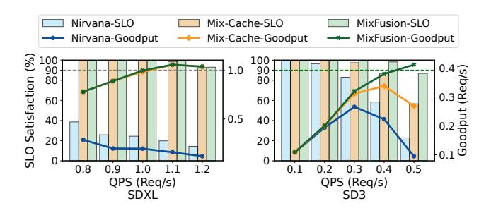

Figure 13. End-to-End SLO satisfaction ratio.

steps for both SD3 and SDXL. Following common practice [2, 40, 50, 66], we adopt three widely used resolutions,  $512 \times 512$ ,  $768 \times 768$ , and  $1024 \times 1024$ , noted as *Low*, *Medium*, and *High*, as the baseline settings. Unless otherwise noted, all experiments are conducted with float16 precision.

**Baseline:** We compare MIXFUSION with the following systems: (1) *NIRVANA* [2]: The state-of-the-art T2I diffusion serving system. We also incorporate the ORCA [65] to enhance its batch size. (2) *Distrifusion* [28]: A distributed parallel inference engine for diffusion. We only evaluate it on multiple GPUs. (3) *Mixed-Cache*: A variant of our approach that replaces our SLO-aware scheduler with an FCFS scheduler while enabling batching. All scheduling methods have a maximum batch size of 12 due to memory limits.

**Workload:** We use COCO [9] and DiffusionDB [60] to evaluate how much MixFusion affects the image quality. From each dataset, we sample 5K text-image pairs to construct evaluation subsets for quality measurement. We generate input streams following a Poisson distribution, consistent with prior work [19], where all resolutions contribute equally to the whole workload. Following the convention in Clockwork [19], we configure the SLO requirement as 5× the execution latency for each resolution setting.

#### 8.1 End-to-End Performance

We first display the end-to-end performance of MIXFUSION with default environment settings.

Performance: We first evaluate MIXFUSION with various QPS (Query Per Second) for both models. We only set diffusiondb [60] as the default database in performance evaluation since MIXFUSION's performance is not affected by prompts. Figure 13 presents the end-to-end SLO and goodput results. Compared to NIRVANA, MIXFUSION achieves 30.1 % higher SLO satisfaction on average while maintaining over 90 % SLO. The improvement is particularly pronounced on SDXL, where larger batch sizes provide greater performance gains. Specifically, SLO satisfaction drops sharply for SD3 as QPS increases, while it remains largely stable for SDXL. This is because latency gaps across resolutions are less pronounced in SDXL: generating a high resolution image takes only 1.3× the time of generating a low one, whereas SD3 requires over

**Table 3.** Quality Score comparison.

<span id="page-8-1"></span>

| Model    | Method                | SDXL                  |                       | SD3                   |                       |
|----------|-----------------------|-----------------------|-----------------------|-----------------------|-----------------------|
|          |                       | COCO                  | diffusiondb           | COCO                  | diffusiondb           |
| CLIP (†) | Original<br>MixFusion | 14.92<br><b>15.43</b> | 16.24<br><b>16.62</b> | 14.79<br><b>15.13</b> | 16.65<br><b>17.06</b> |
| FID (↓)  | Original<br>MixFusion | 31.92<br><b>28.85</b> | 35.56<br><b>33.42</b> | 28.94<br><b>26.56</b> | <b>32.38</b> 38.01    |

2.4× longer. The larger variance in SD3 limits the arriving rate of large resolution requests, but leaves more room for scheduling optimization. This is also the reason why MixFusion outperforms Mixed-Cache more in SD3, demonstrating the effectiveness of our scheduling algorithm. In conclusion, MixFusion achieves 5.33× and 1.06× higher goodput when achieving 90 % [70] SLO (green line in Figure 13) over NIR-VANA and Mixed-Cache, respectively.

Quality: Table 3 reports the CLIP [48] and FID [22] scores for both datasets and both models. The CLIP score measures alignment between generated images and input prompts, with higher values indicating stronger semantic consistency, while the FID score evaluates distance between the generated images and the datasets, with a lower value representing closer to the dataset. MixFusion achieves CLIP and FID scores comparable to the original models, demonstrating that our system obtains comparable quality as prior studies [25, 28].

## 8.2 Sensitivity Study

**Scalability.** We further extend our evaluation to 2, 4, and 8 H100 GPUs within a single node to assess scalability. For all methods except Distrifusion, we employ data parallelism to improve load balancing. Upon the arrival of a new request, we select the GPU that has the lowest workload and dispatch the request accordingly. Figure 15 demonstrates that Mix-Fusion achieves the highest SLO satisfaction across all configurations. In contrast, NIRVANA and Distrifusion exhibit opposing behaviors: NIRVANA performs relatively better under heavy workloads, while Distrifusion only maintains high SLO satisfaction under light workloads. NIRVANA employs ORCA to form batches, thereby increasing the likelihood of incorporating additional large-resolution requests due to longer execution time, leading to stable SLO satisfaction under heavy workloads. Distrifusion, however, processes requests sequentially, which offers lower latency but fails to sustain high throughput under heavy workloads.

Workflow Efficiency. We further evaluate scenarios where one resolution dominates the workload (50 %) while the other two share the remaining 50 %. We conduct an experiment with QPS of 8.8 req/s for SDXL and 3.2 req/s for SD3 on 8 GPUs. AS Figure 14 shows that MIXFUSION demonstrates the highest SLO satisfaction and goodput all the time. Although

<span id="page-9-1"></span>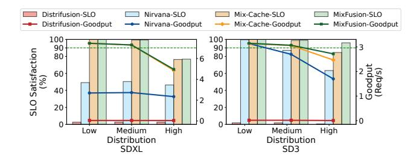

Figure 14. Performance under various distribution.

<span id="page-9-0"></span>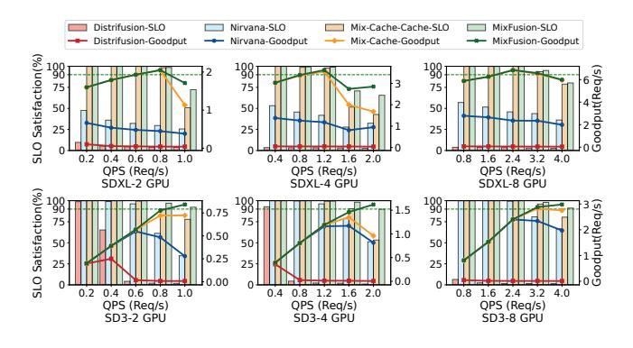

**Figure 15.** SDXL and SD3 end-to-end SLO change with different number of GPUs.

MIXFUSION only outperforms a little over Mixed-Cache when serving SDXL model due to similar SLO constraints, it manifests up to 11.4 % SLO improvement and 1.1× higher goodput than Mixed-Cache with over 90 % SLO on SD3. Moreover, MIXFUSION demonstrates superior performance when high-resolution requests dominate the workload, highlighting its scalability under various scenarios.

SLO Scale. We further evaluate MIXFUSION under different SLO scales to examine its behavior across varying constraints. We adopt the same configurations as in the workflow study and display the results in Figure 16. Notably, NIRVANA outperforms Mixed-Cache when the SLO is set to 3× the baseline latency on SD3. This advantage comes from the ORCA scheduling algorithm, which prioritizes newly arriving requests, enabling more requests to complete within strict deadlines. Nevertheless, MIXFUSION still achieves higher SLO satisfaction than NIRVANA.

## 8.3 Ablation Study

**Performance Breakdown** We assess the performance impact of two extra components introduced by MixFusion, splitting and cache management, by comparing the baseline. We exploit a variant called Patched Batching (which applies only the patch-based batching in Section 4) and MixFusion(which also includes caching from Section 5) to explore the benefits and overhead. Figure 17 presents the latency reductions achieved by each technique. A batch size

Table 4. Quality Analysis

<span id="page-9-3"></span>

| Method                     | SDXL [46] |         | SD3 [13] |         |
|----------------------------|-----------|---------|----------|---------|
|                            | PSNR(↑)   | SSIM(↑) | PSNR(↑)  | SSIM(↑) |
| Distrifusion, 8 Patches    | 10.96     | 0.49    | 9.35     | 0.38    |
| MIXFUSION, Patch Size=128, | 22.13     | 0.77    | inf      | 1.0     |
| 64 Patches, w/o cache      | 22.13     |         |          |         |
| MIXFUSION, Patch Size=256, | 24.84     | 0.81    | inf      | 1.0     |
| 16 Patches, w/o cache      | 24.04     |         |          |         |
| MixFusion, Patch Size=512, | 28.82     | 0.88    | inf      | 1.0     |
| 4 Patches, w/o cache       | 20.02     | 0.00    | 1111     | 1.0     |
| MixFusion                  | 18.57     | 0.67    | 15.96    | 0.72    |
| threshold=1                | 10.57     | 0.07    | 13.70    | 0.72    |
| MixFusion,                 | 18.67     | 0.68    | 16.47    | 0.74    |
| threshold=0.1              | 10.07     | 0.00    | 10.17    | 0.71    |
| MixFusion,                 | 18.70     | 0.68    | 16.47    | 0.74    |
| threshold=0.01             | 10.70     | 0.00    | 10.17    | 0.74    |

<span id="page-9-2"></span>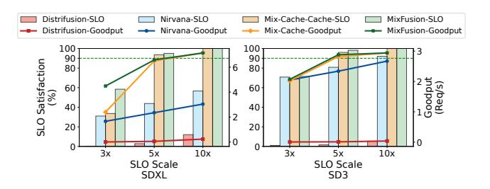

**Figure 16.** Performance under various SLO scale.

of 3 corresponds to one request per resolution. The baseline benefits from batching only when requests share the same resolution, resulting in rapid throughput gains as batch size increases. Patched Batching depicts an average 13 % throughput improvements by processing diverse resolution requests concurrently. The overhead introduced by splitting is minimal, particularly for SD3, which operates on token sequences rather than 2D latent states. SDXL exhibits higher relative improvement than SD3 due to its lower reliance on attention, which limits the benefits of batching. We observe that SD3 incurs higher cache management overhead due to a greater number of blocks per denoising step (24 in SD3 versus 7 in SDXL). Overall, cache management overhead scales modestly with batch size, demonstrating the efficiency of MixFusion's batched cache handling.

Patch size analysis. We evaluate MIXFUSION'S performance across different patch size configurations. As illustrated in Figure 18, throughput increases with the patch size growing, which primarily stems from less splitting overhead, which explains why SDXL manifests a larger decline than SD3 at smaller patch sizes. To mitigate this effect, we configure the patch size as the greatest common divisor of all resolutions within the batch. Additionally, our scheduling algorithm predicts post-batching latency to prevent throughput decline due to unreasonable resolution combination.

<span id="page-10-0"></span>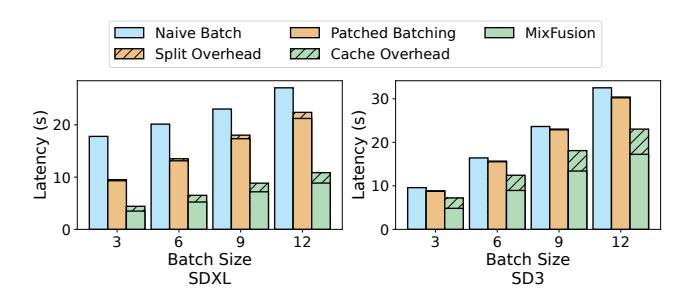

Figure 17. Latency Overhead from the extra operation.

<span id="page-10-1"></span>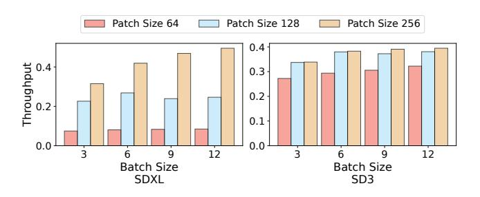

Figure 18. Average throughput changing with patch sizes.

Comparison with DistriFusion. Figure 19 presents the average throughput and memory consumption of MixFusion and DistriFusion. For this evaluation, caching and scheduling are disabled. We evaluate on 8 GPUs, where batch size equals 3 means every GPU has each of three resolution requests on average. MixFusion dispatches these requests evenly to all 8 GPUs, whereas DistriFusion runs as many requests concurrently as possible. Figure 19 demonstrates that MixFusion's throughput across 8 GPUs increases with batch size, reflecting initially low GPU utilization at smaller batch sizes. In contrast, Distrifusion achieves lower throughput on SDXL due to synchronization overhead. Moreover, its communication overhead increases significantly as batch size grows, leading to throughput decreasing on SD3.

We further evaluate image quality across varying patch sizes using Peak Signal-to-Noise Ratio (PSNR) [16] and Structural Similarity Index Measure (SSIM) [59] as metrics. PSNR measures differences in pixel intensity, whereas SSIM quantifies similarity between two images. Inf in PSNR indicates 0 pixel-wise difference, and an SSIM of 1.0 denotes 100 % structural similarity. We generate 100 1024 × 1024 images using either DistriFusion or MixFusion, and compare them against images synthesized by the original model. Table 4 shows that larger patch sizes result in more accurate images generated by MixFusion. The higher quality score compared to DistriFusion originates from pixel approximations in the Patch Edge Stitcher, whereas the SD3 model achieves 100 % accuracy due to the absence of convolution operations. Notably, MixFusion still attains higher PSNR and SSIM than

<span id="page-10-2"></span>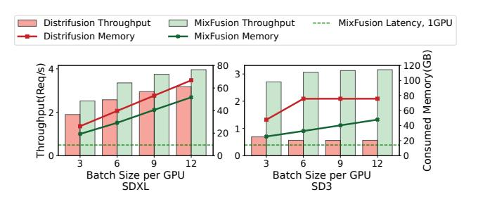

**Figure 19.** Patched batching on throughput and Memory.

<span id="page-10-3"></span>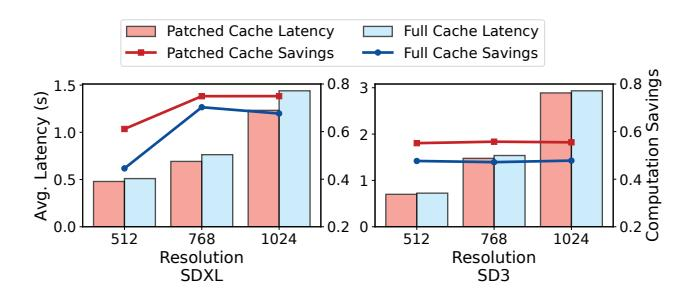

**Figure 20.** Computation savings from patched Vs. full imgs.

DistriFusion, owing to its use of up-to-date data rather than stale KV caches.

Caching Benefits We conduct an experiment to compare the effectiveness of patch-level caching versus whole-image caching. We incorporate whole image caching into Patched Batching Inference and determine that a block can only be skipped if all patches in the current batch meet the similarity threshold. The batch size is set to the maximum capacity supported by our GPU. We measure both the average latency per request and the computational savings, defined as: total\_skiped\_patches

/ (patch\_num × blocks\_num × step\_num). Figure 20 demonstrates that patch-level cache reuse consistently outperforms whole-image caching for both models. SD3 exhibits smaller time savings compared to SDXL, reflecting its lower overall computation requirements. Note that the computation savings reported in Figure 20 differ slightly from those in Figure 7, as the latter does not account for cumulative errors.

Parameter Decision We further conduct experiments to explore the sensitivity of two models: the Throughput Analyzer and the Cache Predictor. We first vary the number of layers and hidden dimensions of the MLP and evaluate the resulting accuracy. Table 5 shows that a configuration of (32, 32, 16) is sufficient for SDXL, while (64, 64, 16) suffices for SD3. Increasing the depth or hidden dimensions beyond these settings leads to overfitting and degrades accuracy. In addition, SD3's throughput is easier to predict than that of SDXL, as SD3 does not include convolution operations, which introduce non-linear complexities. We also study the impact of the Cache Predictor. We first vary the similarity

<span id="page-11-16"></span>**Table 5.** Parameter setting for MLP model.

| Parameters           | SDXL | SD3  |
|----------------------|------|------|
| (16, 16, 8)          | 0.77 | 0.92 |
| (32, 32, 16)         | 0.81 | 0.95 |
| (64, 64, 16)         | 0.79 | 0.96 |
| (16, 32, 32, 16)     | 0.77 | 0.93 |
| (16, 32, 64, 32, 16) | 0.79 | 0.94 |

<span id="page-11-17"></span>Table 6. Parameter setting for MLP model.

| Parameters           | SDXL | SD3  |
|----------------------|------|------|
| ntrees=50 mdepth=5   | 0.75 | 0.72 |
| ntrees=100 mdepth=5  | 0.75 | 0.72 |
| ntrees=100 mdepth=20 | 0.75 | 0.74 |
| ntrees=100 mdepth=50 | 0.75 | 0.74 |
| ntrees=500 mdepth=5  | 0.75 | 0.72 |

threshold and measure its sensitivity to image quality. Table 4 presents the generation quality with various thresholds. reports the generation quality under different thresholds. Even with a large threshold of 1, MixFusion consistently achieves higher quality than Distrifusion, demonstrating the robustness of MixFusion. Accordingly, we use 0.1 as the default threshold throughout the paper unless otherwise specified, as a smaller threshold does not bring a significant quality benefit. Finally, we evaluate the accuracy of the random forest model under different parameter settings. Table 6 shows that SDXL can employ a lightweight configuration with 50 trees and a maximum depth of 5, whereas SD3 requires 100 trees with a maximum depth of 20 to achieve higher accuracy.

## 9 Conclusion

This paper proposes MixFusion, an efficient serving system for mixed-resolution diffusion models. With the help of patch-based mixed-resolution inference and patch-level cache reuse strategy, MixFusion succeeds in processing requests concurrently regardless of resolutions, achieving better performance. In addition, MixFusion incorporates an SLO-aware schedule algorithm to maximize the number of requests meeting their SLO requirements. In addition, we further prove that our system is easy to scale up to a larger distributed environment and still outperforms the most advanced patch-based diffusion research.

#### References

- <span id="page-11-1"></span>Adobe. 2023. Create with Adobe Firefly generative AI. https://www.adobe.com/products/firefly.html.
- <span id="page-11-7"></span>[2] Shubham Agarwal, Subrata Mitra, Sarthak Chakraborty, Srikrishna Karanam, Koyel Mukherjee, and Shiv Kumar Saini. 2024. Approximate Caching for Efficiently Serving Text-to-Image Diffusion Models. In 21st USENIX Symposium on Networked Systems Design and Implementation (NSDI 24). USENIX Association, Santa Clara, CA, 1173–1189. https://www.usenix.org/conference/nsdi24/presentation/agarwal-shubham

- <span id="page-11-11"></span>[3] Sohaib Ahmad, Hui Guan, Brian D. Friedman, Thomas Williams, Ramesh K. Sitaraman, and Thomas Woo. 2024. Proteus: A High-Throughput Inference-Serving System with Accuracy Scaling. In Proceedings of the 29th ACM International Conference on Architectural Support for Programming Languages and Operating Systems, Volume 1 (, La Jolla, CA, USA.) (ASPLOS '24). Association for Computing Machinery, New York, NY, USA, 318–334. doi:10.1145/ 3617232.3624849
- <span id="page-11-12"></span>[4] Sohaib Ahmad, Qizheng Yang, Haoliang Wang, Ramesh K. Sitaraman, and Hui Guan. 2025. DiffServe: Efficiently Serving Text-to-Image Diffusion Models with Query-Aware Model Scaling. In <u>Eighth Conference on Machine Learning and Systems</u>. <a href="https://openreview.net/forum?id=1N3ShLfcTf">https://openreview.net/forum?id=1N3ShLfcTf</a>
- <span id="page-11-2"></span>[5] Aleksey Bokhovkin, Quan Meng, Shubham Tulsiani, and Angela Dai. 2025. SceneFactor: Factored Latent 3D Diffusion for Controllable 3D Scene Generation. In Proceedings of the IEEE/CVF Conference on Computer Vision and Pattern Recognition (CVPR). 628–639.
- <span id="page-11-4"></span>[6] Haoyu Chen, Xiaojie Xu, Wenbo Li, Jingjing Ren, Tian Ye, Songhua Liu, Ying-Cong Chen, Lei Zhu, and Xinchao Wang. 2025. POSTA:
  A Go-to Framework for Customized Artistic Poster Generation. In Proceedings of the IEEE/CVF Conference on Computer Vision and Pattern Recognition (CVPR). 28694–28704.
- <span id="page-11-13"></span>[7] Jinyu Chen, Wenchao Xu, Zicong Hong, Song Guo, Haozhao Wang, Jie Zhang, and Deze Zeng. 2024. OTAS: An Elastic Transformer Serving System via Token Adaptation. arXiv:2401.05031 [cs.DC]
- <span id="page-11-10"></span>[8] Jiuhai Chen, Zhiyang Xu, Xichen Pan, Yushi Hu, Can Qin, Tom Goldstein, Lifu Huang, Tianyi Zhou, Saining Xie, Silvio Savarese, Le Xue, Caiming Xiong, and Ran Xu. 2025. BLIP3-o: A Family of Fully Open Unified Multimodal Models-Architecture, Training and Dataset. arXiv:2505.09568 [cs.CV] https://arxiv.org/abs/2505.09568
- <span id="page-11-14"></span>[9] Xinlei Chen, Hao Fang, Tsung-Yi Lin, Ramakrishna Vedantam, Saurabh Gupta, Piotr Dollar, and C. Lawrence Zitnick. 2015. Microsoft COCO Captions: Data Collection and Evaluation Server. arXiv:1504.00325 [cs.CV]
- <span id="page-11-8"></span>[10] Xinle Cheng, Zhuoming Chen, and Zhihao Jia. 2025. CAT Pruning: Cluster-Aware Token Pruning For Text-to-Image Diffusion Models. arXiv:2502.00433 [cs.CV] https://arxiv.org/abs/2502.00433
- <span id="page-11-0"></span>[11] Prafulla Dhariwal and Alexander Nichol. 2021. Diffusion Models Beat GANs on Image Synthesis. In <u>Advances in Neural Information</u> <u>Processing Systems</u>, M. Ranzato, A. Beygelzimer, Y. Dauphin, P.S. Liang, and J. Wortman Vaughan (Eds.), Vol. 34. Curran Associates, Inc., 8780–8794. https://proceedings.neurips.cc/paper\_files/paper/ 2021/file/49ad23d1ec9fa4bd8d77d02681df5cfa-Paper.pdf
- <span id="page-11-3"></span>[12] Abdelrahman Eldesokey and Peter Wonka. 2025. Build-A-Scene: Interactive 3D Layout Control for Diffusion-Based Image Generation. In <u>The Thirteenth International Conference on Learning Representations</u>. <a href="https://openreview.net/forum?id=gg6dPtdC1C">https://openreview.net/forum?id=gg6dPtdC1C</a>
- <span id="page-11-9"></span>[13] Patrick Esser, Sumith Kulal, Andreas Blattmann, Rahim Entezari, Jonas Müller, Harry Saini, Yam Levi, Dominik Lorenz, Axel Sauer, Frederic Boesel, Dustin Podell, Tim Dockhorn, Zion English, Kyle Lacey, Alex Goodwin, Yannik Marek, and Robin Rombach. 2024. Scaling Rectified Flow Transformers for High-Resolution Image Synthesis. arXiv:2403.03206 [cs.CV] https://arxiv.org/abs/2403.03206
- <span id="page-11-5"></span>[14] Jiarui Fang, Jinzhe Pan, Xibo Sun, Aoyu Li, and Jiannan Wang. 2024. xDiT: an Inference Engine for Diffusion Transformers (DiTs) with Massive Parallelism. arXiv:2411.01738 [cs.DC] https://arxiv.org/abs/ 2411.01738
- <span id="page-11-6"></span>[15] Jiarui Fang, Jinzhe Pan, Jiannan Wang, Aoyu Li, and Xibo Sun. 2024. PipeFusion: Patch-level Pipeline Parallelism for Diffusion Transformers Inference. arXiv:2405.14430 [cs.CV] https://arxiv.org/abs/2405. 14430
- <span id="page-11-15"></span>[16] Fernando A. Fardo, Victor H. Conforto, Francisco C. de Oliveira, and Paulo S. Rodrigues. 2016. A Formal Evaluation of PSNR as Quality Measurement Parameter for Image Segmentation Algorithms. arXiv:1605.07116 [cs.CV] https://arxiv.org/abs/1605.07116

- <span id="page-12-1"></span>[17] Yifan Gao, Zihang Lin, Chuanbin Liu, Min Zhou, Tiezheng Ge, Bo Zheng, and Hongtao Xie. 2025. PosterMaker: Towards High-Quality Product Poster Generation with Accurate Text Rendering. In Proceedings of the IEEE/CVF Conference on Computer Vision and Pattern Recognition (CVPR). 8083–8093.
- <span id="page-12-5"></span>[18] Jiatao Gu, Shuangfei Zhai, Yizhe Zhang, Joshua M. Susskind, and Navdeep Jaitly. 2024. Matryoshka Diffusion Models. In The Twelfth International Conference on Learning Representations. [https://](https://openreview.net/forum?id=tOzCcDdH9O) [openreview.net/forum?id=tOzCcDdH9O](https://openreview.net/forum?id=tOzCcDdH9O)
- <span id="page-12-20"></span>[19] Arpan Gujarati, Reza Karimi, Safya Alzayat, Wei Hao, Antoine Kaufmann, Ymir Vigfusson, and Jonathan Mace. 2020. Serving DNNs like Clockwork: Performance Predictability from the Bottom Up. In 14th USENIX Symposium on Operating Systems Design and Implementation (OSDI 20). USENIX Association, 443–462. [https:](https://www.usenix.org/conference/osdi20/presentation/gujarati) [//www.usenix.org/conference/osdi20/presentation/gujarati](https://www.usenix.org/conference/osdi20/presentation/gujarati)
- <span id="page-12-3"></span>[20] Kaiming He, Xiangyu Zhang, Shaoqing Ren, and Jian Sun. 2016. Deep residual learning for image recognition. In Proceedings of the IEEE conference on computer vision and pattern recognition. 770–778.
- <span id="page-12-9"></span>[21] Jaehoon Heo, Adiwena Putra, Jieon Yoon, Sungwoong Yune, Hangyeol Lee, Ji-Hoon Kim, and Joo-Young Kim. 2025. EXION: Exploiting Inter-and Intra-Iteration Output Sparsity for Diffusion Models. In 2025 IEEE International Symposium on High Performance Computer Architecture (HPCA). 324–337. doi:[10.1109/HPCA61900.2025.00034](https://doi.org/10.1109/HPCA61900.2025.00034)
- <span id="page-12-21"></span>[22] Martin Heusel, Hubert Ramsauer, Thomas Unterthiner, Bernhard Nessler, and Sepp Hochreiter. 2017. GANs Trained by a Two Time-Scale Update Rule Converge to a Local Nash Equilibrium. In Advances in Neural Information Processing Systems, I. Guyon, U. Von Luxburg, S. Bengio, H. Wallach, R. Fergus, S. Vishwanathan, and R. Garnett (Eds.), Vol. 30. Curran Associates, Inc. [https://proceedings.neurips.cc/paper\\_](https://proceedings.neurips.cc/paper_files/paper/2017/file/8a1d694707eb0fefe65871369074926d-Paper.pdf) [files/paper/2017/file/8a1d694707eb0fefe65871369074926d-Paper.pdf](https://proceedings.neurips.cc/paper_files/paper/2017/file/8a1d694707eb0fefe65871369074926d-Paper.pdf)
- <span id="page-12-11"></span>[23] Runhui Huang, Chunwei Wang, Junwei Yang, Guansong Lu, Yunlong Yuan, Jianhua Han, Lu Hou, Wei Zhang, Lanqing Hong, Hengshuang Zhao, and Hang Xu. 2025. ILLUME+: Illuminating Unified MLLM with Dual Visual Tokenization and Diffusion Refinement. arXiv[:2504.01934](https://arxiv.org/abs/2504.01934) [cs.CV] <https://arxiv.org/abs/2504.01934>
- <span id="page-12-0"></span>[24] Zehuan Huang, Yuan-Chen Guo, Xingqiao An, Yunhan Yang, Yangguang Li, Zi-Xin Zou, Ding Liang, Xihui Liu, Yan-Pei Cao, and Lu Sheng. 2025. MIDI: Multi-Instance Diffusion for Single Image to 3D Scene Generation. In Proceedings of the IEEE/CVF Conference on Computer Vision and Pattern Recognition (CVPR). 23646–23657.
- <span id="page-12-22"></span>[25] Xiaoxiao Jiang, Suyi Li, Lingyun Yang, Tianyu Feng, Zhipeng Di, Weiyi Lu, Guoxuan Zhu, Xiu Lin, Kan Liu, Yinghao Yu, Tao Lan, Guodong Yang, Lin Qu, Liping Zhang, and Wei Wang. 2025. InstGenIE: Generative Image Editing Made Efficient with Mask-aware Caching and Scheduling. arXiv[:2505.20600](https://arxiv.org/abs/2505.20600) [cs.DC] <https://arxiv.org/abs/2505.20600>
- <span id="page-12-4"></span>[26] Woosuk Kwon, Zhuohan Li, Siyuan Zhuang, Ying Sheng, Lianmin Zheng, Cody Hao Yu, Joseph Gonzalez, Hao Zhang, and Ion Stoica. 2023. Efficient Memory Management for Large Language Model Serving with PagedAttention. In Proceedings of the 29th Symposium on Operating Systems Principles (<conf-loc>, <city>Koblenz</city>, <country>Germany</country>, </conf-loc>) (SOSP '23). Association for Computing Machinery, New York, NY, USA, 611–626. doi:[10.1145/](https://doi.org/10.1145/3600006.3613165) [3600006.3613165](https://doi.org/10.1145/3600006.3613165)
- <span id="page-12-18"></span>[27] Benjamin Lefaudeux, Francisco Massa, Diana Liskovich, Wenhan Xiong, Vittorio Caggiano, Sean Naren, Min Xu, Jieru Hu, Marta Tintore, Susan Zhang, Patrick Labatut, Daniel Haziza, Luca Wehrstedt, Jeremy Reizenstein, and Grigory Sizov. 2022. xFormers: A modular and hackable Transformer modelling library. [https://github.com/](https://github.com/facebookresearch/xformers) [facebookresearch/xformers](https://github.com/facebookresearch/xformers).
- <span id="page-12-8"></span>[28] Muyang Li, Tianle Cai, Jiaxin Cao, Qinsheng Zhang, Han Cai, Junjie Bai, Yangqing Jia, Ming-Yu Liu, Kai Li, and Song Han. 2024. DistriFusion: Distributed Parallel Inference for High-Resolution Diffusion Models. In Proceedings of the IEEE/CVF Conference on Computer Vision and Pattern Recognition (CVPR).

- <span id="page-12-16"></span>[29] Muyang Li, Ji Lin, Chenlin Meng, Stefano Ermon, Song Han, and Jun-Yan Zhu. 2022. Efficient Spatially Sparse Inference for Conditional GANs and Diffusion Models. In Advancesin Neural Information Processing Systems, S. Koyejo, S. Mohamed, A. Agarwal, D. Belgrave, K. Cho, and A. Oh (Eds.), Vol. 35. Curran Associates, Inc., 28858– 28873. [https://proceedings.neurips.cc/paper\\_files/paper/2022/file/](https://proceedings.neurips.cc/paper_files/paper/2022/file/b9603de9e49d0838e53b6c9cf9d06556-Paper-Conference.pdf) [b9603de9e49d0838e53b6c9cf9d06556-Paper-Conference.pdf](https://proceedings.neurips.cc/paper_files/paper/2022/file/b9603de9e49d0838e53b6c9cf9d06556-Paper-Conference.pdf)
- <span id="page-12-6"></span>[30] Zongming Li, Tianheng Cheng, Shoufa Chen, Peize Sun, Haocheng Shen, Longjin Ran, Xiaoxin Chen, Wenyu Liu, and Xinggang Wang. 2024. ControlAR: Controllable Image Generation with Autoregressive Models. arXiv[:2410.02705](https://arxiv.org/abs/2410.02705) [cs.CV] <https://arxiv.org/abs/2410.02705>
- <span id="page-12-7"></span>[31] Zhimin Li, Jianwei Zhang, Qin Lin, Jiangfeng Xiong, Yanxin Long, Xinchi Deng, Yingfang Zhang, Xingchao Liu, Minbin Huang, Zedong Xiao, Dayou Chen, Jiajun He, Jiahao Li, Wenyue Li, Chen Zhang, Rongwei Quan, Jianxiang Lu, Jiabin Huang, Xiaoyan Yuan, Xiaoxiao Zheng, Yixuan Li, Jihong Zhang, Chao Zhang, Meng Chen, Jie Liu, Zheng Fang, Weiyan Wang, Jinbao Xue, Yangyu Tao, Jianchen Zhu, Kai Liu, Sihuan Lin, Yifu Sun, Yun Li, Dongdong Wang, Mingtao Chen, Zhichao Hu, Xiao Xiao, Yan Chen, Yuhong Liu, Wei Liu, Di Wang, Yong Yang, Jie Jiang, and Qinglin Lu. 2024. Hunyuan-DiT: A Powerful Multi-Resolution Diffusion Transformer with Fine-Grained Chinese Understanding. arXiv[:2405.08748](https://arxiv.org/abs/2405.08748) [cs.CV] [https://arxiv.org/abs/2405.](https://arxiv.org/abs/2405.08748) [08748](https://arxiv.org/abs/2405.08748)
- <span id="page-12-17"></span>[32] Zhuohan Li, Lianmin Zheng, Yinmin Zhong, Vincent Liu, Ying Sheng, Xin Jin, Yanping Huang, Zhifeng Chen, Hao Zhang, Joseph E. Gonzalez, and Ion Stoica. 2023. AlpaServe: Statistical Multiplexing with Model Parallelism for Deep Learning Serving. In 17th USENIX Symposium on Operating Systems Design and Implementation (OSDI 23). USENIX Association, Boston, MA, 663–679. [https://www.usenix.](https://www.usenix.org/conference/osdi23/presentation/li-zhouhan) [org/conference/osdi23/presentation/li-zhouhan](https://www.usenix.org/conference/osdi23/presentation/li-zhouhan)
- <span id="page-12-12"></span>[33] Shiyu Liu, Yucheng Han, Peng Xing, Fukun Yin, Rui Wang, Wei Cheng, Jiaqi Liao, Yingming Wang, Honghao Fu, Chunrui Han, Guopeng Li, Yuang Peng, Quan Sun, Jingwei Wu, Yan Cai, Zheng Ge, Ranchen Ming, Lei Xia, Xianfang Zeng, Yibo Zhu, Binxing Jiao, Xiangyu Zhang, Gang Yu, and Daxin Jiang. 2025. Step1X-Edit: A Practical Framework for General Image Editing. arXiv[:2504.17761](https://arxiv.org/abs/2504.17761) [cs.CV] [https://arxiv.org/](https://arxiv.org/abs/2504.17761) [abs/2504.17761](https://arxiv.org/abs/2504.17761)
- <span id="page-12-14"></span>[34] Cheng Lu, Yuhao Zhou, Fan Bao, Jianfei Chen, Chongxuan LI, and Jun Zhu. 2022. DPM-Solver: A Fast ODE Solver for Diffusion Probabilistic Model Sampling in Around 10 Steps. In Advances in Neural Information Processing Systems, S. Koyejo, S. Mohamed, A. Agarwal, D. Belgrave, K. Cho, and A. Oh (Eds.), Vol. 35. Curran Associates, Inc., 5775–5787. [https://proceedings.neurips.cc/paper\\_files/paper/2022/](https://proceedings.neurips.cc/paper_files/paper/2022/file/260a14acce2a89dad36adc8eefe7c59e-Paper-Conference.pdf) [file/260a14acce2a89dad36adc8eefe7c59e-Paper-Conference.pdf](https://proceedings.neurips.cc/paper_files/paper/2022/file/260a14acce2a89dad36adc8eefe7c59e-Paper-Conference.pdf)
- [35] Cheng Lu, Yuhao Zhou, Fan Bao, Jianfei Chen, Chongxuan Li, and Jun Zhu. 2023. DPM-Solver++: Fast Solver for Guided Sampling of Diffusion Probabilistic Models. arXiv[:2211.01095](https://arxiv.org/abs/2211.01095) [cs.LG]
- <span id="page-12-15"></span>[36] Simian Luo, Yiqin Tan, Longbo Huang, Jian Li, and Hang Zhao. 2024. Latent Consistency Models: Synthesizing High-Resolution Images with Few-step Inference. <https://openreview.net/forum?id=duBCwjb68o>
- <span id="page-12-2"></span>[37] Jian Ma, Yonglin Deng, Chen Chen, Nanyang Du, Haonan Lu, and Zhenyu Yang. 2025. GlyphDraw2: Automatic Generation of Complex Glyph Posters with Diffusion Models and Large Language Models. Proceedings of the AAAI Conference on Artificial Intelligence 39, 6 (Apr. 2025), 5955–5963. doi:[10.1609/aaai.v39i6.32636](https://doi.org/10.1609/aaai.v39i6.32636)
- <span id="page-12-13"></span>[38] Xinyin Ma, Gongfan Fang, Michael Bi Mi, and Xinchao Wang. 2024. Learning-to-Cache: Accelerating Diffusion Transformer via Layer Caching. In The Thirty-eighth Annual Conference on Neural Information Processing Systems. [https://openreview.net/forum?id=](https://openreview.net/forum?id=ZupoMzMNrO) [ZupoMzMNrO](https://openreview.net/forum?id=ZupoMzMNrO)
- <span id="page-12-10"></span>[39] Xinyin Ma, Gongfan Fang, and Xinchao Wang. 2024. DeepCache: Accelerating Diffusion Models for Free. In 2024 IEEE/CVF Conference on Computer Vision and Pattern Recognition (CVPR). 15762–15772. doi:[10.1109/CVPR52733.2024.01492](https://doi.org/10.1109/CVPR52733.2024.01492)
- <span id="page-12-19"></span>[40] Midjourney. 2023. midjourney. <https://www.midjourney.com>.

- <span id="page-13-15"></span>[41] Alexander Quinn Nichol, Prafulla Dhariwal, Aditya Ramesh, Pranav Shyam, Pamela Mishkin, Bob Mcgrew, Ilya Sutskever, and Mark Chen. 2022. GLIDE: Towards Photorealistic Image Generation and Editing with Text-Guided Diffusion Models. In Proceedings of the 39th International Conference on Machine Learning (Proceedings of Machine Learning Research, Vol. 162), Kamalika Chaudhuri, Stefanie Jegelka, Le Song, Csaba Szepesvari, Gang Niu, and Sivan Sabato (Eds.). PMLR, 16784–16804. [https://proceedings.](https://proceedings.mlr.press/v162/nichol22a.html) [mlr.press/v162/nichol22a.html](https://proceedings.mlr.press/v162/nichol22a.html)
- <span id="page-13-1"></span>[42] OpenAI. 2023. Dalle 3 System Card. [https://cdn.openai.com/papers/](https://cdn.openai.com/papers/DALL_E_3_System_Card.pdf) [DALL\\_E\\_3\\_System\\_Card.pdf](https://cdn.openai.com/papers/DALL_E_3_System_Card.pdf).
- <span id="page-13-17"></span>[43] Adam Paszke, Sam Gross, Francisco Massa, Adam Lerer, James Bradbury, Gregory Chanan, Trevor Killeen, Zeming Lin, Natalia Gimelshein, Luca Antiga, Alban Desmaison, Andreas Kopf, Edward Yang, Zachary DeVito, Martin Raison, Alykhan Tejani, Sasank Chilamkurthy, Benoit Steiner, Lu Fang, Junjie Bai, and Soumith Chintala. 2019. PyTorch: An Imperative Style, High-Performance Deep Learning Library. In Advances in Neural Information Processing Systems, H. Wallach, H. Larochelle, A. Beygelzimer, F. d'Alché-Buc, E. Fox, and R. Garnett (Eds.), Vol. 32. Curran Associates, Inc. [https://proceedings.neurips.cc/paper\\_files/paper/2019/file/](https://proceedings.neurips.cc/paper_files/paper/2019/file/bdbca288fee7f92f2bfa9f7012727740-Paper.pdf) [bdbca288fee7f92f2bfa9f7012727740-Paper.pdf](https://proceedings.neurips.cc/paper_files/paper/2019/file/bdbca288fee7f92f2bfa9f7012727740-Paper.pdf)
- <span id="page-13-19"></span>[44] Fabian Pedregosa, Gaël Varoquaux, Alexandre Gramfort, Vincent Michel, Bertrand Thirion, Olivier Grisel, Mathieu Blondel, Peter Prettenhofer, Ron Weiss, Vincent Dubourg, Jake Vanderplas, Alexandre Passos, David Cournapeau, Matthieu Brucher, Matthieu Perrot, and Édouard Duchesnay. 2011. Scikit-learn: Machine Learning in Python. J. Mach. Learn. Res. 12 (nov 2011), 2825–2830.
- <span id="page-13-11"></span>[45] William Peebles and Saining Xie. 2023. Scalable Diffusion Models with Transformers. In 2023 IEEE/CVF International Conference on Computer Vision (ICCV). 4172–4182. doi:[10.1109/ICCV51070.2023.](https://doi.org/10.1109/ICCV51070.2023.00387) [00387](https://doi.org/10.1109/ICCV51070.2023.00387)
- <span id="page-13-6"></span>[46] Dustin Podell, Zion English, Kyle Lacey, Andreas Blattmann, Tim Dockhorn, Jonas Müller, Joe Penna, and Robin Rombach. 2023. SDXL: Improving Latent Diffusion Models for High-Resolution Image Synthesis. arXiv[:2307.01952](https://arxiv.org/abs/2307.01952) [cs.CV]
- <span id="page-13-7"></span>[47] Junxiang Qiu, Lin Liu, Shuo Wang, Jinda Lu, Kezhou Chen, and Yanbin Hao. 2025. Accelerating Diffusion Transformer via Gradient-Optimized Cache. arXiv[:2503.05156](https://arxiv.org/abs/2503.05156) [cs.CV] <https://arxiv.org/abs/2503.05156>
- <span id="page-13-22"></span>[48] Alec Radford, Jong Wook Kim, Chris Hallacy, Aditya Ramesh, Gabriel Goh, Sandhini Agarwal, Girish Sastry, Amanda Askell, Pamela Mishkin, Jack Clark, Gretchen Krueger, and Ilya Sutskever. 2021. Learning Transferable Visual Models From Natural Language Supervision. In Proceedings of the 38th International Conference on Machine Learning (Proceedings of Machine Learning Research, Vol. 139), Marina Meila and Tong Zhang (Eds.). PMLR, 8748–8763. [https://](https://proceedings.mlr.press/v139/radford21a.html) [proceedings.mlr.press/v139/radford21a.html](https://proceedings.mlr.press/v139/radford21a.html)
- <span id="page-13-20"></span>[49] Sebastian Raschka, Joshua Patterson, and Corey Nolet. 2020. Machine Learning in Python: Main developments and technology trends in data science, machine learning, and artificial intelligence. arXiv preprint arXiv:2002.04803 (2020).
- <span id="page-13-9"></span>[50] Robin Rombach, Andreas Blattmann, Dominik Lorenz, Patrick Esser, and Björn Ommer. 2022. High-Resolution Image Synthesis with Latent Diffusion Models. In 2022 IEEE/CVF Conference on Computer Vision and Pattern Recognition (CVPR). 10674–10685. doi:[10.1109/](https://doi.org/10.1109/CVPR52688.2022.01042) [CVPR52688.2022.01042](https://doi.org/10.1109/CVPR52688.2022.01042)
- <span id="page-13-14"></span>[51] Francisco Romero, Qian Li, Neeraja J. Yadwadkar, and Christos Kozyrakis. 2021. INFaaS: Automated Model-less Inference Serving. In 2021 USENIX Annual Technical Conference (USENIX ATC 21). USENIX Association, 397–411. [https://www.usenix.org/conference/](https://www.usenix.org/conference/atc21/presentation/romero) [atc21/presentation/romero](https://www.usenix.org/conference/atc21/presentation/romero)
- <span id="page-13-0"></span>[52] Chitwan Saharia, William Chan, Saurabh Saxena, Lala Li, Jay Whang, Emily L Denton, Kamyar Ghasemipour, Raphael Gontijo Lopes, Burcu

- Karagol Ayan, Tim Salimans, Jonathan Ho, David J Fleet, and Mohammad Norouzi. 2022. Photorealistic Text-to-Image Diffusion Models with Deep Language Understanding. In Advances in Neural Information Processing Systems, S. Koyejo, S. Mohamed, A. Agarwal, D. Belgrave, K. Cho, and A. Oh (Eds.), Vol. 35. Curran Associates, Inc., 36479–36494. [https://proceedings.neurips.cc/paper\\_files/paper/2022/](https://proceedings.neurips.cc/paper_files/paper/2022/file/ec795aeadae0b7d230fa35cbaf04c041-Paper-Conference.pdf) [file/ec795aeadae0b7d230fa35cbaf04c041-Paper-Conference.pdf](https://proceedings.neurips.cc/paper_files/paper/2022/file/ec795aeadae0b7d230fa35cbaf04c041-Paper-Conference.pdf)
- <span id="page-13-13"></span>[53] Desen Sun, Henry Tian, Tim Lu, and Sihang Liu. 2024. Flex-Cache: Flexible Approximate Cache System for Video Diffusion. arXiv[:2501.04012](https://arxiv.org/abs/2501.04012) [cs.MM] <https://arxiv.org/abs/2501.04012>
- <span id="page-13-3"></span>[54] Mingze Sun, Junhao Chen, Junting Dong, Yurun Chen, Xinyu Jiang, Shiwei Mao, Puhua Jiang, Jingbo Wang, Bo Dai, and Ruqi Huang. 2025. DRiVE: Diffusion-based Rigging Empowers Generation of Versatile and Expressive Characters. In Proceedings of the IEEE/CVF Conference on Computer Vision and Pattern Recognition (CVPR). 21170–21180.
- <span id="page-13-5"></span>[55] A Vaswani. 2017. Attention is all you need. Advances in Neural Information Processing Systems (2017).
- <span id="page-13-18"></span>[56] Patrick von Platen, Suraj Patil, Anton Lozhkov, Pedro Cuenca, Nathan Lambert, Kashif Rasul, Mishig Davaadorj, and Thomas Wolf. 2022. Diffusers: State-of-the-art diffusion models. [https://github.com/](https://github.com/huggingface/diffusers) [huggingface/diffusers](https://github.com/huggingface/diffusers).
- <span id="page-13-16"></span>[57] Chunyang Wang, Yuebin Bai, and Desen Sun. 2023. CD-MSA: Cooperative and Deadline-Aware Scheduling for Efficient Multi-Tenancy on DNN Accelerators. IEEE Transactions on Parallel and Distributed Systems 34, 7 (2023), 2091–2106. doi:[10.1109/TPDS.2023.3276759](https://doi.org/10.1109/TPDS.2023.3276759)
- <span id="page-13-4"></span>[58] Xiyu Wang, Yufei Wang, Satoshi Tsutsui, Weisi Lin, Bihan Wen, and Alex Kot. 2024. Evolving Storytelling: Benchmarks and Methods for New Character Customization with Diffusion Models. In Proceedings of the 32ndACM International Conference on Multimedia (Melbourne VIC, Australia) (MM '24). Association for Computing Machinery, New York, NY, USA, 3751–3760. doi:[10.1145/3664647.3681373](https://doi.org/10.1145/3664647.3681373)
- <span id="page-13-23"></span>[59] Zhou Wang, A.C. Bovik, H.R. Sheikh, and E.P. Simoncelli. 2004. Image quality assessment: from error visibility to structural similarity. IEEE Transactions on Image Processing 13, 4 (2004), 600–612. doi:[10.1109/](https://doi.org/10.1109/TIP.2003.819861) [TIP.2003.819861](https://doi.org/10.1109/TIP.2003.819861)
- <span id="page-13-21"></span>[60] Zijie J. Wang, Evan Montoya, David Munechika, Haoyang Yang, Benjamin Hoover, and Duen Horng Chau. 2023. DiffusionDB: A Largescale Prompt Gallery Dataset for Text-to-Image Generative Models. In Proceedings of the 61st Annual Meeting of the Association for Computational Linguistics(Volume 1: Long Papers), Anna Rogers, Jordan Boyd-Graber, and Naoaki Okazaki (Eds.). Association for Computational Linguistics, Toronto, Canada, 893–911. doi:[10.18653/v1/2023.acl](https://doi.org/10.18653/v1/2023.acl-long.51)[long.51](https://doi.org/10.18653/v1/2023.acl-long.51)
- <span id="page-13-8"></span>[61] Felix Wimbauer, Bichen Wu, Edgar Schoenfeld, Xiaoliang Dai, Ji Hou, Zijian He, Artsiom Sanakoyeu, Peizhao Zhang, Sam Tsai, Jonas Kohler, Christian Rupprecht, Daniel Cremers, Peter Vajda, and Jialiang Wang. 2024. Cache Me if You Can: Accelerating Diffusion Models through Block Caching. In 2024 IEEE/CVF Conference on Computer Vision and Pattern Recognition (CVPR). 6211–6220. doi:[10.1109/CVPR52733.](https://doi.org/10.1109/CVPR52733.2024.00594) [2024.00594](https://doi.org/10.1109/CVPR52733.2024.00594)
- <span id="page-13-12"></span>[62] Yuchen Xia, Divyam Sharma, Yichao Yuan, Souvik Kundu, and Nishil Talati. 2025. MoDM: Efficient Serving for Image Generation via Mixture-of-Diffusion Models. arXiv[:2503.11972](https://arxiv.org/abs/2503.11972) [cs.DC] [https://arxiv.](https://arxiv.org/abs/2503.11972) [org/abs/2503.11972](https://arxiv.org/abs/2503.11972)
- <span id="page-13-10"></span>[63] Jingyuan Yang, Jiawei Feng, and Hui Huang. 2024. EmoGen: Emotional Image Content Generation with Text-to-Image Diffusion Models. In 2024 IEEE/CVF Conference on Computer Vision and Pattern Recognition (CVPR). 6358–6368. doi:[10.1109/CVPR52733.2024.00608](https://doi.org/10.1109/CVPR52733.2024.00608)
- <span id="page-13-2"></span>[64] Yuanbo Yang, Jiahao Shao, Xinyang Li, Yujun Shen, Andreas Geiger, and Yiyi Liao. 2025. Prometheus: 3D-Aware Latent Diffusion Models for Feed-Forward Text-to-3D Scene Generation. In Proceedings of the IEEE/CVF Conference on Computer Vision and Pattern Recognition (CVPR). 2857–2869.

- <span id="page-14-5"></span><span id="page-14-0"></span>[65] Gyeong-In Yu, Joo Seong Jeong, Geon-Woo Kim, Soojeong Kim, and Byung-Gon Chun. 2022. Orca: A Distributed Serving System for Transformer-Based Generative Models. In 16th USENIX Symposium on Operating Systems Design and Implementation (OSDI 22). USENIX Association, Carlsbad, CA, 521–538. [https://www.usenix.](https://www.usenix.org/conference/osdi22/presentation/yu) [org/conference/osdi22/presentation/yu](https://www.usenix.org/conference/osdi22/presentation/yu)
- <span id="page-14-2"></span>[66] Zihao Yu, Haoyang Li, Fangcheng Fu, Xupeng Miao, and Bin Cui. 2024. Accelerating Text-to-Image Editing via Cache-Enabled Sparse Diffusion Inference. Proceedings of the AAAI Conference on Artificial Intelligence 38, 15 (Mar. 2024), 16605–16613. doi:[10.1609/aaai.v38i15.](https://doi.org/10.1609/aaai.v38i15.29599) [29599](https://doi.org/10.1609/aaai.v38i15.29599)
- <span id="page-14-1"></span>[67] Zichao Yu, Zhen Zou, Guojiang Shao, Chengwei Zhang, Shengze Xu, Jie Huang, Feng Zhao, Xiaodong Cun, and Wenyi Zhang. 2025. AB-Cache: Training-Free Acceleration of Diffusion Models via Adams-Bashforth Cached Feature Reuse. arXiv[:2504.10540](https://arxiv.org/abs/2504.10540) [stat.ML] [https:](https://arxiv.org/abs/2504.10540) [//arxiv.org/abs/2504.10540](https://arxiv.org/abs/2504.10540)
- <span id="page-14-3"></span>[68] Jintao Zhang, Haoxu Wang, Kai Jiang, Shuo Yang, Kaiwen Zheng, Haocheng Xi, Ziteng Wang, Hongzhou Zhu, Min Zhao, Ion Stoica, Joseph E. Gonzalez, Jun Zhu, and Jianfei Chen. 2025. SLA: Beyond Sparsity in Diffusion Transformers via Fine-Tunable Sparse-Linear Attention. arXiv[:2509.24006](https://arxiv.org/abs/2509.24006) [cs.LG] <https://arxiv.org/abs/2509.24006>
- <span id="page-14-4"></span>[69] Jintao Zhang, Chendong Xiang, Haofeng Huang, Jia Wei, Haocheng Xi, Jun Zhu, and Jianfei Chen. 2025. SpargeAttention: Accurate and Training-free Sparse Attention Accelerating Any Model Inference. arXiv[:2502.18137](https://arxiv.org/abs/2502.18137) [cs.LG] <https://arxiv.org/abs/2502.18137>
- <span id="page-14-6"></span>[70] Yinmin Zhong, Shengyu Liu, Junda Chen, Jianbo Hu, Yibo Zhu, Xuanzhe Liu, Xin Jin, and Hao Zhang. 2024. DistServe: Disaggregating Prefill and Decoding for Goodput-optimized Large Language Model Serving. In 18th USENIX Symposium on Operating Systems Design and Implementation (OSDI 24). USENIX Association, Santa Clara, CA, 193–210. [https://www.usenix.org/conference/osdi24/presentation/](https://www.usenix.org/conference/osdi24/presentation/zhong-yinmin) [zhong-yinmin](https://www.usenix.org/conference/osdi24/presentation/zhong-yinmin)