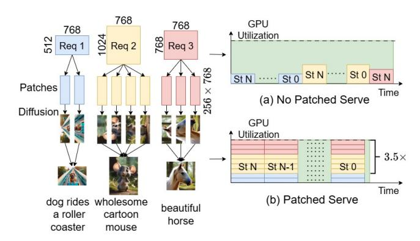

# Abstract

Text-to-Image (T2I) diffusion models have recently attracted significant attention due to their ability to synthesize highfidelity photorealistic images. However, serving diffusion models would suffer from hardware underutilization in realworld settings due to highly variable request resolutions. To this end, we present MixFusion, a parallel serving System that exploits fine-grained patch-level parallelism to enable efficient batching of mixed-resolution requests. Specifically, MixFusion introduces a novel patch-based processing workflow, significantly enabling concurrent processing across heterogeneous requests. Furthermore, MixFusion incorporates a patch-tailored cache management policy to exploit the patch-level locality benefits. In addition, MixFusion features an SLO-aware scheduling strategy with lightweight online latency prediction. Extensive evaluation demonstrates that MixFusion achieves 30.1% higher SLO satisfaction compared to the state-of-the-art solutions on average. Our code is available at https://github.com/desenSunUBW/mixfusion.

CCS Concepts: • Computing methodologies→Massively parallel algorithms; Machine learning; Artificial intelligence; • Computer systems organization → Parallel architectures.

Keywords: Patch Management, Diffusion Model Serving, Mixed-Resolution Batching

## ACM Reference Format:

Desen Sun, Zepeng Zhao, and Yuke Wang. 2026. MixFusion: A Patch-Level Parallel Serving System for Mixed-Resolution Diffusion Models. In Proceedings of the 31st ACM SIGPLAN Annual Symposium on Principles and Practice of Parallel Programming (PPoPP '26), January 31 – February 4, 2026, Sydney, NSW, Australia. ACM, New York, NY, USA, [15](#page-14-0) pages. <https://doi.org/10.1145/3774934.3786420>

[This work is licensed under a Creative Commons Attribution 4.0 Interna](https://creativecommons.org/licenses/by/4.0)[tional License.](https://creativecommons.org/licenses/by/4.0)

PPoPP '26, Sydney, NSW, Australia © 2026 Copyright held by the owner/author(s). ACM ISBN 979-8-4007-2310-0/2026/01 <https://doi.org/10.1145/3774934.3786420>

Figure 1. Assume three requests, Req1, Req2, and Req3, where each requiring processing over N steps, from St N to St 0. (a) Process requests sequentially. (b) Process requests in parallel, achieving higher GPU utilization.

