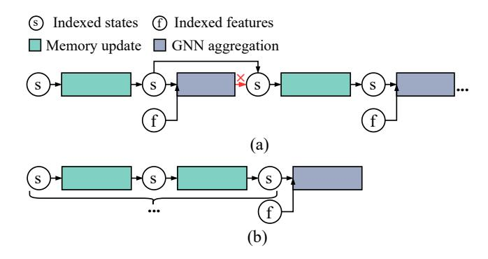

# 1 Introduction

Graph Neural Networks (GNNs) have emerged as fundamental building blocks across a wide spectrum of domains [\[12,](#page-11-0) [31,](#page-12-1) [37\]](#page-12-2). By combining message passing over graph structures with neural operations, GNNs effectively capture complex dependencies among entities (i.e., graph nodes), thereby enabling accurate predictions in tasks such as node classification and community detection [\[19,](#page-11-1) [32,](#page-12-3) [37\]](#page-12-2). However, most real-world graphs are dynamic, with interactions continuously evolving over time. Static GNNs lack the temporal modeling capability to handle such evolving data.

To support dynamic graphs, Temporal Graph Networks (TGNs) extend static GNNs by transforming the input stream of timestamped interactions into a sequence of temporal graphs [\[18,](#page-11-2) [22,](#page-11-3) [26,](#page-11-4) [36\]](#page-12-4). To capture dependencies across temporal graphs, TGNs maintain a persistent node memory, analogous to the hidden state in recurrent neural networks: after each temporal graph is processed, the node memory is

Figure 1. Comparison between (a) baseline TGN inference paradigm and (b) decoupled TGN inference paradigm. Removing unnecessary sequential dependencies enables memory update restructure and GNN aggregation parallelism.

updated, and the resulting temporal state is propagated stepwise to subsequent graphs, thereby accumulating long-range context [\[1,](#page-11-5) [10,](#page-11-6) [18\]](#page-11-2). Owing to this capability, TGNs have been widely adopted in both academic research [\[6,](#page-11-7) [20,](#page-11-8) [34,](#page-12-5) [39,](#page-12-6) [41,](#page-12-7) [42\]](#page-12-8) and industrial applications, ranging from recommendation platforms [\[21,](#page-11-9) [24\]](#page-11-10) to financial fraud detection [\[4,](#page-11-11) [35\]](#page-12-9) and intelligent transportation systems [\[8,](#page-11-12) [13\]](#page-11-13).

Recent efforts have sought to optimize specific components of TGN inference. TGL [\[41\]](#page-12-7) introduces a temporal graph format to accelerate sampling, while ETC [\[5\]](#page-11-14) reduces input transfers by eliminating redundant accesses and reconstructing layouts on GPUs. TGOpt [\[29\]](#page-12-10) employs deduplication, memoization, and precomputation to cut redundancy in sampling, computation, and loading, and TGLite [\[30\]](#page-12-11) extends TGOpt with additional system-level abstractions. While these systems deliver notable improvements, they all remain bound to the same step-wise processing paradigm, leaving broader opportunities unaddressed.

In this paradigm (Figure [1](#page-1-0) (a)), inference must traverse temporal graphs strictly in chronological order, enforcing two coupled stages: (1) the memory update stage, which refreshes per-node memory with new interactions and produces updated temporal states; and (2) the GNN aggregation stage, which applies message passing over updated states and node features to generate predictions. However, we observe that only memory updates require chronological ordering across temporal graphs. The dependency in Figure [1](#page-1-0) (a), which forces each memory update to wait for the preceding GNN aggregation, is unnecessary for semantic correctness and can be safely removed. This insight motivates us to decouple memory updates from GNN aggregation, as illustrated in Figure [1](#page-1-0) (b), thereby enabling opportunities for restructuring memory updates and parallelizing aggregations that are unattainable under the conventional paradigm.

To exploit these opportunities in practice, the rigid stepwise execution must be broken by transforming the Computation Graph (CG) of TGN so that multiple memory updates

can be deferred and aggregated jointly. However, a naive transformation fails to deliver real performance gains. On one hand, handling multiple temporal states in node memory triggers recurrent GPU memory management overhead. On the other hand, aggregating these temporal states with separate kernels leads to redundant computation and underutilized GPU resources. Challenge 1: how to defer the execution of multiple temporal states with lightweight memory management and efficient aggregation?

After optimizing GNN aggregation, the performance bottleneck shifts to the memory update stage. Prior systems process one temporal graph at a time, where dependencies are implicitly carried through node memory handoffs. When multiple temporal states are retained, these handoffs expose cross-graph dependencies, resulting in redundant global memory reads and writes. In prior step-wise processing paradigm, this overhead remained hidden, as each temporal graph was processed independently. However, when memory updates are organized back-to-back, the limitation becomes evident: updated states are written to global memory, and in the next step, they must be read again for further computation, creating excessive traffic across temporal graphs. Challenge 2: how to support cross-graph state updates without incurring prohibitive global memory traffic from localized node-memory handoffs?

A further difficulty lies in determining the appropriate aggregation granularity, i.e., the number of memory updates accumulated before performing a joint GNN aggregation. From a performance perspective, larger granularity is favorable: it lowers the number of aggregations, reducing computation cost; with fewer aggregations, it also reduces synchronization points between memory updates, reducing coordination overhead. However, larger granularity also prolongs the lifetime of temporal states, raising peak memory consumption and risking oversubscription. Because inference precludes costly autotuning, granularity must be determined ahead of execution with negligible overhead. Challenge 3: how to select an aggregation granularity that maximizes efficiency while guaranteeing memory safety?

To address these challenges, we present APERTURE, an end-to-end TGN inference framework that maximizes performance while ensuring memory safety. APERTURE achieves this by separating memory updates from GNN aggregation and exploiting a global view to restructure updates and parallelize read-only aggregation. For Challenge 1, APERTURE remaps sampled results into a global feature map, and leverages this layout to pre-allocate memory space and eliminate duplicate operations during aggregation. For Challenge 2, APERTURE constructs a state-based DAG in parallel and leverages the global dependency information to optimize memory update execution and reduce memory traffic. For Challenge 3, APERTURE models temporal state lifetimes, using an analytical model to select granularity and a topological traversal to track peak memory usage.

To the best of our knowledge, this is the first work to overcome the inherent limitations of the step-wise TGN paradigm, bridging the gap between algorithmic and systemic optimization. The contributions are as follows1:

- We comprehensively analyze the temporal sensitivity
  of the two stages involved in TGN inference and illustrate the opportunities for parallel execution brought
  about by breaking inherent dependencies.
- We propose three novel modules including CG transformation engine, memory update manager, and aggregation granularity calculator, which reduce redundant operations and global memory accesses while maximizing efficiency under memory constraints.
- We develop a TGN inference framework APERTURE
  that coordinates algorithmic and systemic optimizations to accelerate the entire pipeline without accuracy
  loss. The experimental results show that APERTURE
  achieves a maximum speedup of 59.3× in end-to-end\ninference compared to the state-of-the-art work.

### 2 Background

### 2.1 Temporal Graph Networks

Temporal Graph Networks (TGNs) are designed for link prediction on dynamic graphs, i.e., predicting whether an edge will appear between two nodes at a future timestamp based on their historical interactions. The input is a stream of timestamped edges representing node interactions. To balance temporal ordering with execution parallelism, TGNs process edges in fixed-size groups in chronological order. For each group,  $temporal\ neighbor\ sampling\ constructs\ a\ temporal\ graph$  on the fly by selecting the k latest edges per node before the current interaction, where k limits the number of temporal neighbors. The resulting sequence of temporal graphs preserves temporal structure and serves as input to TGN inference, which consists of two tightly coupled stages: memory update and GNN aggregation.

(1) Memory update: TGN maintains a persistent node memory, represented as a tensor in which each row corresponds to the state vector of a unique node identifier. At each step, node states involved in the current temporal graph are first updated using messages generated in the previous step:

$$s_u = \text{UPDT}(s_u^-, \text{AGGR}(m_{ku}^- \mid k \in N(u)))$$
 (1)

where  $s_u^-$  denotes the state of node u before the update,  $m_{ku}^-$  is the message previously generated from neighbor k to u, and N(u) is the neighbor set of u. AGGR( $\cdot$ ) aggregates the stored messages (by mean or most-recent selection [14, 18, 25]), and UPDT( $\cdot$ ) updates the node state, typically implemented with recurrent units such as RNNs [7, 14] or GRUs [3, 18].

After states are updated, the current interactions generate new messages that will be consumed in the next step. For each interaction in the temporal graph, edge  $e_{uv}$  from node

**Table 1.** Components of a temporal graph.

| Component                                              | Description                                                                                                                                                                |
|--------------------------------------------------------|----------------------------------------------------------------------------------------------------------------------------------------------------------------------------|
| Node IDs Dstnode IDs Latest Nbrs Latest Times | Identifiers for all nodes in the temporal graph. Destination nodes involved in interactions. Latest neighbors of destination nodes. Timestamps of the latest interactions. |

*u* to *v* at time *t* involves the destination nodes *u* and *v*; thus, two messages are produced:

$$m_{uv} = \text{MSG}(s_u, s_v, E_{uv}(t), t - t_u)$$
  

$$m_{vu} = \text{MSG}(s_v, s_u, E_{uv}(t), t - t_v)$$
(2)

where  $MSG(\cdot)$  is a learnable module (e.g., MLP),  $s_u$  and  $s_v$  are the latest states of u and v,  $E_{uv}(t)$  is the edge feature, and (t-t.) encodes the elapsed time since the node's last update.

(2) GNN aggregation: After memory updates, TGNs apply temporal GNN layers to generate embeddings for prediction. Each layer performs message passing with temporal attention, combining the updated node states with node features, edge features, and time encodings on the temporal graph:

$$\zeta_{u}(t) = s_{u}(t) \parallel \Phi(0)$$

$$\zeta_{v}(t) = s_{v}(t) \parallel E_{uv}(t) \parallel \Phi(t - t_{v})$$

$$r_{u}(t) = \operatorname{ATTN}(\zeta_{u}(t), \zeta_{v}(t) \mid v \in N(u, t))$$

$$h_{u}(t) = \operatorname{FFN}(r_{u}(t) \parallel s_{u}(t))$$
(3)

where  $\Phi(\cdot)$  encodes time intervals, ATTN denotes attention-based aggregation [18], and FFN is a feed-forward predictor.

### 2.2 Existing TGN Inference Systems

Existing TGN systems typically implement the inference pipeline in three stages as follows.

- (i) *Sampling*: Construct a temporal graph using temporal neighbor sampling. This stage generates the temporal graph, which serves as the input for the subsequent memory update and aggregation stages. Each temporal graph is composed of the components listed in Table 1, which together provide a structured abstraction for subsequent computations.
- (ii) Memory update: Update node states through NM (Node Memory) and RMS (Raw Message Store), as shown in Figure 2. NM stores node states and timestamps, while RMS stores messages and their corresponding timestamps. During execution, node states are loaded from NM via node IDs. Time features are then computed by encoding times in NM and RMS, both accessed via node IDs. These features are concatenated with messages from RMS (also accessed via node IDs) to form raw messages. Finally, the node states and raw messages are processed together to update the node states.

The updated node states are written back to both NM (via node IDs) and RMS (via dstnode IDs and latest Nbrs). The times from RMS are written back to NM (via node IDs), and the latest Times are written back to RMS (via dstnode IDs).

&lt;sup>1The artifact for this paper is publicly available on Zenodo under DOI [27].

(iii) *GNN aggregation*: Apply temporal attention layers to aggregate the updated node states with features and time encodings, generating link-prediction outputs.

Prior studies mainly target optimizations for the three stages. ETC [5] proposes a three-step data access policy with inter-batch pipeline for reducing redundant data accesses and preload time. TGOpt [29] targets storage and computation redundancies in TGAT [33] inference. These redundancies include intra-batch repeated edge interactions, interbatch duplicate embedding calculations, and repeated timeencoding operations. TGOpt addresses them through three techniques: deduplication, memoization, and precomputation. TGLite [30] extends TGOpt by providing lightweight abstractions and composable operators for programming TGNs. It introduces a set of TBlock based operators such as temporal neighborhood sampling, scatter or segmented computations that can be flexibly composed to build customized inference pipelines. Cascade [2] supports training with large batch sizes by exploiting spatial independence in scattered events. Overall, these approaches still operate within the step-wise paradigm, missing broader opportunities for enhancing parallelism and efficiency.

Numerous works have studied system optimizations for static or snapshot-based GNNs [9, 11, 15–17, 21, 23, 28, 38, 40], but their techniques do not naturally extend to temporal scenarios, where sequential dependencies dominate.

### 2.3 Potential Decoupling Opportunities

Our primary analysis focuses on the semantic correctness of the decoupling between memory updates and GNN aggregation. Specifically, we model TGN inference as discrete steps  $t=1,\ldots,T$ . Let  $S_u^{(t)}$  denote node u's state *after* processing step t (i.e., after memory updates), and let  $Y_u^{(t)}$  be the output embedding used for prediction at step t. A generic TGN step can be written as:

$$S_{u}^{(t)} = \operatorname{Upd}\left(S_{u}^{(t-1)}, \operatorname{MsgAgg}^{\operatorname{upd}}\left(\left\{\left(S_{v}^{(t-1)}, \psi^{\operatorname{upd}}(\Delta t_{vu})\right) \mid v \in \mathcal{N}_{u}^{(t)}\right\}\right)\right), \tag{4}$$

$$Y_{u}^{(t)} = \operatorname{Agg}\left(S_{u}^{(t)}, \operatorname{MsgAgg}^{\operatorname{read}}\left(\left\{\left(S_{v}^{(t)}, \psi^{\operatorname{read}}(\Delta t_{vu})\right) \mid v \in \mathcal{N}_{u}^{(t)}\right\}\right)\right). \tag{5}$$

The decoupling is semantics-preserving under the following sufficient conditions: (C1) Read-only read path - Agg and MsgAggread do not modify  $S^{(t)}$  and do not feed back into Upd; (C2) Deterministic temporal encoding -  $\psi^{\text{read}}(\Delta t)$  depends only on timestamps (independent of execution order/parallelism); (C3) Permutation invariance - MsgAggread is permutation-invariant over the neighbor multiset. Under C1–C3, the evolution of states  $\{S^{(t)}\}$  is fully determined by the update recurrence alone, and the read path at step t is a pure function of the snapshot  $S^{(t)}$  (and timestamps). Therefore, we may execute all memory updates in temporal

Figure 2. Illustration of memory update stage.

order to obtain  $\{S^{(t)}\}$ , and postpone/reorder/parallelize the read-only aggregation as long as it reads the same snapshots, yielding identical  $\{Y^{(t)}\}$  to step-wise execution.

#### 3 Motivation

Decoupling memory updates from GNN aggregation can break the rigid step-wise paradigm in TGN inference systems, opening up system-level optimization opportunities. We make three observations based on profiling the TGN model over the *lastfm* dataset on A100 GPU.

