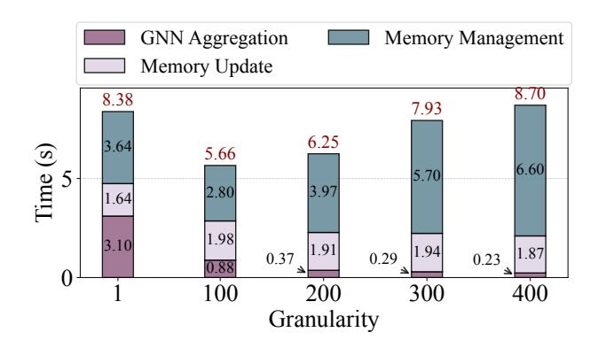

# 3.1 Observation 1: Multi-states aggregation is accuracy-neutral but performance-sensitive

The rigid sequential processing of traditional TGNs limits parallelism and underutilizes hardware. A natural way to improve efficiency is to process multiple temporal graphs together, which we term the *inference step size*. However, as shown in Figure 3, larger step sizes cause significant accuracy degradation due to causal violations: memory updates must follow strict temporal order to ensure correct state evolution.

However, we observe that the dependency forcing each memory update to wait for the preceding GNN aggregation is not semantically necessary. Although memory updates require temporal consistency, GNN aggregation only reads node states without modifying them and is therefore not constrained by temporal order. This insight enables the decoupling of memory updates from aggregation: multiple memory updates can be executed sequentially while preserving temporal semantics, followed by a single GNN aggregation over the resulting states. We refer to this as multi-state aggregation, governed by a granularity parameter  $\Gamma$ . The experimental results confirm that multi-state aggregation preserves model quality (See Section 5.3).

We implement a naive computation graph transformation (*Naive-CG*) that executes  $\Gamma$  memory updates in sequence, materializes the intermediate node states, and then performs

**Figure 3.** Inference accuracy when processing multiple temporal graphs simultaneously. AP and AUC denote Average Precision and Area Under the ROC Curve, respectively.

**Figure 4.** Time breakdown of naive computation graph transformation as the aggregation granularity increases.

a single GNN aggregation over their concatenation. Figure 4 reports the breakdown as  $\Gamma$  increases: GNN aggregation time decreases due to reuse and fewer kernel launches, memory update time remains nearly unchanged, yet the end-to-end time first drops and then grows, eventually exceeding the no-transformation baseline. The inflection is driven by repeated (de)allocations and large-state concatenations, whose overhead scales with  $\Gamma$  and offsets the aggregation gains. These findings suggest that while multi-state aggregation is accuracy-neutral, fully realizing its performance potential requires a careful CG transformation engine.

