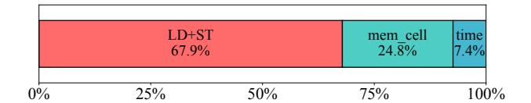

# 3.2 Observation 2: Localized node-memory updates incur excessive memory access overhead

Figure 5 breaks down the execution time of memory updates, showing that the majority of cost is dominated by *global load/store operations*, while the actual update logic and time encoding account for only a small fraction. This indicates that memory updates are highly *memory-bound*, and reducing redundant global accesses is critical for efficiency.

We further analyze consecutive temporal graphs and measure the overlap in nodes (Node IDs). As shown in Figure 6, a large portion of graphs exhibit high redundancy: over 70% of

Figure 5. Time breakdown of memory update stage.

**Figure 6.** Percentage distribution of repeated nodes across consecutive memory update stages.

graphs have more than 70% repeated nodes between successive updates. This reveals substantial opportunity for *fusing* repeated accesses, motivating techniques that minimize crossgraph traffic and reuse updated states.

