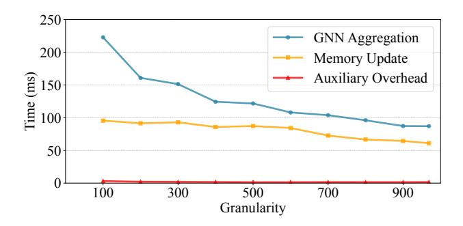
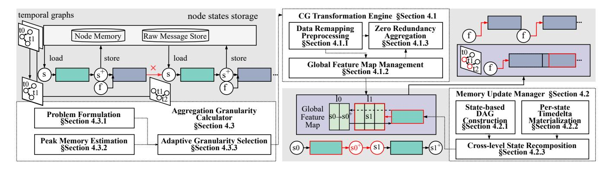
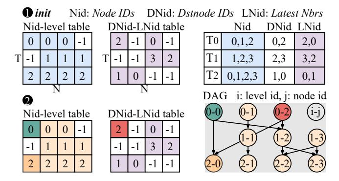
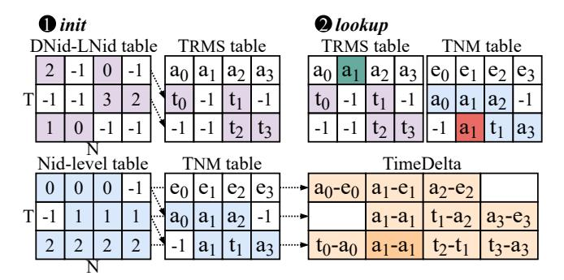
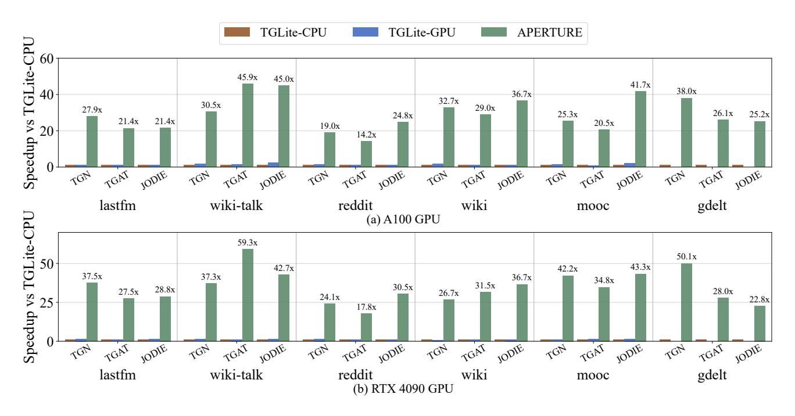
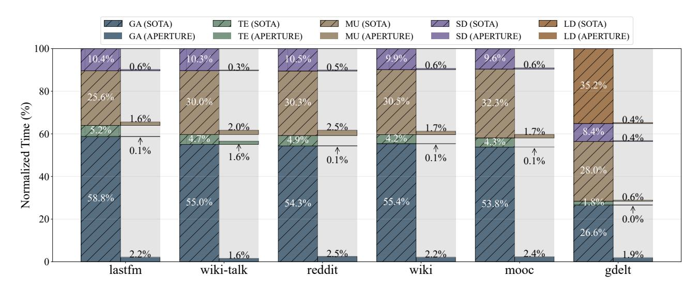
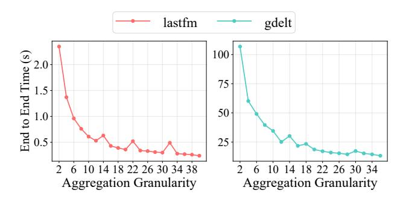
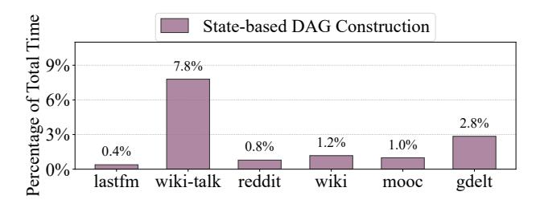

# 3.3 Observation 3: Aggregation granularity affects both performance and memory usage

Aggregation granularity  $\Gamma$  is pivotal for inference performance and memory usage. As shown in Figure 7, runtime declines in both *memory update* and *GNN aggregation* stages as  $\Gamma$  increases. In memory update stage, larger  $\Gamma$  reduces inter-aggregation synchronization points, so each node state is updated fewer times across temporal boundaries. In GNN aggregation, larger  $\Gamma$  improves reuse via deduplication, eliminates redundant computation and feature loads, and lowers kernel-launch overhead. The auxiliary overhead remains nearly flat. However, peak GPU memory usage increases with  $\Gamma$ , as shown in Figure 8. For example, *wiki-talk* reaches OOM near  $\Gamma/\Gamma_{max} \approx 0.3$ , whereas *lastfm* sustains larger  $\Gamma$ . This motivates selecting the largest  $\Gamma$  per workload and device that remains within memory capacity.

### 4 Methodology

We present *APERTURE*, a decoupled TGN inference framework that decouples memory update from GNN aggregation and exposes a global state view for fine-grained scheduling. Figure 9 overviews three cooperating modules.

The *CG Transformation Engine* introduces a global feature map to eliminate allocator/concatenation overhead. It

**Figure 7.** Time breakdown vs. granularity Γ on *lastfm*.

**Figure 8.** Peak GPU memory usage vs.  $\Gamma/\Gamma_{max}$  on *wiki-talk* and *lastfm*. The  $\Gamma_{max}$  is the per-sequence upper bound.

first performs remap-dedup-unmap preprocessing for sizing and balanced work, then preassigns per-state slots and builds a block-diagonal adjacency, executing a single zero-redundancy aggregation kernel to remove repeated loads, computation, and kernel launches.

The *Memory Update Manager* re-expresses updates at state granularity and builds a state-based DAG to make producer-consumer relations explicit. It materializes per-state temporal inputs and *recomposes* consecutive levels when dependencies permit, forwarding updated values on-chip to avoid intermediate global memory accesses.

The Aggregation Granularity Calculator analytically models runtime and memory, estimates peak usage via topological traversal of state lifetimes, and selects the granularity that minimizes inference time under the given memory budget.

### 4.1 CG Transformation Engine

**4.1.1 Data Remapping Preprocessing.** *APERTURE* preallocates space for intermediate states, requiring the sizes of all sampling outputs. This prevents overlapping CPU-side sampling with GPU execution; we therefore migrate the entire temporal graph sampling procedure to the GPU. To simplify analysis and scheduling of memory updates, we deduplicate sampled results within current temporal graphs. Sampling is inherently balanced because each temporal graph selects a fixed number of targets with bounded neighbors; deduplication, by contrast, yields variable per-graph sizes,

and per-graph processing reintroduces imbalance. We adopt a *remap-dedup-unmap* pipeline: *remap* assigns offsets via a prefix-sum over preceding graphs to enable inter-temporal-graph deduplication; after deduplication, *unmap* restores the original per-graph partition. This design balances work across thread blocks, eliminates redundant kernel launches, and preserves the boundaries of temporal graphs with negligible overhead.

**4.1.2 Global Feature Map Management.** Building on the deduplicated results, *APERTURE* manages all intermediate data at the granularity of *states*. A state corresponds to the update of a specific node at a particular temporal step, and serves as the basic unit of both memory updates and GNN aggregation. Managing data at this fine granularity avoids redundant storage of unreferenced entries on the GPU.

A state is described by three attributes: (1) node\_id: the original node identifier that the state corresponds to; (2) level\_id: the temporal step index, where  $1 \le level_id \le T$  and T is the total number of temporal graphs in the input sequence; (3) uniq\_id: the position of this state among deduplicated entries at the same level. A state can be referenced in two complementary ways: the pair  $\langle level_id, node_id \rangle$  associates the state with its original graph entity, while the pair  $\langle level_id, uniq_id \rangle$  uniquely determines its storage location in the global structure.

To store states compactly, we organize them into a CSR-style global feature map. Let  $n_{\ell}$  denote the number of distinct states at level  $\ell$ . The prefix sums  $S_{\ell}$  are calculated as:

$$S_{\ell} = \sum_{k=1}^{\ell-1} n_k, \qquad S_1 = 0 \tag{6}$$

so that the storage address of state ⟨level\_id,uniq\_id⟩
(addr) is calculated as:

$$addr = S_{level\ id} + uniq_id$$
 (7)

This design provides two key advantages. First, recurrent GPU memory allocations are eliminated by assigning each state a pre-determined slot in the feature map, producing a compact representation that significantly reduces memory usage compared to baseline  $O(T \times N)$  storage, where T is the number of temporal graphs and N is the total number of node identifiers in the dynamic graph. Second, the  $\langle level_id, uniq_id \rangle$  indexing scheme directly maps each state to its storage location, avoiding repeated scatter-gather operations and facilitating downstream aggregation.

**4.1.3 Zero Redundancy Aggregation.** Instead of launching separate sparse aggregations for temporal graphs, *APER-TURE* constructs a block-diagonal sparse matrix by concatenating their adjacency structures along the diagonal, and multiplies it with the global feature map in one operation. This design offers multiple benefits. First, redundant memory accesses are avoided due to one-time feature loading. Second, repeated kernel launches are eliminated, where *T* 

**Figure 9.** Overview of *APERTURE* design.

small-scale sparse aggregations are replaced with one kernel. Third, both intra- and inter-step redundancies are removed by accessing deduplicated features in the global layout.

### 4.2 Memory Update Management

**4.2.1 State-based DAG Construction.** To feed a *global feature map*, *APERTURE* must recover all state dependencies, otherwise obscured by NM/RMS. We attach a lightweight metadata field parent\_states to each state descriptor to record the *minimal* dependency set for subsequent computations, without changing the canonical references  $\langle level\_id, node\_id \rangle$  and  $\langle level\_id, uniq\_id \rangle$ . Let s be a state with node\_id = v and  $level\_id = \ell$ , the minimal parent set satisfies:

$$\mathsf{parent\_states}(s) \in \begin{cases} \{\langle v, \ell_p \rangle\}, \\ \{\langle v, \ell_p \rangle, \langle u, \ell_p \rangle\} \end{cases} \tag{8}$$

where u is the latest Nbrs (LNid) paired with v when a raw message (v,u) is involved at level  $\ell_p$  ( $\ell_p < l$ ). Intuitively, NM updates always include the state's own node memory v; RMS-involved updates additionally depend on the sibling indexed by LNid.

We materialize only LNid in parent\_states (sentinel if absent); v is implicit from node\_id. We also record a single parent level  $\ell_p$  in parent\_states: the parent(s) are co-level (i.e., share the same level\_id), so one level\_id suffices. This design keeps the dependency DAG lightweight: each state carries O(1) metadata, with at most one explicit parent (its node\_id plus a single parent level\_id), thereby reducing DAG-construction complexity.

**Parallel construction.** As shown in Figure 10, we propose a two-step kernel that builds state dependencies in parallel.

Step 1: Initialize two  $T \times N$  tables. (i) The Nid-level table  $M_{\rm NM}[\ell,v]$  records, for node v and level  $\ell$ , the nearest prior level  $\ell_p \leq \ell$  at which v's NM was updated; entries are initialized to -1 when absent. (ii) The DNid-LNid table  $M_{\rm RMS}[\ell,v]$  stores the latest neighbor u (LNid) paired with destination node v (DNid) at level  $\ell$  for raw-message updates (v,u).

Step 2: Per-state parent lookup (one thread per state). Given a state  $(\ell, v)$ , a thread first queries  $M_{\rm NM}$  along the time axis to obtain the parent level  $\ell_p$  as the nearest non--1 entry for node v (i.e., the most recent NM update of v at or before  $\ell$ ). This yields the first parent  $(\ell_p, v)$ . It then reads u from  $M_{\rm RMS}[\ell_p, v]$ : if u = -1, the state has only the NM parent; otherwise the second parent is  $(\ell_p, u)$ .

*Example.* For the state ( $\ell$ =2, v=0), scanning  $M_{\rm NM}$ [:, 0] backward finds 0 (the value of  $\ell_p$ ), looking up  $M_{\rm RMS}$ [0, 0] returns 2 (the value of u), so the two parents are (0, 0) and (0, 2).

Remark. For small graphs with few nodes, we materialize a per-node prefix fill along levels so that  $M_{\rm NM}[\ell,v]$  already stores  $\ell_p$  for every  $(\ell,v)$ . This optimization removes the backward scan, reducing the complexity of Step 2 to O(1). For large graphs, we keep the on-the-fly scan design to avoid the extra O(TN) preprocessing and storage cost.

**4.2.2 Per-state Timedelta Materialization.** We further materialize per-state temporal inputs to avoid redundant global NM/RMS accesses in memory update stages.

**Computation pattern.** For each state  $s = (\ell, v)$  with parent key  $(\ell_p, v, u)$  in the state DAG, we use the lookup function  $\kappa(\cdot)$  to read the required timestamps:

$$(t_{\text{NM}}, t_{\text{RMS}}) = (\kappa(s, \text{RMS.t}), \kappa(s, \text{LatestTimes})).$$
 (9)

$$\tau(s) = \Phi(t_{\text{RMS}} - t_{\text{NM}}). \tag{10}$$

Therefore,  $\tau(s)$  is a pure function of read-only NM/RMS entries selected by  $\kappa(s)$ , with no cross-state dependence, and its cost is dominated by global-memory access rather than arithmetic.

Same addressing pattern as DAG construction. Both time prefill and DAG construction resolve the same parent key  $\kappa(s)$  via the Nid-level and DNid-LNid tables: (i) *DAG* construction uses  $\kappa(s)$  to emit parent edges  $(\ell_p, v)$  and optionally  $(\ell_p, u)$ ; (ii) *Time prefill* uses  $\kappa(s)$  to fetch both parent timestamps and produces the encoded temporal feature  $\tau(s)$ .

**Parallel materialization.** As shown in Figure 11, we materialize  $\tau(s)$  per state using the same  $\kappa(s)$  as in Section 4.2.1.

Step 1: Initialize two  $T \times N$  time tables. (i) RMS-time  $T_{RMS}$ . Initialize all entries to -1, then set  $T_{RMS}[0, v]$  to the initial

Figure 10. Example of state-based DAG construction. ① Initialize the Nid-level and DNid-LNid tables from local indices. ② Lookup both tables to resolve parent states, producing the global DAG (right). The colors of nodes correspond to their index sources (Nid, LNid) and states in DAG.

timestamps. For  $\ell \geq 1$ , write latest timestamps *only* to entries  $(\ell, v)$  indicated by the DNid-LNid table (i.e., where a pair  $(v, \mathsf{LNid})$  exists at level  $\ell$ ); keep other entries at -1 to be resolved by predecessor lookup at query time. (ii) *NM-time*  $T_{\mathrm{NM}}$ . Initialize all entries to -1, then set  $T_{\mathrm{NM}}[0, v]$  to the initial timestamps. For any  $(\ell, v)$ , obtain  $T_{\mathrm{NM}}[\ell, v]$  by a predecessor lookup in  $T_{\mathrm{RMS}}$ , i.e. scan column v backward along the level axis from  $\ell$  to the nearest non-empty entry (level  $\ell$ ) and set  $T_{\mathrm{RMS}}[\ell', v]$  to  $T_{\mathrm{NM}}[\ell, v]$  (Row 0 provides the initializer, so this lookup always succeeds).

Step 2: Per-state parent lookup (one thread per state). Launch one thread per state as enumerated by the Nid-level table; each thread writes to the orange slots in the figure. For a state ( $\ell$ , v): (1) obtain  $t_{\rm RMS}$  by a predecessor lookup in column v of  $T_{\rm RMS}$ , i.e., take the nearest prior non-empty entry at or before  $\ell$ ; (2) obtain  $t_{\rm NM}$  by the same predecessor rule in  $T_{\rm NM}$  (nearest prior non-empty in column v at or before  $\ell$ ); (3) compute  $\Delta t(s) = t_{\rm RMS} - t_{\rm NM}$  and record it. After all  $\Delta t(s)$  values are produced, run a single encoding pass to obtain  $\tau(s) = \Phi(\Delta t(s))$ . Both predecessor lookups are guaranteed to succeed by construction (row 0 initialization and the NM parent definition), so no case handling is required.

*Example.* For the dark-orange state ( $\ell$ =2, v=1), step (1) finds  $T_{\rm RMS}[2,1]$  empty and backtracks to obtain  $a_1$ ; step (2) reads  $T_{\rm NM}[2,1] = a_1$ ; hence  $\Delta t(s) = a_1 - a_1 = 0$ .

*Remark.* Obtained time features are stored in a contiguous buffer T; each state keeps O(1) metadata, an integer time\_idx(s) pointing to the row  $T[time_idx(s)]$ .

**4.2.3** Cross-level State Recomposition. Leveraging (1) an explicit state-based DAG (*SDAG*) (Section 4.2.1), (2) perstate materialization of temporal inputs (Section 4.2.2), and (3) management of *states* in global feature map across the entire pipeline (Section 4.1.2), we recompose the state operators of adjacent levels into a single kernel execution.

**Figure 11.** Example of timedelta computation. ① Initialize the  $T_{RMS}$ ,  $T_{NM}$  based on DNid-LNid and Nid-level tables. ② Lookup both tables to resolve parent times, producing the timedelta (right). The colors of nodes correspond to their index sources (Nid, LNid) and parent times.

We define the consumers in level  $\ell+1$  that depend on a unique producer in level  $\ell$  as the *composable subset*. To identify this subset, we scan the maintained SDAG in parallel: for each state in  $\ell+1$ , we test whether its parent resides in  $\ell$ ; these checks are independent across states and thus incur negligible overhead. At execution, the kernel (i) directly reuses the materialized temporal inputs for both levels, avoiding extra fetches and remapping; (ii) computes the update at  $\ell$  and forwards the result to  $\ell+1$  via registers or shared memory, avoiding intermediate materialization; and (iii) writes back only the *final* state of  $\ell+1$  to global memory (the intermediate state at  $\ell$  is consumed on-chip and never spilled). This design reduces global-memory round trips and kernel-launch overhead, improving on-chip reuse while meeting temporalordering requirements. For portions that are not directly fusible, we reuse threads that finish early within the fused kernel to perform global-to-global (G2G) data movement, thereby still avoiding an additional kernel launch.

#### 4.3 Aggregation Granularity Calculator

**4.3.1 Problem Formulation.** Let *T* denote the number of temporal steps. We model the total cost as:

$$\min_{\Gamma} T_{\text{MU}}(\Gamma) + T_{\text{AGG}}(\Gamma), \quad \text{s.t. } M_{\text{peak}}(\Gamma) \le M_{\text{max}}, \quad (11)$$

where  $T_{\rm MU}(\Gamma)$  and  $T_{\rm AGG}(\Gamma)$  are the costs of memory update and aggregation,  $M_{\rm peak}(\Gamma)$  is the peak memory usage. We find that the total workload during inference is roughly constant, but increasing  $\Gamma$  improves the locality and parallelism of memory updates and GNN aggregation. Therefore, the inference cost theoretically decreases with increasing  $\Gamma$ , as supported by the experimental results in Section 3.3. Consequently, we set  $\Gamma$  as large as memory budget permits, which motivates the peak memory estimation below.

**4.3.2 Peak Memory Estimation.** Although inference operates in an online fashion, our preprocessing stage provides complete visibility into each temporal graph, including the

deduplicated-node upper bound. This enables a conservative yet accurate estimation of peak GPU memory usage under any given granularity  $\Gamma$ , avoiding costly fallback while still capturing the substantial gains enabled by larger  $\Gamma$ . Users may specify whether to move edge/node features, NM, and RMS to GPU memory. We define:

- $\hat{N}$ : deduplicated-node upper bound per temporal graph;
- $\tilde{N} := (1 + \epsilon)\hat{N}$ : safety-margined node count,  $\epsilon > 0$ ;
- *k*: number of sampled neighbors per node;
- *b*: bytes per feature element;
- dimout, dimtime: dimensions of states, time features.

The worst-case number of nodes and edges under  $\Gamma$  are:

$$\tilde{N}_{\Gamma} = \Gamma \cdot \tilde{N}, \quad E_{\Gamma} = \tilde{N}_{\Gamma} \cdot k$$
 (12)

where k is the sampled fanout per node. We estimate the total peak memory usage as:

$$M_{\text{peak}}(\Gamma) = \underbrace{\tilde{N}_{\Gamma} \cdot \text{dim}_{\text{out}} \cdot b}_{\text{GlobalState}} + \underbrace{\tilde{N}_{\Gamma} \cdot \text{dim}_{\text{time}} \cdot b}_{\text{TimeDelta}} + \underbrace{f_{\text{agg}}(\tilde{N}_{\Gamma}, E_{\Gamma})}_{\text{Aggregation}} + \text{fixed overheads}$$
(13)

where b is the number of bytes per feature element, and  $f_{\rm agg}$  is a model-specific aggregation cost function obtained via static operator graph analysis. The fixed overhead accounts for storage components, node features, edge features, NM, and RMS, that may reside on either CPU or GPU. We determine their contribution to GPU memory by parsing the experiment configuration, which specifies whether each component is moved to device memory.

**4.3.3** Adaptive Granularity Selection. Once preprocessing concludes and prior to graph construction, we determine the aggregation granularity  $\Gamma$  for the subsequent process. By evaluating the  $M_{\rm peak}(\Gamma)$  function with respect to hardware constraints, we select the maximal feasible  $\Gamma$  with negligible runtime overhead. In this way, *APERTURE* supports adaptive granularity selection while remaining robust to allocator variance and workload irregularities.

### 5 Evaluation

### 5.1 Experimental Setup

To validate the effectiveness of *APERTURE*, we conduct comprehensive experiments across diverse workloads.

**Model and Datasets** - We adopt three representative models including TGN [18], TGAT [33] and JODIE [14]. As listed in Table 2, we use standard datasets from [29, 33, 41], where *wiki-talk* and *gdelt* are large-scale.

**Baselines** - We compare *APERTURE* with state-of-theart baseline TGLite [30]. We further compare with two implementations of TGLite: TGLite-CPU and TGLite-GPU. In TGLite-CPU, the node/edge features and state tensors (node

**Table 2.** Graph datasets (*d* denotes feature dimension).

| Dataset          | # Nodes            | # Edges              | max(t)         | $d_v$      | $d_e$      |
|------------------|--------------------|----------------------|----------------|------------|------------|
| lastfm reddit | 1,980 2,601,977 | 1,293,103 672,447 | 1.4e8 2.7e6 | 128 128 | 128 128 |
| wiki             | 9,928              | 157,474              | 2.7e6          | 128        | 128        |
| mooc             | 7,047              | 411,749              | 2.6e6          | 128        | 128        |
| wiki-talk        | 1,140,149          | 7,833,140            | 1.2e9          | 100        | 172        |
| gdelt            | 16,682             | 191,290,882          | 1.8e5          | 128        | 128        |

memory and raw message store) are stored in host memory and fetched on demand. In TGLite-GPU, the above tensors are stored in device memory to avoid H2D transfers. However, on large graphs (e.g., *gdelt*), keeping multiple tensors resident in GPU memory can lead to out-of-memory (OOM) failures. All methods are executed under the same configurations for fair comparison.

**Hardware Configuration** - All experiments run on a server with Intel Xeon Gold 6336Y CPU and NVIDIA A100 GPU (40 GB). To demonstrate hardware portability and memory safety guarantees of *APERTURE*, we also report end-to-end results on a second server with Intel Xeon Gold 6230R CPU and NVIDIA RTX 4090 GPU (24 GB).

Following prior works [2, 5, 18, 29, 30], we split each dataset into train/val/test with a 70/15/15 ratio. We train on the training split and report results on the held-out test split. For small datasets, we process temporal graphs in fixed-size groups of 200; for large datasets, we use 2000. To reduce measurement noise, we repeat each experiment five times and report the mean.

#### 5.2 End-to-End Performance

As shown in Figure 12, *APERTURE* consistently outperforms TGLite across all datasets and models on both A100 and RTX 4090. On A100, it yields an average speedup of 29.19× over TGLite-CPU and 21.15× over TGLite-GPU. On RTX 4090, the average speedup further increases to  $34.53\times$  over TGLite-CPU and  $27.85\times$  over TGLite-GPU.

**Hardware-wise** - we observe larger relative speedups on RTX 4090: memory updates are highly memory-bound, and our global feature map plus a single block-diagonal *zero-redundancy* aggregation reduce redundant global accesses and kernel launches, which disproportionately benefits devices under tighter memory bandwidth pressure.

**Dataset-wise** - the gains align with redundancy profiles. For TGN on *lastfm* and *gdelt*, speedups are especially high: these graphs have many more edges than nodes, so eliminating repeated feature loads and consolidating aggregation removes substantial computation and traffic. For TGAT on *wiki-talk*, we see notably higher gains than those for TGN: aggregation-side redundancy is significantly reduced, whereas TGN still bears memory-update traffic; *wiki-talk* also exhibits tighter memory headroom at larger Γ. For *wiki*,

Figure 12. Performance speedup of APERTURE and TGLite-GPU over that of TGLite-CPU.

**Figure 13.** Runtime breakdown of the components involved in *APERTURE*.

*mooc*, and *reddit*, which are relatively sparser, improvements are more uniform across models and mainly come from kernel consolidation rather than heavy redundancy removal.

### 5.3 Prediction Accuracy

We verify that *APERTURE* preserves model quality by comparing Area under Curve (AUC, threshold-independent classification accuracy) and Average Precision (AP, ranking precision) against baseline systems across all datasets and three models. As shown in Table 3, *APERTURE* attains the same

AUC/AP as TGLite (up to rounding), indicating that decoupling memory updates from GNN aggregation is semantics-preserving and does not alter node-state evolution. Thus, the performance gains incur no loss in predictive quality.

### 5.4 Breakdown Analysis

Figure 13 reports the normalized runtime breakdown across datasets for TGN on A100 GPU. For clarity, we map each runtime stage to the corresponding *APERTURE* components as follows.

Table 3. Prediction accuracy comparison (AP / AUC).

| DT    | System        | AP / AUC               |                        |                        |                        |                        |                        |
|-------|---------------|------------------------|------------------------|------------------------|------------------------|------------------------|------------------------|
| 21    | o y otelli    |                        | wiki-talk              | reddit                 | wiki                   | mooc                   | gdelt                  |
| TGN   |               |                        | 0.96/0.95 0.96/0.95 |                        |                        |                        |                        |
| TGAT  | TGLite Our | 0.73/0.77 0.73/0.77 | 0.89/0.87 0.89/0.87 | 0.99/0.99 0.99/0.99 | 0.95/0.95 0.95/0.95 | 0.98/0.98 0.98/0.98 | 0.98/0.98 0.98/0.98 |
| JODIE | TGLite Our | 0.73/0.79 0.73/0.79 | 0.96/0.95 0.96/0.95 | 0.98/0.99 0.98/0.99 | 0.89/0.93 0.89/0.93 | 0.99/0.99 0.99/0.99 | 0.97/0.97 0.97/0.97 |

- **GA** (GNN Aggregation): *Zero-Redundancy Aggregation* and *Aggregation Granularity Calculator*, which consolidate aggregation into a single kernel to reduce redundant loads, computations, and launches.
- **TE** (Time Encoding): *Per-state Timedelta Materialization*, which precomputes time deltas to avoid repeated timestamp access and improve parallelism.
- MU (Memory Update): State-based DAG Construction, Crosslevel State Recomposition, and Global Feature Map Management, which jointly reduce memory traffic and management overhead across temporal levels.
- **SD** (Sample and Dedup): *Data Remapping Preprocessing*, which remaps and deduplicates sampled graphs on GPU before aggregation.
- LD (Loading): Also reduced by *Zero-Redundancy Aggregation*, which minimizes redundant edge-indexed loads.

The most significant effect of *APERTURE* is that the dominant costs of **GA** and **MU** nearly vanish, dropping to only single-digit percentages across all datasets.

### 5.5 Aggregation Granularity Analysis

**5.5.1 Peak Memory Estimation.** We evaluate the  $M_{\rm peak}(\Gamma)$  function by comparing estimated peak memory usage with measured peaks across datasets on TGN. As shown in Figure 14, the estimator is consistently conservative (upward-biased), with an average relative error of 14.14%, which avoids OOM re-executions in practice while still enabling large feasible Γ for improved performance.

**5.5.2 Performance Difference.** We vary  $\Gamma$  and measure end-to-end inference performance. As shown in Figure 15, increasing  $\Gamma$  consistently reduces runtime, as memory update stage involves fewer inter-aggregation synchronizations, while GNN aggregation stage benefits from higher reuse (deduped features), fewer loads, and fewer kernel launches. The auxiliary overhead remains nearly flat.

### 5.6 Overhead Analysis

We profile three sources of overhead: (i) one-time allocation of the global feature map, (ii) state-based DAG construction (including preparation for temporal-feature computation), and (iii) aggregation-granularity selection. The first and third

Figure 14. Estimated and measured peak memory usage.

Figure 15. Performance varies with aggregation granularity.

Figure 16. Overhead normalized to end-to-end inference.

are negligible, the former is a single contiguous tensor initialization, the latter a lightweight function evaluation. As shown in Figure 16, DAG construction dominates the overhead but remains under 10% of end-to-end time across all workloads. The DAG construction of wiki-talk and gdelt accounts for a larger fraction due to their node-heavy and edge-heavy characteristics, respectively. The DAG construction cost scales with the number of nodes/edges, whereas the inference performance depends mainly on the chosen group size and dataset redundancy.

### 6 Conclusion and Future Work

APERTURE breaks the step-wise TGN inference paradigm by decoupling memory updates from GNN aggregation. It combines global feature map management, dependency-aware update restructuring, and analytical granularity selection to

improve inference efficiency while guaranteeing memory safety. The evaluation results across configurations show end-to-end gains without accuracy loss, indicating that the decoupling methodology paves a promising system optimization road for TGNs. For future work, we plan to support strict QoS online serving by segmented preprocessing and consistent granularity selection with peak memory bound. We also plan to extend APERTURE to multi-GPU execution via partitioned feature maps and DAG-guided updates with boundary exchange.

## Acknowledgments

This work is supported by National Natural Science Foundation of China (No. 62322201, U23B2020, 62402525, U22A2028 and 92373110), the Fundamental Research Funds for the Central Universities (JKF-2025012343648 and JKF-20240598), and State Key Laboratory of Complex & Critical Software Environment (SKLCCSE-2025ZX-04).

