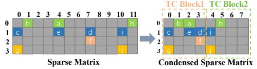

# 2.3 Motivations

1 : Existing storage formats of sparse matrix retain intra-column zeros and impose strict block alignment, limiting the efciency gains achievable on SME architectures. Recent advances in sparse storage compression formats designed for matrix units, such as TCF [\[22\]](#page-12-14) and ME-TCF [\[1,](#page-12-11) [28\]](#page-12-16), condense the sparse matrix into compact, fxed-size tiles to reduce storage overhead, primarily by eliminating columns consisting entirely of zeros (see Figure [3\)](#page-2-1). Compared to traditional sparse compression formats such as CSR, these matrix-unit-oriented designs can substantially enhance SpMM efciency on matrix processing units. However, these designs are fundamentally constrained by the input requirements of Tensor Core architectures, enforcing strict block alignment and left-aligned tiles, with extensive zero-padding to fll incomplete regions (e.g., Column 6 and 7 of TC Block2). By contrast, SME's outer-product execution model operates directly on pairs of input vectors, thereby obviating the need for rigid alignment and padding. More importantly, while formats such as TCF and ME-TCF achieve partial compression by removing empty columns, they do

not support the consolidation of sparsely populated columns that could be further aggregated to maximize compression. For instance, column 0 and column 1 of TC Block1 in Figure [3](#page-2-1) could be consolidated into a single column, as could column 4 and column 5 of TC Block2. By leveraging SME's outerproduct computation model and the fexibility aforded by predicate registers, there remains considerable potential for advanced structural compression strategies and substantial efciency improvements.

Figure 3. Condensed sparse matrix format for Tensor Core.

2 : SpMM kernel lack specialized outer-product designs and sophisticated optimization stacks like traditional implementations, hindering SpMM kernel efciency on SME. Traditional CPU-based SpMM implementations are primarily optimized for vectorized computation paradigms, whereas GPU Tensor Core approaches are inherently designed around inner-product-based calculations[\[1,](#page-12-11) [15,](#page-12-12) [18,](#page-12-13) [22,](#page-12-14) [28\]](#page-12-16). SME, however, utilizes an outer-product computation paradigm, presenting distinct and underexplored optimization opportunities for efcient SpMM kernel design. Moreover, due to substantial diferences in memory hierarchies and cache organizations, GPU-specifc SpMM strategies cannot be directly adapted to ARM platforms. For example, SME's ZA register array enables fexible tile partitioning according to data precision, ofering fne-grained parallelism but increasing kernel scheduling complexity. Consequently, efectively utilizing the Z vector registers and predicate registers within this outer-product framework demands novel optimization strategies that transcend existing CPU- and GPU-oriented methods.

3 : Efciently orchestrating SME and conventional vector units demands sophisticated instruction scheduling to mitigate resource contention and optimize heterogeneous execution. ARM architectures retain independent vector processing resources, including dedicated Neon computational units and registers, whose aggregate computing capability can be substantial and thus non-negligible (e.g., preliminary experiments indicate that conventional vector units can contribute up to 20–30% of the computational throughput compared to SME units). Our empirical observations further confrm that conventional Neon instructions can be efciently co-issued alongside SME's Matrix Outer Product Add(MOPA) instructions, suggesting the feasibility of efectively accelerating SpMM workloads through heterogeneous collaborative computing. However, despite this promising potential, simultaneous use of SME and conventional vector units inevitably incurs complex issues such as mutual interference, pipeline contention, and non-trivial

task allocation problems across heterogeneous resources. Currently, solutions for coordinating such diverse resources for SpMM, while simultaneously avoiding contention and optimizing task distribution, remain largely unexplored.

4 : Load imbalance in SpMM is driven by architectural diversity of CPU core and irregular sparsity patterns of matrix, which together create substantial disparities in computational loads among processing units. Load imbalance during SpMM computation refers to the uneven assignment of computational work among processing units. This issue often arises from the irregular distribution of nonzero elements in sparse matrices. In homogeneous environments such as GPUs with identical CUDA cores or streaming multiprocessors, traditional load balancing strategies like static row-wise partitioning are commonly used. For example, the workload may be divided by assigning each processing unit an equal number of matrix rows, or rows with a similar number of nonzero elements. However, ARM CPUs present new challenges due to their inherent heterogeneity. For instance, Apple's M4 chip includes four highpower cores and six power-efcient cores, while the M4 Pro features ten high-power cores and four power-efcient cores. ARM CPUs across diferent vendors can show even greater variation in core confgurations, counts, and performance. This diversity makes static, sparsity-based partition strategies developed for homogeneous systems poorly portable to diverse ARM platforms with varying confgurations.

