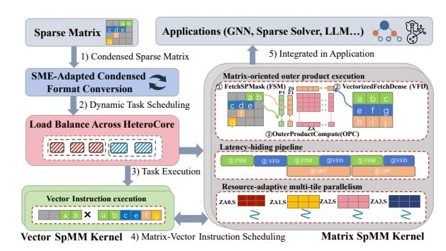

# 3 Design of ASM-SpMM

#### 3.1 Design Overview

As illustrated in Figure [4,](#page-3-0) ASM-SpMM consists of several tightly integrated modules designed to fully exploit SME's computational capabilities on ARM processors.

❶ The SME-adapted format conversion module frst transforms the input sparse matrix into a compact, SME-friendly representation, ensuring efcient storage and data access patterns that are well suited for outer-product computation. ❷ Next, the load balance module adaptively partitions and distributes computational workloads according to both the sparsity structure of the input and the diverse core characteristics of the underlying processor. This enables fne-grained load balancing across widely diverse cores, signifcantly improving hardware utilization. ❸ At the heart of ASM-SpMM is a highly optimized SpMM kernel specifcally engineered for SME. This kernel adopts a specialized outer-product execution paradigm and leverages advanced techniques such as data prefetching, multi-tile parallelism, and pipelined scheduling of memory operations and computation. These optimizations substantially increase register utilization and allow the kernel to fully harness SME's instruction-level parallelism and architectural strengths. ❹ To further boost system throughput, ASM-SpMM introduces a vector SpMM kernel and enables coordinated execution of SME-accelerated

SpMM kernels alongside conventional vector units. This dynamic resource coordination maximizes overall performance, particularly in heterogeneous computing environments. ❺ Finally, the SME-based sparse matrix computation library is seamlessly integrated into higher-level frameworks such as GNNs, providing transparent, efcient support for a broad spectrum of sparse workloads on ARM platforms.

<span id="page-3-0"></span>

Figure 4. The design overview of ASM-SpMM.

#### 3.2 SME-Adpated Compressed Storage Format

To fully exploit the unique capabilities of ARM SME for SpMM acceleration, we propose OP-MCF (Outer-Productbased Matrix Unit Compression Format), a highly compact, data-afnity storage scheme tailored to SME's outer-product execution model and predicate-driven masking. OP-MCF is designed to overcome the structural inefciencies and rigid block alignment constraints inherent in TCF-like formats, as discussed in our preceding analysis.

<span id="page-3-1"></span>

Figure 5. Design of SME-adapted compression format.

3.2.1 Format Structure. OP-MCF represents the compressed sparse matrix using four specialized arrays, as illustrated in Figure [5.](#page-3-1) ❶ RowWindowOffset records the starting ofset of each row window, with window size matching SME's vector length (e.g., 8 rows for M4's SVL512 in FP64). ❷ ColumnOfRowWindow stores, for each row window, the number of compacted columns generated after format transformation and condensation. ❸ SparseAtoB holds the original column indices of each compacted column, ensuring full traceability to the input sparse matrix. ❹ ColumnPositionMaskBit stores, for each original column in a row window, a bitmask encoding the positions of nonzero elements in original column of the input sparse matrix, thus enabling efcient

masked computation. This layout facilitates high-throughput streaming into SME Z registers as shown in Figure [2,](#page-2-0) substantially reducing memory overhead while supporting fnegrained, predicate-controlled access.

3.2.2 Window-Column Compaction. OP-MCF employs a column-centric compaction strategy within RowWindow, which represents a fundamental shift from the block-oriented approach of TCF and ME-TCF designed for GPU Tensor Cores. In contrast to block-based formats that retain considerable redundancy due to rigid block boundaries and often require zero-padding or the inclusion of empty rows, OP-MCF partitions the matrix into row windows that are precisely aligned with the SME's native vector width, using consecutive rows as the essential processing unit. During the compaction process, all unnecessary empty columns are completely removed, addressing a key inefciency of traditional formats that preserve unused structure for alignment, as shown in Figure [3.](#page-2-1) Within each row window, only columns that are nonempty and structurally compatible are aggregated into a minimal set of storage columns, as illustrated in Figure [5.](#page-3-1) This focused aggregation results in a storage format that is both highly compact and memory-locality-aware, delivering substantial savings in storage overhead and notable improvements in memory access efciency.

3.2.3 Masked Multi-Column Merging. Building on this foundation, OP-MCF introduces intra-window masked multicolumn merging to further enhance storage and computational efciency. This approach leverages the observation that, within a row window, many sparse columns have nonzero elements located at non-overlapping row positions. By systematically analyzing these sparsity patterns, OP-MCF allows such columns to be reordered and merged into a single physical column whenever their nonzero entries do not coincide. Data reordering is achieved through a heuristic sorting–based strategy. Specifcally, columns are frst pre-sorted by sparsity patterns, and then merged iteratively within each row window if their nonzeros does not overlap across rows. This avoids local optima that often occurs in greedy clustering. For each merged column, a compact bitmask is generated, for example, an 8-bit mask for a row window comprising eight rows (for double-precision elements). These bitmasks are stored in the ColumnPositionMaskBit array, accurately indicating the position of each valid nonzero element.

This data layout enables SME to utilize predicate registers to achieve an efcient separation of data movement and computation. All non-overlapping sparse columns within a merged column are thus loaded collectively as a single compressed column, accompanied by the corresponding bitmasks. These masks are streamed into predicate registers, allowing outer-product instruction (svmopa) to be invoked for each mask in turn. Each invocation corresponds to one of the original columns. As a result, OP-MCF achieves a substantial reduction in memory trafc by requiring only a single

data load and a small number of lightweight mask loads for each merged column, while preserving computation correctness and maximizing efciency of SME's predicate-driven execution model. For instance, in the third row window of Figure 2, the number of data loads is reduced from four separate column reads to a single merged column read along with a single 32-bit mask (composed of four 8-bit masks). By decoupling storage layout from rigid block alignment and adopting a fexible, predicate-oriented datafow that aligns with the architectural features of SME, OP-MCF dynamically adapts to the irregularity of real-world sparsity patterns. This design addresses the key limitations articulated in the <sup>1</sup> challenge, enabling improvements in both memory efciency and computation throughput for SME-based SpMM.

#### 3.3 ASM-SpMM Runtime Kernel Optimizations

The SME architecture provides a solid foundation for accelerating SpMM. SME features two-dimensional ZA registers partitioned into tiles, along with input vector Z registers that enable efcient parallel data movement and computation. For example, on processors such as Apple M4, all 32 Z registers are available for fexible operand assignment. This architectural organization calls for SpMM kernel designs that are closely aligned with the underlying hardware. The following sections detail three core optimization principles for ASM-SpMM: matrix-oriented outer product execution, resource-adaptive multi-tile parallelism, and latency-aware pipelining as shown in Algorithm [1](#page-5-0) and Figure [6.](#page-6-0)

3.3.1 Outer-Product-Oriented Execution. ASM-SpMM maximizes hardware utilization by organizing computation around a matrix-oriented outer product pattern that matches SME's architecture. Guided by the compressed storage format, the kernel frst partitions the sparse matrix into row windows, each grouping nonzero elements to align with the vector length (SVL) and hardware-friendly memory access patterns. As shown in Algorithm [1,](#page-5-0) for each window, the algorithm iterates over compressed slots, loading sparse values into Z registers and fetching the corresponding dense fragments from with vectorized loads. Prefetch instructions are inserted for both sparse and dense operands to keep memory pipeline primed. Within each slot, the kernel generates predicate vectors from position masks, ensuring that only valid nonzero elements participate in the outer product. For every sparse-dense vector pair, the kernel computes an outer product and directly accumulates results into the relevant ZA tiles or slices. These computations are statically unrolled across all available tiles and slices to maximize parallelism and saturate SME resources. Once all contributions are accumulated, the results in each ZA tile and slice are written back to their corresponding locations in . This tightly coupled fow between compressed input, computation, and output, as detailed in Algorithm [1,](#page-5-0) delivers both high throughput and efcient resource usage, fully leveraging SME's vector and matrix register capabilities.

3.3.2 Resource-Adaptive Multi-Tile Concurrent Execution. To fully unleash SME's computation throughput, ASM-SpMM dynamically schedules multiple outer-product operations across the available ZA tiles and Z registers, adapting execution to the current workload and hardware constraints. While a naive implementation may process a single tile with two input Z registers (one for sparse, one for dense), this only achieves a fraction of SME's peak FLOPS.

#### Algorithm 1: ASM-SpMM Kernel Pseudo Code

```
Input: Sparse Matrix , Dense Matrix 
 Output: Matrix 
1 blockId ← current sparse block index;
2 slotOfset ← sum of .    before blockId;
3 slotsInBlock ← .   [ ];
4 for  = 0 to  by tileWidth do
5 ClearZA( );
6 slotIdx ← slotOfset;
7 for  = 0 to slotsInBlock −1 do
8 slotData ← .[  ];
9 colMasks ← .[  ];
10 colIndices ← .    [  ];
11 slotIdx ← slotIdx+1;
12 if  + 1 < slotsInBlock then
13 Prefetch(.[  + 1] );
14 Prefetch(.[  + 1] );
15 Prefetch(.    [  + 1] );
16 a ← LoadSparseVector();
17 for each valid column  in slot do
18 maskVec ← GetPredicate( [ ] );
19 col ←   [ ];
20 if next column is valid then
21 PrefetchDense(, nextCol, , 0);
22 . . .
23 PrefetchDense(, nextCol, , 7);
24 bTile0 ← LoadDenseTile(, , , 0);
25 . . .
26 bTile7 ← LoadDenseTile(, , , 7);
27 OuterProductAccum(0, ,  0,  );
28 . . .
29 OuterProductAccum(7, ,  7,  );
30 Store all tiles of 0 to  at correct position;
31 . . .
32 Store all tiles of 7 to  at correct position;
```

ASM-SpMM kernels exploit SME's ability to support several independent matrix operations in parallel. For example, on the Apple M4 processor with double-precision data, each ZA register is partitioned into 8 ZA register tiles, and the kernel can concurrently map up to 8 independent outer products, each consuming two Z registers. This maps to 16 of the input 32 Z registers (2 input vector × 8 tile) used solely for operand streaming, achieving 50% utilization of the input Z register. The remaining Z registers enable further parallelism by subdividing each ZA register tile into slices, so that each tile can be processed by two input streams simultaneously, thus saturating all Z registers and maximizing matrix unit occupancy (lines 24-32 in Algorithm [1\)](#page-5-0).

This strategy is resource-adaptive: when the input data type allows the ZA register to be partitioned into more tiles or register resources are ample, the kernel adjusts concurrency by unrolling computation across more tiles and slices, thereby boosting parallel execution and data throughput. Conversely, when register pressure increases, the kernel reduces the degree of unrolling and processes fewer tiles or slices per cycle. This fexible scheduling ensures efcient utilization of both matrix and vector registers under varying hardware confgurations.

3.3.3 Latency-Hiding Pipeline Organization. Efcient ASM-SpMM execution relies on minimizing memory latency and keeping compute units fully occupied. Since default hardware caching is not well-suited for the irregular access patterns of sparse matrix operations, it is essential to explicitly manage data movement.

ASM-SpMM introduces an explicit prefetching strategy that leverages SME's dedicated prefetch instruction \_svprfw. Rather than relying on hardware to automatically detect access patterns, the kernel strategically inserts prefetch instructions to fetch the next required rows or blocks of the sparse and dense matrices into cache before they are needed (lines 12-24 in Algorithm [1\)](#page-5-0).. For example, during the computation of the current row window, the kernel schedules a prefetch for the next sparse matrix row and the relevant segments of the dense matrix. By aligning these prefetch instructions with the main compute loop, the kernel primes the cache for upcoming accesses, efectively reducing memory access latency. This software-managed prefetching is complemented by a pipeline execution model. While the matrix units are actively computing with the current set of operands, the next set of required data is prefetched from memory to cache in the background. This overlap allows memory transfers and computation to proceed concurrently, minimizing idle cycles and ensuring a continuous fow of data to the compute units. The pipeline is further supported by precomputing all index ofsets for the sparse and dense matrices. These precomputed indices enable the kernel to issue vectorized loads and prefetches with minimal runtime overhead. As a result, as soon as a computation phase completes, the data for the next phase is already resident in cache and immediately available for processing. By combining explicit cache guidance through prefetching with a software-managed pipeline, ASM-SpMM overcomes the limitations of default hardware caching. This approach delivers high sustained throughput for sparse matrix computations, even in the face of irregular memory access patterns and varying sparsity structures.

#### 3.4 Heterogeneous Matrix-Vector Co-Execution

Even after compression, sparse matrices still contain tiles with highly irregular nonzero distributions. SME achieves high throughput on tiles that remain relatively dense after compression, but its utilization drops when operating on low-density or fragmented blocks. In contrast, ARM's vector units (SVE/Neon) provide flexible handling of such irregular fragments, though with lower peak throughput. ASM-SpMM adopts a hybrid kernel that couples SME and vector execution, with fine-grained scheduling to maximize parallelism and memory efficiency.

<span id="page-6-0"></span>

Figure 6. Heterogeneous Matrix-Vector Co-execution.

**3.4.1 Hybrid Micro Kernel Design.** The core idea is to split SpMM computation into SME-dominant and vectorassisted paths within the same kernel as shown in Figure 6. We employ a hardware-aware cost model to ensure that the auxiliary vector path never stalls SME execution. The execution time of vector-processed sparse blocks is estimated using latencies obtained from concurrent SME/SVE microbenchmarks. Since SME outer-product operations exhibit a nearly fixed execution window determined by the ZA tile size and outer-product latency, we enforce an overlap constraint: the aggregate estimated time of the blocks assigned to the vector path fit within this window. To maximize overlap, ASM-SpMM prioritizes the sparsest blocks for vector execution. Once the accumulated vector workload reaches this limit, all remaining blocks are executed on SME. This strategy ensures that vector-side work remains hidden behind SME computation while maintaining stable efficiency.

Dense blocks, typically containing clusters of nonzeros, are mapped to SME outer-product instructions, where each pair of input vectors contributes to ZA tile accumulation. Meanwhile, sparse blocks and irregular row fragments are delegated to SVE/Neon. Instead of computing these separately, ASM-SpMM directly feeds vector results back into SME's ZA registers through outer-product accumulation, effectively using the matrix unit as the final reduction buffer. This in-place accumulation avoids redundant memory traffic: intermediate vector results do not need to be written back to memory before SME consumption. Moreover, by letting vector units handle irregular fragments, SME avoids cycles wasted on padding zeros, sustaining high effective utilization. Compared with a pure SME-only kernel, hybrid micro-kernel

increases instruction-level parallelism by offloading scatter-like operations to vectors, while SME focuses exclusively on compute-heavy dense tiles.

3.4.2 Interleaved Instruction Scheduling. Naive mixing leads to stalls when both units contend for cache bandwidth. To overcome this, ASM-SpMM employs interleaved scheduling, where computation, memory access, and prefetch are pipelined across SME and vector instructions. Specifically, while SME executes outer-product accumulation on the current dense tile, vector instructions are scheduled in parallel to (1) prefetch the next dense row-window into L1 cache and (2) accumulate sparse tails from the current block. This staggered scheduling reduces SME stalls waiting for data, as vector units effectively overlap memory latency with useful computation. Furthermore, partial stores are scattered back incrementally rather than at the end of a tile, smoothing out bandwidth usage and reducing cache pressure. To balance resource usage, ASM-SpMM partitions registers explicitly: ZA arrays are reserved for SME tile accumulation, while Z vector registers act as shared buffers for both vector accumulation and SME input loading. This careful register management reduces spilling overhead and ensures high concurrency between SME and vector units.

#### 3.5 Dynamic Load Balance Across Hetero-Core

SpMM execution on ARM CPUs featuring heterogeneous cores is fundamentally challenged by both irregular sparsity patterns of the input matrix and diverse computational capabilities across the available cores. Static load balancing schemes, as shown in Figure 7, which simply partition nonzero elements among processing units according to precomputed estimates, fail to provide sufficient balance when facing such architectural and data irregularities. To address this challenge, we propose a dynamic load balancing strategy built on adaptive row-window task assignment and real-time work stealing as shown in Figure 7.

3.5.1 Hardware-Aware Task Mapping. At initialization, the sparse matrix is partitioned into a large set of row windows, where each window is a contiguous block of rows, and each core is assigned a starting set of row windows tailored to its compute capabilities. High-performance cores equipped with SME matrix units are preferentially allocated row windows with higher nonzero density, effectively concentrating more computational effort on the most capable hardware. In contrast, energy-efficient cores, typically operating on vector units, are assigned a larger count of lighter windows, each containing fewer nonzero elements. This hardware-aware mapping explicitly aligns the computational demands of each window with the processing strength of the assigned core, maximizing initial workload balance and enabling efficient subsequent rebalancing.

**3.5.2 Progress Monitoring.** As execution advances, disparities in completion rates between cores naturally emerge, driven by both the irregularity of matrix and architectural differences among cores. To mitigate these imbalances, the runtime system maintains a sliding window that continually tracks the progress of all threads. Upon completing their current assignments, threads report back the count of completed and outstanding nonzero elements (or row windows), allowing the scheduler to aggregate information and maintain a running average workload per thread.

<span id="page-7-0"></span>

**Figure 7.** Diagram of a) Static load balance strategy, b) Dynamic load balance across hetero-core scheduling policy.

3.5.3 Work Stealing for Dynamic Rebalancing. Whenever a core exhausts its assigned row windows, it first checks the global queue for unassigned tasks. If no unassigned work remains, the system triggers an inter-core work-stealing phase. Idle threads then identify peers with an above-average outstanding workload, as determined by the scheduler's sliding window. These idle threads steal portions of the remaining tasks, with the size of the transfer dynamically adjusted to move the system toward a balanced state. This mechanism is applied iteratively, ensuring that load is continually redistributed in response to ongoing shifts in both core performance and matrix sparsity. By tightly coupling initial hardware-aware task mapping with adaptive progress monitoring and iterative work stealing, ASM-SpMM achieves high resource utilization and effectively mitigates load imbalance across diverse ARM core configurations.

#### 4 Evaluation

#### 4.1 Experimental Setup

**4.1.1 Testbed.** We conduct most of experiments on the Mac M4 CPU and newly released LX2 ARM processor. Both of these two processor utilizes a 512-bit vector length, processing 8 double-precision floating-point numbers at a time. M4 processor features an up to 10-core CPU, with four performance (P) cores and up to six efficiency (E) cores. M4 only equips with two SME compute units, one for P-core clusters, one for E-core clusters. LX2 processor features an up to 12-core CPU, all the cores are equipped with SME unit. For compilation, we used Clang 16.0.

**4.1.2 Benchmarks.** In addition to the 12 representative real-world matrices presented in Table 3, our evaluation further incorporates a random and diverse selection of 80

matrices from the SuiteSparse collection [12]. To obtain a representative benchmark from the SuiteSparse collection, we select matrices using a stratified sampling strategy that spans three orthogonal dimensions: (1) **problem scale**, covering matrix sizes from small ( $\leq 10^3$ ) to very large  $\geq (10^5)$ ; (2) **matrix shape**, including symmetric and unsymmetric square matrices together with rectangular matrices; and (3) **sparsity level**, covering five NNZ-ratio intervals (< 0.001%, 0.001%–0.1%, 0.1%–1%, 1%–1%, and > 5%), capturing the full range from extremely sparse to moderately dense matrices.

**Table 1.** Dataset statistics for evaluation. (Abbr: abbreviation, AvgL: average NNZ length in each row of dataset). 1:from TC-GNN[22]; 2:from SNAP[13]; 3:from OGB[19]; 4:from DGL[6].

| Name                       | Abbr.   | M&K       | NNZ         | Avg. Row Length |
|----------------------------|---------|-----------|-------------|-----------------|
| YeastH <sup>1</sup>        | YH      | 3,138,114 | 6,487,230   | 2.07            |
| OVCAR-8H <sup>1</sup>      | OH      | 1,889,542 | 3,946,402   | 2.09            |
| Yeast <sup>1</sup>         | Yt      | 1,710,902 | 3,636,546   | 2.13            |
| roadNet-CA <sup>2</sup>    | rCA     | 1,971,281 | 5,533,214   | 2.81            |
| roadNet-PA <sup>2</sup>    | rPA     | 1,090,920 | 3,083,796   | 2.83            |
| $\mathrm{DD}^{1}$          | DD      | 334,925   | 1,686,092   | 5.03            |
| web-BerkStan <sup>2</sup>  | WB      | 685,230   | 7,600,595   | 11.09           |
| PPI <sup>1</sup>           | ppi     | 56,944    | 818,716     | 14.38           |
| FraudYelp-RSR <sup>3</sup> | FY-RSR  | 45,954    | 6,805,486   | 148.09          |
| reddit <sup>4</sup>        | reddit  | 232,965   | 114,848,857 | 492.99          |
| ddi <sup>3</sup>           | ddi     | 4,267     | 2,140,089   | 501.54          |
| protein <sup>3</sup>       | protein | 132,534   | 79,255,038  | 598.00          |

**4.1.3 Baselines.** We compare the overall performance of ASM-SpMM with several state-of-the-art SpMM kernels and libraries on ARM CPUs, including the ARM Performance Library (ArmPL, v24.10), Armadillo (v14.6.0), Cholmod from SuiteSparse[12] (v5.3.3), Eigen(v3.4.0), and MP-SpMM[30]. For end-to-end GNN case studies, we integrate ASM-SpMM into two popular frameworks, PyG(v2.6.1) and DGL(v1.1.2), and evaluate their performance improvement.

<span id="page-7-1"></span>**Table 2.** The percentage represents matrice portion out of the 80 testcases from SuiteSparse.

| Platform | Speedup           | ArmPL | Armadillo | Eigen | Cholmod | MP-SpMM |
|----------|-------------------|-------|-----------|-------|---------|---------|
| LX2      | 1 ~ 2×            | 1.3%  | 1.3%      | 0.0%  | 3.9%    | 2.6%    |
|          | $2 \sim 4 \times$ | 1.3%  | 0.0%      | 0.0%  | 37.7%   | 70.5%   |
|          | $4 \sim 8 \times$ | 16.9% | 1.3%      | 1.3%  | 41.6%   | 23.0%   |
|          | > 8×              | 80.5% | 97.4%     | 98.7% | 16.9%   | 3.9%    |
|          | Geomean           | 9.69  | 16.43     | 19.53 | 4.32    | 2.62    |
| M4       | 1 ~ 2×            | 0.0%  | 0.0%      | 0.0%  | 0.0%    | 2.7%    |
|          | $2 \sim 4 \times$ | 1.3%  | 3.9%      | 1.1%  | 15.6%   | 25.3%   |
|          | $4 \sim 8 \times$ | 6.5%  | 10.4%     | 2.4%  | 28.6%   | 32.0%   |
|          | > 8×              | 92.2% | 85.7%     | 96.5% | 55.8%   | 40.0%   |
|          | Geomean           | 11.81 | 15.12     | 18.62 | 4.78    | 2.94    |

