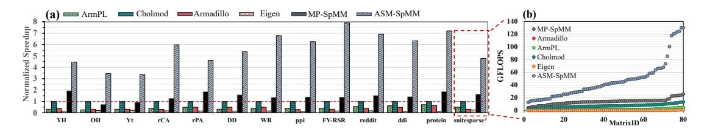
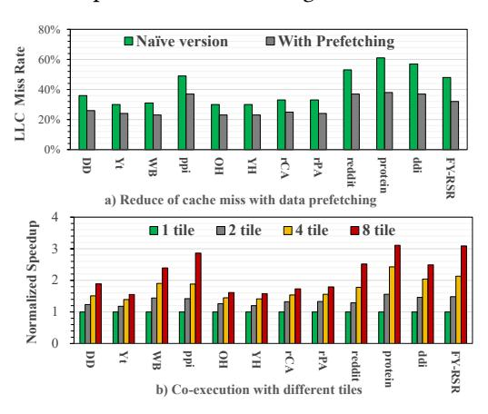
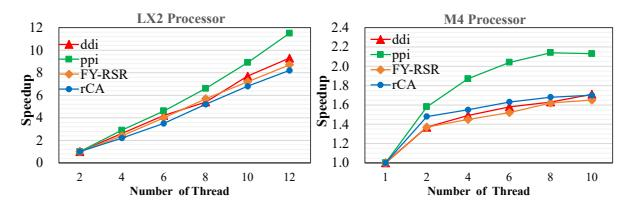

# 4.2 Overall Performance Comparison

We measure average performance under different values of N, the number of columns of matrix B, including 512 and 1024. Figure 8 shows the performance on the M4 processor, with speedups normalized to Cholmod, indicated by the red dashed line. ASM-SpMM consistently achieves the highest speedups across all 12 matrices, delivering gains of  $3.5 \times$  to  $7.9 \times$  over Cholmod. This advantage stems from the fact that

**Figure 8.** (a) Speedups on 13 matrices (normalized to Cholmod (red dashed line)). (b) Measured throughputs on 80 matrices from SuiteSparse (sorted by GFLOPS of ASM-SpMM). SuiteSparse\* shows the geomean speedups across SuiteSparse matrices.

ASM-SpMM is the first SpMM library on ARM platforms to exploit the SME compute unit through SME-oriented optimizations, whereas existing libraries rely solely on vector units, limiting their achievable performance.

Beyond the per-matrix trends shown in Figure 8, Table 2 provides distribution-level insights across the selected SuiteSparse testcases. The results indicate that ASM-SpMM achieves consistently large gains over general-purpose libraries, with most matrices falling into the high-speedup region. This reflects the inherent advantage of SME's outer-product execution, which can sustain high compute efficiency once the sparse structure exposes any degree of local density. In contrast, the improvements over sparse-optimized libraries such as Cholmod and MP-SpMM are more balanced. The overall distribution patterns are also similar on both M4 and LX2, demonstrating that the proposed optimizations maintain stable benefits across different Armv9 microarchitectures. M4 exhibits a slightly higher proportion of large speedups due to its stronger SME pipeline, while the general trends remain consistent. This confirms that ASM-SpMM provides portable performance advantages across diverse Arm CPUs.

#### 4.3 Single-Core Breakdown Analysis

**4.3.1 Ablation Study.** To evaluate the effectiveness of individual optimization techniques on the overall performance of ASM-SpMM, we use MP-SpMM without multithreading as the baseline and conduct ablation experiments on the M4 processor with the dense matrix B having 1024 columns, as shown in Figure 9. To evaluate the effectiveness of individual optimization techniques on the overall performance of ASM-SpMM, we use MP-SpMM (which performs best among all the tested open-source implementations as shown in Figure 8) without multithreading as the baseline, and conduct ablation experiments on the M4 processor with the dense matrix B having 1024 columns, as shown in Figure 9. Compared with the baseline, directly applying SME through a naive outer-product-oriented execution achieves only marginal improvements, yielding a speedup of merely 1.04-1.23× over MP-SpMM that relies solely on the vector unit. This indicates that a straightforward adaptation to the SME execution model is insufficient to fully exploit the computational capability of SME units. Introducing the multi-tile concurrent execution (MT) substantially increases

parallelism within the SME unit and provides the first significant performance boost. For instance, the speedup on FY-RSR rises from 1.23× to 2.89×, while on ddi and ppi it improves from around 1.04× to more than 2.1×. This highlights that the fine-grained utilization of SME tiles is crucial for unlocking its compute throughput. Building on MT, applying the SME-adapted compressed storage format (FM) further reduces redundant computations and lowers memory traffic. The speedups increase to 4.23× on FY-RSR. Adding pipeline organization and data prefetching (PR) brings additional but smaller gains, mainly through data access latency hiding and smoothing of memory accesses. Finally, by offloading part of the computation to the vector units, ASM-SpMM further exploits the available compute capacity beyond the SME units alone. On top of the previous optimizations, it delivers an additional improvement of around 5%-10%, demonstrating the benefits of heterogeneous co-execution in utilizing all on-chip resources. Overall, the ablation results reveal a clear progression: naive SME use alone is insufficient, while successive optimizations that integrate tiling, format adaptation, pipeline design, and heterogeneous co-execution are all necessary to fully realize the potential of SME units.

**Figure 9.** The ablation study. Base: SpMM without SME acceleration from MP-SpMM; SME: naive SME acceleration; MT: SME with multi-tile concurrent execution; FM: SME-adapted compressed storage format; PR: pipeline and data prefetching; VC: hybrid matrix-vector unit.

4.3.2 Evaluation of Compressed Storage Format. We define mean NNZ per slot as the average number of nonzeros retrieved per memory transaction under SME's outerproduct execution model(similar to MeanNnzTC in [1, 28]). On the M4, a double-precision fetch slot contains 8 elements. This metric reflects both workload reduction (fewer slots for the same NNZ) and data reuse efficiency (multiple nonzeros sharing one transaction). With CSR, only one nonzero is obtained per slot, offering almost no reuse. As shown in Table 10, TensorCore-oriented formats such as SGT, DTC-LSH, and AccOrder improve the mean NNZ per slot to about 0.6

to 2.3, yet remain limited by block alignment and padding of Tensor Core. In contrast, OP-MCF achieves 4 to 6x NNZ per slot across workloads, an order-of-magnitude higher than CSR and three to five times greater than TensorCore-oriented formats. These gains stem from two SME-specific designs: (i) row-window compaction, which eliminates empty columns without padding, and (ii) masked multi-column merging, which fuses sparse, non-overlapping columns with lightweight predicate masks. By moving from isolated nonzeros in CSR or padded blocks in TCF-style formats to dense bundles of useful nonzeros, OP-MCF aligns with SME's outer-product model, thereby reducing memory transactions and sustaining higher throughput.

**Figure 10.** Mean NNZ per fetch of different sparse compression formats with the outer-product execution model on ARM SME. CSR is a widely used sparse compression format, while DTC-LSH [1], SGT [22], and AccOrder [28] are improved compression formats designed for Tensor Core.

**Figure 11.** Evaluation on effectiveness of optimization techniques within ASM-SpMM runtime kernel

4.3.3 Evaluation of SME Microkernel. We further evaluate the effect of pipeline organization and data prefetching by measuring the last-level cache (LLC) miss rate on the M4 processor using the Perf tool. The results are shown in Figure 11-a. Compared with the version without pipeline and prefetching, ASM-SpMM with these optimizations exhibits a clear reduction in LLC misses, with the miss rate decreasing from values in the range of 30%–61% to 23%–38% across the tested datasets. This corresponds to reductions of roughly 20%–35%. The results demonstrate that pipeline organization and data prefetching are effective in improving memory efficiency, mitigating cache stalls, and thus sustaining higher

throughput in the ASM-SpMM runtime kernel. We also analyze the performance impact of SME's ability to support concurrent tile execution. As shown in Figure 11-b, the ZA matrix can be partitioned into multiple independent tiles, up to 8 tiles for double precision and 4 tiles for single precision. The results show a consistent trend across datasets: moving from 1-tile to multi-tile execution provides substantial speedups. The largest gains are observed on workloads such as protein, FY-RSR, and ppi, which benefit most from increased parallelism in SME due to higher arithmetic intensity. For lighter workloads such as Yt or YH, the improvements plateau beyond 2 tiles.

**Table 3.** Performance of vector, matrix and hybrid kernel.

| Dataset | Vector-only (GFLOPS) | Matrix-only (GFLOPS) | Hybrid (GFLOPS) | Hybrid/Theory |
|---------|----------------------|----------------------|-----------------|---------------|
| rCA     | 8.45                 | 16.42                | 19.43           | 0.78          |
| FY-RSR  | 11.44                | 49.72                | 55.245          | 0.90          |
| ddi     | 11.85                | 31.82                | 34.62           | 0.79          |
| ppi     | 10.01                | 29.84                | 33.67           | 0.84          |

**4.3.4 Evaluation of Hybrid Kernel.** Table 3 reports the performance of SpMM on vector unit, matrix unit, and the hybrid vector-matrix kernel on the M4 processor. The hybrid kernel consistently outperforms either unit alone, achieving about 8% to 18% speedup over sole matrix unit and much larger gains over sole vector unit. For example, on FY-RSR, the hybrid kernel reaches 55.2 GFLOPS compared with 49.7 GFLOPS on the matrix unit. Nevertheless, the efficiency relative to the ideal aggregate performance remains between 0.78 and 0.90, showing that hybrid execution cannot fully realize the ideal additive performance. The gap mainly arises from contention for resources as well as overheads in workload partitioning. While instruction scheduling alleviates these issues to some extent, it cannot fully eliminate them. Overall, hybrid execution effectively leverages both SME and vector pipelines, but resource contention still limits its ability to reach ideal combined throughput.

**Figure 12.** SME utilization and power efficiency.

#### 4.3.5 Hardware Efficiency and Correlation Analysis.

We conducted a micro-benchmark on a single performance core of the M4 processor, sweeping matrix densities from 0.1% to 10% on a fixed 500×500 matrix. This experiment provides empirical evidence of how sparsity impacting SME utilization and energy efficiency. As shown in Figure 12, SME utilization grows steadily with density, rising from 5% at 0.1% to 17% at 10%. This trend indicates that denser blocks provide sufficient arithmetic intensity for OP-MCF forming

effective micro-tiles, reducing indexing overheads and improving pipeline occupancy. Power measurements collected via power metrics tool show a similar trends. Although total package power increases moderately with density, computation throughput grows faster, leading to a rise in energy efficiency from 2.32 GFLOPS/W to 4.31 GFLOPS/W. This demonstrates that SME becomes increasingly efficient as the effective arithmetic intensity increases, allowing compute-bound execution to amortize the static power cost of the core. Overall, the results confirm a clear correlation: higher local density produces higher SME utilization and higher energy efficiency, validating ASM-SpMM's preprocessing strategy for extracting dense compute tiles from sparse matrices.

**Figure 13.** Thread scalability evaluation of ASM-SpMM on different datasets on M4 processor and LX2 processor.

#### 4.4 Multi-core Breakdown Analysis

**4.4.1 Scalability Evaluation.** We evaluate the thread scalability of ASM-SpMM on both the M4 and LX2 processors using four datasets, with the matrix dimension fixed to N =1024. As shown in Figure 13, ASM-SpMM achieves nearlinear and even super-linear scalability on LX2. With 12 threads, the performance reaches an 8× to 11× speedup compared with 2 threads. This behavior can be explained by two factors: First, each of the 12 cores on LX2 is equipped with an SME unit, enabling true parallel scaling across all cores. Second, the super-linear effect partly arises from one-time initialization overheads of the threading runtime that are amortized as the number of threads increases. On the M4 processor, the trend is markedly different. Two threads already achieves a 1.4-1.6× improvement over a single thread, but additional threads contribute only modest gains of 4%-8%. The underlying reason lies in the heterogeneous core design of M4 CPU. It has 10 cores in total, including 4 performance (P) cores and 6 efficiency (E) cores, but only two SME compute units. SME is implemented as an independent accelerator, typically shared at the CPU-cluster level. The P-core cluster integrates a larger SME unit, while the E-core cluster contains a smaller one. Once both SME units are occupied, further threads primarily exploit the vector units rather than additional SME capacity, leading to limited incremental speedups. This underscores the robustness of ASM-SpMM in exploiting the full spectrum of compute resources across different processor designs.

