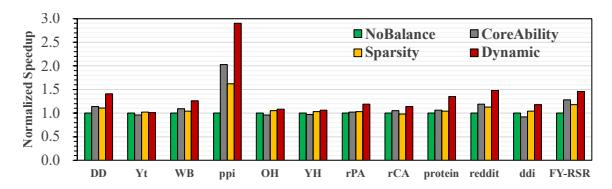
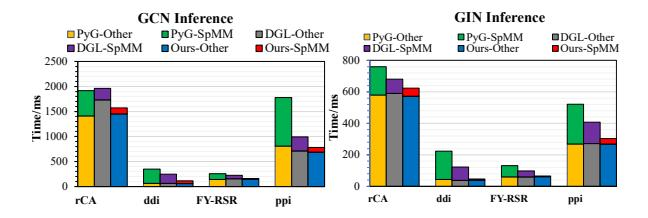

# **4.4.2** Effectiveness of Dynamic Workload Balance Design. Figure 14 compares four scheduling strategies on the

M4 processor: no balancing, static allocation by core capacity, static allocation by sparsity, and ASM-SpMM's dynamic balancing. Across 12 datasets, the dynamic strategy consistently achieves the best results. For example, it delivers up to 2.9× speedup on ppi and 1.48× on reddit, with steady gains (1.14–1.46×) on most others. Static schemes bring only limited benefits and sometimes even hurt performance (e.g., Yt, OH), since they cannot adapt to the heterogeneous core configuration of M4 CPU. In contrast, ASM-SpMM's dynamic balancing, which incorporates work stealing, adjusts to runtime conditions and distributes workloads more evenly across the four performance cores and six efficiency cores, yielding 1.04 to 1.9x higher throughput.

**Figure 14.** Two static strategies, capability-based assignment that distributes nonzero elements proportionally to each core's peak compute capability and sparsity-based assignment that evenly allocates nonzeros according to matrix sparsity, are compared with dynamic load balancing.

#### 4.5 Case Study: End-to-End GNN Inference

The Graph Convolutional Neural Network (GCN) model[26] and Graph Isomorphism Network(GIN) are two of the most widely used GNN models, consisting of several GraphConv layers. GraphConv layer performs following computation:

$$H_{l+1} = \sigma[(A \times H_l) \times W_l + b_l],$$

where  $\sigma$  denotes the activation function, A is the adjacency matrix, H is the feature matrix, W represents the weight matrix, and b is the bias term. The core operation  $A \times H_l$  corresponds to a sparse matrix—dense matrix multiplication (SpMM). To evaluate the benefits of our proposed ASM-SpMM, we integrate it into PyTorch via the CPU Extension interface and implement both GCN and GIN models, referred to as ASM-GCN and ASM-GIN, respectively. We measure the end-to-end inference time on four representative datasets: ddi, rCA, ppi, and FY-RSR, which were also used in the previous operator-level evaluation. We compare against two widely adopted GNN frameworks, DGL and PyG on the M4 processor. Figure 15 summarizes the results.

Across all datasets and model configurations, ASM-GCN and ASM-GIN consistently achieve substantial reductions in inference time. The degree of acceleration, however, strongly correlates with the proportion of SpMM within the overall computation. For instance, in the GCN model on FY-RSR, SpMM accounts for 33.8% of the total inference time in DGL and 45.0% in PyG, whereas in ASM-GCN the fraction drops to only 7.5%, leading to an end-to-end speedup of 1.3–1.6×.

By contrast, in the GCN model on ddi, SpMM dominates the workload, contributing 77.2% and 84.3% of total runtime in DGL and PyG, respectively. With ASM-SpMM, the SpMM share is reduced to 48.4%, yielding speedups of 2.0–2.9×. For the GCN model on rCA, SpMM is a smaller bottleneck in this dataset. ASM-SpMM lowers the SpMM ratio from 11.9% in DGL and 26.4% in PyG to only 7.4%, thereby achieving slight reduction of overall inference latency by about 1.2×. Comparable conclusions are also observed for GCN and GIN across other datasets, further confirming robustness of ASM-SpMM as an effective acceleration primitive for GNN.

**Figure 15.** The end-to-end inference time of GCN and GIN models. "PyG-Other" and "PyG-SpMM" represent execution time of the components in the GNN model, excluding SpMM and the SpMM operation itself, respectively. The sum of these two parts constitutes the total inference time of the model. The same method applies to both DGL and our design.

#### 4.6 Overheads and Portability Analysis

In many practical workloads, SpMM is executed iteratively with the same sparse matrix A, often across thousands of iterations. In such cases, the overhead of ASM-SpMM's format transformation is amortized and becomes negligible. This assumption holds for mainstream sparse computing frameworks (e.g., DGL and PyG) and widely used sparse matrix repositories, including TC-GNN [22], OGB [19], SNAP [13], and SuiteSparse [12], where each sparse matrix can be preprocessed only once and reused across iterations. Consequently, downstream applications such as sparse matrix factorization, GNN inference, and hyper-parameter optimization can fully benefit from ASM-SpMM's performance gains. Similar one-time preprocessing assumptions have also been adopted and validated in prior GPU Tensor Core-oriented SpMM systems, including DTC-SpMM [1], Acc-SpMM [28], and TC-GNN [22], where the transformation cost is shown to be negligible when amortized over repeated executions. We evaluate ASM-SpMM on two ARM processors and observe consistent performance improvements. Most optimizations, including the SME-oriented compressed format, dynamic load balancing, and SME kernels, are portable to other SMEenabled ARM CPUs, as the core computation model remains unchanged. Nevertheless, achieving peak performance on new platforms may require lightweight tuning. For instance, while the multi-tile execution strategy directly applies, tile sizes and resource allocation should be adjusted according to each CPU's configuration.

#### 5 Related Work

SpMM Optimization on GPU Matrix Units: Recent work has optimized SpMM for Tensor Cores by leveraging GPUspecific features. DTC-SpMM [1] and Acc-SpMM [28] exploit data-affinity reordering, warp-level sparsity scheduling, and pipelining, while Flash-LLM [23] and FlashSparse [18] reduce memory traffic through Load-as-Sparse, Compute-as-Dense and swap-and-transpose strategies. SMaT [15] and TC-GNN [22] further optimize shared memory usage and integrate graph operations on Tensor Cores. These approaches fundamentally depend on GPU characteristics such as innerproduct execution, warp-level scheduling, and GPU-centric memory hierarchies. ARM SME adopts an outer-product execution model with CPU-oriented cache and memory designs. Consequently, GPU-oriented techniques are not directly transferable to SME, necessitating SME-specific optimizations tailored to its hardware characteristics.

Optimization on SME Matrix Unit. OpenFFT-SME [25] introduces a specialized outer-product optimization strategy for the Cooley–Tukey FFT algorithm, evaluated on ARM processor simulators. Zhao [29] and Huang [7] proposes a stencil computation algorithm utilizing vector outer products, together with optimizations targeting memory access, execution pipelining, and data reuse. Among prior works leveraging SME matrix units, ASM-SpMM is the first to optimize SpMM using SME acceleration and to provide comprehensive evaluations on both LX2 and Apple M4 CPUs.

Cooperation of Matrix and Vector Units Matrix and vector units are optimized for different computational patterns but can deliver greater performance when used jointly. On NVIDIA GPUs, concurrent execution of Tensor Core and CUDA Core kernels has been demonstrated [27], and recent work such as Jigsaw [24] and HR-SpMM [21] exploits both to accelerate sparse matrix-vector multiplication. To our knowledge, however, such cooperation has not yet been explored on modern CPUs like ASM-SpMM.

#### 6 Conclusion

In this paper, we present ASM-SpMM, a high-performance SpMM library for ARM processors with SME. ASM-SpMM combines sparse format design, optimized micro-kernels, joint exploitation of ARM matrix and vector units, and dynamic load balancing to accelerate SpMM. To our knowledge, this is the first comprehensive study of SpMM on SME, and the first evaluation on both LX2 and Apple M4 CPUs, demonstrating consistent performance gains across architectures. Extensive experiments show substantial speedups over existing SpMM implementations and widely used ARM libraries.

## Acknowledgments

This research is supported supported in part by Guangdong S&T Program under Grant No. 2024B0101040005, supported in part by the Guangxi Key Research and Development Program under Grant GuikeAB25069495.

