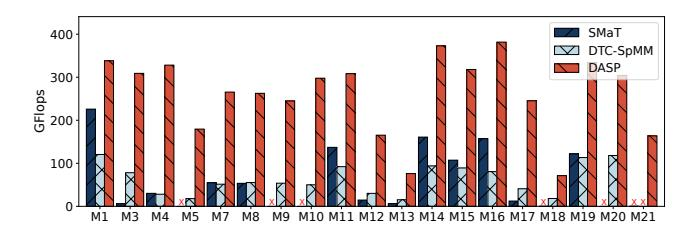

# 1 Introduction

Sparse Matrix-Vector multiplication (SpMV) [\[1,](#page-12-0) [11\]](#page-12-1) serves as a cornerstone in scientific computing, graph analytics, and machine learning workloads [\[38\]](#page-13-1). With the emergence of large-scale sparse datasets (e.g., billion-node graphs [\[14,](#page-12-2) [19,](#page-12-3) [37\]](#page-13-2), FEM simulations [\[12,](#page-12-4) [18,](#page-12-5) [36\]](#page-13-3)), accelerating SpMV on modern GPUs has become critical. Tensor Cores and Sparse Tensor Cores (TCs/SpTCs), specialized for matrix multiplication, have been introduced in NVIDIA GPUs [\[6,](#page-12-6) [30\]](#page-12-7). They are commonly used to accelerate compute-bound kernels such as GEMM and convolution [\[9,](#page-12-8) [15,](#page-12-9) [16,](#page-12-10) [21,](#page-12-11) [39\]](#page-13-4), but their potential for SpMV has been largely overlooked [\[45\]](#page-13-5). In TC computation, input data is evenly distributed among participating threads [\[33\]](#page-12-12), enabling better data reuse and

**Figure 1.** Comparison of SpMV GFlops performance between SpMM-oriented works and DASP across 21 representative matrices. Data points marked with an 'x' indicate runtime errors (e.g., exceeding the GPU shared memory limit).

reducing per-thread memory load compared to CUDA Cores. This is particularly beneficial for memory-bound kernels like SpMV, where memory access dominates execution time [38].

However, fully exploiting TCs/SpTCs for SpMV remains challenging, as it critically depends on maximizing TC utilization. Specifically, achieving high utilization depends on two key factors: (1) TC result efficiency, which measures how effectively the output produced by each Tensor Core operation contributes to meaningful results, and (2) TC computation efficiency, which captures the proportion of nonzero operands participating in actual computation within each TC operation. DASP [22] represents one of the most advanced attempts to leverage TCs for SpMV acceleration, while DASP still faces three key limitations: (1) the matrix multiply-accumulation (MMA) shapes used by DASP are mapped to ALU instructions on CUDA cores rather than actual TC acceleration units on newer GPUs. Additionally, a direct migration of DASP's mapping to newer TCs results in low TC result efficiency; (2) DASP employs rigid sparse formats tied to specific TC shapes, which constrain flexibility and limit performance portability; (3) high memory access latency, coupled with insufficient memory-compute overlap, further degrades overall SpMV performance.

On the other hand, many recent advances in TC acceleration have focused on Sparse Matrix-Matrix Multiplication (SpMM) [8, 20, 34, 44], which multiplies a sparse matrix A with a dense matrix B to produce a dense output matrix C. As SpMV can be viewed as a degenerate case of SpMM where the dense matrix has only a single column, it is natural to consider whether techniques developed for SpMM could be leveraged to improve SpMV performance. Unfortunately, despite such structural similarity, SpMV exhibits distinct computational characteristics that make direct application of SpMM-oriented optimizations inefficient. Specifically, we evaluate the SpMV GFlops performance of SpMM-oriented works (DTC-SpMM [8] and SMaT [34]) compared to DASP on 21 representative matrices from SuiteSparse, as shown in Figure 1. These methods still fail to achieve comparable throughput in SpMV due to the following key differences: (1) Compared to DASP, these methods improve TC result

efficiency but introudce excessive zeros, which severely reduce TC computation efficiency. (2) In SpMM, multiple TC operations can be performed after fetching tiles of matrices *A* and *B*, effectively amortizing memory latency. In contrast, SpMV performs only one TC computation per memory fetch, and accesses to vector *X* are highly irregular and fragmented, unlike the structured, vectorized accesses to *B* in SpMM.

Thus, optimizing SpMV on TCs/SpTCs requires fundamentally new approaches beyond simply adapting SpMM techniques. Specifically, we face the following key challenges: (1) How to design SpMV-specific sparse matrix mappings onto TCs that simultaneously achieve high TC result utilization and high TC computation efficiency? (2) How to construct sparse formats that better leverage GPU-optimized vectorized and asynchronous memory accesses? (3) How to design compute pipelines for SpMV that achieve efficient memory-compute overlap to reduce warp stalls, even when each memory fetch supports only a single TC operation?

To address these unique challenges of SpMV and overcome the limitations of existing approaches (e.g., DASP [22]), we first conduct a thorough analysis of existing SpMV optimizations on TCs, identify two key observations that hinder efficient SpMV acceleration on TCs and SpTCs. Based on these insights, we propose *Drawloom*, an optimized SpMV library that leverages the most efficient TC shapes with multistage pipelines to fully utilize TCs and SpTCs for acceleration. Specifically, this paper makes the following contributions1.

- We propose ArbitWeave, a redesigned tensor core mapping strategy tailored to the unique characteristics of SpMV, enabling the use of arbitrary-shaped high-throughput TCs.
- We propose the Zig-zag Chained Format (ZCF), a sparse storage format designed to enhance memory locality and support GPU-optimized vectorized and asynchronous accesses with two-level load balancing strategy for better TC and SpTC utilization.
- We propose a multi-stage register pipeline with highly optimized kernel design to bridge the gap between tensor core computation and sparse matrix data fetching, enabling efficient SpMV acceleration.
- We implement *Drawloom*, an optimized SpMV library for tensor cores that consistently outperforms cuS-PARSE and other state-of-the-art solutions on A100 and H100 GPUs in FP16, FP32, and FP64. Its effectiveness is validated through comprehensive experiments.

#### 2 Background

### 2.1 Tensor Core and Sparse Tensor Core

Tensor Core (TC) [29] units are optimized for matrix multiply-accumulation (MMA) operations. The shape of a TC, defined by its  $mma\_m \times mma\_n \times mma\_k$  dimensions, has undergone significant changes across GPU generations. As

&lt;sup>1The artifact for this paper is publicly available on Zenodo under DOI [43]

Table 1. Tensor Core shapes supported on different architectures (FP16 or above; V: Volta, A: Ampere, H: Hopper, Sp: with sparse enabled)

| A/B  | Shape                      | Architecture | Sp  |
|------|----------------------------|--------------|-----|
|      | m8n8k4                     | V            | No  |
| FP16 | m16n8k16                   | A/H          | Yes |
|      | m16n8k8                    | A/H          | Yes |
| TF32 | m8n8k4                     | V            | No  |
|      | m16n8k8                    | A/H          | Yes |
|      | m16n8k16                   | A/H          | Yes |
| FP64 | m8n8k4                     | V/A/H        | No  |
|      | m16n8k16                   | H            | No  |
|      | m16n8k8                    | H            | No  |
| FP16 | m64nNk16 (N ∈ [8, 256]) | H(wgmma)     | Yes |
| TF32 | m64nNk8 (N ∈ [8, 256])  | H(wgmma)     | Yes |

shown in Table [1,](#page-2-0) the V100's inaugural TC supports only the m8n8k4 configuration, while the Hopper (H100) architecture now supports flexible shapes ranging from m64n8k16 to m64n256k16 [\[24\]](#page-12-18).

The shape of a TC critically impacts computational efficiency. Microbenchmark studies [\[24,](#page-12-18) [25,](#page-12-19) [35\]](#page-12-20) reveal notable variations in latency and throughput across different configurations. Commonly, larger TC blocks often achieve higher throughput. For example, the m16n8k16 on H100 delivers 494 TFlops with a 24-cycle latency, whereas the m16n8k8 configuration achieves only 368 TFlops at 16 cycles. Optimal TC shapes align with the dimensions of the target computation, enabling parallel processing of larger data chunks per clock cycle and minimizing resource contention. Conversely, mismatched shapes lead to underutilized computational lanes, degrading performance. [2](#page-2-1)

Beyond standard TCs, Sparse Tensor Cores (SpTCs) [\[26,](#page-12-21) [41\]](#page-13-8) represent a pivotal innovation for sparse data processing. These units optimize computations by exploiting sparsity patterns, requiring non-zero elements to adhere to a 2:4 sparsity ratio. Metadata is embedded to track the positions of non-zero elements, enabling halved computation and memory traffic. For instance, a 50% sparse matrix processed via SpTCs achieves near-doubled efficiency compared to dense counterparts. This design is particularly advantageous for large-scale sparse matrices, where reducing redundant operations is critical for performance.

The performance divergence of two types of hardware units and latency variance of TC block choices show the

Figure 2. Sparse matrix reorder and DASP format

importance of kernel design with considering hardware features and emphasize the desire for architecture-aware optimizations in high-performance computing.

#### 2.2 Overview of DASP

DASP [\[22\]](#page-12-13) is currently one of the state-of-the-art methods for accelerating SpMV, leveraging TCs to improve performance. We briefly introduce its implementation and highlight the limitations in Section [3.](#page-2-2)

Sparse Matrix preprocessing and the storage format. As shown in Figure [2,](#page-2-3) DASP starts by reordering the sparse matrix based on the number of non-zero(NNZ) elements in each row. The matrix rows are classified into three categories: long rows(NNZ > 256), medium rows(NNZ > 4), and short rows, with each category having its specialized storage format and computation method. Each of those row categories has its own value array(val) and column ID array(cid), where each non-zero element is paired with its corresponding column ID. There is also a row pointer array(rpt) to facilitate efficient memory access for long and medium rows. DASP further divides medium rows into irregular parts, but we do not show it for simplicity.

Parallel strategy and algorithm routine. DASP applies distinct computation methods to different row categories. Each long row is stored solely in the TC, and the results are first reduced within the warp using shuffle instructions. Afterward, an additional GPU function is called to perform warp-level reduction. Medium rows are grouped in the TC, and the results are written back after coalescing to ensure proper memory access patterns. For short rows, DASP concatenates the two complementary parts to compensate for hardware unit length such as combining the rows with NNZ lengths of 1 and 3 and mapping them to a TC block with \_ = 4. Although they are grouped together in the TC block, the computations are still done separately, which does not reduce the overall TC execution count.

