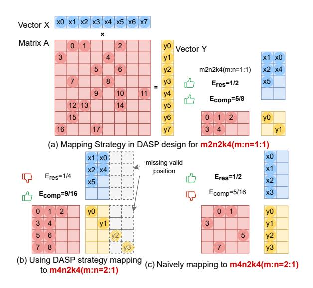
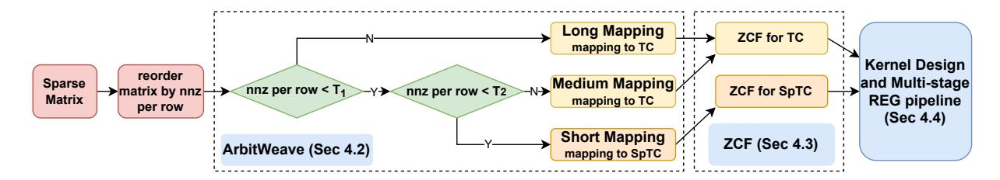
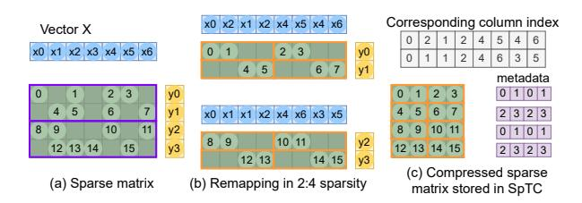
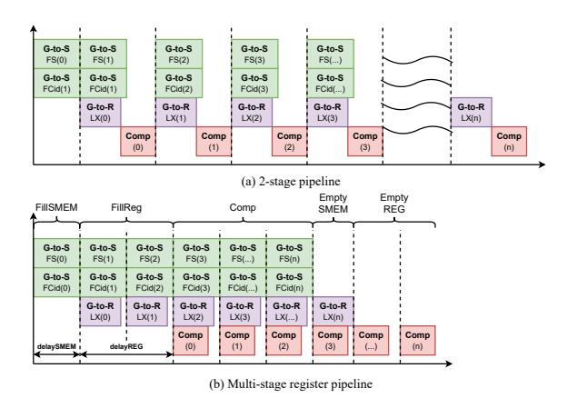
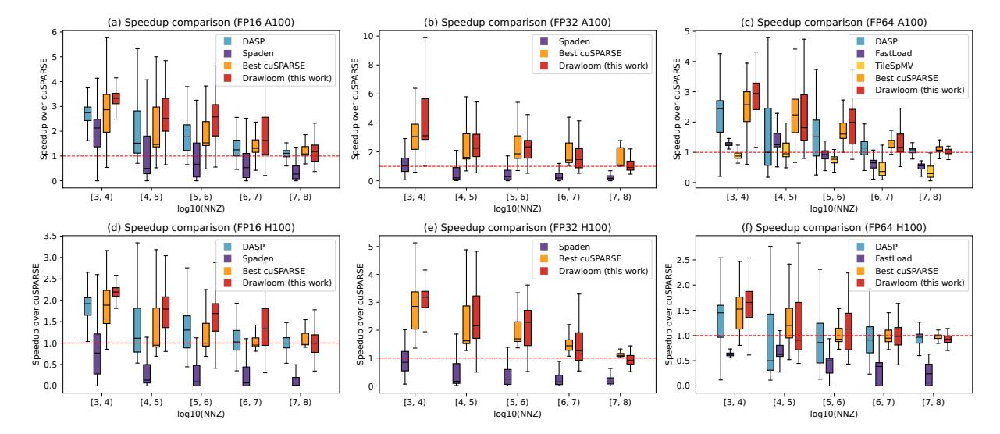
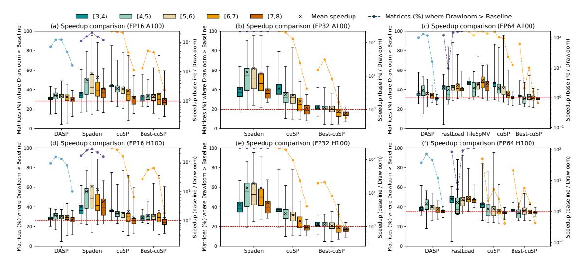
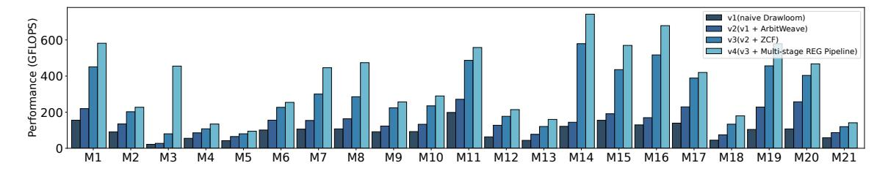

# 3 Motivations

This section presents a performance analysis of state-ofthe-art TC-based SpMV implementation (DASP [\[22\]](#page-12-13)) and highlights the observed performance gaps.

2Notably, legacy TC shapes like m8n8k4, initially designed for V100, exhibit poor efficiency on modern GPUs such as A100 and H100 [\[33\]](#page-12-12). This stems from architectural shifts: newer GPUs no longer support these configurations, forcing compilers to emulate TC operations via ALU instructions.

**Figure 3.** DASP and SpMM mapping strategy (numbers with circle mean nonzeros in the sparse matrix)

**Observation 1: Suboptimal TC shape selection limits hardware utilization.** Although previously discussed, it is important to briefly recall that on newer generation GPUs, the **m8n8k4** TC selected by DASP is executed through ALU operations on CUDA Cores rather than Tensor Cores. This underutilization of Tensor Cores highlights the need for a more systematic analysis of TC usage efficiency in SpMV. To this end, for TC shape of  $m \times n \times k$  we define two key metrics:

• TC result efficiency ( $E_{res}$ ), which measures the proportion of output elements generated by a TC instruction that are actually useful (i.e., contribute to the final vector Y):

$$E_{res} = \frac{\text{# of valid output elements}}{m \times n}$$
 (1)

TC computation efficiency (*Ecomp*), which approximates the proportion of useful computations within a TC operation based solely on the sparsity of matrix *A*. It is defined as:

$$E_{comp} = \frac{\text{# of non-zero elements in } A}{m \times k}$$
 (2)

Figure 3(a) illustrates DASP's current approach for mapping sparse matrices to TCs. DASP uses the smallest TC instruction, m8n8k4 (simplified as m2n2k4 in Figure 3(a) for clarity), to compute SpMV. By compressing non-zero elements per row and placing vector X values into matrix B according to the column indices of non-zero elements in A, DASP produces results Y along the diagonal of the TC output matrix. This mapping achieves relatively good  $E_{res}$  and  $E_{comp}$ .

However, DASP's design is suboptimal for modern GPUs like A100 and H100, which prioritize larger TC blocks (e.g.,

m16n8k16, m: n=2:1). Figure 3(b) demonstrates migrating DASP's approach to m16n8k16 blocks (simplified as m4n2k4). While larger m-dimension increases parallelism, mismatched row-vector interactions (highlighted by dashed boxes) reduce  $E_{res}$  to 1/4, lowering TC utilization.

A naïve alternative, inspired by SpMM optimizations, treats SpMV as a single-column SpMM case (Figure 3(c)). Here, TC block B's first column is populated with partial dense vector X, and results Y appear in the first column of output matrix C. While theoretically achieving higher  $E_{res}$ , sparse regions in the matrix often result in far lower  $E_{comp}$ .

Additionally, NVIDIA Nsight Compute profiling shows that TCs are largely idle during DASP's SpMV kernel execution, while a significant number of CUDA Core instructions are issued. This profiling observation further supports our findings and motivates us to find a better mapping strategy to utilize high-throughput TC shapes available on arbitrary target GPU architecture (e.g., A100, H100).

**Observation 2: Long warp resident cycle.** Existing SpMV (e.g., DASP [22]) exhibits prolonged warp residency due to uncoordinated memory-compute. In DASP [22], each thread independently accesses the elements needed for computation, loading the sparse matrix A from GMEM into REGs (**Fetch Sparse**), then loading the column IDs (**Fetch CID**), and finally using these column IDs to sparsely load values from vector  $X(\textbf{Load}\ X)$  for the subsequent computation (**TC Comp**).

Due to the lack of asynchronous memory access, *fetch sparse*, *fetch CID*, *load X*, and *TC comp* occur sequentially. As a result, when one warp performs data access, it cannot proceed with subsequent operations until the data is fully loaded, relying on the GPU scheduler to schedule available warps. Consequently, the memory utilization in DASP typically ranges from 20% to 60%.

Fortunately, the hardware support for asynchronous memory copy (*async-copy*) introduced with the A100 architecture provides the key enabler for improving memory access. With *async-copy*, data transfers from GMEM to SMEM can be performed asynchronously, allowing for better memory accesses and computations overlapping. This hardware feature allows us to decouple memory staging from computation in more granular stages, paving the way for our multi-stage pipeline design, described in Section 4.4. Specifically, we divide the *fetch CID*, *load X*, and *TC Comp* into multiple pipeline stages. By leveraging this capability, we can achieve improved memory throughput and reduced warp waiting cycles.

### 4 Design of Drawloom

#### 4.1 Design Overview

Figure 4 illustrates the overview of *Drawloom*, which consists of three main components: Computation Mapping with *ArbitWeave*, Sparse Matrix Conversion with *Zig-zag chained* 

**Figure 4.** Overview of Drawloom

**Figure 5.** Kernel design of Drawloom (each threadblock has 2 warps and *WarpLoad* = 2 for simplicity)

*format(ZCF)*, and CUDA Kernel Optimization with *Multi-Stage Pipeline*.

**4.1.1 Computation Mapping with ArbitWeave.** Previous works typically leverage only a single TC shape to accelerate SpMV. In contrast, we take into account the structural characteristics of the sparse matrix and selectively employ both standard TCs and SpTCs, along with three tailored mapping strategies.

Firstly, for different tensor core shapes characterized by  $(mma\_m, mma\_n, mma\_k)$ , we define a structural ratio  $V = mma\_m/mma\_n$ . This ratio represents the relative number of output rows to output columns produced by a tensor core operation. We use V to define the row strip width, i.e., a group of V consecutive rows in the sparse matrix. These row strips become the basic computation unit mapped to either a standard TC or SpTC. By aligning the granularity of computation with the hardware execution shape, we ensure efficient utilization of the matrix-multiply-accumulate (MMA) units with optimal TC result efficiency.

Based on the number of nonzeros in each row strip, we propose the following three mapping strategies to maximize TC computation efficiency. The details about  $T_1$  and  $T_2$  are described in Section 4.1.3:

- Long Mapping: If the number of nonzero elements in a row exceeds a predefined threshold  $T_1$ , the row strip is directly mapped to a TC block.
- Medium Mapping: If the number of nonzeros falls between two thresholds  $T_2$  and  $T_1$ , multiple row strips are grouped and collectively mapped to a TC block.
- Short Mapping: If the number of nonzeros is below *T*2, multiple row strips are grouped and mapped to a SpTC block for more efficient sparse computation.

To our knowledge, Drawloom is the first work realizing simultaneous scheduling of different blocks of a sparse matrix onto both TC and SpTC via *ArbitWeave* mapping strategy. Specifically, by adopting the SpTC mapping strategy, we can effectively store and process irregular data within SpTC, as illustrated in Figure 7. Furthermore, in contrast to DASP, *ArbitWeave* adopted in Drawloom can support mapping to arbitrary TC shapes. Such design significantly improves hardware scalability and utilization compared to DASP's fixed-shape approach.

4.1.2 Sparse Matrix Conversion with Zig-zag chained **format.** To accommodate the ArbitWeave mapping scheme for both TC and SpTC, we design two variants of the zig-zag chained format (ZCF) tailored to their respective requirements. For row strips mapped to TCs (Long Mapping & *Medium Mapping*), we store the values in a contiguous Val array and use a corresponding Cid array to record the column indices of each nonzero element. For row strips mapped to SpTCs(Short Mapping), we compress the value array to meet the sparsity constraints required by SpTCs, achieving up to 50% memory savings compared to the TC format, while the Cid array remains uncompressed according to Short Mapping. This design directly supports SpTC computation, in contrast to DASP, where short rows are stored as Cid and Val arrays but are later accessed and computed using CUDA Cores rather than SpTCs. In addition, for both Long Mapping and Medium Mapping, we use a row\_ptr array, which records the number of TC blocks corresponding to each row strip (or row window), allowing the kernel to correctly index into the compressed data. The detailed structure of the Zig-zag chained format(ZCF) and row\_ptr array will be elaborated in Section 4.3.

**4.1.3 Kernel Design and Optimizations.** Each thread block consists of four warps, and we design a two-level load

balance to effectively address load imbalance issues observed in the SuiteSparse dataset. At the matrix level, we categorize rows based on their number of nonzeros (NNZ) using two thresholds  $T_1$  and  $T_2$ , as shown in Equation 3. As shown in Figure 5, for Medium Mapping and Short Mapping, each warp is assigned to compute one group of TC Blocks. While for Long Mapping, we employ a more sophisticated warp **level** load balancing strategy. Specifically, we distribute the TC Block generated from Long Mapping evenly across all warps to ensure a similar workload. As shown in Figure 5, each warp is assigned to most WarpLoad TC blocks, where WarpLoad denotes the number of TC blocks assigned to each warp in long mapping. It is a tunable parameter, and we set it to 2 in Figure 5. In the kernel execution, each warp writes partial results to intermediate buffers, and a dedicated reduction kernel is launched afterward to aggregate the final output.

$$T_1 = (mma\_m/v) \times mma\_k \times warpload$$

$$T_2 = mma k$$
(3)

Based on our two-level load balancing strategy, the thresholds  $T_1$  and  $T_2$  are determined in Equation 3. Specifically,  $T_2$  is assigned to  $mma\_k$ , with which short rows in the sparse matrix cannot fully utilize a regular TC block and are therefore mapped to the SpTC block using *Short Mapping*. We set the threshold  $T_1$  as  $(mma_m/v) \times mma_k \times warpload$ . Rows with nnz greater than  $T_1$  are classified as long rows and handled by the long-mapping strategy. In this case, such rows generate more than **WarpLoad** TC blocks, which are distributed across multiple warps to achieve load balance.

To improve memory efficiency, we optimize access patterns using vectorized instructions, *async-copy*, and a register-level pipeline. During memory accesses, each thread performs 128-bit vectorized loads to maximize global memory bandwidth. We use *async-copy* to stage TC blocks and sparse indices in shared memory (SMEM), and load the vector *X* using the PTX *LDG* instruction. Due to the irregular and fine-grained nature of accessing *X*, we propose a *multi-stage register pipeline* that leverages multiple register sets to overlap memory latency with TC computation. These optimizations are detailed in Section 4.4.

#### 4.2 Arbitrary MMA Shapes Mapping

**4.2.1 Arbitrary mapping to dense TC.** To flexibly map sparse matrices onto the diverse MMA shapes supported by modern GPUs, we design a Tensor-Core-aware mapping framework called *ArbitWeave*. Figure 6 illustrates *ArbitWeave*'s mapping strategy. *ArbitWeave* designs a novel mapping approach tailored for high-throughput TC shapes (e.g., m4n2k4, with m: n=2:1, v=2). It partitions the sparse matrix into v-width row strips (purple boxes, width = v = 2) and m-width row windows (blue boxes, width = m = 4). Within each strip, columns are compressed

**Figure 6.** Design of TC block mapping strategy (Long Mapping and Medium Mapping), numbers with circle mean nonzeros in the sparse matrix

**Figure 7.** SpTC mapping strategy(Short Mapping), numbers with circle means nonzeros in the sparse matrix

by removing zero-only columns, preserving high  $E_{comp}$  while fully utilizing TC result capacity.

As shown in Figure 6, based on the number of nonzeros in each row, row strips are assigned to either **Long Mapping** (nnz >  $T_1$ ) or **Medium Mapping** ( $T_2 < \text{nnz} \le T_1$ ) to ensure high TC utilization. In both cases, vector X values corresponding to non-zero columns are aligned to the matrix B columns within the TC block. Results Y are aggregated diagonally across the TC output matrix at the row strip granularity.

**4.2.2 Arbitrary mapping to SpTC.** For rows with the number of nonzeros less than threshold  $T_2$ , *ArbitWeave* leverages the Sparse Tensor Cores(SpTC), a dedicated TC introduced to double the computation throughput by skipping zeros. As illustrated in Figure 7(a), rows with up to  $mma_k$  NNZ (e.g., k = 4 for the m4n2k4 SpTC configuration) are directly mapped to SpTC blocks. Specifically, NNZs are grouped into pairs and remapped into a 2:4 sparsity pattern (orange boxes in Figure 7(b)), where each box retains at most two NNZs. The corresponding column indices guide the placement of vector X (**Remapping vector X**) into SpTC's input matrix B, ensuring correct multiplicative mappings. For example, the first row's NNZ (elements '0', '1', '2', and '3') interact with 'x0', 'x2', 'x4', and 'x5' to compute 'y0' without redundancy.

Figure 7(c) illustrates the compressed sparse matrix used for SpTC execution. After applying a 50% compression to the sparse matrix, only the non-zero elements are retained. The accompanying metadata (in purple) encodes the original

Table 2. Zig-zag chained formats

| Mapping                        | Data Structures                                                      |  |  |  |  |  |
|--------------------------------|----------------------------------------------------------------------|--|--|--|--|--|
| Long Mapping Medium Mapping | <pre>longPtr, longCid, longVal mediumPtr, mediumCid, mediumVal</pre> |  |  |  |  |  |
| Short Mapping                  | shortCid, shortVal                                                   |  |  |  |  |  |

position of each non-zero within the orange boxes (from Figure 7(b)) using values 0, 1, 2, or 3. Unlike the column index in *Long Mapping* and *Medium Mapping*, the column index (in gray) here is aligned with the remapped vector X rather than directly corresponding to the original column index of each non-zero element. This distinction enables compatibility with SpTC hardware requirements while maintaining correctness.

#### 4.3 Zig-zag Chained Format

In this section, we describe how the matrix is transformed into the ZCF layout, supporting both TC and SpTC kernel execution. ZCF is built on the row partitioning and load balancing strategies discussed in Section 4.1.2. To facilitate efficient storage and balanced computation, we adopt a two-level load balancing strategy. At the **matrix level**, rows are grouped into three categories: *Long, Medium*, and *Short.* Table 2 shows the categorization, and Equation 3 defines the thresholds. At the **warp level**, Long rows are further split across warps, with an inter-warp reduction to fuse the results.

As illustrated in Figure 8, we employ the *Zig-zag chained format(ZCF)* to store sparse matrices, tailoring the data structures to distinct matrix regions. For the *short* part, mapped to SpTC(simplified as m4n2k4 SpTC), we store non-zero values within row windows in the shortVal array and track their column indices via shortCid for efficient vector *X* access. For *medium* part, mapped to dense TC(simplified as m4n2k4), compresses multiple row strips into TC blocks. Here, mediumVal and mediumCid store NNZ and column indices, respectively, while mediumPtr records the number of TC blocks per row window. For the *long* part, each row strip occupies dedicated TC blocks, with longVal and longCid mirroring the roles of their *medium* counterparts. The longPtr array tracks TC block counts per row strip to guide inter-warp reduction during result aggregation.

We fully utilize the GPU memory hierarchy to guide format design and memory arrangement. To maximize memory bandwidth, we enforce vectorized memory access within TC blocks. As shown by the gray zig-zag chain in Figure 8, contiguous data segments are aligned to a stride length (zcf\_value\_stride), set to 2 for illustration but adjusted to 8 for FP16 or 4 for FP32 and FP64 in practice. This alignment is compatible with the 128-bit memory transactions at the GPU thread level, ensuring memory resource utilization.

#### 4.4 Multi-stage Register Pipeline

Existing SpMV implementations suffer from serialized execution of sparse matrix *A* access (FS), column indices access (FCid), vector *X* indexing (LX), and computation (Comp), causing significant latency. Nsight Compute [32] profiling shows prolonged warp stalls and low memory throughput. To mitigate this, we leverage the async-copy instruction introduced in the A100, which overlaps global-to-shared memory (GMEM-to-SMEM) transfers with computation. As shown in Figure 9(a), inspired by prior SpMM works [8, 46], we adopt a *2-stage pipeline*: FS and FCid are asynchronously copied to SMEM, while subsequent LX and Comp operate from SMEM to enable parallelism between data movement and computation.

However, directly applying 2-stage pipelining to SpMV is challenging. Unlike SpMM, SpMV operates on a single-column vector X, resulting in narrower (e.g., 16-bit for half or 64-bit for double) and more fragmented memory accesses. This, combined with X's random access pattern, limits memory bandwidth utilization. Moreover, each memory access in SpMV typically triggers only one TC operation, whose short latency makes it hard to overlap with async-copy. In contrast, SpMM's larger tiles yield more computation, better hiding memory latency and benefiting from contiguous accesses.

To address these limitations, we propose a multi-stage register pipeline. As shown in Figure 9(b), we define two pipeline parameters: delaySMEM, representing the GMEMto-SMEM transfer delay, and delayREG, governing SMEMto-REG transfers and computation overlap. The pipeline is structured into five phases. During FillSMEM, the sparse matrix A and column indices are asynchronously copied to SMEM buffers. In *FillREG*, vector *X* values are prefetched into registers using SMEM indices, overlapping memory access with prior stages. The Comp phase executes TC block computations using preloaded register data, while the EmptySMEM and EmptyREG phases finalize the remaining computations without additional memory operations. By decoupling memory transfers and computation across multiple stages, this design effectively hides latency and reduces warp stalls. For instance, setting delaySMEM to 1 (as in the 2-stage pipeline) employs double buffering to overlap GMEM-to-SMEM transfers, while delayREG of 2 optimizes register-level prefetching to align with TC execution patterns.

#### 5 Evaluation

### 5.1 Experimental Setup

**Environments.** We evaluate performance on two recent NVIDIA server GPUs: the A100 (Ampere architecture, Compute Capability 8.0, 80GB global memory) and H100 (Hopper architecture, Compute Capability 9.0, 80GB global memory). All code is compiled using NVCC 12.6 with the -O3 optimization flag. Benchmarks are executed 1000 times, and results are averaged to ensure statistical reliability. On the A100

**Figure 8.** Sparse matrix conversion with Zig-zag chained format, numbers with circle mean nonzeros in the sparse matrix. The input sparse matrix is reorderd based on the number of nnz per row, then the matrix is categorized into three parts and stored by *ZCF for TC* and *ZCF for SPTC*.

**Figure 9.** Comparison between (a)2-stage pipeline and our (b)multi-stage register pipeline. FCid: Fecth column indies for vector; LX: Load vector *X*; Comp: TC computation. Numbers indicate calculation order.

platform, the host CPU is an Intel Xeon Gold 6336Y, while the H100 platform is equipped with an Intel Xeon Platinum 8468; the specific CPUs are not essential to our evaluation, as the workload is based on GPUs.

Baselines. We compare Drawloom with the state-of=the-art SpMV implementations on both CUDA Core and Tensor Core for fair comparison. For CUDA Core baselines, we evaluate: (1) cuSPARSE v12.0 [27], NVIDIA's vendor-optimized library, using the default algorithm and CSR format; (2) Fast-Load [13], a memory-optimized SpMV approach using CSC formats (FP64 only); (3) TileSpMV [28]: tile-based SpMV implementation (FP64 only). For Tensor Core baselines, we evaluate: (1) DASP [22], a leading Tensor Core-optimized SpMV framework (FP16/FP64 only); (2) Spaden [4], which leverages bitmap-based sparse formats for efficiency (FP16/FP32 only). These baselines represent diverse optimization strategies, enabling a comprehensive analysis of performance tradeoffs. We additionally evaluate a Best-cuSPARSE baseline by

comparing multiple cuSPARSE-supported formats, including CSR, CSC, BSR, and SELL, and selecting the best-performing one for each matrix.

**Figure 10.** Cumulative frequency distribution (CFD) of sparse matrices over  $\log_{10}(\text{NNZ})$  in the SuiteSparse dataset.

**Datasets.** We evaluate our approach on the SuiteSparse Matrix Collection. Matrices with fewer than 1k nonzeros are removed, as such small sizes offer limited GPU parallelism. In addition, TileSpMV [28] skips GPU kernel launches when the number of rows is smaller than its block size, resulting in unrealistically low runtimes. Therefore, after filtering the above matrices, 4234 matrices remain for evaluation. As shown in Table 3, to ensure representativeness, we further select 21 matrices from prior SpMV studies, covering a wide range of sparsity patterns, dimensions, and application domains. This dual dataset strategy ensures both broad coverage and focused analysis of performance-critical scenarios. The cumulative frequency distribution (CFD) of the matrices' sparsity, measured by  $\log_{10}(\mathrm{NNZ})$ , is illustrated in Figure 10.

#### 5.2 Overall Performance

We compare our approach against cuSPARSE [27], Best cuS-PARSE, FastLoad [13], Spaden [4], DASP [22], and TileSpMV3 across the entire SuiteSparse Matrix Collection. Figure 11

&lt;sup>3TileSpMV only supports CUDA 11, and thus cannot be tested on H100

**Table 3.** 21 representative matrices from the SuiteSparse Matrix Collection and their feature values. nrow denotes the matrix row number. NNZ denotes the nonzero element number.  $NNZ_{max/min}$ ,  $NNZ_{mean}$ , and  $NNZ_{std}$  denote the (maximum/minimum), mean, and standard deviation of the nonzero element number per row.

| Id  | Matrix      | nrow | NNZ   | max/min   | mean   | std     | Id  | Matrix      | nrow | NNZ  | max/min  | mean   | std    |
|-----|-------------|------|-------|-----------|--------|---------|-----|-------------|------|------|----------|--------|--------|
| M1  | pwtk        | 0.2M | 11.6M | 180/2     | 53.39  | 4.74    | M12 | econ_fwd500 | 0.2M | 1.3M | 44/1     | 6.17   | 4.44   |
| M2  | FullChip    | 3.0M | 26.6M | 2312481/1 | 8.91   | 1806.80 | M13 | scircuit    | 0.2M | 1.0M | 353/1    | 5.61   | 4.39   |
| M3  | mip1        | 66K  | 10.4M | 66395/4   | 155.77 | 350.74  | M14 | pdb1HYS     | 36K  | 4.3M | 204/18   | 119.31 | 31.86  |
| M4  | mc2depi     | 0.5M | 2.1M  | 4/2       | 3.99   | 0.08    | M15 | consph      | 83K  | 6.0M | 81/1     | 72.13  | 19.08  |
| M5  | webbase-1M  | 1.0M | 3.1M  | 4700/1    | 3.11   | 25.35   | M16 | cant        | 62K  | 4.0M | 78/1     | 64.17  | 14.06  |
| M6  | circuit5M   | 5.6M | 59.5M | 1290501/1 | 10.71  | 1356.62 | M17 | cop20k_A    | 121K | 2.6M | 81/0     | 21.65  | 13.79  |
| M7  | Si41Ge41H72 | 0.2M | 15.0M | 662/13    | 80.86  | 126.97  | M18 | dc2         | 116K | 0.8M | 114190/1 | 6.56   | 361.50 |
| M8  | Ga41As41H72 | 0.3M | 18.5M | 702/18    | 68.96  | 105.39  | M19 | rma10       | 46K  | 2.4M | 145/4    | 50.69  | 27.78  |
| M9  | in-2004     | 1.4M | 16.9M | 7753/0    | 12.23  | 37.23   | M20 | conf5_4-8x8 | 49K  | 1.9M | 39/39    | 39.00  | 0.00   |
| M10 | eu-2005     | 0.9M | 19.2M | 6985/0    | 22.30  | 29.33   | M21 | ASIC_680k   | 0.7M | 3.9M | 395259/1 | 5.67   | 659.81 |
| M11 | shipsec1    | 140K | 7.8M  | 102/24    | 55.46  | 11.07   |     |             |      |      |          |        |        |

Figure 11. The overall performance of SpMV on A100 and H100, with the reported speedup normalized to cuSPARSE.

illustrates their speedup compared to cuSPARSE under varying NNZ counts (in log scale), with six subplots corresponding to A100/H100 GPUs and FP16/FP32/FP64 precision.

Overall, our approach outperforms all other baselines across the dataset. However, the speedup becomes less pronounced as the NNZ count increases. This is because matrices in this range typically have very large shapes, with nonzero elements sparsely distributed. Such sparsity within large TC blocks reduces the number of nonzeros per block, thereby lowering  $E_{comp}$ .

As shown in Figure 11(a, d) and Figure 12(a, d), in FP16 precision, our method achieves significant performance improvements, outperforming all baselines on the majority of matrices. Specifically, we observe notable speedups over DASP of 84.65% of matrices, 96.14% over cuSPARSE, and 91.35% over Spaden. On average, our approach delivers 1.42×, 2.72×, and 5.16× speedups over DASP, cuSPARSE, and Spaden on A100, and 1.35×, 1.90×, and 9.35× speedups, respectively,

on H100. Compared to DASP, our *ArbitWeave* mapping strategy selects m16n8k16 TCs on A100/H100, eliminating HFMA and HADD2 instructions introduced by m8n8k4 TCs in DASP. *ArbitWeave* maintains comparable  $E_{comp}$  (60.15% vs. 61.20% for DASP on average), and significantly improves  $E_{res}$ , as elaborated in Section 4.2.1. For SpMM, the  $E_{comp}$  is much lower (11.78%), highlighting the advantage of our approach. Compared with Spaden (113us) on 'cop20k\_A', *Drawloom* (FP16) only takes 16.93us. Spaden uses a bitmap to store the positions of non-zero elements in the TC Block and stores the non-zero elements continuously. While this reduces GPU memory overhead, Spaden adds compute overhead because non-zero elements need to be restored based on the bitmap, leading to a high number of LOP3 instructions (typically used for bit-level left/right shift operations).

Under FP16 precision, *Drawloom* can achieve the highest speedup of 1.85× on the M14 matrix among representative matrices, and the highest speedup of 2.99× (on 'Ga3As3H12'

**Figure 12.** Comparison of *Drawloom* with SpMV baselines across three precisions and hardware settings. Dashed lines with markers indicate the percentage of matrices where *Drawloom* is faster in each  $\log_{10}(\text{NNZ})$  group, while boxplots show the distribution of speedups.

**Figure 13.** Comparison of warp stall and memory throughput improvement relative to DASP (A100/FP16)

matrix) among all evaluated matrices. The performance advantage of *Drawloom* can be understood as follows. Compared to DASP, ArbitWeave in *Drawloom* selects the m16n8k16 TC shape on both A100 and H100 GPUs, which better matches the matrix dimensions and computation granularity. Moreover, *Drawloom* maps rows with fewer than 16 nonzero elements to SpTCs. Unlike DASP, which processes these irregular rows solely on CUDA cores, *Drawloom* enhances memory locality and avoids scattered nonzero accesses. Additionally, ZCF in *Drawloom* is more memory-efficient, reducing IMAD instruction count by 67.8%, which are typically used for memory index calculations. This improvement comes from ZCF's enhanced memory locality, which enables vectorized memory accesses, whereas DASP still relies on discrete, non-coalesced accesses.

As shown in Figure 11(b, e), in FP32 precision, our method achieves higher performance on most matrices compared to existing baselines. We achieve speedups over Spaden on 99% of matrices, 92.8% over cuSPARSE, and 58.77% over best-cuSPARSE. The average speedups relative to Spaden, cuS-PARSE, and best-cuSPARSE are 11.5×, 2.9×, and 1.1× on A100 and 12.6×, 2.4×, and 1.1× on H100. The detailed performance comparison and speedups are shown in Figure 12(b,

e). Compared with best-cuSPARSE, our method achieves a maximum speedup of  $5.1\times$  on the 'wiki-Talk' matrix, where best-cuSPARSE selects the SELL format. For this matrix, the non-zero element standard deviation (nnz std) is 99.9, and 95.2% of the data is padded with zeros in SELL format. Our *ArbitWeave* mapping strategy adapts the mapping choice to rows with different nnz, achieving an  $E_{comp}$  of 37.6% and thereby improving Tensor Core block utilization. For matrices with nnz larger than  $10^7$ , only 15.7% of them show performance where Drawloom surpasses best-cuSPARSE on H100. However, Drawloom achieves a 17.4× faster preprocessing time, as shown in Figure 15. This underscores the practical importance of selecting methods based on matrix characteristics.

As shown in Figure 11(c, f) and Figure 12(c, f), in FP64 precision, our method also demonstrates superior performance across most matrices. We achieve speedups over DASP on 85.41% of matrices, 90.93% over cuSPARSE, 82.29% over Fast-Load, and 97.29% over TileSpMV. The average speedups relative to DASP, cuSPARSE, and FastLoad are 1.57×, 2.27×, and  $2.67 \times$  on A100 and  $1.52 \times$ ,  $1.29 \times$ , and  $2.21 \times$  respectively, on H100. The average speedups compared to TileSpMV is 2.72×. Compared with FastLoad (49.34us) on 'cop20k A', Drawloom (FP64) takes (31us). FastLoad uses the CSC format to improve GPU memory access and applies load balancing to avoid thread divergence. However, FastLoad does not utilize Tensor Cores during computation, wasting the GPU's computational acceleration potential. Furthermore, Nsight Compute [32] reports indicate that FastLoad uses a significant number of SHFL instructions (14.9%) for accumulating results between threads.

Our approach generally achieves good performance on matrices with fewer than 16 NNZ per row. For instance, on

Figure 14. Performance comparison of Drawloom using different optimization measures on A100

'south31', 'twotone', and 'ASIC\_100ks', we achieve 1.25×, 1.21×, and 1.18× speedups against DASP, respectively. These results show that our SpTC mapping outperforms dense TC-based methods (e.g., DASP, Spaden) by leveraging sparsity-aware instructions and minimizing zero-padding overhead.

#### 5.3 Evaluation of Multi-stage Register Pipeline

As highlighted in Observation 2, DASP's data access pattern suffers from serialized execution of TC block processing, column index retrieval, and subsequent vector X accesses. These forces warp to idle while awaiting memory operations, resulting in prolonged warp stalls and inefficient memory utilization. To quantify this, we estimate total stall cycles using the product of warp stall cycle per issued instruction and executed instructions, capturing the impact of memory-induced idle periods on warp efficiency. The results, illustrated in Figure 13, demonstrate that our approach achieves superior or comparable memory throughput to DASP across all 21 representative matrices. Notably, 19 matrices exhibit significant warp stall improvements.

However, 'mc2depi' and 'webbase-1' show a slight increase in warp stalls. As detailed in Table 3, these matrices feature extremely sparse rows (average 3.0 NNZ per row). As discussed in Section 5.2, even mapping such rows to SpTCs introduces additional zero-padding, increasing memory traffic and exacerbating stalls. Despite this, our method still outperforms DASP in memory throughput for these matrices, validating the efficiency of our memory access and pipeline design. This suggests that while SpTC-based mapping may amplify stalls in ultra-sparse cases, our optimized data movement mechanisms mitigate overall latency, achieving a favorable balance between computation and memory efficiency.

#### 5.4 Ablation Study

To validate the effectiveness of individual components in our methodology, we conduct an ablation study on the 21 representative matrices selected in Section 5.1. The results, summarized in Figure 14, demonstrate the incremental performance gains from each optimization. We evaluate four kernel variants (V1-V4). V1 serves as the baseline, using m8n8k4 Tensor Cores. V2 enables *ArbitWeave*. V3 incorporates *ZCF* to improve GPU data access efficiency compared to V2 using CSR format. V4 further integrates the *multi-stage* 

register pipeline with tunable parameters delay SMEM and delay REG.

V2 achieves an average 1.56× speedup over V1, with up to 2.4× on 'conf5\_4-8x8', where V2 effectively utilizes Tensor Cores, while V1 falls back to FFMA and HADD2 instructions (30.2% of total), reducing overall instruction count by 58%. V3 improves over V2 by 1.91× on average, achieving 4.02× on 'pdb1HYS'. By replacing CSR-based if-else thread selection with *ZCF* vectorized access, V3 reduces branch instructions by 50% and increases memory bandwidth by 48.3%. V4 outperforms V3 by 1.46× on average, reaching 5.68× on mip1. The *multi-stage register pipeline* overlaps memory access and computation, eliminating warp barriers and boosting L2 bandwidth by 8×, resulting in significant gains.

### 5.5 Preprocessing Overheads

**Figure 15.** Preprocessing costs of SpMV methods

The preprocessing time is shown in Figure 15. Our preprocessing approach outperforms DASP on 72.9% of all SuiteS-parse matrices and surpasses Spaden on 63%. It also outperforms the best-cuSPARSE implementation on 99.4% of the matrices. For a fair comparison, we include the overhead of CSR-to-CSC, CSR-to-BSR, and CSR-to-SELL format conversions as well as our preprocessing for best-cuSPARSE. For CSC and BSR, we use the official cuSPARSE conversion functions, while for SELL, we use the state-of-the-art PETSc [42] library. On average, the preprocessing of our method is 1.35× faster than DASP, 2.39× faster than Spaden, and 12.69× faster than best-cuSPARSE. We notice that while Drawloom achieves only modest speedup over best-cuSPARSE for large nnz matrices, its preprocessing time is 17.4× faster for matrices with nnz larger than  $10^7$ , as discussed in Section 5.2. Therefore, in

practice, selecting preprocessing strategies according to the matrix characteristics remains important. Moreover, since preprocessing is performed only once, its overhead can be amortized across multiple solver iterations, which has been widely accepted in these works [4, 17, 23].

#### 5.6 Ablation Study on Disabling Sparse Tensor Cores

**Figure 16.** Normalized block distribution on short/medium/ long mapping and speedup of *Drawloom* with and without SpTC on A100

We conduct an ablation study by disabling the short mapping in *ArbitWeave*, which normally maps short rows to SpTC blocks. As shown in Figure 16, across the 21 matrices, our method achieves an average speedup of 1.17×. In particular, on matrices M12 and M17, the speedups reach 1.54× and 1.7×, respectively. Taking M12 for example, the matrix contains 6.17 nonzeros per row on average. With the short mapping enabled, *ArbitWeave* maps 12,567 rows to SpTC blocks out of a total of 13,952 TC blocks. In contrast, when the short mapping is disabled, all rows are mapped to regular TC blocks, resulting in a total of 20,094 blocks, an increase of 44%. This demonstrates that the short mapping in *ArbitWeave* effectively assigns irregular short rows to SpTC blocks, reducing the total number of TC computations and improving overall performance.

#### 6 Discussion

Theoretical FLOPs - When evaluating the computational cost of sparse matrix operations on Tensor Cores (TCs), the theoretical FLOPs are commonly estimated from the number of nonzero elements (NNZ) in the matrix, representing the minimum algorithmic work. However, theoretical FLOPs do not capture the discrepancy introduced by TC execution. As sparse matrices often fail to fully occupy TC blocks, the actual number of operations executed by the hardware can exceed the theoretical value.

**TC Computation Efficiency** - To better characterize this effect, we define the TC computation efficiency metric  $(E_{comp})$ .  $E_{comp}$ , while related to matrix density, quantifies how effectively a sparse matrix uses TC blocks during execution. A higher  $E_{comp}$  means denser block occupancy, fewer TC blocks, and fewer TC operations executed. Thus,  $E_{comp}$  more accurately reflects the effective computation cost on TC. Theoretical FLOPs depend only on algorithmic computation (e.g.,

NNZ) and remain unchanged across hardware units, TC mapping strategies, or sparse formats. Moreover,  $E_{comp}$  captures the interaction between sparsity patterns and TC tile shapes, which can be naturally extended to SpMM computations.

#### 7 Related Work

Given the importance of SpMV in scientific computing and deep learning, many studies have optimized its GPU performance. Auto-SpMV [2], WISE [40], and AlphaSparse [7] use auto-tuning and format selection to adapt SpMV execution to specific matrices. FastLoad [13] improves memory access efficiency, and Gao et al. [10] optimize thread configurations per matrix block. However, these methods do not fully exploit Tensor Cores (TCs). Spaden [4] uses a bitmap-based sparse format, while DASP [22] maps SpMV to TCs through reordering and load balancing. Yet, DASP suffers from suboptimal TC shapes and long warp stalls. Drawloom addresses these limitations with ArbitWeave for adaptive TC shape selection and a multi-stage register pipeline that overlaps memory access and computation to improve throughput.

In addition to dense TCs, recent work leverages SpTC 2:4 sparsity for higher performance in matrix computations, mainly in SpMM. cuSparseLt [31] provides kernels for 1:2 and 2:4 structured sparse matrices, while DFSS [5] and VENOM [3] design pruning algorithms and corresponding kernels to exploit SpTC. Directly applying these SpMM approaches to SpMV is inefficient due to its low computation density and irregular memory access. Drawloom is the first to target SpMV with SpTC-aware optimizations, selectively mapping particularly sparse regions to SpTC blocks and minimizing padding zeros. Its register pipeline further decouples access to vector *X*, improving memory-compute overlap and overall performance.

#### 8 Conclusion

In this paper, we propose *Drawloom*, a method supporting arbitrary TC shapes while improving memory-compute overlap. Key components include *ArbitWeave*, *Zig-zag Chained Format*, and a *multi-stage register pipeline*. Evaluations on SuiteSparse matrices with A100 and H100 GPUs show significant speedups over cuSPARSE and state-of-the-art SpMV implementations, highlighting the potential of Tensor Cores for SpMV acceleration.

#### Acknowledgments

This work is supported by National Key Research and Development Program of China (Grant No. 2023YFB3001801), National Natural Science Foundation of China (No. 62322201, U23B2020, U22A2028 and 92373110), the Fundamental Research Funds for the Central Universities (JKF-2025012343648 and JKF-20240598), and State Key Laboratory of Complex & Critical Software Environment (SKLCCSE-2025ZX-04).

