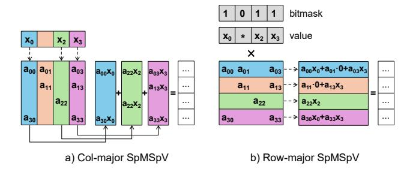

# 2.2 SpMSpV

SpMSpV can be organized under two paradigms: *matrix-driven* (*row-major*) and *vector-driven* (*column-major*). Figure 1 illustrates the differences in their computation flows and work patterns.

**Figure 1.** Comparison of SpMSpV paradigms. (a) Column-major: iterate over nonzero entries of the input vector, fetch columns and accumulate partial products into the output. (b) Row-major: iterate over matrix rows and use a bitmask to skip inactive vector entries.

Matrix-driven SpMSpV approaches iterate over matrix rows (CSR), treating the input vector as dense. Algorithm 1 illustrates this matrix-driven paradigm. In this scheme, each nonzero in a row first checks the corresponding position in a bitmap to confirm whether the vector entry is active(line 6);

if the entry is active, the value is then loaded(lines 7,8). BFS-like unweighted SpMSpV systems such as TileSpMSpV [18] and BerryBees [26] further incorporate an *output mask* to avoid unnecessary updates to inactive result entries, thus reducing redundant work during traversal.

