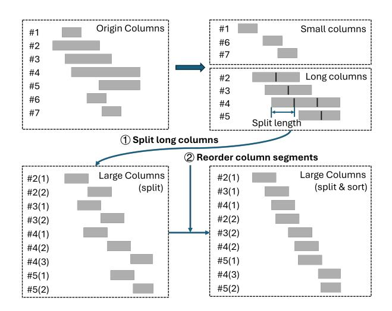

# 4.3 Compute pipeline

To further reduce the cost of hash computation, we implement the fetch-compute-writeback pipeline that overlaps global-memory fetches with local aggregation. The key idea

is to use the stall time of irregular memory accesses to perform hash updates, thereby hiding much of the hashing cost. Algorithm 4 illustrates the execution flow with double buffering. The kernel executes the following steps:

- 1. **Asynchronous fetch.** The next segment of indices and values is fetched from global memory into shared memory using cp.async, which proceeds in the background (line 5).
- 2. **Hash aggregation.** While the next segment is being fetched, threads aggregate the current segment into the shared-memory hash table (line 7).
- 3. **Synchronization and flush.** After the hash computation of the current segment finishes, threads issue cp. async.

Figure 4. Column decomposition and reorder. Columns are transposed for visualization: each bar denotes a column segment, where the left edge marks the starting row index and the width indicates its nonzero count. Long columns are split into shorter segments (①) and then reordered by starting row index to improve locality (②).

