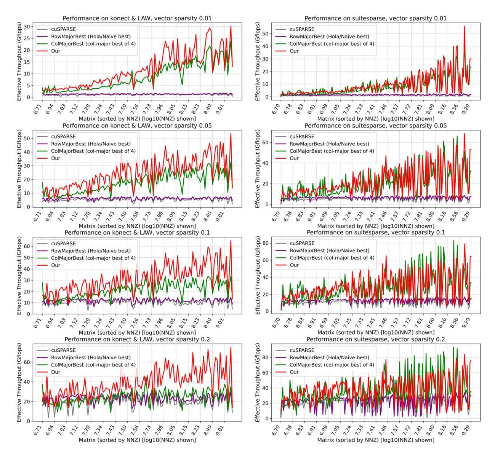

# 6.2 SpMSpV Performance

We evaluate the performance of our method with random input vectors at four sparsity levels (0.01, 0.05, 0.1, and 0.2).

Figure 5 presents results on both **Web-scale graphs** (left) and **SuiteSparse matrices** (right). Each row corresponds to one sparsity level, thus yielding eight subfigures in total.

To summarize across datasets, Table 1 and 2 report the geometric mean (GeoMean) speedup of our method over other baselines on Konect & LAW and SuiteSparse benchmark, as well as the maximum observed speedup and the fraction of cases where our method achieves the best performance.

Across the four sparsity levels (0.01, 0.05, 0.1, 0.2), our method achieves an average speedup of  $1.41\times$  on Konect (up to  $3.42\times$ ) and  $1.13\times$  on SuiteSparse (up to  $2.55\times$ ). While the least favorable cases naturally yield lower gains due to dataset-specific structure, the minimum speedups observed are  $0.57\times$  on Konect and  $0.54\times$  on SuiteSparse. In addition, it attains the best performance in about 90.3% of Konect cases and 59.5% of SuiteSparse cases overall, confirming that the advantage is consistent across sparsity levels. A more fine-grained analysis is provided in Section 6.4.

When examining individual baselines, we find that our advantage over cuSPARSE and row-major SpMSpV methods is more pronounced at low input sparsity. That is because both approaches perform redundant work proportional to the number of matrix nonzeros, which leads to inefficiency when the input vector is sparse. cuSPARSE executes computations insensitive to input sparsity, while row-major methods must traverse the entire matrix and access auxiliary mask

**Table 1.** Speedup and best fraction on **Konect** and **LAW** datasets.

| Baseline \ Sparsity | 0.01          | 0.05    | 0.10   | 0.20   |
|---------------------|---------------|---------|--------|--------|
| cuSPARSE            | G-mean: 8.93  | 4.24    | 2.85   | 1.91   |
|                     | Max: 33.40    | 8.89    | 5.00   | 7.08   |
| NaiveSpMSpV         | G-mean: 91.66 | 53.07   | 38.90  | 26.93  |
| rvarvespivispv      | Max: 3015.74  | 1464.87 | 990.00 | 658.16 |
| HoloCnMCnV          | G-mean: 7.41  | 3.69    | 2.49   | 1.64   |
| HolaSpMSpV          | Max: 27.05    | 8.43    | 5.01   | 3.01   |
| Dla al-Caut         | G-mean: 8.61  | 8.86    | 8.44   | 8.03   |
| BlockSort           | Max: 56.23    | 53.65   | 37.48  | 35.81  |
| Cl11C1              | G-mean: 4.42  | 4.16    | 4.24   | 4.46   |
| GlobalSort          | Max: 8.25     | 7.33    | 6.91   | 7.94   |
| D11- A +            | G-mean: 5.06  | 5.86    | 5.73   | 5.56   |
| BlockAtomic         | Max: 63.37    | 67.02   | 48.48  | 60.68  |
| GlobalAtomic        | G-mean: 1.47  | 1.48    | 1.53   | 1.63   |
| GiodalAtomic        | Max: 2.85     | 4.46    | 5.35   | 6.11   |
| Best of 7           | G-mean: 1.38  | 1.42    | 1.44   | 1.41   |
| Dest of /           | Max: 2.85     | 3.42    | 3.17   | 2.37   |
| Best%               | 92.9%         | 91.3%   | 90.5%  | 86.5%  |

arrays to validate activity. In contrast, column-major SpM-SpV methods scale more directly with the number of active nonzeros, so our relative speedup against these baselines remains roughly stable across sparsity levels.

We further note that the impact of load balancing differs across strategies. Block-level methods (e.g., BlockAtomic, BlockSort) are sensitive to skewed nonzero distributions: some CTAs receive little work while others are heavily loaded, which explains why our method achieves very high maximum speedups over them. NaiveSpMSpV, which directly maps threads to rows without explicit balancing, suffers even more from workload skew and thus shows particularly poor performance. By contrast, global strategies (GlobalAtomic, GlobalSort) distribute work more evenly across CTAs and therefore avoid such extreme slowdowns.

At the same time, we also observe that the gains vary significantly between web graphs and scientific matrices. To understand this gap, we next analyze how locality metrics affect VDHA's performance and present a lightweight predictive model to estimate whether a matrix benefits from our method.

#### 6.3 Ablation and Sensitivity Studies

We conducted an ablation study and a sensitivity analysis to quantify the contribution of each optimization stage and evaluate parameter choices.

As shown in Table 4, we compare hash, hash+split, and hash+split+reorder, with normalized performance of 0.689×, 0.947×, and 1.000×, respectively. The split step improves

**Figure 5.** Efficient performance of our method versus baselines at different sparsity. Efficient performance is defined as *efficient NNZ* divided by runtime, where *efficient NNZ* denotes the number of matrix nonzeros multiplied by the input vector sparsity. Left: web-scale graphs (Konect & LAW). Right: SuiteSparse matrices.

load balance for long columns. Without splitting, the hashonly variant suffers from severe workload skew: threads processing extremely long columns generate disproportionately many intermediate updates, which largely exceed the capacity of the per-CTA hash table and result in poor performance. The reorder step improves the reuse of long-column segments within the hash table. Without reordering, segments from a single long column do not overlap in the hash table, limiting the effectiveness of shared-memory aggregation. Reordering these segments increases cross-column overlap and enhances aggregation efficiency, as discussed in Section 3.2. We then examine the sensitivity of VDHA to the hash-table size and split size. Table 5 reports the normalized performance across all tested configurations. VDHA achieves its best performance at HASH\_TABLE\_SIZE = 2048 and SPLIT\_SIZE = 256, while all tested configurations remain within  $0.8215\times-1.000\times$  of peak performance. This parameter choice balances two factors: (i) providing enough shared-memory capacity to maximize the benefits of aggregation, and (ii) avoiding excessive shared-memory usage that would reduce occupancy, as discussed in Section 5.2.

Table 2. Speedup and best fraction on SuiteSparse datasets.

| Pagalina \ Cnaugity | 0.01          | 0.05    | 0.10    | 0.20    |
|---------------------|---------------|---------|---------|---------|
| Baseline \ Sparsity | 0.01          | 0.05    | 0.10    | 0.20    |
| CUSPARSE            | G-mean: 6.53  | 3.68    | 2.60    | 1.80    |
| Cu5i AR5L           | Max: 41.61    | 10.47   | 6.27    | 9.54    |
| Noive Cm MCmV       | G-mean: 10.80 | 7.81    | 6.28    | 5.51    |
| NaiveSpMSpV         | Max: 11817.54 | 5613.71 | 3835.80 | 5200.53 |
| ** 1 0 1/0 **       | G-mean: 5.51  | 3.18    | 2.26    | 1.80    |
| HolaSpMSpV          | Max: 31.88    | 9.31    | 6.29    | 10.14   |
| Pl 10 .             | G-mean: 6.41  | 6.05    | 5.84    | 5.71    |
| BlockSort           | Max: 55.39    | 57.59   | 53.56   | 73.18   |
| 01.1.10             | G-mean: 5.41  | 5.13    | 4.50    | 5.24    |
| GlobalSort          | Max: 9.07     | 8.59    | 8.77    | 8.55    |
| D1 1 44             | G-mean: 1.99  | 2.04    | 1.95    | 1.85    |
| BlockAtomic         | Max: 53.94    | 57.67   | 60.35   | 109.23  |
| Cl 1 144            | G-mean: 1.64  | 1.64    | 1.66    | 1.73    |
| GlobalAtomic        | Max: 4.81     | 8.42    | 9.92    | 11.01   |
|                     | G-mean: 1.20  | 1.17    | 1.11    | 1.05    |
| Best of 7           | Max: 2.55     | 2.29    | 2.11    | 2.15    |
| Best%               | 68.9%         | 63.6%   | 56.5%   | 48.8%   |

