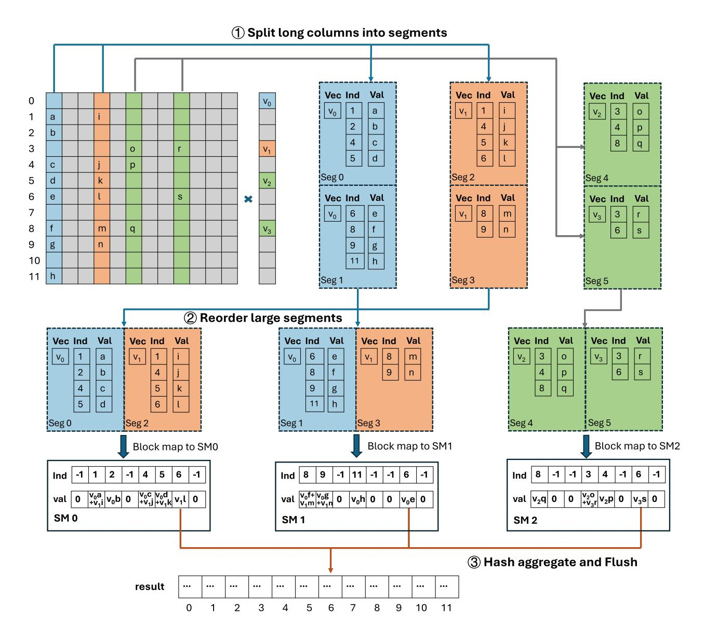

# <span id="page-5-0"></span>Algorithm 3 Hash-based insertion with fallback

```
1: function Insert(H, ind, val)
 2:
        h \leftarrow \text{hash\_func}(ind) \% TABLE\_SIZE
        cnt \leftarrow 0
        while cnt < FALLBACK ITER do
 4:
            old \leftarrow atomicCAS(\&H.key[h], -1, ind)
            if old == -1 or old == ind then
 6:
 7:
                 UpdateHash(H.val[h], val)
                 return
 8:
            h \leftarrow \text{next\_hash}(h)
 9:
             cnt \leftarrow cnt + 1
11:
        Fallback(ind, val)
```

Alg. 3 illustrates the pseudocode for hash-based insertion, where H is the shared memory hash table and each update is a key-value pair (ind, val). The starting hash position is computed using hash\_func. Each thread attempts

<span id="page-6-0"></span>

**Figure 3.** Overview of the VDHA design. Columns are first classified by length; long columns are split into smaller segments (①) and further reordered to enhance locality (②). Both the reordered long segments and short columns are then block-mapped to GPU SMs for hash aggregation, and the aggregated results are finally written back atomically (③).

to claim the slot via atomicCAS, where -1 denotes an empty entry. If atomicCAS returns -1 or the target index, the insertion succeeds and UpdateHash updates the value. Otherwise, next\_hash continues probing. Once the probe count exceeds FALLBACK\_ITER, the update falls back to a direct global atomic: the pair (ind, val) is added to result[ind] using atomicAdd.

