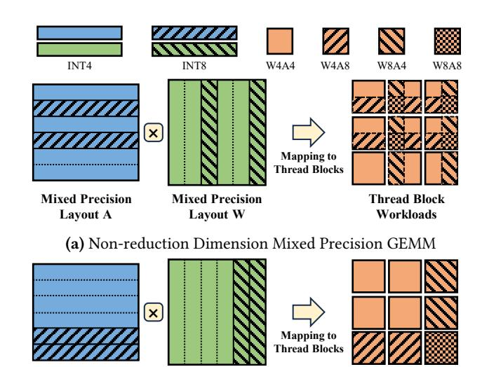
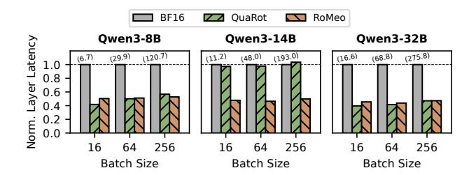
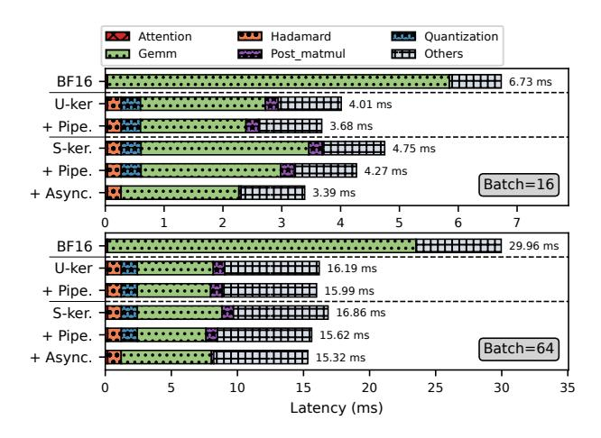

# 3 Algorithm: Rotated Token-wise Mixed Precision Quantization

To better maintain model performance under 4-bit precision, we propose Rotated Token-wise Mixed Precision Quantization (RTMPQ), a novel method addressing dual-dimensional outliers in LLMs. In this section, we first introduce an empirical analysis of activation distribution that identifies why existing channel-wise quantization methods underperform. Then we detail RTMPQ algorithm, which effectively handles the dual-dimensional outliers through rotation and tokenwise mixed precision computation.

#### 3.1 Analysis of Outliers in LLMs

We visualize the activation distribution recorded from the down projection linear module in Qwen3-8B [\[44\]](#page-14-1) model's final layer in Figure [2.](#page-3-0) As shown in Figure [2a,](#page-3-0) the activation distribution exhibits a sparse pattern wherein a small number of extreme values dominate the magnitude scale. These outliers introduce substantial quantization error by distorting the quantization range and inefficiently utilizing the limited bit representation. Consistent with prior works [\[7,](#page-12-4) [10,](#page-12-5) [25\]](#page-13-2), we observe these outliers concentrate in specific channels, termed channel-wise outliers (CO).

Existing channel-wise mixed precision methods leverage this property by separating outlier channels from normal channels for higher precision computations. After we identify and prune the top 256 outlier channels by maximum activation values, the maximum value drops from 1272 to 110 (Figure [2b\)](#page-3-0), enabling effective 8-bit quantization.

However, when scaled to 4-bit quantization, the remaining values still exhibit outliers that unable to be effectively represented within the constrained 4-bit precision, resulting in

<span id="page-3-0"></span>

**Figure 2.** Visualized activation distribution of down projection module from layer 35 in Qwen3-8B model. CO and TO refers to channel-wise outliers and token-wise outliers, respectively. For better visualization, the absolute activations are downsampled using 64×64 max pooling.

<span id="page-3-1"></span>
$$H_4 = \begin{bmatrix} 1 & 1 & 1 & 1 \\ 1 & -1 & 1 & -1 \\ 1 & 1 & -1 & -$$

**Figure 3.** Example of a Hadamard matrix of size 4 and illustration of rotation technique in a quantized LLM linear module. It is notable that Hadamard matrices are orthogonal matrices, and  $HH^T$  equals the identity matrix I.

significant accuracy degradation. These residual outliers cannot be eliminated through channel-wise detection since they originate from specific tokens within the input sequence, which we identify as token-wise outliers.

#### 3.2 RTMPQ Algorithm Design

Rather than applying mixed precision quantization directly to channel-wise outliers, RTMPQ employs a two-step approach to address the dual-dimensional outlier problem.

**Hadamard Rotation.** Inspired by QuaRot [3] and other works [6, 26, 38], RTMPQ first employs Hadamard rotation for channel-wise outlier suppression. As shown in Figure 3, the Hadamard matrix is an orthogonal matrix with elements of either +1 or -1. When multiplied to the activation matrix, it redistributes the values across channels, effectively smoothing extreme values. To maintain mathematical equivalence, a transposed Hadamard rotation to weight matrices is performed during offline preparation.

```
Algorithm 1: Token-wise Mixed Precision Module
   Input: A: FP16 activation tensor of shape (M, K).
            W: FP16 weight tensor of shape (K, N).
   Output: C: FP16 output tensor of shape (M, N).
 1 Function Quant(X, nbits)
       range max \leftarrow 2^{nbits} - 1;
       scale \leftarrow \max(|X|) / range\_max;
       X_Q \leftarrow \text{INT}(X/scale);
       return X_O, scale;
6 Function Forward(A, W)
       C \leftarrow Empty(M, N, FP16);
7
       for i \leftarrow 0 to M do
8
            for j \leftarrow 0 to N do
 9
                V_A, s_A \leftarrow Quant(A[i,:], i \in O_A? 8:4);
10
                V_W, s_W \leftarrow Quant(W[:, j], j \in O_W? 8:4);
11
                C[i, j] \leftarrow (V_A \cdot V_W) \times (s_A \times s_W);
12
       return C;
```

Our empirical study demonstrates the effectiveness of Hadamard rotation. As shown in Figure 2c, the peak activation value after rotation is sharply reduced from 1272 to 58.5, significantly reducing quantization error. Furthermore, the rotated activation exhibits token-wise concentration as the irregularity migrates from the channel dimension to token dimension. This transformation eliminates the need for complex dual-dimensional mixed precision computation.

The additional runtime overhead introduced by rotation remains minimal due to the recursive structure of Hadamard matrices. Multiplication with Hadamard matrices can be efficiently implemented through Fast Walsh-Hadamard Transform within the computational complexity of  $O(mn \log n)$  for  $m \times n$  matrices [1]. This represents negligible overhead compared to the dominant cost of the linear module.

**Token-wise Mixed Precision.** Following Hadamard rotation, outliers now exhibit pure token-wise concentration. RTMPQ then addresses these remaining outliers through token-wise mixed precision quantization.

First, the outlier set  $O_A$  is determined by measuring pertoken maximum activation values. Given a fixed outlier count budget  $k_o$ , RTMPQ performs top-k selection to identify the  $k_o$  tokens with highest activation magnitudes, storing them in set  $O_A$ .

Second, RTMPQ applies INT8 quantization to outlier tokens while using INT4 quantization for remaining tokens, as detailed in Algorithm 1 (lines 10). In addition to the quantized integer representations, corresponding per-token scaling factors are also derived during quantization. These two procedures of outlier identification and mixed precision quantization extend symmetrically to the weight matrix (line 11) and are completed during the offline preparation phase before model serving.

Notably, while weight matrices are typically smoother than activations, the required pre-multiplication by  $H^T$  for weights illustrated in Figure 3 amplifies their non-uniformity, creating an outlier distribution similar to Figure 2c. This necessitates applying the same mixed-precision quantization to the weight matrix as well.

Finally, RTMPQ performs matrix multiplication that naturally accommodates this heterogeneous precision scheme. The algorithm computes dot products between quantized vectors and dequantizes the results using corresponding scaling factors, as detailed in Algorithm 1 (line 12).

Depending on the outlier status, these dot products may be computed in four distinct precision combinations. RTMPQ employs INT32 accumulators for cross-precision multiplication to prevent overflow during accumulation. The reduced sum is subsequently cast back to floating-point precision and dequantized using per-token scaling factors obtained during the quantization process.

By separating token-wise outliers in higher precision, the remaining values are able to be processed more accurately in low bit-width precision. As shown in Figure 2d, the maximum activation value is further reduced from 58.5 to 18.6 after ruling out token-wise outliers.

#### 3.3 Computational Complexity Analysis

Given that INT4 Tensor Cores typically achieve 2× higher throughput than INT8 Tensor Cores, the proportion of INT4 computations becomes crucial for determining RTMPQ's theoretical speedup.

Assume we select  $k_a$  token-wise outliers in the activation matrix and  $k_w$  outliers in the weight matrix. The ratio of pure INT4 computations is given by:

$$\mathcal{P}_{INT4} = \frac{(m - k_a) \times (n - k_w)}{m \times n}$$

where m denotes the number of tokens and n the number of channels. Assume INT8 Tensor Cores deliver  $2 \times$  throughput of FP16 Tensor Cores, the overall theoretical speedup of RTMPQ against original FP16 baseline can be calculated as:

$$\mathcal{S} = \frac{1}{\mathcal{P}_{INT4}/4 + (1-\mathcal{P}_{INT4})/2}$$

For example, if we set m = n = 4096,  $k_a = k_w = 256$ , the ratio of INT4 multiplications is 88%, leading to a theoretical speedup of 3.57×.

## 4 System Challenges

The proposed RTMPQ algorithm demonstrates potential for superior model performance preservation. However, two system challenges prevent the implementation of this theoretical advantage for practical serving speedup.

<span id="page-4-0"></span>

(b) Permuted Mixed Precision GEMM

Thread Block

Workloads

**Figure 4.** Workload partitioning and thread block mapping for non-reduction dimension mixed precision multiplication.

#### 4.1 Sparse and Cross-Precision Computation

Layout W

Permuted

Layout A

The fundamental difference between token-wise and channel-wise mixed precision lies in their computational dimension within matrix multiplication (GEMM). Token-wise mixed precision operates along the non-reduction dimension, while channel-wise method operates along the reduction dimension, which naturally supports computation decomposition.

Therefore, token-wise mixed precision has to face sparse and cross-precision computation, which is hard to be efficiently implemented. To illustrate, we present the workload partitioning of non-reduction dimension mixed precision GEMM in Figure 4a. While the output matrix is divided into 9 tiles for parallel execution on GPU thread blocks, mixed precision causes workload heterogeneity: 8 of the 9 thread blocks must handle mixed data type combinations, requiring conditional branches and limiting Tensor Core efficiency.

One potential solution is to coalesce data of same precision with permutation, as shown in Figure 4b. This approach homogenizes the workload within thread blocks: 4 blocks now compute pure INT4 multiplication, 4 blocks handle either INT4-INT8 or INT8-INT4 multiplications, and 1 block computes pure INT8 multiplication. However, the permutation introduces non-trivial overhead of computing indices and performing in-place swaps, which often outweighs the computational benefits.

#### 4.2 Dynamic Outlier Distribution

Another challenge stems from the distinct origin of tokenwise outliers in LLMs. Channel-wise outliers emerge from the internal model structure and are found to be concentrate at specific positions along the channel dimension. Existing

<span id="page-5-0"></span>

Figure 5. The permutation-free mixed precision computation implementation proposed in RoMeo.

methods leverage offline calibration datasets to identify these channels, simplifying system design.

In contrast, token-wise outliers originate from linguistic characteristics within input sequences, exhibiting dynamic and unpredictable patterns. This nature introduces both challenges for quantized data layout and online outlier detection. Performing real-time detection could incur significant runtime overhead, thereby diminishing overall speedup gains.

## 5 System Optimizations

RoMeo introduces three specialized optimizations to address these challenges and achieve tangible serving speedup.

#### 5.1 Permutation-free Mixed Precision Computation

RoMeo employs a permutation-free approach to densify sparse computation while avoiding heavy permutation operations. As illustrated in Figure [5,](#page-5-0) RoMeo pre-allocates a dedicated outlier buffer whose size is fixed based on the predetermined number of outlier tokens. During quantization, the entire matrix is quantized to INT4, while the embeddings corresponding to outlier tokens are copied and quantized into this outlier buffer in INT8 precision. Since outlier tokens typically constitute only a small fraction of the total, the additional memory overhead remains marginal.

Next, RoMeo performs all four types of cross-precision multiplications between INT4 activations, INT8 outlier activations, and the corresponding weight matrices. Since all individual matrices involved in the computation are now dense and uniform-precision, each GPU thread block is assigned to handle a specific cross-precision computation type. We detail the implementation of this kernel in [§5.2.](#page-5-1)

Notably, in our scheme, outlier tokens are quantized to both INT8 and INT4 precisions and participate in multiple multiplication operations. We tolerate this redundant computation to preserve the contiguous memory layout requirement of Tensor Core instructions.

Finally, we directly overwrite the corresponding positions in the output tensor with higher-precision results computed from outlier tokens. This approach completely avoids permutation overhead while maintaining contiguous memory access patterns, simultaneously resolving the challenge of storing multiple precision data within a single data buffer.

## <span id="page-5-1"></span>5.2 Intra-Kernel Cross-Precision Multiplication with Software Pipelining

The performance of the core GEMM kernel is crucial for overall serving efficiency. RoMeo introduces an efficient separatekernels implementation with software pipelining to support intra-kernel cross-precision multiplication.

Single vs. Multiple Kernels. Mixed precision computation introduces diverse precision operand combinations, presenting a key design decision: whether to employ a single fused kernel or multiple separate kernels for handling different precision combinations in multiplication.

Typically, a fused single-kernel implementation assigns different thread blocks to handle different multiplication types, minimizing kernel launch overhead. Conversely, a separate-kernels implementation launches distinct kernels (e.g., four kernels for four precision combinations), introducing additional launch overhead and potentially suffering from insufficient parallelism due to the tall-and-skinny matrices caused by outlier tokens.

Nevertheless, we opt for a separate-kernels implementation in this work. The primary reason is the distinct computational characteristics and on-chip resource requirements of different multiplication types. For instance, an INT8-INT8 multiplication kernel requires twice shared memory capacity for matrix tile caching compared to an INT4-INT4 kernel under identical tiling parameters. In this configuration, GPU occupancy becomes constrained by shared memory consumption, which subsequently enables the compiler to utilize more registers for instruction-level parallelism without negative side effects.

In contrast, an INT4-INT4 kernel consumes less shared memory, establishing a tradeoff between register usage and GPU occupancy. The compiler may reduce loop unrolling to decrease register usage, trading this for higher occupancy to achieve optimal overall performance. A fused kernel implementation prevent this fine-grained allocation of on-chip resources according to the specific requirements of each computation precision, leading to suboptimal performance.

RoMeo addresses the limitations of launch overhead and underutilization through asynchronous execution, as detailed in [§5.3.](#page-6-0) Our evaluation demonstrates that the separatekernels implementation outperforms the fused alternative when combined with this asynchronous optimization.

Software Pipelining and Type Casting. Achieving high performance for compute-intensive kernels on GPUs requires efficient overlap of memory accesses and computation. RoMeo employs a software pipeline to this end, as outlined

#### **Algorithm 2:** RoMeo Software Pipeline

```
Input: Iter_K: Number of tiles along K dimension. N_{stage}: Number of pipeline stages.
```

```
1 Function MainLoop
       // Pipeline fill
       for i \leftarrow 0 to N_{stage} - 1 do
         cp_async_block(i);
3
       // Steady state
       for i \leftarrow 0 to Iter_K - N_{stage} - 1 do
4
           cp_async_wait(N_{stage} - 1);
           mma_compute(i\%N_{stage});
6
           cp_async_block(i + N_{stage});
       // Pipeline tail
       for i \leftarrow N_{stage} - 1 \text{ to } 0 \text{ do}
8
           cp_async_wait(i);
           mma_compute((Iter_K - 1 - i)%N_{stage});
10
       scale_and_write_out();
```

in Algorithm 2. The kernel's main loop computes the product of submatrices  $A[bid_m \times TM : (bid_m + 1) \times TM, :]$  and  $B[:,bid_n \times TN : (bid_n + 1) \times TN]$ , where  $bid_m$  and  $bid_n$  are thread block indices, and TM and TN are the tiling sizes along the M and N dimensions, respectively. Computation proceeds along the K dimension in  $Iter_K$  tiles.

The pipeline first issues  $N_{stage}$  asynchronous memory copy operations via cp. async PTX instruction to load data from global to shared memory, thereby filling the pipeline. The steady state then starts: each iteration waits for the oldest memory copy to complete, performs matrix multiplication using Tensor Cores mma instructions, and subsequently issues a new asynchronous copy. Finally, the pipeline drains by waiting for all remaining memory operations to complete and performing the corresponding computations.

For computations involving different data types, RoMeo inserts an in-shared-memory type casting phase before performing mma computations. INT4 data is cast to INT8 using two binary arithmetic instructions instead of expensive type conversion instructions. Upon completing all computations, the results are scaled by the per-token scaling factors in registers and written back to global memory.

#### <span id="page-6-0"></span>5.3 Asynchronous Concurrent Execution

Modern GPUs feature over a hundred streaming multiprocessors (SMs) and large Tensor Core instruction shapes to enable massive parallelism. Hardware underutilization occurs when the problem size is insufficient to saturate available resources. Consider the outlier multiplication of a  $256\times4096$  matrix. Using a  $256\times256$  thread block tiling configuration, only 16 thread blocks are launched, leaving most SMs idle.

RoMeo employs an asynchronous concurrent execution strategy to address underutilization while simultaneously

<span id="page-6-2"></span>

**Figure 6.** Illustration of asynchronous execution in RoMeo.

hiding quantization overhead. The approach leverages the observation that several kernels lack serial dependencies. For instance, the four separate multiplication kernels for different precision combinations can execute concurrently. By decomposing activation quantization into two independent tasks, quantizing outlier tokens and quantizing non-outlier tokens, each multiplication kernel depends on exactly one quantization task. This decomposition enables constructing a fine-grained task dependency graph where tasks execute asynchronously across multiple CUDA streams, as shown in Figure 6. RoMeo uses CUDA events to enforce correct execution ordering only where true dependencies exist.

#### 6 Implementation

We implement RoMeo as a PyTorch extension for seamless integration into existing LLM frameworks. The quantized modules are wrapped as PyTorch nn.Module instances, allowing direct replacement of original linear layers. We leverage HadaCore [1] for efficient Hadamard transformations.

At kernel level, we develop fused Triton [37] kernels for outlier identification, quantization and INT4 data packing. we develop mixed precision CUDA kernels with CUT-LASS [35] and expose them to Python through compiled dynamic libraries. For ease of use, RoMeo employs a justin-time (JIT) compilation mechanism that compiles kernels for specific model dimensions during initial execution and caches the compiled binaries for subsequent runs. The system also incorporates auto-tuning for critical hyperparameters based on runtime profiling results, including tiling sizes and the number of pipeline stages.

#### 7 Evaluation

We conduct comprehensive evaluations of RoMeo to assess its effectiveness in both model accuracy preservation and end-to-end performance speedup. Additionally, we perform ablation studies to analyze the contribution of individual technical components.

<span id="page-7-0"></span>**Table 1.** Comparison of baseline quantization methods across key features: Outlier Dimension addressed , Mixed Precision (M.P.), Hadamard Rotation (H.R.), and Quantization Granularity (Quant. Gran.). Tok. and Chan. represent Token and Channel, respectively.

| Method    | Outlier Dim. | M.P.         | H.R.         | Quant. Gran.   |
|-----------|--------------|--------------|--------------|----------------|
| QuaRot    | Chan.        | ×            | <b>√</b>     | per-Tok.Chan.  |
| ~<br>MixQ | Chan.        | ✓            | ×            | per-Tok./Chan. |
| Atom      | Chan.        | $\checkmark$ | ×            | per-Group      |
| RoMeo     | Tok. & Chan. | $\checkmark$ | $\checkmark$ | per-Tok./Chan. |

#### 7.1 Accuracy Evaluation

*Evaluated Models.* We evaluate our RTMPQ algorithm on two series of widely used open-source LLMs: Qwen3 [44] and Llama-3.1 [12]. The Qwen3 series include 8B, 14B, and 32B models, while the Llama-3.1 series include 8B and 70B models, covering a wide range of model sizes.

Evaluated Tasks. We conduct both perplexity evaluation on WikiText2 [28] and zero-shot evaluation on six common downstream tasks, including ARC (Challenge and Easy) [8], HellaSwag (HS) [46], LAMBADA [29], PIQA [4], and Wino-Grande (WG) [31]. Downstream tasks are evaluated using the lm-eval library [14] with a batch size of 32. Perplexity is measured with a batch size of 2 and sequence length of 2048.

Baselines. We evaluate RTMPQ against other state-of-the-art 4-bit quantization methods, including QuaRot [3], MixQ [7] and Atom [48]. QuaRot employs a similar Hadamard transformation for outlier suppression. MixQ applies mixed precision quantization across channels, allocating higher precision to channels containing channel-wise outliers. Atom leverages mixed precision quantization at channel levels similar to MixQ, but performs quantization at a finer group-wise granularity (group size 128). While this can yield potentially higher accuracy, it introduces additional computational overhead.

In Table 1, we compare key features of baselines and RoMeo, highlighting that RoMeo handles dual-outliers in both token and channel dimensions using mixed precision quantization and Hadamard rotation. This enables coarse-grained per-token/channel quantization, leading to better serving efficiency. The choice of quantization granularity is orthogonal to the RTMPQ algorithm, and RoMeo can further improve accuracy by combining with per-group quantization at the cost of efficiency.

The unquantized baseline uses BF16, the default weight type for the evaluated models. We also include INT4 quantization results using trivial round-to-nearest quantization for reference. For RoMeo, we set the token-wise outlier percentage to 5% for both activation and weight tensors. To ensure fair comparison, we configure MixQ to select channel-wise

<span id="page-7-1"></span>**Table 2.** Comparison of measured perplexity on WikiText2 dataset. The lower is better.

| Method |        | Qwen3  | Llama-3.1 |        |        |
|--------|--------|--------|-----------|--------|--------|
| Method | 8B     | 14B    | 32B       | 8B     | 70B    |
| BF16   | 9.72   | 8.65   | 7.61      | 6.24   | 2.81   |
| INT4   | 2.55e4 | 2.25e5 | 2.19e6    | 769.53 | 1.02e4 |
| MixQ   | 14.76  | 12.57  | 12.38     | 10.55  | 17.15  |
| Atom   | 19.04  | 10.68  | 9.78      | 7.62   | 4.25   |
| QuaRot | 11.53  | 9.81   | 8.85      | 8.44   | 5.10   |
| RoMeo  | 10.97  | 9.59   | 8.64      | 7.99   | 4.87   |

outliers from activation tensors online with a percentage of 10% to match RoMeo's sparsity level.

**7.1.1 Perplexity Evaluation.** Table 2 presents the perplexity results of different quantization methods on the Wiki-Text2 dataset. We observe that naive INT4 quantization leads to extremely high perplexity across all models, indicating a severe degradation in model quality. MixQ exhibits significant performance degradation because it only addresses channel-wise outliers in activations, leaving numerous tokenwise outliers unhandled. Although QuaRot achieves better results by suppressing channel-wise outliers through input rotation, it still underperforms compared to RoMeo due to residual token-wise outliers. In contrast, RoMeo achieves superior perplexity across all models by effectively mitigating both token-wise and channel-wise outliers through our proposed RTMPQ algorithm. Atom achieves competitive perplexity on Llama-3.1 models due to its finer-grained, groupwise mixed-precision quantization, but at the cost of higher computational overhead. However, Atom's effectiveness is severely limited on Owen3 models, indicating a lack of scalability across different model architectures.

7.1.2 Downstream Tasks Evaluation. Table 3 presents the zero-shot accuracy results of different quantization methods across six downstream tasks, using the same experimental settings as the perplexity evaluation. RoMeo achieves the highest average accuracy across all Qwen3 models, consistently outperforming existing quantization methods and narrowing the performance gap with the half-precision baseline. On Llama-3.1 models, Atom attains marginally better average accuracy due to its finer-grained quantization approach, but RoMeo still delivers competitive results with substantially lower computational overhead.

By computing merely 5% of outliers in higher precision, RoMeo effectively mitigates quantization error while maintaining computational efficiency, achieving a superior balance between model accuracy and inference performance for practical LLM serving.

Table 3. Comparison of zero-shot accuracy on six downstream tasks. The higher is better.

<span id="page-8-0"></span>

| Model         | Method | ARC-C | ARC-E | HS    | LAMBADA | PIQA  | WG    | Average |
|---------------|--------|-------|-------|-------|---------|-------|-------|---------|
| Qwen3-8B      | BF16   | 56.74 | 80.85 | 74.90 | 64.12   | 77.80 | 68.11 | 70.42   |
|               | INT4   | 26.45 | 26.60 | 26.40 | 0.00    | 51.14 | 51.14 | 36.35   |
|               | MixQ   | 40.27 | 64.18 | 62.55 | 37.45   | 70.67 | 59.91 | 55.84   |
|               | Atom   | 47.18 | 73.65 | 63.44 | 41.41   | 72.25 | 61.56 | 59.92   |
|               | QuaRot | 48.21 | 72.94 | 68.29 | 53.95   | 74.10 | 62.43 | 63.32   |
|               | RoMeo  | 49.66 | 72.85 | 70.43 | 57.91   | 73.34 | 62.27 | 64.41   |
|               | BF16   | 60.32 | 82.95 | 78.82 | 67.82   | 79.87 | 72.53 | 73.72   |
|               | INT4   | 24.83 | 25.55 | 26.16 | 0.02    | 50.05 | 50.43 | 29.51   |
| Qwen3-14B     | MixQ   | 46.93 | 71.04 | 68.24 | 45.53   | 73.39 | 68.43 | 62.26   |
|               | Atom   | 51.79 | 73.23 | 74.02 | 62.47   | 76.93 | 68.90 | 67.89   |
|               | QuaRot | 57.00 | 79.55 | 74.79 | 63.09   | 77.48 | 68.35 | 70.04   |
|               | RoMeo  | 58.11 | 79.63 | 75.66 | 63.81   | 77.80 | 69.93 | 70.82   |
|               | BF16   | 60.84 | 83.25 | 82.59 | 67.13   | 81.94 | 73.40 | 74.86   |
|               | INT4   | 25.94 | 25.76 | 26.12 | 0.00    | 50.05 | 50.75 | 35.72   |
| Qwen3-32B     | MixQ   | 45.31 | 66.16 | 71.48 | 40.93   | 73.23 | 58.09 | 59.20   |
|               | Atom   | 22.70 | 25.08 | 78.81 | 64.56   | 49.51 | 68.90 | 51.59   |
|               | QuaRot | 56.23 | 77.44 | 79.19 | 62.74   | 79.05 | 67.96 | 70.44   |
|               | RoMeo  | 57.59 | 77.95 | 79.59 | 63.87   | 77.42 | 67.56 | 70.66   |
|               | BF16   | 53.67 | 81.23 | 78.84 | 75.33   | 81.23 | 73.56 | 73.98   |
|               | INT4   | 22.95 | 30.98 | 30.34 | 4.35    | 52.50 | 51.54 | 32.11   |
| Llama-3.1-8B  | MixQ   | 42.92 | 69.28 | 69.75 | 57.03   | 75.14 | 67.17 | 63.55   |
|               | Atom   | 49.06 | 74.62 | 74.62 | 70.27   | 78.29 | 70.72 | 69.60   |
|               | QuaRot | 42.32 | 66.84 | 71.91 | 65.13   | 75.03 | 62.04 | 63.88   |
|               | RoMeo  | 48.12 | 75.59 | 74.03 | 68.79   | 77.37 | 68.43 | 68.72   |
| Llama-3.1-70B | BF16   | 64.85 | 86.62 | 84.95 | 78.87   | 84.22 | 78.93 | 79.74   |
|               | INT4   | 26.62 | 25.88 | 26.29 | 0.00    | 50.92 | 48.22 | 35.59   |
|               | MixQ   | 48.12 | 73.19 | 73.70 | 56.18   | 74.32 | 60.06 | 64.26   |
|               | Atom   | 60.92 | 84.51 | 83.04 | 78.07   | 83.03 | 77.74 | 77.89   |
|               | QuaRot | 56.57 | 80.60 | 81.53 | 74.69   | 82.48 | 71.35 | 74.54   |
|               | RoMeo  | 59.56 | 82.79 | 82.52 | 76.32   | 83.03 | 75.85 | 76.68   |

#### 7.2 Efficiency Evaluation

Experimental Setup. We evaluate performance speedup on NVIDIA GeForce RTX 4090 GPUs with 24 GB memory, which provides up to 8× peak INT4 performance over halfprecision. The environment uses Python 3.12, PyTorch 2.8.0, and CUDA 12.8 for kernel compilation and execution.

Methodology. We employ CUDA Graph to capture the target workflow, eliminating kernel launch overhead, memory allocation costs, and PyTorch framework overhead. The captured graph is executed repeatedly without synchronization to ensure continuous GPU execution. The average latency is measured using CUDA events with multiple runs after

warmups. This ensures accurate and stable microsecondlevel latency measurements, particularly essential for small kernels or high-overhead scenarios.

7.2.1 End-to-end Performance. We integrate RoMeo to Transformers [\[41\]](#page-13-12) framework to evaluate its end-to-end acceleration performance. Our evaluation covers Qwen3 model sizes from 8B to 32B parameters, representing a broad spectrum of LLM scales. The experiments are conducted across varying batch sizes with a fixed input sequence length of 128. The outlier percentage in RoMeo is consistently set to 5%, maintaining alignment with our previous accuracy evaluation configuration.

Figure [7](#page-9-0) displays the latencies of a single transformer layer for BF16, QuaRot, and RoMeo, normalized to the BF16

<span id="page-9-0"></span>

**Figure 7.** Normalized layer-level latency on Qwen3 models of different input batch sizes. The number in parentheses indicates the absolute latency of BF16 baseline in milliseconds.

baseline. Absolute latency figures for the BF16 baseline are included in parentheses for reference. We exclude Atom from this comparison due to its significant computational overhead from finer-grained quantization, which results in substantial performance degradation relative to other 4-bit methods, as detailed in §7.2.3. The results demonstrate that RoMeo achieves up to 2.10× end-to-end speedup over the half-precision baseline. Despite the additional computation and challenges introduced by mixed precision quantization, RoMeo delivers performance comparable to the uniform precision baseline QuaRot, highlighting its effectiveness in maximizing hardware utilization and mitigating mixed precision overhead through specialized system designs.

Notably, QuaRot exhibits significant performance degradation on the Qwen3-14B model. This occurs because QuaRot applies Hadamard transformation between heads before the o\_proj layer in the attention module. While this approach works efficiently for Llama-2 series models (evaluated in QuaRot's original paper), Qwen3-14B's 40 attention heads lead to inefficient Hadamard transformation implementation. In contrast, RoMeo applies Hadamard transformation at the heads' hidden dimension, avoiding this issue.

7.2.2 Model Serving Performance. To evaluate the real-world model serving performance of RoMeo, we further integrate it into SGLang [49] (version v0.5.5), a widely adopted LLM serving framework. Our experiments include various sizes of Qwen3 models, ranging from 8B to 32B. For models exceeding the memory capacity of a single GPU, we employ tensor parallelism (TP) to distribute model parameters across multiple GPUs (2 GPUs for the 14B model and 4 GPUs for the 32B model). All evaluations use a fixed input sequence length of 128 and are carried out through SGLang's official offline benchmarking scripts, measuring prefill throughput in tokens per second across varying batch sizes.

The results in Table 4 show that RoMeo achieves a prefill throughput improvement of up to 1.90× over the unquantized baseline when serving the Qwen3-8B model on a single GPU. At small batch sizes, CPU overhead becomes the bottleneck, leading to performance degradation. This can be mitigated by enabling CUDA graphs in the prefill stage. As the

<span id="page-9-2"></span>**Table 4.** Comparison of prefill throughput (tokens per second) on Owen3 models of different input batch sizes.

| Model               | Batch | BF16     | RoMeo    | Speedup |
|---------------------|-------|----------|----------|---------|
|                     | 8     | 10233.07 | 5213.35  | 0.5095  |
| Qwen3-8B<br>(TP=1)  | 16    | 10664.64 | 10282.52 | 0.9642  |
|                     | 32    | 10745.83 | 19815.86 | 1.8441  |
|                     | 64    | 10545.13 | 20073.60 | 1.9036  |
| Qwen3-14B<br>(TP=2) | 8     | 6449.20  | 4021.85  | 0.6236  |
|                     | 16    | 6840.79  | 8060.05  | 1.1782  |
|                     | 32    | 6781.74  | 9148.49  | 1.3490  |
|                     | 64    | 6848.02  | 9064.14  | 1.3236  |
|                     | 8     | 4425.40  | 2581.76  | 0.5834  |
| Qwen3-32B<br>(TP=4) | 16    | 4451.47  | 5210.75  | 1.1706  |
|                     | 32    | 4561.73  | 5598.86  | 1.2274  |
|                     | 64    | 4537.32  | 5473.99  | 1.2064  |

batch size increases, kernel execution dominates the overall latency, allowing RoMeo to fully leverage its computational advantages.

For larger models requiring distributed serving, RoMeo still delivers significant speedups, achieving up to  $1.35\times$  for Qwen3-14B and  $1.23\times$  for Qwen3-32B. The reduced speedup in distributed settings is primarily due to communication overhead from tensor parallelism, which partially offsets the computational gains from quantization. Overall, these results confirm that RoMeo effectively accelerates LLM serving in production environments.

<span id="page-9-1"></span>**7.2.3 Kernel Performance.** Figure 8 presents the performance of the non-reduction dimension mixed precision multiplication kernel in RoMeo across various matrix shapes derived from Qwen3 and Llama-3.1 models. The M dimension of matrix multiplication is fixed to 4096.

We compare RoMeo' mixed precision kernel against four baselines: BF16 (PyTorch's half-precision multiplication implementation), INT8 (INT8 precision multiplication kernel implemented with CUTLASS), Atom (group-wise INT4 mixed precision kernel), and QuaRot (state-of-the-art INT4 multiplication implementation with fused dequantization kernel).

RoMeo achieves a geometric average speedup of 4.68× over BF16 across all matrix shapes, effectively utilizing the GPU's peak INT4 performance. It also consistently outperforms the INT8 baseline (3.39× average speedup). Atom kernels only achieve 3.63× average speedup due to the overhead of finer-grained group-wise quantization.

Compared to QuaRot, which achieves an average speedup of 4.55× over the half-precision baseline, RoMeo delivers comparable performance across most matrix shapes despite computing additional high-precision outliers. As a mixed precision kernel, RoMeo effectively leverages the GPU's low-precision computational capabilities while minimizing the

<span id="page-10-0"></span>

**Figure 8.** Normalized kernel performance on various matrix shapes. QKV, O, UG, and D represents the concatenated q, k, v projection, the output projection, the concatenated up, gate projection, and the down projection linear modules, respectively. These matrix shapes correspond to the actual weight tensors encountered in model serving.

<span id="page-10-1"></span>

**Figure 9.** Layer-level latency breakdown for Qwen3-8B across different batch sizes with progressive optimizations.

overhead of outlier computation through system-level optimizations, acheiving performance comparable to the fully-optimized uniform precision kernel implementations.

#### 7.3 Optimization and Performance Breakdown

Figure 9 shows RoMeo's layer-level latency breakdown of Qwen3-8B across different batch sizes, with five configurations progressively enabled: unified single kernel (U-ker), unified single kernel with pipelining (U-ker + Pipe.), separate kernels (S-ker), separate kernels with pipelining (S-ker + Pipe.), and separate kernels with pipelining and asynchronous execution (S-ker + Pipe. + Async.).

Compared to BF16 baseline, RoMeo introduces three main runtime overheads: Hadamard transformation, outlier identification and quantization, and post-multiplication overwrite. These overheads collectively account for approximately 12% of the baseline latency, while the mixed precision GEMM kernel delivers substantial performance gains that yield net speedup. The simple unified kernel implementation outperforms separate kernels due to reduced kernel launch overhead. Software pipelining improves both configurations by overlapping computation and memory access. However, with

<span id="page-10-2"></span>

**Figure 10.** Scaling the percentage of outliers.

asynchronous execution enabled, the separate-kernels implementation achieves superior performance, better utilizing streaming multiprocessor resources. The benefits of concurrent execution decline at larger batch sizes where individual kernels can already saturate GPU resources.

#### 7.4 Scaling Outliers

Figure 10 shows the perplexity of Qwen3-8B and Llama-3.1-8B models across different outlier percentage levels. We observe that perplexity decreases with increased outlier percentage, confirming that preserving more outliers improves model accuracy. The most significant improvements occur at lower percentages: Qwen3-8B and Llama-3.1-8B show perplexity reductions of 0.40 and 0.29 respectively when increasing outliers from 0% to 1.6%. This demonstrates that a small fraction of outliers has a disproportionate impact on quantization accuracy, which is the core property that RoMeo leverages to achieve high accuracy with minimal additional computational overhead.

#### 8 Related Work

#### 8.1 Quantization Algorithms of LLMs

Weight-only Quantizations. Weight-only LLM quantization methods including GPTQ [13], AWQ [23], QuIP [6], SqueezeLLM [20], and OmniQuant [32] apply low-bit quantization to weights while maintaining activations in higher precision. Although effective for memory reduction in low-batch scenarios, these approaches cannot achieve computational speedup in high-throughput serving settings where computation becomes the bottleneck.

Uniform Precision Weight-activation Quantizations.

SmoothQuant [\[43\]](#page-14-5) enables practical 8-bit weight-activation quantization through channel-wise smoothing. QServe [\[24\]](#page-13-0) and Quant-LLM [\[42\]](#page-13-1) explore sub-8-bit format quantization but still cannot leverage high-throughput 4-bit Tensor Cores of modern GPUs. QuaRot [\[3\]](#page-11-1) proposes rotation-based 4-bit quantization but still exhibits significant accuracy degradation compared to higher-bit methods. Other works including DuQuant [\[22\]](#page-12-12), AffineQuant [\[27\]](#page-13-15), OstQuant [\[19\]](#page-12-13), Spin-Quant [\[26\]](#page-13-5), and FlatQuant [\[34\]](#page-13-16) improve accuracy through optimized rotation matrices. These methods are orthogonal to our RTMPQ algorithm and could be combined for enhanced performance.

#### Mixed Precision Weight-activation Quantizations.

HAQ [\[39\]](#page-13-4) and MxMoE [\[11\]](#page-12-6) explore tensor-wise mixed precision for LLMs. Atom [\[48\]](#page-14-4), LLM.int8() [\[10\]](#page-12-5), and COMET [\[25\]](#page-13-2) propose channel-wise mixed precision methods for finergrained quantization. MixQ [\[7\]](#page-12-4) improves the performance of channel-wise mixed precision quantization by predicting outlier channels. However, these methods overlook tokenwise outliers, limiting their quantization performance.

Hardware-specialized Quantizations. ANT [\[18\]](#page-12-14) proposes a new data type designed for lower quantization error. Olive [\[17\]](#page-12-15) designs novel encoding schemes that sacrifice precision for common values to better represent outliers. While promising for accuracy, these methods require specialized hardware support to realize practical speedups and cannot be directly deployed on existing GPU-based LLM serving infrastructure.

## 8.2 Accelerating Quantized LLM Serving

Prominent LLM serving frameworks, such as vLLM [\[21\]](#page-12-16), SGLang [\[49\]](#page-14-7), and Chitu [\[36\]](#page-13-17), support quantized model by continuously integrating the latest algorithms and optimizations. SqueezeLLM [\[20\]](#page-12-11) and DecDEC [\[30\]](#page-13-18) employ algorithmsystem co-design for weight-only quantization, but cannot accelerate high-throughput serving scenarios. FP6-LLM [\[42\]](#page-13-1), COMET [\[25\]](#page-13-2), MixQ [\[7\]](#page-12-4) and Qserve [\[24\]](#page-13-0) develop specialized systems and kernels for their specific quantization algorithms, which are not directly applicable to our RTMPQ algorithm. Ladder [\[40\]](#page-13-19) and QFactory [\[47\]](#page-14-8) provide compilation frameworks for quantized kernels, but they cannot handle RTMPQ's fine-grained mixed precision pattern.

## 9 Conclusion

We present RoMeo, a LLM serving system that achieves superior model accuracy preservation through a novel Rotated Token-wise Mixed Precision Quantization algorithm. RoMeo introduces a permutation-free mixed precision computation paradigm that integrates software-pipelined cross-precision kernels and fine-grained asynchronous concurrent execution to effectively overcome the challenges of deploying

token-wise mixed precision quantization on GPUs. Extensive evaluations across diverse LLMs and benchmarks demonstrate that RoMeo not only improves quantization accuracy over existing methods but also delivers practical end-to-end speedups, establishing it as an effective solution for accurate and efficient LLM serving.

