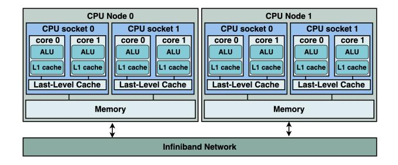
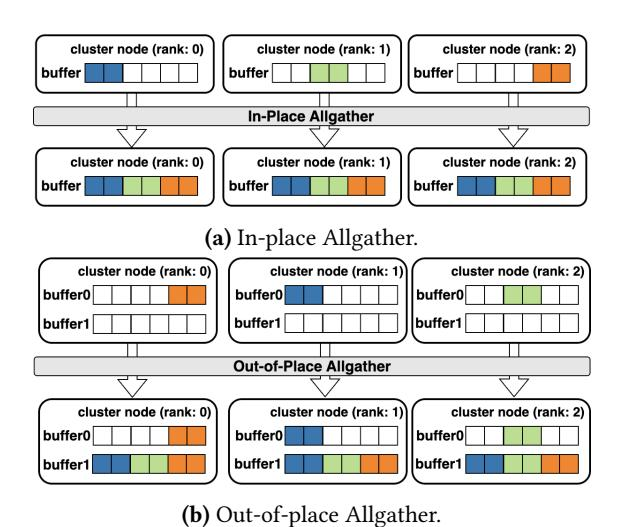
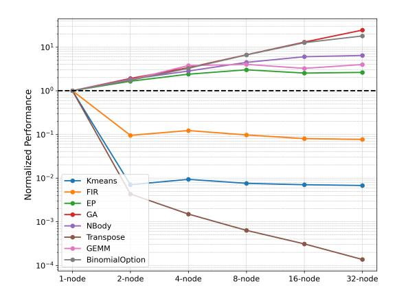

# 2 Background

#### 2.1 Programming Model

2.1.1 GPU. The programming model is structured with two levels of parallelism. The GPU block represents coarsegrained parallelism, while each GPU block consists of a fixed number of GPU threads that provide fine-grained parallelism. Importantly, there are no dependencies among execution units at either level, enabling highly parallel execution.

All GPU threads access the same memory space, and modifications made by one thread are visible to all other threads. [1](#page-1-0)

2.1.2 CPU Cluster. A CPU cluster consists of multiple CPU nodes (Figure [2\)](#page-1-1). All nodes are connected through networks such as an InfiniBand. In contrast to the GPU model, where all threads access the same memory space, CPU clusters follow a distributed memory model, with each node maintaining its own memory space. As a result, cross-node network communication is required to ensure memory consistency among the distributed nodes.

<span id="page-1-1"></span>

Figure 2. CPU Cluster Structure.

## 2.2 Executing GPU Programs on Single CPUs

GPUs are designed to execute a large number of lightweight tasks, while CPUs are optimized for a smaller number of heavier tasks. To address this disparity, researchers [\[21,](#page-12-7) [22,](#page-12-13) [32,](#page-12-9) [38,](#page-13-3) [42\]](#page-13-4) apply compiler transformations to wrap the workload within a CUDA block into a CPU function, which is then executed by a CPU thread.

An example is shown above. For the GPU program (Listing [1\)](#page-2-1), 5 \* 256 GPU threads are invoked during execution. Since thread operation overhead on CPUs is significantly higher than on GPUs, CPUs cannot efficiently support the same number of threads. With the proposed compiler optimization (Listing [2\)](#page-2-2), the entire workload of a GPU block is

<span id="page-1-0"></span><sup>1</sup>We only discuss GPU global memory for CPU cluster migration. The GPU shared memory and local memory do not require cross-node communication to maintain consistency, as all threads within a GPU block are scheduled to the same CPU node for execution.

mapped to a single function (line 1), reducing the requirement to just 5 CPU threads (line 10).

```
1 #define N 1200
2 __global__ void vec_copy(char *src, char *dest) {
3    int id = blockDim.x * blockIdx.x + threadIdx.x;
4    if(id < N)
5        dest[id] = src[id];
6 }
7  int main() {
8    vec_copy<<<ceil(N/256), 256>>>(src, dest);
9 }
```

#### **Listing 1.** Original GPU program.

```
void vec_copy(char *src, char *dest, int block_id) {
  #pragma omp simd

for(int thread_id=0; thread_id<256; thread_id++) {
  int id = 256 * block_id + thread_id;

  if (id < N)
```

**Listing 2.** Transformed single-node CPU program.

The transformed CPU program utilizes CPU resources for high performance. In Listing 2, a for-loop is introduced (line 3), where each iteration represents a GPU thread. Since there are no dependencies among these iterations, the for-loop is well-suited for optimization using CPU SIMD instructions. Similarly, the host program contains a parallelized for-loop (line 11), where each iteration corresponds to a GPU block. This for-loop can be executed by multiple CPU threads to maximize performance.

For single-CPU migration, GPU global memory is mapped to CPU heap memory, which is accessible to all CPU threads, with consistency maintained by the OS and hardware. However, when extending to a CPU cluster, CPU threads are distributed across multiple nodes, and no unified memory space exists among all CPU threads. Thus, auxiliary communication operations are required to maintain consistency.

#### 2.3 Allgather Communication

Our solution utilizes Allgather communication to maintain data consistency across CPU nodes. Allgather collects data from each node, concatenates them sequentially, and returns the concatenated data to all nodes (Figure 3).

From a data placement perspective, Allgather can be categorized into two types: in-place and out-of-place. In in-place Allgather (Figure 3a), the input and output share the same buffers, so the local data in the input buffer does not need to be moved to another location. In contrast, out-of-place Allgather (Figure 3b) uses separate buffers for input and output. Processing the output buffer requires not only communication between nodes but also local memory movement from the input buffer to the output buffer. Additionally, out-of-place Allgather requires two buffers, resulting in double memory usage compared to in-place Allgather.

<span id="page-2-3"></span>

Figure 3. Allgather communication.

In addition to data placement, we observe that data distribution also affects communication overhead. Specifically, a balanced Allgather, where all distributed nodes have the same data size, is typically faster than an imbalanced Allgather. For example, in a 2-node cluster with a total data size of N GB, a balanced Allgather—where each node holds  $\frac{N}{2}$  GB—usually outperforms an imbalanced Allgather, where one node has  $\frac{N}{4}$  GB and the other has  $\frac{3N}{4}$  GB.

Based on our network evaluation, we observe that balanced-in-place Allgather consistently achieves the highest performance. Therefore, CuCC utilizes balanced-in-place Allgather communication to maintain data consistency.

## 3 Problem Statement and Solution

#### <span id="page-2-0"></span>3.1 Challenges of Existing Solutions

It is challenging to migrate the GPU shared memory model to the distributed memory space of CPU nodes. A possible solution is to first migrate a GPU program to a single-CPU program. Then, scale this single-CPU program to a CPU cluster using DSM frameworks by replacing local memory accesses with distributed memory accesses. An example of migrating the program in Listing 1 with a popular DSM solution, PGAS, is shown in Listing 3.

<span id="page-2-4"></span>Although state-of-the-art PGAS solutions [4, 11] integrate network optimizations like GASNet-EX [8] and RDMA, they perform poorly for GPU program migration due to heavy communication overhead. For example, Listing 3 introduces 1200 remote memory accesses (line 7), where each access is only 1 byte. This large number of fragmented communications limits overall performance. We evaluate the performance on a 32-node cluster (Figure 4); most GPU programs do not achieve high scalability, and some even slow down when scaled to distributed nodes, as the communication overhead significantly exceeds the performance gains.

```
1 void vec_copy ( char * src , pgas :: global_ptr <char > dest ,
2 int block_id ) {
3 for ( int tid =0; tid <256; tid ++) {
4 int id = 256 * block_id + tid ;
5 if( id < N )
6 // Async one - side remote memory access
7 pgas :: remote_put ( dest + id , src [ id ]) ;
8 }
9 }
10 int main () {
11 // Cluster - level global variable
12 pgas :: global_ptr <char > global_dest ( N ) ;
13 // Distributed Execution
14 int c_rank = pgas :: rank_me () ;
15 int c_size = pgas :: rank_n () ;
16 int local_size = ceil ( N /256) / c_size ;
17 for ( int bid = local_size * c_rank ;
18 bid < local_size * ( c_rank +1) ; bid ++)
19 vec_copy ( src , global_dest , bid ) ;
20 }
```

Listing 3. The PGAS migration for GPU program in Listing [1.](#page-2-1)

<span id="page-3-0"></span>

Figure 4. Performance of CPU cluster migration using PGAS.

#### 3.2 Insight of CuCC

As summarized in Section [3.1,](#page-2-0) GPU programs contain a large number of threads, and each thread typically issues a small number of memory accesses. When migrated with existing solutions, this massive number of fine-grained memory accesses turns into a large volume of fragmented network communications, which introduces significant overhead.

We propose a new solution, CuCC, that executes with low network overhead. The insight is that, since GPU programs follow the SPMD model, all threads execute the same programs, differing only by their thread index. This leads many GPU programs to contain memory access patterns where sequential threads access consecutive memory locations. Therefore, instead of issuing a separate network communication for each GPU thread's memory access, CuCC coalesces all memory accesses within a GPU block and services them with a single coarse-grained network operation. Additionally, as all GPU blocks execute the same program, their memory accesses are highly symmetric. This symmetry allows CuCC to use collective communication primitives.

