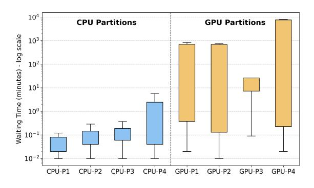

# [Hyesoon Kim](https://orcid.org/0000-0002-6061-7825)

Georgia Institute of Technology Atlanta, USA hyesoon@cc.gatech.edu

coupled with supply chain shortages, has significantly constrained their availability [\[9,](#page-12-3) [20,](#page-12-4) [39\]](#page-13-2).

Data center maintainers frequently observe an imbalance in usage between CPUs and GPUs. We measure the utilization of four CPU partitions and four GPU partitions in the Georgia Tech PACE cluster. By monitoring the Slurm scheduling system, we record the waiting time of all jobs submitted between March 2nd and 8th, 2025 in Figure [1.](#page-0-0) The waiting time represents the duration jobs wait for resources to become available for execution. Figure [1](#page-0-0) shows that CPU partitions experience significantly shorter waiting times than GPU partitions. This indicates that while users wait for GPU resources, a substantial number of CPUs remain idle.

Figure 1. Waiting times for CPU and GPU partitions.

The imbalance in CPU/GPU usage motivates researchers to explore using CPUs to alleviate the GPU shortage. Researchers [\[7,](#page-12-5) [16,](#page-12-6) [21,](#page-12-7) [23,](#page-12-8) [32,](#page-12-9) [38,](#page-13-3) [42\]](#page-13-4) propose compiler and runtime solutions. With these optimizations, GPU programs can be executed on single CPUs with high performance.

However, a gap still exists between GPU and CPU runtimes due to differences in computational capacity. CPUs are designed to support a broad range of general applications and cannot match the computational power of GPUs, which are optimized for high-throughput workloads. For instance, in 2020, NVIDIA released the A100 GPU, which delivers 19.5 TFLOP/s for single-precision floating-point computation. In contrast, one of the most advanced CPUs released a year later, AMD EPYC 7713, achieves only 4.096 TFLOP/s. As GPUs continue to integrate more computational units, the performance gap between CPUs and GPUs is widening.

Given that CPUs are typically more accessible in data centers, this paper explores a new direction: executing GPU programs on CPU clusters. By leveraging multiple CPU nodes, this approach aggregates greater computational resources, bringing the overall capacity closer to that of a single GPU and enabling GPU programs to migrate to CPUs without significant performance loss.

Compared to a single CPU, CPU cluster migration is significantly more challenging, as CPU clusters and GPUs have different memory models. The GPU programming model follows a shared memory model, where all threads can access a global memory space, and data consistency is implicitly maintained by hardware. In contrast, CPU clusters use a distributed memory model, where each node has its own memory space. Thus, to support the migration of GPU programs (shared memory model) to CPU clusters (distributed memory model), auxiliary cross-node communication operations are required to ensure data consistency.

The distributed shared memory (DSM) problem, which aims to provide a shared memory model on a distributed system, is a classical challenge for which researchers have proposed numerous solutions [\[4,](#page-12-10) [11,](#page-12-11) [26,](#page-12-12) [33,](#page-13-5) [46\]](#page-13-6). However, existing DSM solutions are designed for traditional CPU programs, which are typically Multiple Program Multiple Data (MPMD) and contain relatively few memory accesses with irregular patterns. Consequently, peer-to-peer communication is often used to provide flexibility. When these DSM solutions are applied to programs migrated from GPUs, which contain a vast number of memory accesses, they introduce significant communication overhead that degrades overall performance. A detailed analysis is provided in Section [3.1.](#page-2-0)

In this paper, we propose CuCC (CUDA on CPU Clusters), a new solution tailored for migrating GPU programs to CPU clusters. GPU programs follow a Single Program Multiple Data (SPMD) model, where all threads execute the same programs. This results in memory access patterns that are highly regular. Our solution exploits this regularity by coalescing multiple memory accesses into a single, larger operation and uses collective communication primitives to achieve high bandwidth to lower network overhead.

We implement CuCC as an end-to-end framework that translates CUDA programs into CPU cluster executables. We demonstrate that CuCC is 12.81× faster than existing single-CPU solutions and achieves runtimes approaching those of GPUs. The contributions are summarized as follows:

- Propose a solution for executing GPU programs on CPU clusters with low communication overhead.
- Introduce an auxiliary compiler analysis for GPU-to-CPU-cluster migration.
- Implement an end-to-end framework for migrating GPU programs to CPU clusters.
- Evaluate the proposed solution on CPU clusters and compare its performance against GPUs.

Although this paper focuses on migrating CUDA applications to CPU clusters, the proposed approach is general and not restricted to any specific GPU programming language.

