# 4 CuCC Execution Workflow

To execute a GPU kernel on CPU cluster, CuCC follows a three-phase workflow. In Section [6,](#page-4-0) we prove that the workflow is theoretically capable of supporting the execution of all types of GPU programs on CPU clusters.

- 1. Partial Block Execution: In this phase, each CPU node executes a distinct set of GPU blocks in parallel. These GPU blocks write to non-overlapping memory locations, with all blocks writing the same amount of data. Importantly, some GPU blocks may not be executed during this phase. Specifically, if a block does not meet the requirements introduced in Section [6,](#page-4-0) its execution is deferred to the third phase. These deferred blocks are referred to as callback blocks.
- 2. Balanced-In-Place Allgather: After the first phase, each CPU node holds a unique memory copy. To ensure consistency across the cluster, balanced-in-place Allgather is applied to synchronize memory spaces.
- 3. Callback Block Execution: After Allgather, all CPU nodes have an identical memory copy. The callback blocks, which were not executed in the first phase, are then executed independently by all CPU nodes. Since all CPU nodes execute the same set of blocks, the memory space remains identical across the cluster.

We use GPU kernel in Listing [1](#page-2-1) to illustrate the workflow. The program consists of five GPU blocks: blocks 0-3 each write 256 elements, while block 4 writes only 176 elements to . Figure [5](#page-4-1) illustrates the workflow for executing the GPU program on a two-node CPU cluster. Before kernel execution, both CPU nodes have identical copies of the memory space.

During the partial block execution phase, GPU blocks are split between CPU nodes for execution. To ensure that the results can later be synchronized using balanced-in-place Allgather, CuCC assigns blocks 0 and 1 to Node 0 and blocks 2 and 3 to Node 1. Each CPU node then writes 512 elements to the array locally. GPU block 4 is designated as a callback block and is not executed during this phase.

After the first phase, each CPU node holds a different copy of the memory space. To synchronize the memory spaces, CuCC invokes balanced-in-place Allgather across the CPU cluster. After this communication, both CPU nodes have identical memory spaces, equivalent to executing GPU blocks 0 through 3 independently on each node.

Finally, in the callback block execution phase, each CPU node executes the callback block (GPU block 4) independently. From a sequential perspective, the CuCC execution workflow is equivalent to executing all callback blocks after the other blocks. Since the GPU programming model does not enforce a specific GPU block execution order, the results will be consistent with those produced by the GPUs.

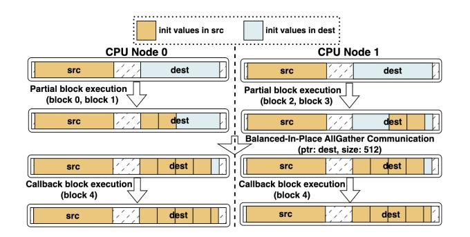

**Figure 5.** CuCC execution workflow for Listing 1.

## 5 Implementation

CuCC consists of both compilation and runtime components. CuCC first compiles the GPU source code to LLVM IR, then applies compiler analysis and transformations to generate CPU object files. These object files are subsequently linked with the CuCC runtime library to produce CPU cluster executables. The generated CPU cluster program follows the workflow introduced in Section 4.

Figure 6 illustrates the process of migrating the GPU program in Listing 1. All analysis and transformations are applied at the LLVM IR level. The source code shown in Figure 6 is provided for illustrative purposes only.

The GPU program is first analyzed by a compiler analysis, *Allgather distributable analysis* (Section 6), to collect metadata used for generating CPU executable. Metadata values are based on symbolic analysis. Thus, for programs with runtime-dependent values (e.g., dynamic GPU block size), CuCC can still perform the migration.

With the metadata, CuCC applies a template-based approach to generate CPU host module. The template consists of three code sections corresponding to three phases in the workflow. The first code section (Figure 6 lines 1-4 in CPU host module) represents the Partial Block Execution phase. To generate this section, CuCC analyzes the GPU host module to determine the grid size (ceil(N/256)) and retrieves the tail-divergent information from the metadata. Using these values, CuCC generates the instruction (line 1) to calculate the number of GPU blocks to be executed by each CPU node. This variable (p\_size) is also used to generate the Callback Block Execution section (line 6-8). The second code section (line 5) represents the Balanced-In-Place Allgather phase. To generate this section, CuCC retrieves metadata information (mem\_ptr, unit\_size) to determine the variables and their sizes that need to be communicated.

In CuCC, all GPU threads within a GPU block are always executed by the same CPU node. Thus, for CPU kernel module generation, which corresponds to the execution of a single GPU block, CuCC utilizes the same compiler transformations as existing GPU-to-single-CPU solutions. CuCC is

developed by extending the codebase of CuPBoP [21], a GPU-to-single-CPU project reported to achieve high performance on single CPUs. Therefore, the single-node performance is equivalent to that of CuPBoP, which is used as the baseline.

The transformed modules are linked with the CuCC runtime library, which provides implementations of cluster operations. In our evaluation, CuCC utilizes MPI primitives to implement these functions.

## 6 Allgather Distributable Analysis

To generate CPU programs that follow the CuCC three-phase workflow, the most important decision is how to assign GPU blocks to each CPU node. To make balanced-in-place Allgather feasible for maintaining consistency, CuCC must distribute GPU blocks across CPU nodes in the partial block execution phase such that each node performs the same amount of memory writes (*balanced*) and the order of memory writes aligns with the cluster ranks of the CPU nodes (*in-place*). We propose a compiler analysis, *Allgather distributable analysis*, to analyze GPU programs and distribute workloads in alignment with the requirements.

#### 6.1 Terminology

#### **Definition: Write Interval**

The *Write Interval* of a GPU thread represents the range of global memory addresses written by that thread. For a GPU block, the *Write Interval* can be expressed as:

$$write_interval(block) = \bigcup_{t \in block} write_interval(t),$$

where *t* denotes a thread within *block*.

For a set of GPU blocks  $\mathbf{B} = \{\text{block}_1, \text{block}_2, \dots, \text{block}_K\}$ , the *Write Interval* is the union of the Write Intervals of all blocks in the set:

$$\mathrm{write\_interval}(\mathbf{B}) = \bigcup_{block \in \mathbf{B}} \mathrm{write\_interval}(block).$$

As an example, in the GPU kernel shown in Listing 1, the Write Intervals for block 0 through 4 are:

[dest, dest + 256), [dest + 256, dest + 512), ..., [dest + 1024, dest + 1200).

CuCC considers only the write interval for GPU global memory access, as GPU local and shared memory accesses do not require cross-node communication.

## **Definition: Allgather Distributable**

Let a set of blocks  $\mathbf{B} = \{\text{block}_1, \text{block}_2, \dots, \text{block}_K\}$  represent the GPU blocks of a GPU kernel. The GPU kernel is considered *Allgather distributable* for an *N*-node cluster if there exist a subset  $\mathbf{C} \subseteq \mathbf{B}$ , and the set difference  $\mathbf{B} - \mathbf{C}$  can be partitioned into *N* disjoint subsets  $S = \{S_i\}$ , where  $i = 1, \dots, N$ , such that the following conditions are satisfied:

1. **Equal Length of Write Intervals**: All subsets  $S_i$  have write intervals of equal length:

 $len(write\_interval(S_i)) = len(write\_interval(S_i)), \forall S_i, S_i \in S.$ 

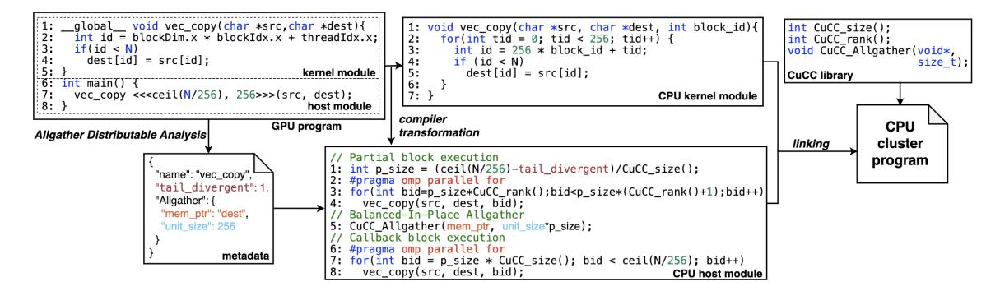

Figure 6. GPU-to-CPU-cluster migration process in CuCC.

2. Disjoint Write Intervals: The write intervals of any two subsets are disjoint:

write\_interval() ∩write\_interval() = ∅, ∀ ≠ ∈ .

3. No Gaps between Write Intervals: The union of all write intervals in the subsets must cover the entire write interval of the set difference:

$$len(write\_interval(\mathbf{B} - \mathbf{C})) = \sum_{S_i \in S} len(write\_interval(S_i)).$$

Allgather distributable GPU kernels can be executed on CPU clusters using the three-phase workflow. In the partial block execution phase, each CPU node executes the workload of a subset in . Then, a balanced-in-place Allgather operation is invoked to synchronize the memory space across all CPU nodes, with a length equal to len(write\_interval()). Finally, in the callback block execution phase, the GPU blocks in C are executed independently on each CPU node.

Theoretically, all GPU kernels are Allgather distributable. Even GPU kernels that contain irregular memory access can still satisfy the definition of Allgather distributable by setting equal to . We refer to these kernels as trivial Allgather distributable. When three-phase workflow executes these trivial kernels, the first and second phases do not perform any work, and all GPU blocks are executed in the third phase, similar to GPU-to-single-CPU execution. With the generalization of Allgather distributable, CuCC is theoretically capable of supporting all types of GPU programs.

In this paper, we primarily discuss non-trivial kernels that benefit from distributed execution. Unless explicitly stated otherwise, all references to Allgather distributable refer to this non-trivial subset. In Section [7.1,](#page-6-0) we analyze real-world GPU kernels in AI/HPC applications and demonstrate that a large number of them are non-trivial Allgather distributable and can be accelerated by cluster execution.

#### 6.2 Compiler Analysis Implementation

Given the abstract definition, implementing a compiler analysis to detect the Allgather distributable property poses challenges. To address this, we break down the Allgather distributable criteria into a series of conditions suitable for static analysis. During compiler analysis, CuCC identifies all write instructions that target GPU global memory. For each write instruction, the following conditions are checked.

- 1. When treating the GPU block index and block size as constants, the index of the write position is an affine function of the thread index, with an invariant coefficient and intercept.
- 2. The write instruction is not enclosed within conditional statements with thread-variant conditions, unless the conditional statements are tail divergent.
- 3. When treating the thread index and block size as constants, the index of the write position is an affine function of the block index with a positive coefficient.

The first condition ensures that each block writes the same number of bytes. In most real GPU applications, each thread writes to a memory location determined by its global index (i.e., . × . + ℎ.). When the memory write index is an affine function of the thread index, each thread writes the same amount of data. Since the GPU programming model enforces that all blocks contain the same number of threads, this guarantees that all blocks write the same number of bytes to memory.

The second condition extends the first condition to cases where write instructions are enclosed within conditional statements (e.g., if-else statements). If the conditional statement is thread-variant, it cannot be guaranteed that each block has the same number of threads executing the write instruction; thus, blocks may write different amounts of bytes, which is not suitable for three-phase workflow.

We observe that the second condition frequently excludes GPU applications that satisfy all other conditions. For example, the GPU program in Figure [6](#page-5-0) contains a global memory write, where the write index is an affine function of both the thread index and block index. Nevertheless, this write instruction is enclosed within an if-statement with a thread-variant condition (id<N), causing it to fail the second condition.

To enable more GPU kernels to be migrated to CPU clusters, we relax the second condition and introduce a concept called tail divergence. The key insight is that a specific ifstatement pattern is widely present in GPU programs. When

the output data size is not a multiple of the block size, GPU programs include if-statements to filter out out-of-bound memory accesses. These if-statements evaluate to True for all blocks except the last block. We refer to such if-statements as **tail divergent**, as they only diverge at the tail block. The GPU kernel in Figure 6 is tail divergent, as the if-statement (line 3) can evaluate to false only in the last block. For GPU kernels with tail-divergent write instructions, the last block can be designated as a callback block, while the remaining blocks write an equal number of bytes.

The first and second conditions ensure that all GPU blocks (except the tail block) write the same amount of data, a requirement for achieving *balanced*. The third condition, on the other hand, ensures that the write locations increase linearly with the GPU block index, which is necessary for achieving *in* – *place*. This enables CuCC to partition the GPU blocks evenly in ascending order and assign each partition to the CPU node corresponding to its cluster rank.

Kernels that satisfy all three conditions are classified as Allgather distributable, and the compiler records the corresponding information in the metadata. As shown in Figure 6, the metadata includes tail divergence (tail\_divergent), the memory variables that require communication (mem\_ptr), and the number of bytes each block writes (unit\_size). This metadata is then used to generate CPU cluster executable.

The conditions form a sufficient but not necessary condition for the actual Allgather distributable criteria. As a result, the analysis may produce false negatives. In CuCC, GPU kernels mistakenly identified as not Allgather distributable are executed independently by all CPU nodes. This ensures that false-negative cases still maintain correctness. Despite the potential for false negatives, our evaluation demonstrates that these conditions accurately identify Allgather distributable kernels in real-world benchmarks.

#### 7 Evaluation

We use two CPU clusters: a *Thread-Focused* cluster that features CPUs with high thread-level parallelism, and a *SIMD-Focused* cluster that is equipped with CPUs supporting wide SIMD instructions. It is important to note that while these names highlight specific architectural strengths, both CPUs support SIMD instructions and multi-core execution; we enable both optimizations on both clusters. Both clusters are connected via a 100 Gb/s InfiniBand network with RDMA support. Detailed specifications are provided in Table 1.

Table 1. Cluster Specifications.

| Name           | Nodes | Single Node Config. | Year | Cores/ SMs | FLOPs (Tera) | Network     |
|----------------|-------|------------------------|------|---------------|-----------------|-------------|
| SIMD-Focused   | 32    | 2 × Intel 6226         | 2019 | 24            | 4.15            | 100 Gbps IB |
| Thread-Focused | 4     | 2 × AMD 7713           | 2021 | 128           | 8.19            | 100 Gbps IB |
| A100 GPU       | 1     | NVIDIA A100            | 2020 | 108           | 19.5            | N/A         |
| V100 GPU       | 1     | NVIDIA V100            | 2017 | 80            | 15.7            | N/A         |

For performance evaluation, to reduce noise, we filter out GPU programs with kernel execution times less than 100 ms on an NVIDIA A100 GPU. Each experiment is executed seven times, and the median is reported as the final result.

#### 7.1 Coverage Evaluation

We analyze the generalization of Allgather distributable in real-world GPU kernels. We analyze the kernels in two popular AI models: BERT [15], for Natural Language Processing, and Vision Transformer (ViT) [18], for Computer Vision. Since many GPU programs in AI applications are generated by Deep Learning Compilers, we compile the PyTorch implementations of these models with Triton [44] to generate GPU programs (NVVM IR) and analyze them. We also analyze GPU programs implemented manually in CUDA from Hetero-Mark GPU benchmarks [43] for HPC applications.

The coverage is demonstrated in Figure 7. All 21 kernels in the ViT and BERT models are Allgather distributable. The high coverage is due to the kernels being lowered from the Triton language. Compared to low-level GPU programming languages like CUDA and OpenCL, Triton provides a more abstract programming interface. For example, Triton does not support inter-block barriers, which encourages the generation of GPU programs with regular memory access patterns that do not have data races between blocks, making it favorable to execute these blocks in distributed nodes.

On the other hand, the Hetero-Mark benchmark contains manually written CUDA kernels, each with a unique code structure. In this benchmark, 8 of the 13 GPU kernels are Allgather distributable. Of the remaining five, four have memory access patterns that overlap the written interval, which makes it difficult to maintain data consistency in a distributed system, and one contains indirect memory access, making it impossible to analyze statically. To support these kernels, peer-to-peer communication is needed, which introduces high network overhead and may outweigh the performance gain from CPU cluster execution.

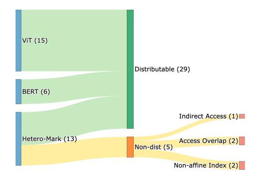

Figure 7. Coverage Evaluation for Allgather Distributable.

#### 7.2 Performance Evaluation

Eight GPU programs, previously used in other GPU migration projects [6, 10, 17, 21, 22, 27, 28], are used to evaluate the performance. We do not directly reuse the kernels in Section 7.1, as we find that their execution times are too short to reflect meaningful speedup. Specifically, as GPU kernels generated by Triton are hard-coded with bound checking, making it hard to scale the data size to increase the workload to make the runtime evaluation stable.

We execute CuCC on clusters of varying sizes and present the results in Figure 8. The scalability evaluations follow the principle of **strong scalability**, where the problem size remains fixed across all cluster configurations.

For SIMD-Focused cluster, most kernels demonstrate high scalability on 2-node and 4-node clusters. As the cluster size increases, Kmeans and Transpose fail to achieve further performance gains and even experience slower execution times. Similar behavior is observed on Thread-Focused cluster.

The Matrix Transpose kernel consists of lightweight operations primarily involving memory movement. As the cluster size increases, the memory access overhead on each node decreases. However, the overall communication volume remains constant since the matrix size does not change. Consequently, as the per-node execution time decreases, the communication overhead becomes increasingly significant, limiting scalability. In contrast, for other kernels, the communication overhead is negligible compared to the total execution time. This overhead is illustrated in Figure 9.

For the Kmeans, the GPU program consists of 313 GPU blocks. When executed on a 16-node cluster, each CPU node is assigned 19 GPU blocks. Each GPU block is executed by a CPU thread, resulting in a CPU thread count close to the number of available CPU cores (24 cores). However, when scaling up to a 32-node cluster, each CPU node is assigned fewer GPU blocks, which cannot efficiently utilize the CPU cores, thereby limiting further scalability.

Another reason for the Kmeans slowdown is the overhead caused by the callback blocks. When executed on a 16-node cluster, each CPU node processes 19 GPU blocks ( $\lfloor \frac{313}{16} \rfloor$ ) during the partial block execution phase, while 9 GPU blocks (313 – 16 × 19) are designated as callback blocks to be executed after the Allgather operation. Each CPU node executes 28 GPU blocks in total. However, when the cluster scales up to 32 nodes, each CPU node processes only 9 GPU blocks during the partial block execution phase and executes 25 callback blocks. Thus, each node executes 34 GPU blocks in total, which leads to a overall execution time slowdown.

On the other hand, the FIR (Finite Impulse Response) achieves near-linear scalability, even on a 32-node cluster. FIR involves heavy computation, including a for-loop that traverses the input sequence to accumulate results. The computed results are scalars, making FIR computation-intensive with minimal memory access overhead. Consequently, the

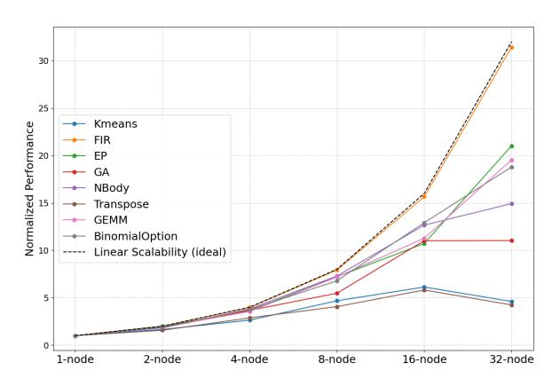

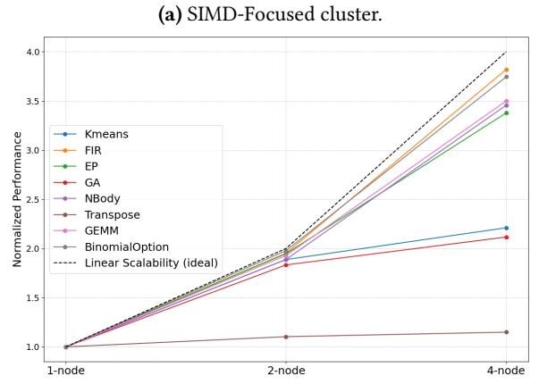

Figure 8. CuCC scalability evaluation results.

(b) Thread-Focused cluster.

communication overhead is much lower than the computation, making it well-suited for scaling to large clusters.

Thread-Focused cluster also achieves speedup compared to single-node, however, the scalability is lower than SIMD-Focused cluster. For instance, the Transpose kernel achieves a 2.88× speedup on the 4-node SIMD-Focused cluster, but only a 1.14× speedup on 4-node Thread-Focused cluster.

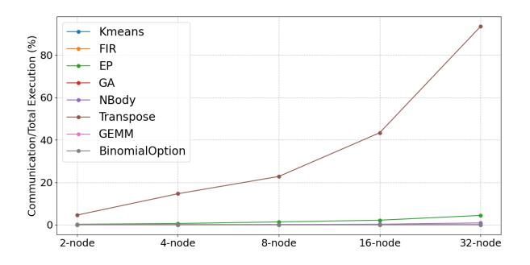

**Figure 9.** Network overhead in SIMD-Focused cluster.

The difference in scalability can be attributed to two factors. First, a single Thread-Focused node contains 128 CPU cores, whereas a single SIMD-Focused node has only 24 CPU

cores. Consequently, for GPU kernels with N blocks, the Thread-Focused cluster cannot achieve further speedup beyond  $\frac{N}{128}$  nodes, as adding more nodes would result in idle CPU cores. In contrast, the upper bound of scalability for the SIMD-Focused cluster is much higher, at  $\frac{N}{24}$  nodes. Second, as further discussed in Section 8.2, a single Thread-Focused node usually achieves significantly higher performance than a single SIMD-Focused node. The expected speedup for a K-node cluster can be estimated using Amdahl's law:

$$speedup = \frac{single \ node \ execution}{communication + \frac{single \ node \ execution}{K}}$$

Since both SIMD-Focused and Thread-Focused clusters have the same network bandwidth, their communication overheads are similar. However, the single node execution time on the SIMD-Focused nodes is greater than that on the Thread-Focused nodes. Consequently, for the same *K*, the SIMD-Focused cluster demonstrates better scalability.

#### 7.3 Comparison with PGAS Solution

PGAS is another approach for GPU-to-CPU-cluster migration. To migrate a GPU program, the corresponding memory variables are replaced with PGAS global variables, and their associated read/write operations are substituted with remote memory access (Section 3.1). PGAS is designed for general programs, which uses fine-grained remote access for flexibility. For the example in Listing 3, the PGAS solution performs 1200 cluster-level communication operations (line 7). In contrast, CuCC utilizes coarse-grained collective communication. The CPU program generated by CuCC contains only a single collective communication operation (Figure 6, CPU host module, line 5).

We migrate the GPU benchmark using UPC++ [4], one of the most popular PGAS implementations, and execute it on SIMD-focused cluster. We calculate the relative runtime of PGAS and CuCC and present the results in Figure 10. Compared to PGAS, CuCC achieves higher performance across all benchmarks and scales. Moreover, the speedup becomes increasingly significant as the cluster size grows. After filtering out the Transpose benchmark as an outlier, CuCC achieves an average speedup of 4.09× over the PGAS solution on 2-node cluster and 12.81× on 32-node cluster.

CuCC and PGAS exhibit the most significant runtime difference in Transpose benchmark. In Transpose, data movement constitutes the majority of the workload. This data movement involves GPU global memory, which, in PGAS solution, is mapped to remote memory access. The original GPU program assigns a single thread to handle each matrix element. Therefore, for an  $N \times N$  matrix, the PGAS program results in  $N^2$  communications, introducing substantial overhead. In contrast, CuCC coalesces all memory accesses and requires only a single Allgather communication.

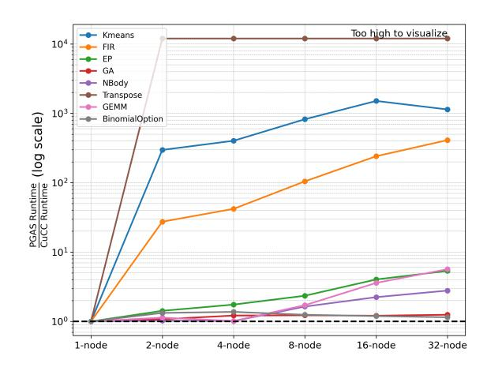

Figure 10. CuCC and PGAS solution runtime comparison.

CuCC and PGAS achieve similar performance on the GA and BinomialOption benchmarks. In GA (Gene Alignment), remote memory access occurs only when specific target gene sequences are found in the query gene sequence, which happens infrequently for the given dataset. In BinomialOption benchmark, only the first thread in each GPU block writes to global memory, resulting in minimal communication overhead. As a result, CuCC and PGAS exhibit similar runtimes.

#### 7.4 CPU Cluster vs GPU

We compare the performance of CPU clusters and GPUs. Two GPUs, the NVIDIA A100 and V100, **released in the same era as the evaluated CPUs**, are used for comparison.

**7.4.1 Runtime Analysis.** We measure the execution time of GPUs running the original GPU programs and the execution time of CPUs running the migrated CPU programs. The results are presented in Figure 11. For CPU runtimes, we report the best result achieved across various cluster sizes.

On average (geometric mean), the SIMD-Focused cluster has a runtime that is  $2.55\times$  slower than the NVIDIA V100 GPU and  $4.14\times$  slower than the NVIDIA A100 GPU. In comparison, the Thread-Focused cluster achieves a runtime that is  $1.57\times$  slower than the V100 and  $2.54\times$  slower than the A100. We provide a detailed analysis of representative applications:

**Transpose:** Both CPU platforms achieve lower execution times than the V100 and A100 GPUs. The Matrix Transpose is memory-intensive, involving frequent transfers between global memory and shared memory. CPUs benefit from large last-level caches (SIMD-Focused CPU: 19.25 MB, Thread-Focused CPU: 256 MB), which are comparable in size to those on GPUs (V100: 6 MB, A100: 40 MB). Additionally, these memory transfers can be efficiently optimized using SIMD instructions, enabling CPUs to deliver performance that is close to or even better than GPUs.

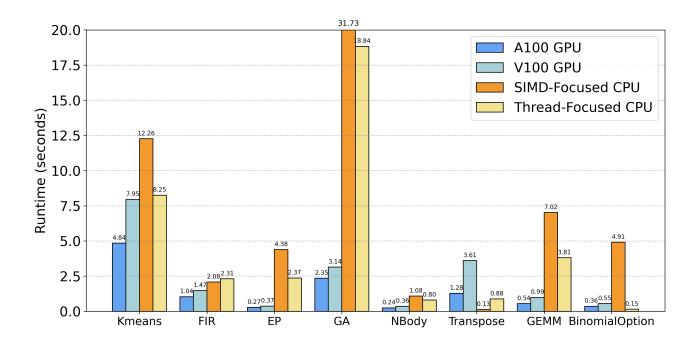

Figure 11. Runtime Comparison between CPUs and GPUs.

BinomialOption: The program features a two-level nested for-loop and is highly compute-intensive, resulting in significant workloads for each GPU thread. Each GPU block performs an internal reduction, with only the first GPU thread writing a scalar value to global memory. This memory access pattern is ideal for CPU cluster migration, as it incurs low communication overhead. Consequently, the Thread-Focused CPU cluster achieves the highest performance with 4-node execution. With a computational capacity of up to 32 TFLOPs, the 4-node Thread-Focused CPU cluster outperforms both the A100 (19.5 TFLOPs) and V100 (14 TFLOPs).

The SIMD-Focused CPU cluster achieves its highest performance with 32 nodes, further demonstrating that BinomialOption is well-suited for CPU clusters. However, the SIMD-Focused cluster does not achieve the same level of performance as the Thread-Focused cluster. This is because the nested for-loop in the GPU program has loop dependencies that cannot be parallelized with SIMD.

EP and GA: On both benchmarks, GPUs outperform CPU clusters by a factor of 5×-10×. These programs contain relatively few GPU blocks (EP: 512, GA: 256), which cannot fully utilize thread-level parallelism in large-scale CPU clusters. Additionally, the kernel code includes for-loops that cannot be optimized with SIMD instructions. As a result, these programs are unable to effectively leverage either the thread-level or data-level parallelism available in CPUs.

**7.4.2 Throughput Analysis.** In data centers, CPUs, designed for general applications, are typically much more accessible than GPUs. For example, the TACC Lonestar6 cluster [2] has 560 CPU nodes but only 16 GPU nodes. Similarly, the Frontera cluster [1] contains 8,368 CPU nodes and only 90 GPU nodes. This vast difference in quantity enables CPUs to provide significantly more aggregate compute capacity, making them well-suited to complement GPU resources.

We estimate the cluster-wide throughput for the TACC Lonestar6 cluster (Figure 12). The throughput of batch processing for each GPU program is measured over a one-second time frame. The cluster contains a significant number of

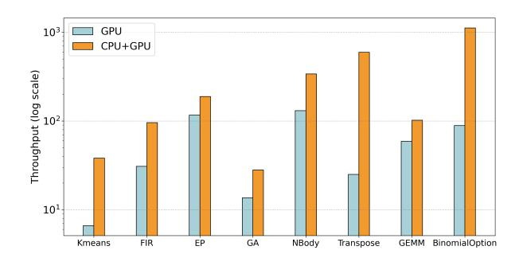

Figure 12. Throughput provided by GPUs and GPUs+CPUs.

Thread-Focused CPUs, providing substantial aggregated computational capacity. On average, instead of executing programs on GPU nodes alone, utilizing these additional CPU nodes improves throughput by 3.59×.

Based on this cluster-wide throughput analysis, we conclude that GPU-to-CPU migration can unlock the potential of idle CPU resources to alleviate GPU shortages. Specifically, for batch-processing applications that are less sensitive to latency, executing on CPU clusters can achieve higher throughput compared to GPU execution.

#### 8 Discussion

#### 8.1 Target GPU Applications

Our solution proposes integrating multiple CPU nodes to execute GPU programs with minimal network overhead. Thus, the benefit a GPU application receives depends highly on two factors.

**Parallelism:** Our solution applies GPU block-level parallelism, in which GPU blocks are distributed to CPU nodes for parallel execution. Therefore, it is critical to have a sufficient number of GPU blocks to distribute. For example, to achieve linear scalability for a CPU cluster with C nodes, where each node has T CPU cores, we need at least  $C \times T$  GPU blocks to fully utilize the CPU resources.

Local Execution Overhead: If the local execution (e.g., computation, local memory access) is heavy, migrating to CPU-cluster execution significantly decreases the execution time, bringing an end-to-end speedup. In Sec. 7.2, we found that all GPU applications achieve a speedup from CPU-cluster migration compared to the single-CPU solution. This is because the input GPU programs are originally designed for single-GPU execution. As a single GPU typically has higher capacity than a single CPU, the workload designed for a single GPU is inherently heavy for a single CPU execution, which allows it to benefit from distributing the workload to CPU clusters.

## 8.2 Target CPU Architectures

The SIMD-Focused CPU (Intel Gold 6226) provides wide SIMD instructions (AVX-512), while the Thread-Focused

CPU (AMD EPYC 7713) offers high thread-level parallelism with 64 cores per socket. To ensure a fair comparison between them, in this section, we limit execution on the Thread-Focused cluster nodes to 64 CPU cores. This results in comparable theoretical computational capacities: 4.147 TFLOPs for the SIMD-Focused cluster and 4.096 TFLOPs for the Thread-Focused cluster.

We compare the runtime performance of the two clusters. As shown in Figure [13,](#page-10-0) the Thread-Focused cluster demonstrates significantly higher performance for migrated GPU programs. Based on the geometric mean, the Thread-Focused cluster is 4.61×, 4.66×, and 4.32× faster than the SIMD-Focused cluster for 1, 2, and 4 nodes, respectively.

For a single-node, the largest performance difference is observed in the BinomialOption kernel, where Thread-Focused CPUs are 55× faster than SIMD-Focused CPUs. The BinomialOption contains 1024 GPU blocks, each with a non-parallel for-loop to calculate accumulated values. This structure is highly suited to thread-level parallelism, as the large number of blocks can be executed in parallel. Conversely, since the kernel includes a non-parallel for-loop as its inner loop, it is challenging to apply SIMD optimization. As a result, the SIMD-Focused CPU, which is optimized for data-parallel operations, achieves lower performance compared to the Thread-Focused CPU, which excels in thread-parallel workloads.

The SIMD-Focused and Thread-Focused clusters show the closest performance on the Transpose kernel. In single-node execution, the Thread-Focused CPU is 1.3× faster than the SIMD-Focused CPU. The Transpose consists of parallelized for-loops, with the loop body primarily containing memory movement operations, which are highly amenable to SIMD optimization. To further analyze performance, we measured execution time with SIMD optimization disabled. Compared to execution with SIMD optimization enabled, the Thread-Focused CPU showed no performance degradation, while the SIMD-Focused CPU experienced a slowdown of 61.66%.

Based on the evaluation, we conclude that for executing migrated GPU programs, CPUs with a higher core count are more likely to achieve high performance, and thread-level parallelism is more effective than data-level parallelism.

#### 8.3 Future Directions for GPU-to-CPU Migration

Based on the evaluation result, we propose several suggestions for future GPU-to-CPU migration solutions.

Workload Redistribution: Our evaluation reveals that GPU programs with few GPU blocks cannot scale effectively to large CPU clusters. For instance, for a 4-node CPU cluster with 64 cores per node, at least 256 GPU blocks are required to fully utilize thread-level parallelism in CPUs.

In addition to parallelism, adjustable block sizes could also help redistribute workloads to align with hardware capabilities. After GPU-to-CPU migration, each GPU block maps to

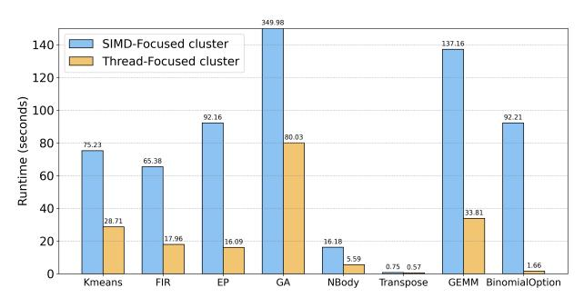

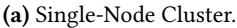

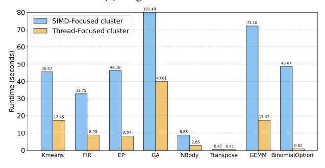

(b) 2-Node Cluster.

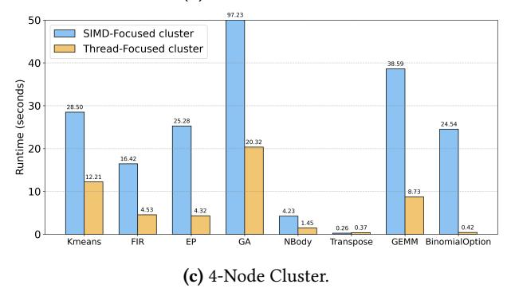

Figure 13. Runtime in SIMD/Thread-Focused clusters.

a CPU thread, effectively replacing a GPU Streaming Multiprocessor (SM) with a CPU core. Since GPU SMs and CPU cores have different computational capacities, workloads optimized for an SM may not be well-suited for a CPU core.

However, in practical GPU programs, developers often hard-code block sizes to control resource utilization within a GPU SM, such as shared memory and registers. These hardcoded values create challenges when attempting to modify the number of blocks through compiler transformations.

Therefore, we suggest developing a more flexible GPU programming framework that enables the adjustment of GPU block workloads through compiler transformations. Such a framework would not only facilitate GPU-to-CPU migration but also benefit other portable programming solutions.

SIMD Optimization: CPUs leverage both data-parallelism and thread-parallelism to achieve high performance. However, our evaluation reveals that utilizing data-parallelism in transformed CPU programs is more challenging.

In the transformed CPU programs, a GPU thread is replaced by an iteration of a for-loop. To achieve high performance, each GPU thread should ideally be executed by a lane of an SIMD instruction. Although these iterations are independent, applying SIMD optimization to such forloops remains challenging. This is because these parallel for-loops are usually the outermost loops in transformed CPU programs, whereas SIMD instructions are most suitable for parallelizing inner loops. Additionally, Han et al. [\[23\]](#page-12-8) suggest that transformed CPU programs often involve complex control flow and data flow, making them difficult for static analysis.

In our evaluation, we observed that Thread-Focused CPUs typically achieve higher performance than SIMD-Focused CPUs, even when both have the same peak theoretical performance. This observation highlights the need for developing SIMD optimizations tailored for CPU programs transformed from GPU programs.

## 8.4 Cost and Energy Aspects

Our solution proposes a way to utilize idle CPU resources to alleviate the GPU shortage. It is important to note that idle CPUs have non-negligible energy consumption [\[30,](#page-12-24) [36\]](#page-13-9). Consequently, cloud providers often offer spot services at discounted rates [\[25,](#page-12-25) [31\]](#page-12-26), encouraging users to leverage these idle resources. Based on these observations, we believe our solution, which offers a new way to utilize idle CPUs, provides an attractive option for saving energy and reducing costs in data centers.

