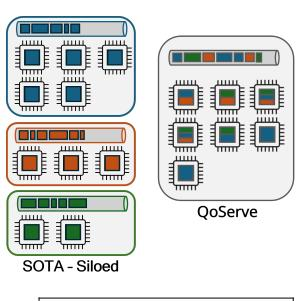
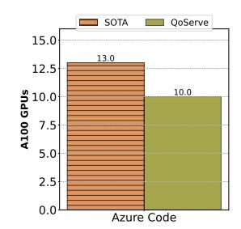
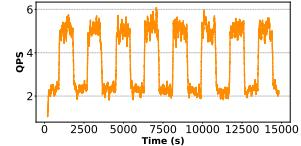
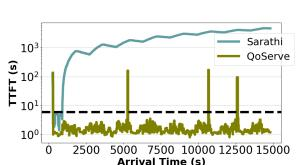

# Ramachandran Ramjee Microsoft Research Bengaluru, India ramjee@microsoft.com

#### **Abstract**

The widespread adoption of Large Language Models (LLMs) has enabled diverse applications with very different latency requirements. Existing LLM serving frameworks rely on siloed infrastructure with coarse-grained workload segregation — interactive and batch — leading to inefficient resource utilization and limited support for fine-grained Quality-of-Service (QoS) differentiation.

We present QoServe, a novel QoS-driven inference serving system that enables efficient co-scheduling of diverse workloads on shared infrastructure. QoServe introduces fine-grained QoS classification allowing applications to specify precise latency requirements, and dynamically adapts scheduling decisions based on real-time system state. Leveraging the predictable execution characteristics of LLM inference, QoServe implements dynamic chunking to improve overall throughput while maintaining strict QoS guarantees. Additionally, QoServe introduces hybrid prioritization to balance fairness and efficiency, and employs selective request relegation for graceful service degradation during overloads. Our evaluation demonstrates that QoServe increases serving capacity by 23% compared to current siloed deployments, while maintaining QoS guarantees on an A100 cluster, and improves per-replica goodput by up to 2.4x compared to Sarathi on a shared cluster. Notably, under extreme load, our system reduces SLO violations by an order of magnitude compared to current strategies.

CCS Concepts: • General and reference  $\rightarrow$  Reliability; Metrics; • Computing methodologies  $\rightarrow$  Neural networks; • Software and its engineering  $\rightarrow$  Software reliability; Scheduling.

*Keywords:* Large Language Models; Quality of Service; Inference serving; Scheduling; Reliability

This work is licensed under a Creative Commons Attribution 4.0 International License.

ASPLOS '26, Pittsburgh, PA, USA
© 2026 Copyright held by the owner/author(s).
ACM ISBN 979-8-4007-2359-9/2026/03
https://doi.org/10.1145/3779212.3790206

Figure 1. Efficiency of QoServe under uniform load and transient overload. (top left) Illustration of QoServe coscheduling vs current siloed deployments. (top right) A100 GPUs needed to serve a fixed load of 35QPS while meeting the QoS targets of requests divided equally among 3 QoS tiers in a real cluster. QoServe improves efficiency by 23% compared to the state-of-the-art Sarathi [4] siloed deployment. (bottom left) Bursty overload scenario. (bottom right) QoServe maintains low latency while SOTA scheduling succumbs to cascading deadline violations under bursty loads.

#### **ACM Reference Format:**

Kanishk Goel, Jayashree Mohan, Nipun Kwatra, Ravi Shreyas Anupindi, and Ramachandran Ramjee. 2026. QoServe: Breaking the Silos of LLM Inference Serving. In *Proceedings of the 31st ACM International Conference on Architectural Support for Programming Languages and Operating Systems, Volume 2 (ASPLOS '26), March 22–26, 2026, Pittsburgh, PA, USA.* ACM, New York, NY, USA, 16 pages. https://doi.org/10.1145/3779212.3790206

## 1 Introduction

Large language models (LLMs) have transformed applications across diverse domains including conversational assistants, coding assistants, content generation, and summarization. These applications can have very different latency requirements — for example, autocomplete coding assistants

demand responses within milliseconds, while summarization tasks can reasonably tolerate longer latencies. As LLM deployments scale to serve billions of users and diverse applications, inference serving systems must efficiently handle this diverse spectrum of latency requirements while ensuring high GPU utilization.

Current LLM serving solutions primarily adopt a coarsegrained categorization, segregating requests into two broad service classes: latency-sensitive interactive applications, and throughput-oriented batch processing, and serve them independently [9]. Interactive requests are typically served with smaller prefill chunks [4] to minimize latency, but that can result in relatively higher operational costs due to reduced throughput (e.g., 28% lower as shown in Figure 4). Batch requests, on the other hand, employ larger chunks to achieve higher throughput as latency is not a constraint. This siloed deployment, however, creates other inefficiencies: it leads to significant GPU resource under-utilization, as workload demands fluctuate across the two classes. Moreover, such partitioning inhibits the introduction of more QoS classes with fine-grained latency requirements, as doing so further exacerbates the partitioning inefficiencies.

Furthermore, current inference systems struggle under load fluctuations and overload conditions. Typical scheduling mechanisms such as first-come-first-served (FCFS) indiscriminately delay all incoming requests under overload, degrading user experience across the board. Alternatively, naïve throttling approaches reject all new incoming requests when reaching capacity, ignoring their QoS requirements or relative priorities. Neither strategy adequately manages the complex trade-offs between throughput, latency, and fairness during such demand surges.

In this paper, we present QoServe, a QoS-driven LLM inference serving system that addresses these limitations through two key ideas. First, QoServe supports fine-grained QoS classes which allows applications to precisely specify their latency requirements. Multiple QoS classes are served efficiently by co-scheduling requests with diverse QoS targets on a shared rather than siloed infrastructure. Second, QoServe implements a hybrid prioritization and an eager relegation policy that allows graceful service degradation during overload conditions. Figure 1 compares QoServe to state-of-the-art Sarathi-Serve [4] siloed deployment, demonstrating significant performance improvements.

Efficiently supporting multiple QoS classes on a shared serving instance poses significant challenges. One approach is to use the smallest chunk size necessary to meet the latency constraint of the strictest QoS class on all serving instances. However, this would result in low throughput [4] and high cost for all service classes. Instead, QoServe leverages the unique execution characteristics of LLM inference – particularly the distinct prefill and decode phases and the inherent predictability of the prefill phase – to dynamically adjust

chunk sizes based on the observed system state and individual QoS targets. Co-serving multiple QoS classes allows us to exploit *deadline slack* of requests with relaxed latency requirements to schedule bursts of larger chunk sizes, thereby increasing throughput opportunistically.

For managing overload conditions gracefully, QoServe employs a hybrid prioritization and an eager relegation policy. Simple overload handling approaches like shortest-jobfirst (SJF) manage overload by prioritizing short requests. This helps reduce load due to the quadratic dependence of request length on LLM system load [17]. However, SJF neglects the QoS requirements of longer jobs, leading to SLO violations even at low load (Figure 2). On the other hand, Earlier Deadline First (EDF) scheduling is optimal under low load but suffers excessive violations even when load is slightly higher than capacity. Thus, QoServe introduces a hybrid policy that smoothly interpolates between EDF and SJF, allowing deployments to minimize SLO violations across both low and high load. Additionally, QoServe proactively employs eager relegation, selectively degrading service for a small subset of requests to ensure stable performance, even under extreme load conditions. In multi-QoS scenarios, QoServe leverages application-provided hints about request importance, such as whether a request originates from a free or paid tier, to perform relegation. This ensures that lower-priority requests are affected first during overload conditions, allowing the system to maintain QoS for the majority of high-priority requests. Our evaluations show that during significant overload scenarios (50% above capacity), QoServe consistently meets latency targets for over 95% of requests, translating into substantial cost savings and enhanced user experience across diverse applications relying on LLM infrastructure.

Our work makes the following key contributions:

- 1. We develop a QoS-aware adaptive scheduling algorithm that exploits the unique characteristics of LLM inference to co-schedule requests belonging to multiple QoS classes on shared infrastructure, improving throughput while maintaining latency guarantees.
- 2. We design and implement a hybrid prioritization and eager relegation policy that minimizes SLO violations under both optimal load and overload conditions.
- We evaluate QoServe across workloads and scenarios, demonstrating up to 32% higher serving capacity while meeting QoS guarantees compared to baseline.

The rest of the paper is structured as follows. (§2) outlines the need for QoS-based serving systems and (§3) details the architecture and implementation of QoServe. (§4) presents our evaluation methodology and results.

