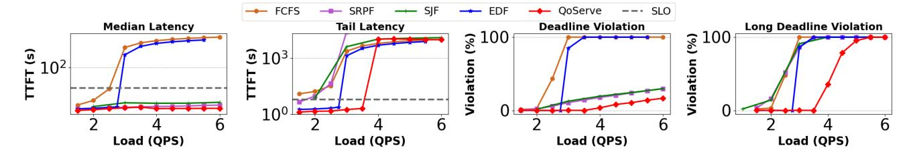
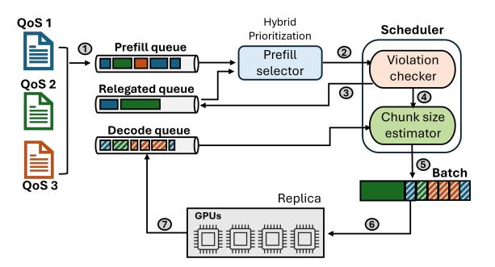

# 2 Background and Motivation

#### 2.1 LLM Inference

Large language model (LLM) inference is fundamentally different from traditional computing workloads, characterized

Figure 2. Comparison of traditional policies for multi-SLA scheduling. The graphs plot the latency and violations in the strictest QoS class. FCFS breaks down very quickly because urgent requests can be stalled by non-urgent ones. Deadline-aware policies like EDF are better than FCFS, but cannot gracefully degrade at high loads because of intense queue buildup. SJF/SRPF on the other hand can maintain QoS in the median case but violates SLOs of the majority of long jobs even at a low load of 2.5 QPS. QoServe interpolates smoothly between SJF and EDF and minimizes violations across all load conditions.

by two distinct computational phases that significantly impact system design: the prefill and decode stages. During the prefill phase, the entire input prompt is processed simultaneously, making it computationally intensive. The subsequent decode phase generates output tokens auto-regressively, with each token's generation depending on the previously generated tokens.

Scheduling. In this work, we assume co-located LLM inference scheduling as seen in popular serving frameworks like vLLM [\[11\]](#page-14-1) and SGLang [\[21\]](#page-14-2) where prefills and decodes of a request are executed on the same replica using chunked prefills [\[4\]](#page-13-0) for better serving efficiency. Chunked prefills split a prefill request into equal-sized chunks, allowing for efficient batching and scheduling without pausing ongoing decodes. This approach helps balance the trade-off between throughput and latency, and is used as a standard scheduling practice in production systems [\[18\]](#page-14-3).

Latency metrics. LLM inference encompasses three primary latency metrics, which serve as critical performance indicators across different application types:

- 1. Time to First Token (TTFT). This metric captures the initial response latency, measuring the duration from request submission to generating the first output token. For interactive applications like chatbots and coding assistants, TTFT is crucial as it directly influences user perception of system responsiveness.
- 2. Time Between Tokens (TBT). This metric measures the interval between the generation of consecutive output tokens of a request, and affects the overall perceived fluidity of the response which is particularly important for interactive applications where users expect a smooth, uninterrupted stream of generated content.
- 3. Time to Last Token (TTLT). This metric focuses on the total time required to complete the entire generation process. TTLT is particularly relevant for non-interactive, batch-oriented applications such as document summarization, comprehensive research analysis, or offline content generation. In these scenarios, the overall completion time

matters more than the speed of initial response or tokenby-token generation.

The application's nature determines which of these metrics take priority. User-facing, interactive applications critically depend on both TTFT and TBT, as these metrics directly impact user experience and perceived system responsiveness. In contrast, non-interactive applications primarily concern themselves with TTLT, prioritizing the total time to generate a complete output over the speed of initial token generation.

## 2.2 Production Deployment Landscape

Due to the fundamental differences in workload characteristics and performance requirements between these application types, current industrial practices for LLM inference deployment predominantly employ a siloed infrastructure model [\[9\]](#page-13-1), maintaining two distinct GPU clusters: (1) a dedicated fleet for latency-sensitive, interactive requests, and (2) a separate cluster for batch processing and background jobs.

Overload management. When faced with traffic exceeding capacity, current systems employ limited and often ineffective overload management techniques.

- 1. Rate Limiting: These mechanisms simply reject excess requests without considering their relative importance or potential impact.
- 2. Short Request Prioritization: These techniques favor shorter requests, which can unfairly disadvantage longer but potentially more important queries.

Such approaches are unable to provide application-aware or graceful service degradation, resulting in either uniform performance degradation across workloads or complete rejection of a class of requests without any fairness guarantees.

#### 2.3 Deployment Challenges

Current LLM deployments create significant operational inefficiencies due to the siloed infrastructure model.

Resource provisioning and utilization. As workload demands fluctuate, dedicated clusters often operate well below their maximum capacity, resulting in substantial resource underutilization. An interactive cluster might be overwhelmed

during peak hours, while a batch processing fleet remains largely idle, leading to inefficient computational resource allocation. The complexity intensifies when supporting applications with multiple different latency requirements. Each unique performance profile potentially necessitates a dedicated infrastructure cluster, which can increase operational complexity significantly. What begins as a straightforward architectural decision quickly transforms into a management challenge, with each new cluster introducing additional capacity provisioning challenges and monitoring overhead.

Lack of graceful service degradation. Existing mechanisms for overload management, such as user rate limiting and prioritizing short requests, are often unfair and not application-aware, and thus lack an ability to gracefully degrade QoS. These techniques can lead to poor user experiences and inefficient resource utilization.

#### 2.4 Analysis of Multi-SLA scheduling policies

A practical approach to mitigating the operational complexities and resource inefficiencies of siloed infrastructure is to co-schedule requests from various applications within a unified cluster. In this section, we examine the effects of traditional scheduling policies from the literature on multi-tenant scheduling and assess their performance for LLM inference across three key dimensions: latency, SLO violations, and the fairness of SLO violations. This analysis highlights the necessity for a novel multi-tenant, SLO-aware scheduling policy tailored for LLM inference.

Scheduling policies. We compare four different scheduling policies from the literature for multi-tenant systems. First-Come-First-Served (FCFS) represents the most basic approach, processing requests in the order they arrive. More advanced policies include Shortest Job First (SJF), which prioritizes jobs with the shortest expected execution time, and Shortest Remaining Prompt First (SRPF), which continuously re-evaluates and preempts jobs to minimize overall waiting time, based on the outstanding prompt tokens to be processed. Finally, Earliest Deadline First (EDF) schedules jobs based on their impending deadlines.

Figure [2](#page-2-0) compares the multiple scheduling policies and plots the (a) median and (b) p99 latency of requests in the system, (c) percentage of requests that violated their SLO, and (d) the number of long requests (requests with prompt length in the 90th percentile of the dataset) that violated their SLO. Despite their theoretical foundations, we observe that these scheduling approaches fundamentally struggle when applied to large language model (LLM) inference workloads. QoServe exploits the unique computational characteristics of LLMs — including variable input complexity, distinct prefill and decode phases, and the predictability of the prefill phase to devise an SLO-aware scheduling policy which minimizes latency and SLO violations while maximizing throughput, as we show in our evaluations (figs. [10](#page-9-0) and [11\)](#page-10-0).

Figure 3. Overview of QoServe

Summary. In this paper, we address these critical infrastructure challenges by introducing a QoS-aware serving framework, QoServe. Our system transforms LLM inference serving from a static, siloed approach to a dynamic, applicationaware computational system. By introducing sophisticated service level objective (SLO) management, QoServe enables more efficient, responsive, and cost-effective infrastructure for next-generation AI applications.

