# <span id="page-3-0"></span>3 QoServe: Design and Implementation

QoServe is designed to efficiently manage concurrent LLM inference requests with diverse QoS requirements, while maximizing resource utilization across the shared infrastructure. We address the limitations outlined earlier by dynamically adapting scheduling decisions based on real-time system state and QoS targets of the in-flight requests.

## 3.1 Overview

The architecture of QoServe is shown in Figure [3.](#page-3-1) A request in QoServe can be in one of three queues — 1) prefill queue, 2) decode queue, or 3) relegated queue. 1 When a request enters the system, it is put into the prefill queue. In each iteration, QoServe constructs a batch consisting of all requests in the decode queue and a prefill-chunk from a request in the prefill queue. The prefill selector uses hybrid prioritization to select the prefill request for the current batch. 2 The violation checker module validates that the chosen request has not already violated (or will not violate) its QoS targets in the current iteration. 3 If it does, it is eagerly moved into the relegated queue and a different prefill request is chosen. The relegated requests are serviced opportunistically during periods of lower system load, ensuring eventual completion without permanent rejection; while enabling graceful degradation under overload conditions. 4 A lightweight predictor is then used to estimate the latency of the batch to make sure that the QoS targets are not violated, while maximizing the chunk size for efficiency. 5 A mixed batch of prefill and decode tokens is constructed using the chosen prefill chunk and the requests in the decode queue, which is then

<span id="page-4-0"></span>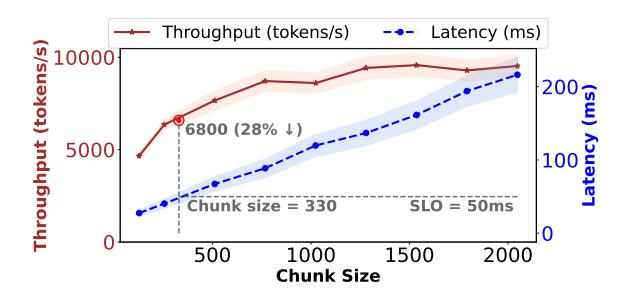

**Figure 4.** Performance characteristics as a function of chunk size, showing the throughput-latency tradeoff.

**(6)** dispatched to the execution engine on the GPU for processing. **(7)** Once the prefill portion of a request is completed, it is moved to the decode queue, and subsequent iterations continue.

#### 3.2 QoS Classes and Deadlines

QoServe defines two QoS classes: interactive and non interactive. Interactive requests use two SLOs — TTFT (time to first token) and TBT (token-by-token latency), which ensure immediate responsiveness and consistent pacing. Non-interactive requests have a single TTLT (total latency) target, focused on overall completion. Although, we define two QoS classes, the application owner is free to specify their custom SLO targets within the class, allowing for flexibility and customization to specific application needs as shown in Table 3.

The deadline for each request is determined based on its QoS class. For the interactive QoS class, following the approach in [2], the deadline for the first token is defined as:

$$D_{first} = t_{arrival} + SLO_{TTFT}, \tag{1}$$

while subsequent tokens' deadlines are calculated using:

<span id="page-4-1"></span>
$$D_n = t_{arrival} + SLO_{TTFT} + (n-1) \cdot SLO_{TBT}, \tag{2}$$

where n is the token position. For non-interactive requests a deadline is set only for the full completion of the request as:

$$D_{total} = t_{arrival} + SLO_{TTLT} \tag{3}$$

Once we have defined the deadlines for each request, QoServe scheduling aims to minimize deadline violations while maximizing throughput.

#### 3.3 Dynamic Chunking

State-of-the-art LLM inference serving frameworks [4, 11] serve requests using chunked-prefills, where each iteration processes a fixed number of tokens (called chunk size), which includes both prefill and decode tokens from different requests using fused prefill-decode MLP to improve the compute efficiency of memory-bound decode phase [5]. However, this involves a fundamental trade-off between throughput and latency – a larger chunk results in better throughput

but increases the TBT of the decodes in the batch. This is illustrated in Figure 4.

A naïve approach for co-scheduling jobs of different QoS classes with deadlines on TTFT, TBT, and TTLT would be to use the smallest chunk size necessary to meet the latency constraint of the strictest QoS class. However, this results in low throughput and high cost for all service classes.

QoServe employs *dynamic chunking* to opportunistically maximize the chunk size for the prefill request by exploiting any slack in the deadlines of the requests being currently serviced. For each request in the decode queue, we define slack as the difference between the deadline for the next token (Eq. 2) and current time. Using this slack and characteristics of the requests in decode phase, we calculate the chunk size which maximizes throughput under the given latency budget. We elaborate on the design in Section 3.6.1

#### 3.4 **QoServe Scheduling**

While dynamic chunking allows us to choose an optimal chunk size for a prefill request, we also need to decide which request from the prefill queue should be processed in the current scheduling iteration.

Hybrid Prioritization. As shown in Figure 2, existing scheduling policies struggle with LLM workloads at higher loads. For example, EDF which prioritizes requests with earlier deadline has very low deadline violation rates (Figure 2(c)) at low loads, but the violation rates spike to almost 100% once the load exceeds a certain threshold. On the other hand, policies which prioritize short work requests — SRPF and SJF — handle higher loads much better but are worse than EDF at lower loads. Further, SRPF and SJF achieve this at the expense of unfairly penalizing long jobs (Figure 2(d)) without any regard to the request priorities. To handle varying load conditions which are common in production services and maintain fairness across requests, our first key insight is a *hybrid prioritization* scheme which interpolates between SRPF and EDF. This allows us to get EDF characteristics at low loads, and leverage SRPF semantics under overload conditions while maintaining fairness.

To implement this scheduling, QoServe smoothly interpolates between EDF and SRPF to compute the priority of a request. For interactive requests, the priority is computed by taking a linear combination of the TTFT deadline (this incorporates EDF semantics) and the estimated time taken which will be needed to process the remaining prefills (this incorporates SRPF semantics) of the request as:

<span id="page-4-2"></span>
$$P^{i} = t_{arrival}^{i} + SLO_{TTFT}^{i} + \alpha * Prefill_{rem}^{i}.$$
 (4)

Note that we only consider the TTFT deadline, as TBT deadlines are maintained by our dynamic chunking scheme. For non-interactive requests, the priority is computed as

$$P^{i} = t^{i}_{arrival} + SLO^{i}_{TTLT} + \alpha * (Prefill^{i}_{rem} + Decode^{i}_{rem}), (5)$$

<span id="page-5-0"></span>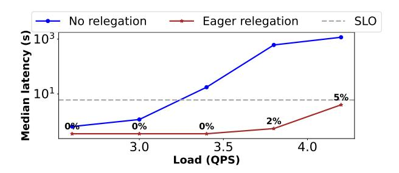

**Figure 5.** Proactively relegating a small percentage of requests enormously helps in maintaining the quality of service for the median request in the system, which otherwise grows exponentially due to a cascade of violations.

where  $Decode_{rem}$  indicates the time to compute all the decode tokens. Since decode length is unknown in LLM inference, this introduces a challenge in modeling the priority of non-interactive requests. We address this with a simple insight — for non-interactive jobs, the TTLT deadline is typically much greater than the actual processing time. Therefore, given an application, we can use historic information on the decode tokens generated by that application and over-approximate it by two standard deviations. We show in (\$4.4.1) that this simple prediction sufficiently captures the priority of non-interactive jobs.

Eager Relegation. Our hybrid prioritization strikes a balance between minimizing deadline violations and fairness. However, as shown in Figure 5, under overload conditions, QoServe (or any scheduling policy) still cannot service all incoming requests at the desired QoS SLOs. Our second key insight is that by eagerly relegating a small fraction of requests that we know will miss their deadlines, one can provide stable performance for the majority, enabling graceful service degradation under overload conditions. The key idea is simple — if a request has already violated its TTFT / TTLT deadline, or is about to violate it in the current iteration, then QoServe de-prioritizes this request into a relegated queue. In multi-tenant deployments, we also use application hints such as free vs paid tier to preferentially relegate low-priority requests to ensure stability of service to the high priority ones. Only when there are no more low-priority requests, OoServe proactively relegates high-priority requests that have violated their deadlines to prevent cascading deadline violations. This enables graceful degradation of service even under extreme load. As shown in Figure 5, by relegating just 5% of the requests, we can maintain latency SLOs even under very high overload conditions.

**Selective Preemption.** Note that our *hybrid prioritization* scheduling can preempt an in-flight request for which a few prefill chunks have already been processed to instead service a new request with strict QoS target (see eq 4). Preemption

#### <span id="page-5-1"></span>Algorithm 1 Dynamic Batch Creation Algorithm

```
1: function CREATE_BATCH
        selected\_jobs \leftarrow GET\_ALL\_DECODES
 3:
        batch decode context ← GET DECODE CONTEXT(selected jobs)
 4:
        num decodes ← selected jobs
 5:
        min decode slack ← GET MIN SLACK(selected jobs)
 6:
7:
        // Below invokes the predictor model to find dynamic chunk size
        C ← GET PREFILL BUDGET(num decodes, batch decode context, min decode slack)
 8:
        job_queue ← PRIORITY_QUEUE(COMPARATOR)
        prefill\_token\_count \leftarrow 0
 9:
10:
         while prefill_token_count < C do
11:
            top job \leftarrow job queue.TOP
            if WILL_VIOLATE(top_job) then
12:
13:
                UPDATE_RELEGÂTE_STATUS(top_job, true)
                job_queue.PUSH(top_job)
14:
15:
                continue
16:
            else
                \textit{curr\_job\_tokens} \leftarrow \textit{min}(C - \textit{prefill\_token\_count}, \textit{REM\_TOKENS}(\textit{top}))
17:
18:
                prefill\_token\_count \leftarrow prefill\_token\_count + curr\_job\_tokens
19:
                top\_job.prefill\_tokens\_taken \leftarrow curr\_job\_tokens
20:
                selected_jobs.APPEND(top_job)
21:
                job queue.POP
22:
            end if
23:
        end while
24:
        PROCESS_BATCH(selected_jobs)
25: end function
26: function COMPARATOR(job1, job2)
27:
        if job1.drop_status ≠ job2.drop_status then
28:
            return\ job1.drop\_status < job2.drop\_status
29.
30:
        priority1 \leftarrow job1.arrival\_time + job1.TTFT\_SLO + \alpha \times job1.rem\_prefill\_tokens
31:
        priority2 \leftarrow job2.arrival\_time + job2.TTFT\_SLO + \alpha \times job2.rem\_prefill\_tokens
        return priority1 < priority2
```

is a desirable capability as it avoids head-of-line blocking of small interactive requests behind long batch requests. However, in LLM serving, the memory overhead of preemption can be significant as the KV-cache of requests can be large. To avoid this, QoServe uses *selective preemption*, where we preempt a request to accommodate another with a higher priority only if (1) the in-flight request is in the prefill queue (i.e., requests in the decode queue are never preempted), and (2) preempting that request for an iteration does not lead to deadline violation. We do not preempt requests in the decode queue as TBT targets are typically strict (10s of ms), and thus preempting them significantly increases the chances of TBT violation. This also ensures that the KV-cache for each request remains in the GPU for the shortest necessary duration, thereby minimizing memory pressure. The pseudocode for hybrid batch creation and prioritization in QoServe is presented in Algorithm 1.

#### 3.5 An Illustrative Example

Figure 6 illustrates QoServe with an example of five requests (A-E) across 3 QoS buckets. A is an interactive request while others are non-interactive. State-of-the-art LLM schedulers like vLLM [11] and Sarathi [4] will execute each iteration using a fixed chunk size and process requests in arrival order (FCFS). Our solution introduces two key improvements.

First, we prioritize requests based on their QoS targets using our hybrid prioritization, which will prioritize request *A* before *D* due to its earlier deadline. Second, we dynamically adjust chunk sizes based on accumulated slack. For example,

<span id="page-6-2"></span>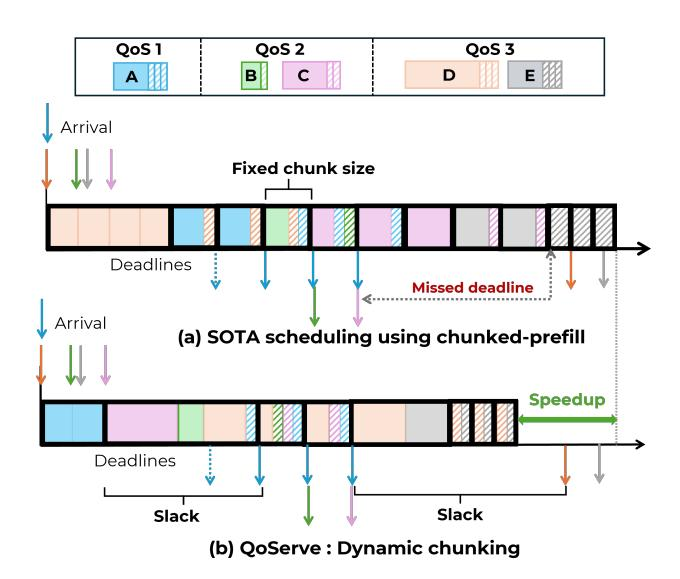

**Figure 6.** An illustration of how QoServe improves throughput using dynamic chunking compared to SOTA scheduling.

after A's prefill phase completes earlier than its deadline, it accumulates significant slack before its next token is due. We exploit this slack by dynamically increasing the chunk size, adding more prefill tokens from requests B and D (which have the earliest deadlines in the queue), thereby improving throughput without violating any ongoing request deadlines.

When the interactive job A enters its decode phase, we revert to the original smaller chunk size necessary to meet its TBT, though we still exploit slack accumulated if decoding completes faster than predicted. Once A completes and no remaining requests impose strict TBT constraints, we again increase chunk size to maximize throughput while respecting the TTLT deadlines of ongoing requests. This approach effectively leverages the deterministic execution characteristics of LLMs to dynamically optimize chunk sizes during runtime, balancing throughput and deadline requirements.

#### 3.6 Implementation

We implemented QoServe by extending the Sarathi scheduler [4], which is built on top of the vLLM inference system [11]. The implementation focuses on enhancing the scheduler component while maintaining compatibility with vLLM's efficient tensor parallelism and PagedAttention mechanisms. We extended the vLLM API to associate each inference request with its corresponding QoS requirements (TTFT, TBT, and/or TTLT) and priority level during request submission. The hybrid prioritization policy is implemented using a priority queue that incorporates both deadline proximity and estimated processing time, with the interpolation factor  $\alpha$  configurable as a deployment parameter. For non-interactive requests, we maintain a running history of token generation patterns per application to estimate the expected

decode length.  $\alpha$  is a configurable hyperparameter. For fixed-QPS runs, we perform an offline sweep of  $\alpha$  values from 0 to 10 and select the value that minimizes SLO violations. An  $\alpha$  of 8 ms/token provided the best trade-off, reducing violations without affecting tail latency. For variable-QPS, we employ load-adaptive tuning. At low loads, we set  $\alpha=1$  ms/token as Figure 14 shows that smaller values achieve comparable violation rates and median latency while limiting tail latency. This optimizes tail latency at low loads while minimizing deadline violations at high loads. To support multi-tenant deployments, we add a priority field to each request that enables relegation decisions based on application hints such as free-tier versus premium users.

<span id="page-6-1"></span>**3.6.1 Dynamic chunking batch predictor.** Given the statistics of the requests in a batch, e.g. number of requests, context lengths, etc., the dynamic chunk size predictor determines the optimal chunk size that maximizes throughput while adhering to the latency constraints. For this, we train a lightweight random forest model which predicts the execution time of a given batch. The model is trained on latency profiles of MLP and attention operation collected at varying chunk sizes, batch sizes as well as context lengths. To collect this data, we use a lightweight harness exposed by an inference simulator Vidur [3], and collect profiles for each model, hardware, and parallelism configuration of interest.

The prediction runs on the CPU and incurs a negligible overhead with < 10% error margin on chunk size prediction. We tune the model to err on the side of under-predicting chunk size. While this may scarcely miss on fully maximizing throughput; it ensures no inadvertent latency increase due to over-prediction. Modifying the chunk size at runtime incurs no additional cost — simply requiring pulling appropriate number of tokens from the pending prefill queue. (§4.1.4) illustrates how dynamic chunking adapts to varying slack under load and dynamically tunes chunk size per iteration.

## <span id="page-6-0"></span>4 Evaluation

Our evaluation aims to answer the following questions.

- 1. What is the improvement due to QOSERVE in the serving capacity while meeting specified QoS SLOs at a cluster scale (§4.1.1), with PD (Prefill-Decode) colocation (§4.1.2), and with PD disaggregation (§4.1.3), and the impact of dynamic chunking (§4.1.4)?
- 2. What is the impact of QoServe on request latencies and deadline violations under high load conditions (§4.2)?
- 3. How does QoServe react to transient load spikes (§4.3)?
- 4. What is the independent impact of the different optimizations and design choices used in QoServe, impact of varying workload compositions and SLOs (§4.4)?
- 5. How does QoServe empirically and qualitatively compare to other relevant concurrent work (§4.5)?

<span id="page-7-2"></span>

| Model      | GPU (TP)          | Attention |
|------------|-------------------|-----------|
| Llama3-8B  | A100 - 80GB (TP1) | GQA       |
| Qwen-7B    | A100 - 80GB (TP2) | MHA       |
| Llama3-70B | H100 - 80GB (TP4) | GQA       |

<span id="page-7-3"></span>Table 1. Model configurations and hardware setup

|            |      | Prompt tokens | Decode tokens |     |
|------------|------|---------------|---------------|-----|
| Dataset    | p50  | p90           | p50           | p90 |
| ShareGPT   | 1730 | 5696          | 415           | 834 |
| Azure Conv | 928  | 3830          | 41            | 342 |
| Azure Code | 1930 | 6251          | 8             | 43  |

Table 2. Datasets used in evaluation

Models and Hardware. We evaluate QoServe across three different models, tensor parallel (TP) degrees, two hardware platforms, and attention mechanisms to demonstrate the diversity and generality of our results across models and hardware configurations, as shown in Table [1.](#page-7-2) Our evaluation spans three different datasets with varying ratios of prefill to decode tokens, as shown in Table [2.](#page-7-3)

Workloads and QoS Tiers. For workloads, we use popular open-source datasets such as ShareGPT [\[19\]](#page-14-4) and coding and conversation production traces from multiple LLM inference services in Azure [\[15\]](#page-14-5). Request arrival times are generated using a Poisson distribution, [\[4,](#page-13-0) [13\]](#page-14-6), while maintaining the prefill and decode token counts of the respective traces. To emulate different applications, we divide the dataset into three equal parts, and assign each part with a different application type and the corresponding QoS bucket and SLO. We consider three QoS buckets: one interactive and two non-interactive, as shown in Table [3.](#page-7-0)

We selected the SLO targets to be representative of three key production workloads at a large cloud provider (<retracted>): Q1: O (ms) – interactive responses (e.g. chat applications), Q2: O (minutes) — user-facing but relaxed SLO (e.g. video summaries), and Q3: O (hours) – batch processing (e.g. email insights). For interactive applications, the SLOs track the TTFT and TBT latency metrics, while for noninteractive applications we only track TTLT. In the first set of experiments, we assume an equal mix of requests from these three representative application categories (33% each). Furthermore, to demonstrate resilience to the choice of workload split and SLOs, we also evaluate QoServe with varying workload composition and SLO targets in ([§4.4.2\)](#page-11-2).

Baselines. We built QoServe on top of Sarathi-Serve [\[4\]](#page-13-0), which itself extends vLLM [\[11\]](#page-14-1). Our evaluation includes several baseline configurations: (1) Sarathi-Silo (SOTA), the State-of-the-art siloed deployment where each QoS bucket is assigned an independent GPU cluster with each replica running a Sarathi scheduler (2) Sarathi-FCFS, which coschedules requests across all QoS Tiers on a unified cluster

<span id="page-7-0"></span>

| QoS    | Request | Interactive |         | Non-interactive |
|--------|---------|-------------|---------|-----------------|
| bucket | ratio   | TTFT(s)     | TBT(ms) | TTLT(s)         |
| Q1     | 33.33%  | 6           | 50      | -               |
| Q2     | 33.33%  | -           | -       | 600             |
| Q3     | 33.33%  | -           | -       | 1800            |

Table 3. QoS classes and workload composition

using Sarathi with FCFS policy, and (3) Sarathi-EDF, which again co-schedules but also imparts deadline-awareness during scheduling by using the Earliest Deadline First policy on Sarathi. The strictest QoS bucket with 50ms TBT deadline uses a chunk size of 256, while the other two QoS classes use a large chunk size of 2K to maximize throughput in the siloed baselines. For shared cluster baselines, the chunk size chosen is 256, to meet the TBT targets of the strictest tier.

By default, all experiments are run with PD colocation with chunking enabled, except in ([§4.1.3\)](#page-8-2) where the experiments are run with PD disaggregation. We evaluate different scheduling policies within the same serving framework (vLLM) to isolate algorithmic improvements from implementation artifacts. This approach ensures fair comparison by eliminating performance variations due to different system implementations. Since Sarathi demonstrates superior throughput over vanilla vLLM through chunking, we do not present the non-chunked vLLM baseline.

Setup. We first evaluate QoServe under uniform load conditions to identify the impact of our design on goodput ([§4.1\)](#page-7-4) as well as on latency and SLO violations ([§4.2\)](#page-9-1). Next, we evaluate how QoServe performs under transient spikes in load ([§4.3\)](#page-10-1), and finally we perform detailed ablation of our individual techniques ([§4.4\)](#page-11-1).

#### <span id="page-7-4"></span>4.1 Capacity and Goodput at Regular Load

<span id="page-7-1"></span>4.1.1 Cluster-scale evaluation. We evaluate QoServe over a cluster of 16 A100 GPUs (4 nodes, 4 GPUs per node) with pairwise NVLink and 80GB memory per GPU. Table [4](#page-8-3) presents the results for serving the Az-Code trace at 35 QPS across 360K requests (equally split among 3 QoS classes as shown in Table [3\)](#page-7-0) using Llama3-8B. The silo baseline allocates dedicated replicas based on capacity estimation from per-replica throughput for each QoS tier: 7 replicas for Q1 and 3 each for Q2 and Q3, totaling 13 GPUs. In contrast, QoServe meets the latency SLOs at each tier, with no deadline violations using 10 mixed-workload replicas. Both deployments use round-robin load balancing across replicas.

QoServe achieves comparable p99 latencies and no deadline violations with 23% fewer GPUs. To validate QoServe's resource efficiency, we reduce the silo allocation to match QoServe's GPU count (6,2,2 replicas), which causes violations to surge to 60.4%. An alternate 4,3,3 allocation faces approximately 95% Q1 violations with p99 latency of 385.36s.

<span id="page-8-4"></span>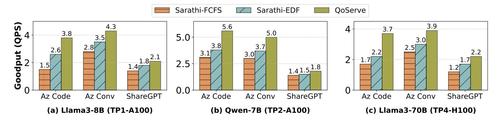

Figure 7. Maximum goodput per replica in a shared cluster across models, hardware, and datasets

<span id="page-8-3"></span>

| Scheme       | Total | p99 Latency in s (SLO) |          |           | Overall    |
|--------------|-------|------------------------|----------|-----------|------------|
| (GPUs)       | GPUs  | Q1(6s)                 | Q2(600s) | Q3(1800s) | violations |
| Silo-(7,3,3) | 13    | 3.09                   | 172.84   | 171.11    | 0.24%      |
| Silo-(6,2,2) | 10    | 11.39                  | 4681.56  | 4678.17   | 60.4%      |
| QoServe-(10) | 10    | 3.38                   | 55.79    | 204.61    | 0%         |

**Table 4.** Cluster-scale experiments

<span id="page-8-5"></span>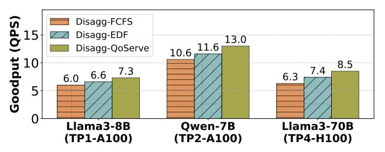

**Figure 8.** Goodput with PD disaggregation

QoServe achieves better resource efficiency than siloed deployments by maximizing throughput while meeting QoS targets through dynamic chunking. Since the lengths of requests (prompt length as well as number of decode tokens) can vary over time, even at uniform QPS the compute load on the serving system varies. QoServe benefits from dynamically increasing chunk size by exploiting any deadline slack of the non-interactive QoS requests as well as any slack of interactive requests during lower load. On the other hand, the siloed replicas serving the strict QoS requests are limited by the small chunk sizes required to meet the TBT constraints resulting in lower efficiency.

<span id="page-8-1"></span>**4.1.2 Goodput under PD colocation.** We measure the system's goodput, which we define as the number of requests served per replica per second while meeting the latency targets (p99). We allow at most 1% of total requests to violate their deadlines. For these single replica experiments, we compare against the Sarathi-FCFS and Sarathi-EDF baselines. Figure 7 shows the goodput while serving requests over a 4-hour period across three different datasets and models listed in Table 1. As shown, QoServe achieves 1.5x to 2.4x higher

<span id="page-8-6"></span>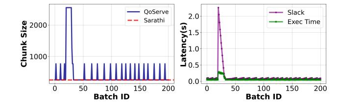

**Figure 9.** Chunk sizes in OoServe using dynamic chunking

goodput compared to Sarathi-FCFS and 20–40% higher goodput than Sarathi-EDF. These performance benefits stem from a combination of dynamic chunking, hybrid prioritization, and eager relegation. (§4.4) examines the contribution of each of these techniques.

<span id="page-8-2"></span>Goodput under PD disaggregation. QoServe's techniques of hybrid prioritization and eager relegation are directly applicable to the prefill nodes of disaggregated serving. We evaluate QoServe on the PD disaggregated mode of vLLM [1] using the Az-conv trace with identical QoS classes from Table 3. We set a large chunk size of 8K as default as we are not constrained by TBT in the prefill nodes for disaggregated serving. As done in the colocated case, we use the Sarathi-FCFS and Sarathi-EDF baselines for these experiments and report the maximum goodput supported per (prefill) replica. In all deployments, the number of decode replicas and their SLO attainment is identical as they work with a maximum batch size that meets the strictest TBT. Efficiently supporting different TBT SLOs in the decode nodes is left to future work. As shown in Figure 8, across models, hardware and parallelism, QoServe achieves better prefill goodput (QPS) compared to the baselines. This directly translates to fewer required prefill nodes in disaggregated serving. The throughput gains are lower compared to PD colocation because we are unable to exploit dynamic chunking here, because of the large baseline chunk size.

<span id="page-8-0"></span>**4.1.4 Dynamic chunking.** Figure 9 shows the effectiveness of dynamic chunking by analyzing chunk sizes and batch latency relative to accumulated slack for Az-conv trace

<span id="page-9-0"></span>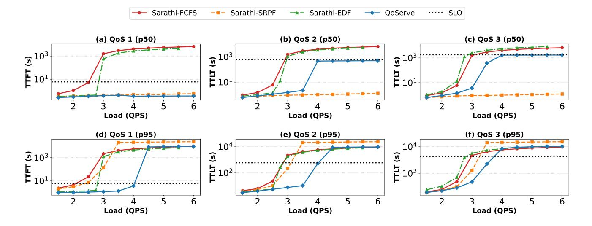

Figure 10. Latency of requests across the three QoS buckets as we vary load in the system

on Llama3-8B for 200 consecutive iterations. As shown, when high slack accumulates across requests, QoServe uses an increased chunk size until slack is exhausted. Dynamic chunking achieves 20% throughput improvement by exploiting latency slack to optimize chunk sizes. We set the chunk size maximizing the throughput using the performance profile in Figure 4. As throughput saturates around 2500, we choose that as the maximum chunk size. Note that 2500 chunk size delivers 2× higher throughput compared to the default 256 chunk size mandated by tight TBT constraints.

#### <span id="page-9-1"></span>4.2 Latency and SLO violations under Overload

We comprehensively evaluate system behavior at various loads by comparing QoServe against baselines on a shared cluster. We measure three key parameters: (1) median and p95 latency (TTFT, TBT, and TTLT) across all requests, (2) percentage of deadline violations across all SLO buckets, and (3) deadline violations in each SLO bucket and violations categorized by request length to assess scheduling fairness. For this evaluation, we add another baseline, Sarathi-SRPF which prioritizes jobs with the lowest pending prefill tokens.

Latency. Figure 10 shows the median and p95 latency across all requests for Llama3-8B on the Azure-Code dataset. As load exceeds the optimal operating point, queuing delay increases because the system cannot process requests as fast as they arrive. This causes a sharp increase in latency for all requests. While this happens in every system, the point where scheduling delay becomes unreasonably large defines the maximum serviceable load. We omit TBT plots since across all schemes, the average TBT violations was less than 0.1%, by virtue of carefully chosen chunk size.

There are several takeaways from these graphs.

- The State-of-the-art Sarathi-FCFS scheduler ignores individual request deadlines. As load increases, SLOs for jobs with stricter QoS requirements are violated. At heavy overloads, head-of-line blocking causes denial of service to all requests.
- Adding deadline awareness through mechanisms like EDF (Sarathi-EDF) better maintains QoS than Sarathi-FCFS, but doesn't scale well with load because we must sacrifice throughput to meet SLOs for the strictest QoS tier. It also degenerates at high loads similar to FCFS due to head-of-line blocking.
- Schedulers that prioritize short jobs like Sarathi-SRPF maintain good median latency at the expense of tail latency. The p95 latency, however, grows unboundedly because SRPF ignores longer requests. Since it is not deadline-aware it prioritizes minimizing latency across requests of all SLO-buckets, which could have otherwise been used to prioritize those with stringent SLOs.
- QoServe handles up to 40% higher load while meeting tail latency SLOs in each QoS bucket compared to baselines. Notably, QoServe's hybrid prioritization smoothly balances between deadline prioritization (EDF) and length prioritization (SRPF), achieving low median latency without drastically increasing tail latency.

**Deadline violations.** For the same workload, Figure 11(a) shows the overall percentage of SLO violations across all requests as load varies. QoServe maintains zero deadline violations for up to 30% higher load than the next-best scheme, Sarathi-EDF. Even at extreme overloads, QoServe has the fewest deadline violations compared to all other shared-cluster scheduling policies. These lower deadline violation result in the higher goodput we saw in (§4.1.2).

<span id="page-10-0"></span>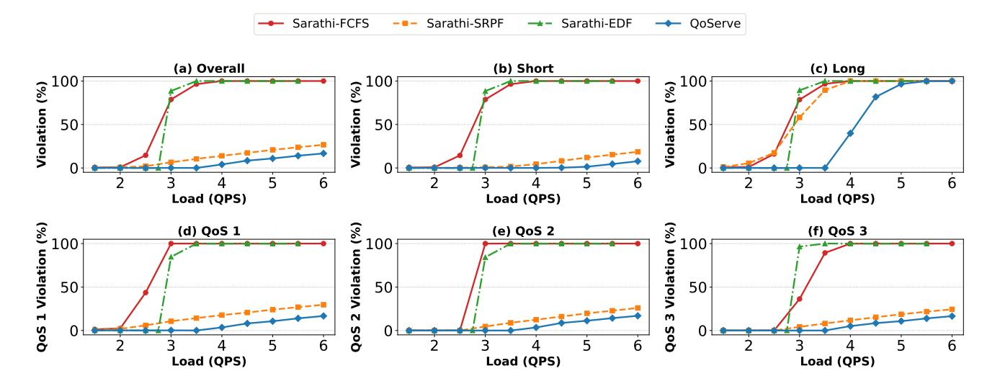

Figure 11. Deadline violations across all jobs, split by request length and QoS buckets

Finally, we analyze whether deadline violations are distributed fairly across request lengths and different QoS buckets. Figure 11(b,c) plot the deadline violations by request length (combined across all QoS buckets). We classify requests as long if their prompt token count is greater than or equal to the 90th percentile, and short otherwise. Our analysis reveals three key patterns:

- Sarathi-FCFS and Sarathi-EDF violate SLOs for short and long requests at similar rates. These schedulers do not differentiate between request lengths. At high loads when head-of-line blocking occurs, all requests violate SLOs due to a cascade effect.
- Sarathi-SRPF shows a very high ratio of violations for long versus short jobs, and ignores all long requests beyond certain load. Even at very low loads (<2 QPS), when other schedulers have no deadline violations, Sarathi-SRPF unnecessarily deprioritizes long requests and misses their deadlines. This approach is not only unfair but also counterproductive in real-world settings where request importance doesn't correlate with length.
- QoServe achieves balance between these extremes. It does not deprioritize long requests under normal conditions. During overload, it adjusts the *α* parameter (§3) to incorporate SRPF-like behavior. This approach allows QoServe to maintain fairness at reasonable loads while gracefully degrading service as load increases.

Figure 11d-f plots the split of deadline violations across the three constituent QoS buckets. We observe that Sarathi-FCFS first violates requests in the strictest QoS bucket and then continues to the less strict buckets. This happens because Sarathi-FCFS is deadline unaware, and due to head-of-line blocking, it violates requests with the shortest deadlines when they get blocked by other requests. Sarathi-EDF equally misses deadlines across all tiers because it treats all

requests equally with respect to their individual deadlines. Sarathi-SRPF shows a pattern similar to Sarathi-FCFS, violating the strictest tier first due to being deadline unaware. However, it has fewer overall violations by ignoring long jobs, which frees up capacity for the larger proportion of short requests. On the contrary, QoServe combines the best of these strategies via hybrid prioritization, and achieves fewer overall violations than even Sarathi-SRPF.

#### <span id="page-10-1"></span>4.3 Transient Overload Scenario

We evaluate whether OoServe can gracefully degrade service during transient overload by running an end-to-end evaluation with diurnal load patterns. Load in the system varies dynamically between low (QPS:2.0) and high (QPS:5) points every 15 minutes over a total of 4 hours as shown in Figure 12(a). This workload pattern models realistic diurnal request rate variations typically observed over a weekly cycle in production, compressed into a shorter evaluation timeframe to facilitate the 4-hour experimental duration. This pattern incorporates a 2.5× peak-to-trough ratio consistent with request rate variability documented in LLM production traces [9]. To evaluate OoServe handling of requests with multiple priorities, we mark a random set of 20% of requests in each QoS bucket as low priority, based on application hints. The remaining 80% of requests in each bucket are marked as high priority or Important.

Figure 12(b) shows the overall deadline violations observed in the system. While the baselines collapse under this load and violate deadlines for all requests, QoServe misses deadlines for no important tasks and only 8.75% of all requests. This improvement comes from leveraging application hints to perform eager relegation. Additionally, the throughput gains from dynamic chunking and hybrid prioritization help QoServe sustain higher loads.

<span id="page-11-3"></span>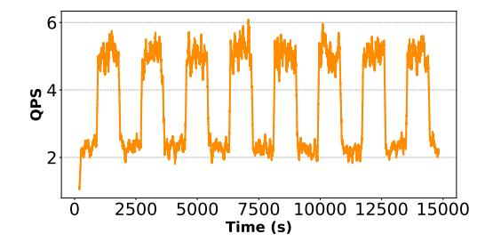

| Scheme       | Violations (%) |           |       |       |       |  |
|--------------|----------------|-----------|-------|-------|-------|--|
|              | Overall        | Important | QoS 1 | QoS 2 | QoS 3 |  |
| Sarathi-FCFS | 81.88          | 81.96     | 97.13 | 89.14 | 59.57 |  |
| Sarathi-EDF  | 84.12          | 84.09     | 79.3  | 83.27 | 89.77 |  |
| QoServe      | 8.64           | 0         | 16.03 | 9.98  | 0     |  |

Figure 12. Workload with varying QPS and overall deadline violations across different schemes

<span id="page-11-4"></span>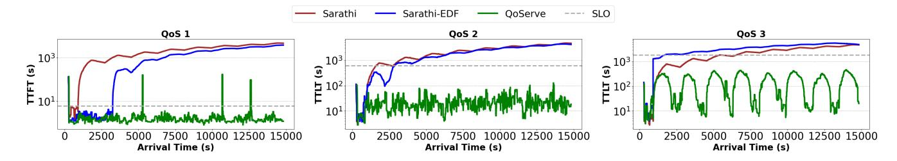

Figure 13. Rolling average of p99 latency of all high-priority requests during a dynamic workload with varying request rates

Figure [13](#page-11-4) plots the rolling p99 latency (over 60s windows) of all requests in the system for the three QoS buckets. We see that the baseline Sarathi-FCFS fails to sustain performance during the first request burst. It cannot recover from the queueing delay and enters request denial mode beyond that point for all classes. While Sarathi-EDF sustains the first burst and absorbs some of it until the second peak, it succumbs to queueing delay beyond this point. QoServe handles both high and low load periods, meeting the latency SLOs for a large majority of requests (all important requests and 92% of all requests). For relegated requests in QoServe, the maximum latency observed was no more than 3900s, while the maximum latency in baselines reached 5582s. Across all requests, irrespective of whether they are relegated, QoServe has better tail latency compared to the baselines. These results demonstrate graceful service degradation—proactively dropping a few requests during overload to maintain service levels for the majority, thereby eliminating cascading effects. In fact, the p50 rolling average for QoServe remains much more uniform and resilient to load changes.

## <span id="page-11-1"></span>4.4 Ablation Studies

<span id="page-11-0"></span>4.4.1 Impact of various techniques. We now examine how each component of our system design affects throughput and SLO violations. For this analysis, we tag all requests as important and evaluate three design elements—dynamic chunking, hybrid prioritization, and eager relegation—starting with the Sarathi-EDF baseline. Table [5](#page-11-5) shows that dynamic chunking provides a 20% boost in throughput, while eager

<span id="page-11-5"></span>

| Optimal Load |                    | High load (QPS=6) |         |
|--------------|--------------------|-------------------|---------|
| QPS          | % gain             | % viol            | % impr. |
|              |                    |                   | -       |
|              | 20%                | 74                | 26%     |
|              | 9%                 | 26                | 68%     |
| 3.65         | 1.4%               | 16                | 32%     |
|              | 2.75<br>3.3<br>3.6 | -                 | 100     |

Table 5. Impact of QoServe's optimizations. (DC:Dynamic Chunking, ER:Eager Relegation, HP:Hybrid Prioritization)

relegation adds another 9%. The impact of hybrid prioritization appears marginal in the optimal load scenario but becomes significant at high load.

To further illustrate the impact of hybrid prioritization, Figure [14](#page-12-0) plots the median latency and percentage of deadline violations as we vary system load across three different values of , our hybrid prioritization parameter. As increases, the system increasingly deprioritizes longer requests. This significantly reduces median latency for all requests but comes at the cost of violating deadlines for most long requests. This demonstrates the importance of tuning this parameter as load increases to strike a balance between low median latency and fair service for long requests.

<span id="page-11-2"></span>4.4.2 Varying workload composition and SLOs. We now evaluate QoServe's robustness across diverse SLO configurations and workload compositions.

Workload mix. We evaluate QoServe under skewed workload distributions: 70-15-15 (interactive dominant) and 15-15- 70 (batch-dominant) at 4.5 QPS. Table [6](#page-12-2) presents p99 latencies and SLO violations. While baseline systems fail to meet

<span id="page-12-0"></span>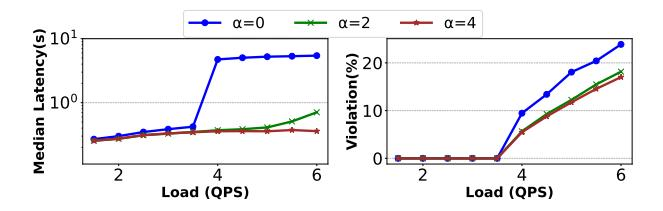

Figure 14. Varying the hybrid prioritization parameter

<span id="page-12-2"></span>

| Scheme                | Med     | % Violations |          |              |  |  |
|-----------------------|---------|--------------|----------|--------------|--|--|
| Scheme                | Q1(6)   | Q2(600)      | Q3(1800) | % Violations |  |  |
| Composition: 70-15-15 |         |              |          |              |  |  |
| Sarathi-FCFS          | 4835.2  | 4843.6       | 4825.7   | 100%         |  |  |
| Sarathi-EDF           | 3354.3  | 4214.7       | 6033.6   | 98%          |  |  |
| QoServe               | 0.77    | 425.31       | 1625.15  | 5%           |  |  |
| Composition: 15-15-70 |         |              |          |              |  |  |
| Sarathi-FCFS          | 4835.2  | 4843.6       | 4825.7   | 100%         |  |  |
| Sarathi-EDF           | 1800.75 | 2621.5       | 4436.4   | 82.78%       |  |  |
| QoServe               | 0.779   | 4.7          | 1027.5   | 0.5%         |  |  |

Table 6. Latency across workload compositions.

SLO targets under these loads, QoServe maintains SLO compliance across all tiers through a combination of strategic relegation (0.5-5% of requests), deadline-aware scheduling, and increased throughput via dynamic chunking.

**Varying SLO.** We modify the SLO targets to (3s, 50ms), (6s, 50ms), and (1000s) for Q1, Q2, and Q3 respectively, with equal request distribution. This configuration increases the proportion of interactive workloads compared to previous experiments. On the Azure-Conv trace with Llama3-8B, QoServe achieves 5 QPS goodput while Sarathi-EDF sustains only 3.7 QPS — a 26% performance degradation.

## <span id="page-12-1"></span>4.5 Comparison to concurrent work

Although the concurrent work discussed in Section 5 are not open-source, we provide best-effort comparisons with three representative approaches.

**4.5.1 Medha - Adaptive chunking.** Medha [6] uses adaptive chunking that starts with large chunks and progressively shrinks to maintain consistent TBT as attention overhead increases in later chunked iterations. We implement the dynamic chunking policy from Medha within our framework. Figure 15a compares chunk size choices between QoServe and Medha across 1000 consecutive batches using a synthetic trace (10K prefill tokens, 500 decode tokens per request) on Llama3-8B since chunking overhead is negligible for the median prompt lengths (<5K tokens) in our evaluation datasets.

While Medha progressively reduces chunk sizes within a prefill, it is unaware of slack accumulated by the current batch of requests. In contrast, QOSERVE opportunistically increases chunk sizes when slack becomes available, as demonstrated in Figure 15a. For fairness, we evaluate QOSERVE with

<span id="page-12-3"></span>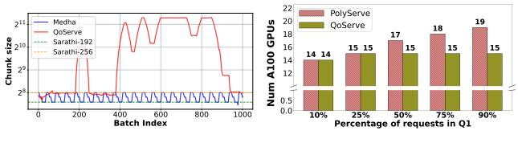

- (a) Comparison to Medha
- (b) Comparison to PolyServe

**Figure 15.** Comparison with concurrent work

only dynamic chunking under FCFS scheduling, disabling all other techniques. Compared to Medha's adaptive chunking (also under FCFS), this isolated setup yields a 23% goodput improvement (0.32 vs. 0.26 QPS), showing the gains arise solely from the chunking strategy.

**4.5.2 PolyServe.** PolyServe [22] is a multi-SLO scheduling system designed to serve interactive workloads with diverse TBT requirements. It partitions requests into separate deployments based on TBT SLO categories, employing dedicated resources and autoscaling for each deployment. It uses a similar adaptive chunking policy as Medha. We do not implement autoscaling and request migration in PolyServe or QoServe to compare only the core techniques.

We compare PolyServe against QoServe's collocated approach using PolyServe's evaluation methodology. Our experimental setup comprises two interactive job categories: Q1: 50ms TBT and Q2: 100ms TBT, both maintaining 6s TTFT SLOs. We determine the A100 GPU requirements for serving Llama3-8B on Azure Conversation traces at 50 QPS total load, varying the distribution of requests between QoS classes. We calculate GPU requirements by determining maximum perreplica goodput for each QoS class, then computing total resources needed for specific load configurations.

Figure 15b presents the comparative capacity requirements as we vary request composition across the two TBT classes for PolyServe and QoServe. Compared to PolyServe, QoServe always has lower resource requirement due to colocation of requests which allows exploiting prefill slack and improving throughput using dynamic chunking.

**4.5.3 SLOs-Serve.** We provide a qualitative comparison with SLOs-Serve [8], which employs periodic dynamic programming to optimize scheduling across all active and queued requests. Despite sharing similar multi-QoS objectives with QoServe, SLOs-Serve's  $O(NN_{new}M)$  scheduling complexity (where N represents running requests,  $N_{new}$  denotes queued requests, and M indicates KV blocks) exhibits poor scalability. In comparison, QoServe requires  $O(\log(N_{new}))$  time to choose the prefill tokens to schedule from the priority queue. In their paper, SLOs-Serve is evaluated with MHA models (which limits the KV-cache size) with constrained batch sizes on 40GB GPUs, where the scheduling overheads would be lower; whereas QoServe efficiently scales to larger model configurations and distributed deployments.

