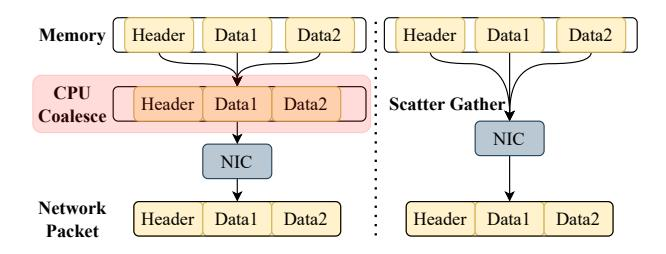

# 1 Introduction

Remote Procedure Calls (RPCs) allow services to invoke functions on remote servers as if they were local calls, offering developers a familiar and straightforward programming model for building distributed applications [\[20,](#page-10-0) [21,](#page-10-1) [45,](#page-11-0) [69,](#page-12-1) [72\]](#page-12-2). RPC libraries (e.g., Apache Thrift [\[16\]](#page-10-2), bRPC [\[18\]](#page-10-3), and gRPC [\[32\]](#page-11-1)) have been widely adopted across various domains such as cloud microservices [\[1,](#page-10-4) [6,](#page-10-5) [33\]](#page-11-2), high-performance computing (HPC) [\[58,](#page-12-3) [63\]](#page-12-4), distributed data stores [\[27,](#page-11-3) [38\]](#page-11-4), network file systems [\[30,](#page-11-5) [60\]](#page-12-5), and large language models (LLMs) [\[25,](#page-11-6) [55\]](#page-11-7).

As recently reported by Google Cloud [\[62\]](#page-12-6), RPC processing occupies a non-negligible ratio (∼7.1%) of CPU cycles across the entire fleet, highlighting the critical role of RPCs in the overall performance of cloud applications. Traditionally, the performance of RPCs has been constrained by the relatively slow network. In modern datacenters, however, round-trip times (RTTs) have dropped to only a few microseconds [\[19,](#page-10-6) [37,](#page-11-8) [56\]](#page-12-7), shifting the performance bottleneck from the network toward the CPU. The overhead of CPU-based memory copies in (de)serialization has become increasingly significant. For example, Google reports that Protobuf serialization alone accounts for 5% of datacenter CPU usage [\[39\]](#page-11-9); and Meta reports that serialization consumes 6.7% of the CPU cycles in its microservices [\[64\]](#page-12-8). As NIC throughput has increased to 800 Gbps [\[23\]](#page-11-10) and is expected to reach 1.6 Tbps

<sup>∗</sup>Xiangyu Liu and Huiba Li are co-primary authors.

soon [\[34\]](#page-11-11), the relatively high cost of CPU processing, especially memory copies, has become a performance bottleneck representing the costly "memory-copy tax" in the cloud.

A typical RPC proceeds as follows. First, the client serializes the function input (i.e., a set of data objects) by copying scattered data of object fields into a contiguous userspace buffer and constructing metadata associated with these object fields (e.g., sizes and offsets). Second, the request message is copied from userspace to kernel-space. Third, the serialized data is transmitted to the server, which then deserializes the message reversely to reconstruct the original objects, invokes the function call, and finally returns a response back. Although modern network dataplane (e.g., DPDK [\[35\]](#page-11-12)/RDMA [\[15\]](#page-10-7)) bypasses the kernel and eliminates user-/kernel-space memory copies, (de)serialization overheads related to RPC memory copies cannot be avoided. Most existing serialization libraries [\[9,](#page-10-8) [16,](#page-10-2) [17,](#page-10-9) [31,](#page-11-13) [67\]](#page-12-9) follow the aforementioned RPC procedure, and thus are highly inefficient for RPCs in modern high-performance networks.

This paper presents zBuffer, a zero-copy, metadata-free serialization library designed to minimize the memory-copy tax. At the core of zBuffer is scatter-gather reflection, a novel technique that integrates hardware offloading and compiletime optimization based on two related observations. First, commercial off-the-shelf (COTS) NICs support scatter-gather (SG) I/O that can efficiently gather/scatter data to/from a contiguous on-device buffer, but this feature is buffer-centric: it moves raw bytes without understanding the object structure (e.g., field identity, ordering, and types). Second, static reflection, commonly used in high-performance libraries [\[2,](#page-10-10) [5,](#page-10-11) [11,](#page-10-12) [29\]](#page-11-14), provides programs the ability to inspect and manipulate its own structure at compile time, offering the missing object-level structure that scatter-gather I/O cannot support.

zBuffer seamlessly integrates static reflection with NIC scatter-gather capabilities, eliminating the overhead traditionally associated with RPC memory copies. To use the NIC scatter-gather mechanism, an application should submit requests to the NIC containing a descriptor table, where each descriptor represents an object field via a pointer and length. Since the receiver lacks knowledge of the message layout, these descriptors (i.e., metadata) must be transmitted alongside the message. With static reflection, the object field order and byte boundaries are determined at compile time, enabling the generation of fixed (de)serialization code paths that embed this metadata. At runtime, serialization follows these compile-time–generated paths to produce a descriptor table, which can be directly submitted to the NIC without additional metadata construction. The NIC then uses scattergather I/O to aggregate non-contiguous fields for transmission. On the receiving side, pre-generated code can similarly reconstruct the object from a contiguous buffer. This implicit encoding, combined with scatter-gather I/O, eliminates the need for both data coalescing and runtime metadata construction. We term this integration scatter-gather reflection.

<span id="page-1-0"></span>

Figure 1. RPC Processing in a Send-Receive Transaction.

We choose C++ for its widespread adoption in both cloud and HPC applications and its robust support for compile-time optimizations [\[4,](#page-10-13) [7,](#page-10-14) [50\]](#page-11-15). However, using C++ to generate arbitrary object description tables at compile time is nontrivial as C++ offers no native reflection. To ensure that the generated (de)serialization paths precisely cover the expected fields, it is necessary to accurately extract each field of the object. However, the diverse and complex data types in applications make automatic field extraction challenging.

To address this challenge, we implement compile-time static reflection in C++ using macros and template metaprogramming. A single annotation macro registers the object field, yielding a deterministic, compile-time enumeration of fields. As each field has fixed memory size, by using sizeof [\[13\]](#page-10-15) operator, we compute stable sizes, offsets, and alignments; a recursive traversal then flattens nested aggregates into a linear field sequence with fixed byte boundaries. Template specialization and type traits select per-type serialization policies and synthesize fixed code paths at compile time, eliminating runtime metadata construction. Moreover, this approach provides the compiler with essential information, enabling it to optimize more effectively, thus achieving high performance with low runtime overhead.

We further design and implement a fast RPC system (called zRPC) by integrating zBuffer with zero-copy packet transmission, which eliminates all RPC memory copy overheads not only in (de)serialization but also in network transmission. Extensive evaluation shows that zBuffer/zRPC significantly outperforms state-of-the-art serialization/RPC mechanisms: zBuffer is ∼7× faster than Cornflakes [\[57\]](#page-12-10) in serialization for complex objects; and zRPC reduces 99th percentile latency by 21% and achieves 62% higher throughput than eRPC [\[37\]](#page-11-8) on the Masstree KV with YCSB.

zBuffer/zRPC has been widely deployed in Alibaba's internal production systems [\[43,](#page-11-16) [44,](#page-11-17) [68\]](#page-12-11). We have also opensourced our TCP edition of zBuffer/zRPC at [https://github.](https://github.com/alibaba/PhotonLibOS/tree/main/rpc) [com/alibaba/PhotonLibOS/tree/main/rpc](https://github.com/alibaba/PhotonLibOS/tree/main/rpc).

<span id="page-2-0"></span>

Figure 2. CPU-based coalescing vs. NIC-based coalescing.

### 2 Background and Motivation

#### 2.1 Remote Procedure Call

Remote Procedure Calls (RPCs) are an important inter-process communication mechanism that enables processes to conduct service calls and invoke procedures in other processes or remote systems as if they were local. In the context of a send-receive operation, the processes related to memory copy are depicted in Fig. 1. On the sender side, an application first constructs the metadata (**1**) and coalesces the data from the structure's scattered memory regions (2). Then, the coalesced data is copies from user-space to kernel-space (3). On the receiver side, when the message is received, the data is first copied from kernel-space to user-space (4). Finally, the data is copied to the structure's memory region and will be handed over to the application for further processing (**6**). A minimum of 4 memory copies are required for a send-receive transaction. Furthermore, a single RPC call involves at least two such transactions (i.e., request and response), resulting in significant overhead.

#### 2.2 Scatter-Gather Data Coalescing

The scatter-gather feature was originally designed for HPC applications, which frequently move large, statically-sized chunks of memory between servers. HPC applications have used scatter-gather to optimize MPI all-to-all communication primitives [28], or provide zero-copy communication over MPI derived data types [61]. Fig. 2 compares CPU-based coalescing and NIC-based scatter-gather coalescing for serialization. Scatter-gather allows the NIC to assemble packets from multiple, non-contiguous memory regions, rather than a single memory region. For instance, given a list of I/O addresses, the popular Mellanox CX-5 [49] NIC makes multiple PCIe requests to coalesce the memory into a single packet. However, although scatter-gather avoids the overhead of coalescing data, the metadata for reconstructing the message object still introduces high serialization overhead, suffered by state-of-the-art scatter-gather coalescing methods [57].

#### 2.3 Analysis of Serialization Overhead

Fig. 3 shows two approaches in serializing and transmitting a message with three non-contiguous fields. The first approach is traditional software serialization libraries like Protobuf [9] and FlatBuffers [31]. **①** The application sets up each field

<span id="page-2-1"></span>

Figure 3. Transmission of three non-contiguous fields.

<span id="page-2-2"></span>

**Figure 4.** 99th percentile (p99) latency as achieved load increases of serialization libraries, without metadata construction and zero-copy.

of the serialization object. ② Add and calculate an object header, which is used to record metadata about the structure, such as field offsets and sizes, then copy the scattered data into a contiguous buffer. ③ Add packet header and copy the buffers into pinned memory to enable the NIC to perform DMA transfers. ④ Finally, the NIC uses DMA to transfer the memory. This approach of serialization incurs high overhead due to two extra copies. We measure an echo application that has 16 concurrent clients sending a simple message (one 1024-byte field) to a single-core server, which deserializes, reserializes, and transmits the data back. Fig. 4 shows the result. With a <36 μs latency constraint, the throughput of zero-copy is 45 Gbps, without metadata construction is 23.4 Gbps, and existing libraries is 13-14 Gbps. Data copies are the significant cost.

To avoid this, we propose a zero-copy serialization library called zBuffer. zBuffer leverages the reflection feature of C++ at compile time and the scatter-gather feature of modern NICs to achieve scatter-gather reflection. This approach implements the "Zero-Copy" method (Fig. 3). With zBuffer, the information for each field is obtained at the time of setting the fields, eliminating the need to construct additional metadata, also eliminating the need to copy the data into a contiguous buffer.

```
struct sg {
  void* sg_base; // Pointer to buffer.
  size_t sg_len; // Length of buffer.
};
struct sg_array {
  uint16_t sg_begin; // index of first valid sg
  uint16_t sg_end; // index of last valid sg
  uint16_t capacity; // valid capacity of sg_array
  sg* sg_a; // sg_array
};
```

Listing 1. The scatter-gather array (sg\_array) structure.

```
// Object Definition
struct Msg: public Message{
  int id;
  string val1;
  string val2;
  PROCESS_FIELDS(val1,val2);
};
class Serializer{
    sg_array sgs;
    template<typename T>
    void serialize(T& x);
};
class Deserializer{
    sg_array sgs;
    template<typename T>
    T* deserialize(void* buf);
};
```

Listing 2. The data structure and API of zBuffer.

