# I. INTRODUCTION

Recent advancements in Large Language Models (LLMs), such as GPT [62] and LLaMA [51], are fundamentally transforming previous software across various domains, from personal assistants [100] to search engines [54]. This paradigm shift imposes immense pressure on cloud providers to develop cost-efficient serving infrastructure capable of handling billions of user queries [67]. However, the high costs and constrained supply of top-performing accelerators like NVIDIA GPUs [61] and self-designed accelerators [52] have forced major cloud providers, such as Amazon [13], Azure [32], and Inspur [80], to increasingly leverage ubiquitous generalpurpose CPUs for LLM serving [21], [36].

To meet the computational demands of AI-driven software, modern general-purpose CPUs are incorporating specialized Accelerator Units (AU) in the execution pipeline, which are

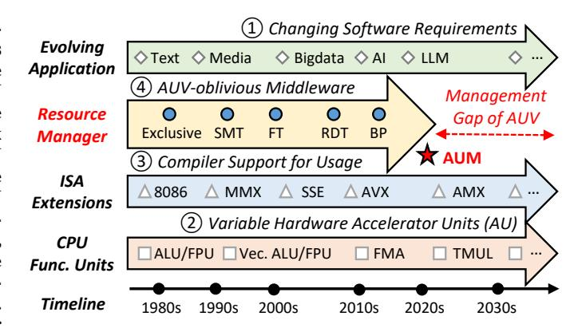

Fig. 1: The management gap between evolving AU and AU variations (AUV)-oblivious resource managers.

designed to accelerate key operations, such as Intel AMX1 [59] and RISC-V M-extension [2] for heavy matrix multiplications in LLM serving [37]. Enabled by dedicated Instruction Set Architecture (ISA) extensions for every emerging AU [24], [70], software applications can easily harness AU capabilities to achieve significant performance gains, as shown in Figure 1. However, CPU execution becomes more heterogeneous due to newly-designed AU alongside conventional functional units, such as integer ALU and vector units [70]. To sidestep management complexities and guarantee AU application performance, current industry practice is to utilize AU-enabled CPU exclusively [41], [80] (i.e., allocating the whole processor to AU applications without sharing), leading to severe resource waste and poor platform efficiency.

Given the inefficiency of exclusive allocation, sharing AUenabled CPU is essential for maximizing platform efficiency, but effective sharing is non-trivial due to variable behaviors of AU at three abstraction layers, which we term Accelerator Unit Variations (AUV). *Variation-1: Variable Usage Pattern.* Software-layer AU utilization is highly dynamic in different applications and operators. For instance, two LLM serving phases (i.e., prefill and decode [102]) have distinct AU usages due to different matrix operation dimensions. *Variation-2: Compulsory Frequency Interference.* Variable AU usages

1 In this paper, we use Intel Advanced Matrix Extension (AMX) for matrix multiplication to represent one of the emerging accelerator units.

cause compulsory system-layer frequency reduction to respect thermal design power (TDP) limits. The dynamic frequency scaling creates unpredictable performance interferences and makes it difficult to guarantee sharing service-level objectives (SLO). *Variation-3: Dissimilar Resource Bound.* AU exhibits microarchitecture-layer resource affinities distinct from traditional functional units. The imbalanced processor frontend and backend resource bounds lead to underutilized hardware components in different cycles. The three-dimensional AUV are challenging for guaranteeing performance and maximizing efficiency in shared environments.

However, conventional resource managers fail to handle AUV for contradictory performance and efficiency objectives. To utilize the redundant resources, CPU platforms incorporate workload-aware mechanisms as shown in Figure 1, including Simultaneous Multi-Threading (SMT) variants, such as Frontend Throttling (FT) [14] and Backend Partition (BP) [50], and resource partitioning mechanisms, such as Intel Resource Director Technology (RDT) [11], [27]. We find that simply applying current AUV-oblivious resource sharing managers is unacceptable since they cannot make precise decisions for variable AU, causing 10-50% AU application performance and CPU efficiency degradations. Therefore, we envision a critical management gap between more variable AU and AUV-oblivious resource managers, failing to maximize AU capability and CPU efficiency.

To bridge this management gap, we propose AUM, a novel AU-aware resource Manager designed to handle AUV and maximize CPU efficiency in shared environments. More specifically, AUM offers higher manageability with two cooperative components, and every component has three stages for three-dimensional AUV. The *Background AU Profiler* synthesizes AUV offline from usage patterns, frequency reductions, and resource bounds to obtain the discrete *AUV Model*. Guided by this model and runtime information, the *Runtime AU Controller* decides the optimal AU configurations online, including usage-aware performance slacks, frequency-aware processor divisions, and collision-aware resource allocations. Overall, AUM selects AU sharing configurations that maximize CPU efficiency and minimize AU performance slowdowns.

To evaluate AUM, we have implemented a prototype and evaluated it with various workloads on three production CPU platforms. Evaluation results show that AUM achieves better CPU performance-per-watt efficiency by up to 8.8% and 4.7% compared with state-of-the-art (SOTA) exclusive AU usages and AUV-oblivious sharing methods, respectively. Meanwhile, it maintains high-performance AU applications by reducing SLO violations by up to 11%. AUM induces negligible management overheads and achieves better total cost of ownership, enabling more efficient general-purpose processor management for the AI era.

In summary, this paper makes the following contributions:

 Analysis: We envision the complex accelerator unit variations and characterize them from three abstraction layers. We show that both AU-exclusive usages and AUV-

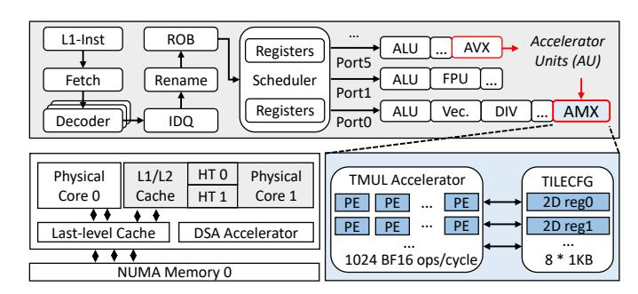

Fig. 2: The block diagram of modern CPU with accelerator units and the implementation of typical AMX.

oblivious sharing resource managers cannot achieve highperformance and efficient processors.

- Design: We introduce AUM, a novel AU-aware resource manager tailored for AU-enabled processors in shared environments. We design two cooperative components to pursue optimal efficiency-performance trade-offs.
- Evaluation: We implement and evaluate AUM thoroughly on production CPU platforms to prove its better performance-per-watt efficiency and performance guarantee compared to SOTA resource managers.

#### II. BACKGROUND

This section introduces current accelerator units and a prevailing AU-accelerated application, LLM serving.

#### A. CPU Accelerator Units

To improve the performance of artificial intelligence (AI) applications on CPU platforms, hardware vendors have integrated specialized functional units into recent processors, such as Intel Advanced Matrix Extensions (AMX) [59], ARM Scalable Matrix Extensions (SME) [5], and RISC-V M-extension [2]. They follow the Single-Instruction-Multiple-Data (SIMD) paradigm to accelerate operations like matrix multiplication. Different from dedicated accelerators (e.g., Data Streaming Accelerator, DSA [40]) outside the CPU pipeline, these accelerator units (AU) on every physical core share the instruction flow, microarchitectural resources, and data access path with normal functional units [24]. The layout of modern processors containing Intel AMX and AVX units is shown in Figure 2, which are the targeted AU in this paper with relatively mature software support. Every AMX unit contains an array of eight 2-dimensional registers (TILECFG) with the size of 1KB and a matrix multiply accelerator (TMUL) that performs 1024 ops per cycle with BF16 precision [25]. The matrix multiplications via TMUL compute C[M][N]+=A[M][K]\*B[K][N] with  $M \le 16$  and  $N \le 64$ . AMX is introduced from SPR [59] with BF16 precision and the following generations add support for more data types like FP16 in GNR [28] and FP8 in DMR [31].

#### B. AU-accelerated LLM Serving

Large language models (LLM) have shown impressive achievements and great potential in various creative tasks,

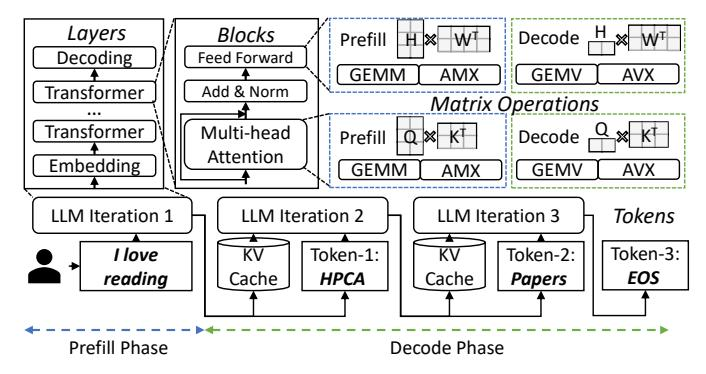

Fig. 3: LLM serving with AU-accelerated matrix operations.

leading the boom of the AI era [51], [62], [99]. Besides once-for-all heavyweight LLM training, optimizing the LLM serving (i.e., inference) efficiency is gaining more attention in both academia and industry [42], [60]. LLM serving contains two phases: (1) The prefill phase processes all tokens of the input prompt simultaneously to generate the first new token. (2) The decode phase uses the previously generated token as input to produce the following tokens one by one until an end-of-sequence (EOS) token is produced [37]. Two phases are relatively independent and have different characteristics [67], [102]. As shown in Figure 3, LLM iteration passes through repeated transformer layers composed of multiple blocks like multi-head attention to generate every subsequent token. The heavy blocks are composed of matrix operations of different sizes, depending on phases, batch sizes, and input lengths [36]. They can be accelerated by AU-enabled CPU [57] but the most efficient AU choices are changing with matrix dimensions [41]. Many LLM serving frameworks are exploring AU utilization to improve serving performance, such as Ktransformer [41] and xFasterTransformer [33].

#### III. DEFICIENCY OF EXCLUSIVE AU UTILIZATION

AU acceleration of diverse workloads is promising, but current exclusive AU usages fall short compared with GPUs in efficiency, calling for shared deployment to fully unleash the efficiency potential of AU-enabled processors.

#### A. Characterization Methodology

1) Hardware: In Sections III, IV, V, and VII, we evaluate three commercial off-the-shelf AU-enabled CPU platforms with different memory devices: Intel 4th Sapphire Rapids (SPR) [59] released in 2022, with DDR5 memory and High-Bandwidth Memory (HBM), as well as 6th Granite Rapids (GNR) [28] released in 2024 with Multiplexer Combined Ranks (MCR) memory. The hardware specifications are shown in Table I. The three platforms are equipped with AVX and AMX units in every physical core, and we calculate AU TFLOPS based on their base frequencies. The main difference among GenA, GenB, and GenC is memory configurations, and GenC further improves AU.

TABLE I: Hardware specifications of evaluated CPUs.

| Platforms GenA             |                 | GenB            | GenC           |  |
|----------------------------|-----------------|-----------------|----------------|--|
| Generation                 | Sapphire Rapids | Sapphire Rapids | Granite Rapids |  |
| CPU                        | Xeon 8475B      | Xeon Max 9468   | Xeon 6982P-C   |  |
| # cores/sockets            | 48 / 2          | 48 / 2          | 120 / 1        |  |
| AU TFLOPS (AVX-512/AMX) | 25.6/206.4      | 25.6/206.4      | 32/344         |  |
| Base Frequency             | 2.7 GHz         | 2.1 GHz         | 2.8 GHz        |  |
| L1-I / core                | 32 KB           | 32 KB           | 64 KB          |  |
| L1-D / core                | 48 KB           | 48 KB           | 48 KB          |  |
| L2 / core                  | 2 MB            | 2 MB            | 2 MB           |  |
| LLC / socket               | 97.5 MB         | 105 MB          | 504 MB         |  |
| Memory                     | DDR5 1TB        | HBM 128GB       | MCR 768GB      |  |
| Memory BW                  | 233.8 GB/s      | 588 GB/s        | 600 GB/s       |  |

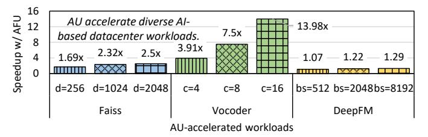

Fig. 4: AU acceleration of three types of AI workloads under different dimension (d), cores (c), and batch sizes (bs). All the results are normalized to AU-disabled GenC performance.

2) Software: To accelerate LLM serving with AU, we use Intel xFasterTransformer (xft) [21] framework with the latest Intel AMX support. We use xft to serve the open-sourced llama2-7b and llama2-13b [51] with BF16 precision and batch size of 16. To study the cascaded yet different serving phases, prefill and decode [67], [102], we mimic them in xft with varying output length. We use Linux perf [19], pmu-tools [38], and pgos [26] tools to characterize LLM and AU behaviors. Meanwhile, we select various metrics widely used in previous studies [56], [102]. The SLO of LLM serving are time-tofirst-token (TTFT) for the prefill phase, indicating the time to generate the first token, and time-per-output-token (TPOT) for the decode phase, indicating the average time taken to generate subsequent tokens. The performance of LLM serving is measured via tokens per second (Throughput), indicating the generated tokens with performance guarantees.

## B. Pros and Cons of Current AU Utilization

Despite LLM serving [57], AU has proven its strengths in diverse AI-based datacenter workloads as shown in Figure 4. Faiss vector search (Faiss) [53], speech vocoder (Vocoder) [23], and deepfm recommendation (DeepFM) [20] are greatly accelerated with AU capabilities under different parameters on the GenC platform. Admittedly, GPU-based datacenters are the main trend in the AI era. But CPU is still worth optimizing for two reasons. Firstly, GPU is inadequate for the booming demand of AI-enabled applications with up to 40% shortage [3], thus utilizing AU to accommodate selective AI workloads could free up the limited GPU for higher-priority workloads such as Azure and AWS [13], [32], [80] and improve cluster sustainability [44]. Secondly, even in a GPU-centric datacenter such as Alibaba Cloud, there are also

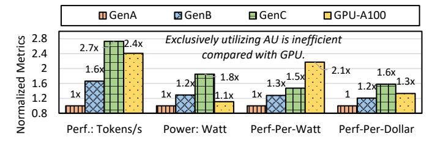

Fig. 5: Inferior performance and efficiency of exclusive AUenabled CPU compared with GPU solutions.

around 50% idle CPU cores with accelerator units that can be better utilized besides its cooperation with GPUs [95]. Current industrial providers concentrate on the AU application performance and allocate the whole CPU exclusively to avoid management complexity and hardware contention [41], [80].

Admittedly, exclusive AU usages without any sharing can maximize its performance, but it causes both low CPU efficiency and waste of redundant hardware resources. Given the enhanced AU on the CPU platform, the improved LLM serving performance is still insufficient compared with highend GPUs like Nvidia A100, as shown in Figure 5. We compare with a single-GPU server driven by FlexGen [57], [73] on performance, power, and cost of the processing units (1 CPU vs. 1 GPU). The absolute performance, power, and cost of GenA are 188 tokens/s, 270 Watt, and \$ 7200, respectively. We find that GPU is even more efficient considering the power consumption, with a 2.1x better performance-perwatt compared with GenA and 1.4x better than GenC. But the performance-per-cost of single-GPU servers is worse than that of the high-end CPU platforms. The performance gap would be bigger with model parallelism [74] while the power consumption would be significantly higher for multi-GPU servers and larger models (5kW vs. 500W), which are in line with prior efficiency studies [66], [78]. It shows that utilizing AU exclusively is not an efficient alternative to GPUs in large-scale datacenters. Moreover, exclusive AU usages cause a great waste of hardware resources. Applications with variable AU usages have distinct resource demands and leave redundant processor resources underutilized, which requires proper sharing methods to deploy more general applications and improve overall efficiency [11], [101].

Considering the performance pros and efficiency cons of exclusive AU utilization, sharing processors between AU and general workloads is both necessary and worthwhile for more cost-efficient AU-enabled processor management.

## IV. UNDERSTANDING ACCELERATOR UNIT VARIATIONS

To better utilize and manage the emerging AU, we need to understand their behaviors and differences. This section systematically characterizes LLM serving with the modern AU, Intel AMX, and demonstrates the three-dimensional AUV that hinder the intuitive sharing management.

TABLE II: Comparison of LLM of different architectures and sizes. BB is backend bound and DB is dram bound. Every value is denoted as percentages of Prefill / Decode phases.

| Model          | Size | Cycle Ratio | $\mu$ op Ratio | BB      | DB      |
|----------------|------|-------------|----------------|---------|---------|
| Phi-3 [83]     | 3.8B | 17.8 / 1.9  | 4.1 / 0.9      | 84 / 89 | 21 / 53 |
| Llama2 [51]    | 7B   | 14.4 / 1.5  | 3.7 / 0.5      | 92 / 96 | 24 / 59 |
| Llama3 [51]    | 8B   | 13.1 / 1.3  | 3.5 / 0.5      | 91 / 96 | 24 / 60 |
| Gemma2 [82]    | 9B   | 13.3 / 1.4  | 3.3 / 0.4      | 92 / 96 | 25 / 62 |
| Llama2 [51]    | 14B  | 10.9 / 1.2  | 2.5 / 0.4      | 94 / 97 | 29 / 68 |
| Qwen3-A3B [84] | 30B  | 18.2 / 2.3  | 4.5 / 1.1      | 82 / 90 | 21 / 51 |

#### A. Variation-1: Variable Usage Pattern

Firstly, AU is used unequally in applications and operators, laying the foundation of AUV. We analyze the variable AU usage patterns to find the causes and proxies.

- 1) AU usage analysis in LLM serving: AU is variably utilized in current AI applications. We observe three practical metrics on CPU to characterize AU usage in applications [85]. Firstly, AMX cycle ratio, measured via tma amx busy metric, indicates the proportion of cycles during which AMX is busy with arithmetic operations. We find that AMX usage is varying: the compute-intensive prefill phase (14.4%) is higher than the memory-intensive decode phase (1.5%), and the high-bandwidth platforms (GenB and GenC) are higher. Secondly, AMX µop ratio, measured via tma\_fp\_amx divided by tma\_fp\_arith, shows the proportion of floating-point operations the AMX has finished. We find that FP operations of prefill are mostly finished by AMX (3.7% / 3.8%), but the decode phase uses AMX for FP operations less (0.5% / 1.5%). Thirdly, the avx\_insts metric of the decode phase is higher because the vector-size operations are more efficient using AVX rather than AMX [41], showing different AU choices for varying-size matrix multiplications.
- 2) Analysis of LLM Architecture: We analyze more LLM of different architectures and sizes: Phi-3-Mini-128K-Instruct of 3.8B size [83], Llama3 of 8B size [51], Gemma2 of 9B size [82], and Owen3-30B-A3B of 30B size and Mixture-of-Experts (MoE) architecture [84]. Also, larger models would be restricted by the CPU memory bandwidth greatly, such that they are more suitable for CPU-GPU hybrid deployment [36], [41]. We mainly study the AU usage patterns and key backend resource bounds of the six models as shown in Table II. We find that smaller models have higher AU usages and MoE architecture is suitable for AU deployment as well. The memory bound is more vital for larger models, but sparse expert activation of the MoE architecture can relieve the memory pressure. We choose the small-size models for the following experiments since they are suitable for CPU-only serving without GPU requirements [30], and larger LLMs behave similarly on AU usage patterns [57].
- 3) Analysis of AU usage variations: The AU usage differences mainly result from variable operator dimensions. The performance of GEMM operations achieves 40.57 TFLOPS in the prefill phase but 6.87 TFLOPS in the decode phase due to variations in matrix dimensions. Most GEMMs in the prefill phase are  $8192 \times 4096 \times 22016$ , where 8192 denotes

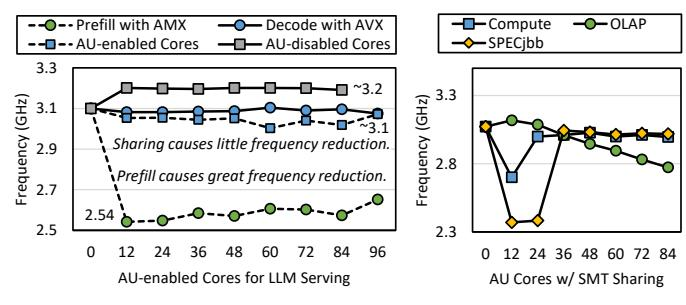

(a) Impact of usage pattern on AU frequency reduction. (b) Sharing interferences affect frequency reduction.

Fig. 6: Variable frequency reduction due to AU utilization.

batch size 16 times input sequence length 512. However, most GEMMs in the decode phase are  $16 \times 4096 \times 22016$  with the performance of 3.87 TFLOPS, where 16 denotes batch size for one output token. Meanwhile, although the request arrival rates for user-facing LLM serving are inherently variable, we find that it affects the AU usage pattern via batch size variations since current LLM serving frameworks always adopt continuous batching techniques [33], [42]. AU usage patterns are stable under certain model, phase, and batch size. Therefore, we choose to profile the variation of different batch sizes to reduce the overhead of profiling varying request arrival rates, and we adaptively tune the configurations at runtime based on SLO and performance slack of different requests, similar to prior works have done [11], [102].

Findings #1: Variable AU usages in applications initialize AUV and requires usage-aware management.

#### B. Variation-2: Compulsory Frequency Interference

Secondly, variable AU usages incur compulsory frequency reduction, excavating AUV. We analyze the frequency variations and interferences on shared cores.

- 1) Compulsory frequency reduction: Due to the thermal design power limit, physical cores enabling more power-hungry AU trigger automatic frequency reduction, which changes with AU usage. We use the turbostat [45] tool to record the core frequency of GenA with all-core turbo frequency of 3.2 GHz. Figure 6a presents the impact of AU usages on frequency reduction and varies the number of AU cores with (square) and without (circle) power stressors on the remaining physical cores. We have two observations: (1) The prefill phase with more AMX usages causes greater frequency reduction to 2.5 GHz, which is influenced little by the number of AU cores (green circles). The decode phase with more AVX usages reduces frequency slightly to 3.1 GHz (blue circles). (2) The remaining AU-disabled cores experience no cascaded frequency reduction (gray squares). However, the frequency reduction of AU cores running the decode phase is more severe when co-running power stressors (blue squares).
- 2) Complex frequency interference: We find that AUinduced frequency reduction is further affected by sharing interferences, leading to variable cascaded performance degradation. We use all cores for the decode phase and share

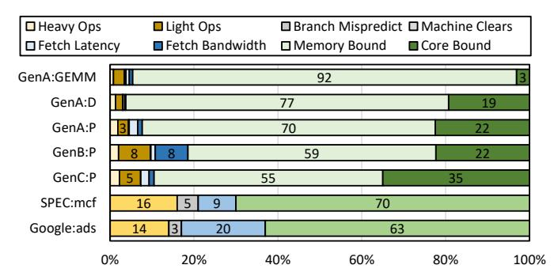

Fig. 7: Comparison of cycle distributions with variable AU usages on evolving platforms. The yellow, gray, blue, and green categories are retiring, bad speculation, frontend bound, and backend bound, respectively.

different numbers of cores with three types of applications: *Compute/OLAP/OLTP* (detailed in Section V-A). Figure 6b presents the average frequency of the shared cores, showing that with increasing sharing pressure, relatively low AU usages in the decode phase also induce more severe and variable frequency reduction. Moreover, the abrupt frequency drops on limited cores (12-24) may be caused by heat accumulation on compute-intensive shared cores, and we observe similar drops in repeated experiments with other applications, which excavates the complexity of frequency interference.

Findings #2: Usage-based frequency reduction worsens AUV, and unstable frequency interference adds difficulties to maximizing the efficiency of AU-enabled processors.

#### C. Variation-3: Dissimilar Resource Bound

Thirdly, AU presents microarchitectural resource demand different from traditional functional units, changing with variable AU usages. We adopt the top-down methodology [97] to analyze AU resource bounds and further deep dive into key backend bottlenecks.

- 1) Frontend resources are oversupplied.: Frontend resources are responsible for providing  $\mu$ ops for AU execution, and frontend bound means execution stalls at the L1 instruction cache, fetch unit, and decoder components. As shown in Figure 7, we compare applications with variable AU usages with traditional non-AU applications, mcf benchmark from SPECCPU [8], and ads services from Google [35]. Based on CPU cycle distributions, we mainly have three observations: (1) AU frontend bound is significantly less than the general functional units. AU follows the SIMD paradigm with a smaller instruction working set and fewer i-cache misses, leading to lower fetch latency than before [35]  $(5\% \rightarrow 1\%)$ . (2) Increasing AU usages cause similar frontend bound by comparing pure matrix multiplication (GEMM), prefill, and decode on the GenA platform. (3) Higher bandwidth platforms cause greater frontend bound.
- 2) Backend resources are overloaded.: Backend resources are responsible for providing data for AU execution, and backend bound means execution stalls at the execution ports (core bound) and memory access path (memory bound). Despite

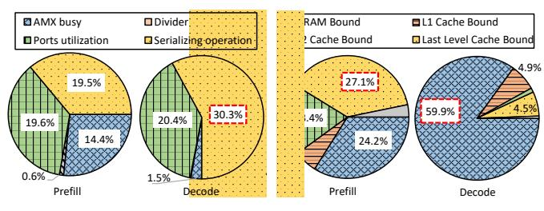

- (a) Core bound breakdown.
- (b) Memory bound breakdown.

Fig. 8: Decomposed AU demands on backend resources.

abundant frontend resources for AU, backend resources are under strain and restrict AU performance, as shown in Figure 7. To investigate the overload causes, we further decompose the backend resource in Figure 8.

Figure 8a breaks down the core bound. We find that the instruction window resources [50] (e.g., reorder buffer) are critical for AU execution due to high serializing operations to guarantee instruction sequences. Meanwhile, the decode phase has higher demands on the instruction window resources with higher serializing ratios. As for more severe memory bound, we break down the memory path (L1 cache, L2 cache, LLC, DRAM) in Figure 8b. We find that for the decode phase, DRAM access has the highest influence, specifically on memory bandwidth rather than memory access latency. For the prefill phase, the memory access path across the cache hierarchy and memory affects AU performance similarly.

**Findings #3:** AU microarchitectural resource bounds are variable and dissimilar from before, complicating AUV and optimal resource sharing decisions.

## V. DEFICIENCY OF AUV-OBLIVIOUS SHARING

The complex three-dimensional AUV pose new challenges to conventional sharing management. AUV-oblivious sharing based on simultaneous multi-threading (SMT) and resource partitioning (RP) fails to optimize AU-enabled processors for contradictory performance and efficiency goals.

#### A. Real-world Sharing Scenarios with AU

Workload sharing is a common practice in datacenters to utilize redundant resources and improve overall efficiency [48], [49], [90]. Regarding AU processors, sharing is between AIbased applications with AU and general applications without AU, where AU is not shared for hyperthreads, since AU resources are limited for physical cores. As for sharing priority, LLM serving is considered latency-critical (LC) in this paper and we share it with other best-effort (BE) applications for two reasons. Firstly, LLM applications are mostly user-facing scenarios, leading to its high sensitivity on SLO guarantee. Secondly, it is rare to co-locate many LC workloads in realistic datacenters for better performance guarantee. We select three representative BE applications based on real-world parameters: (1) Memory-intensive online analytical processing (OLAP) uses TPC-H [86] to replay joint queries, evaluated by query throughput. (2) Compute-intensive prime number

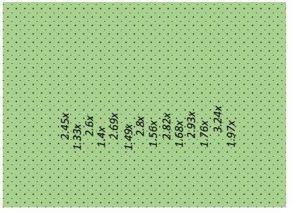

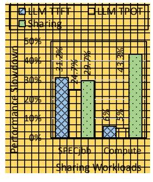

- (a) Impact of sharing pressures on AU and shared applications.
- (b) Impact of shared application types.

Fig. 9: Variable SMT impact on AU sharing performance.

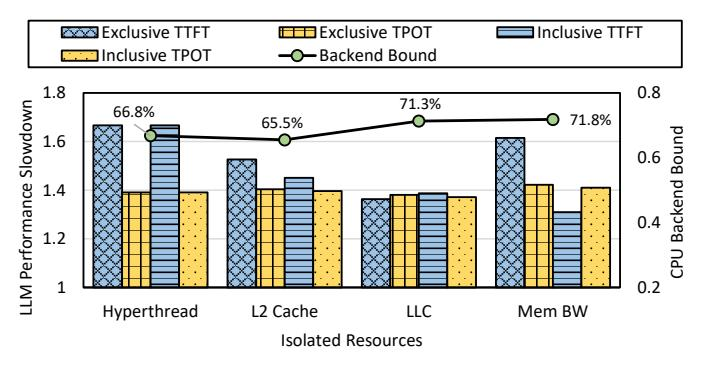

Fig. 10: AUV-oblivious resource sharing impact on AU performance. Exclusive means partitioning the single resource. Inclusive means partitioning all resources on the left.

division (*Compute*) uses sysbench [39] to perform repeated computations, evaluated by event throughput. (3) Complicated Java server (*SPECjbb*) uses SPECjbb 2015 benchmark [75] to perform parallel transactions, evaluated by transaction throughput. The sharing selections are determined before the execution for different AU usage scenarios.

## B. Deficiency of Conventional SMT Sharing

SMT-based sharing methods treat AU applications statically and cause variable performance degradations. Conventional SMT uses redundant processor resources to execute multiple threads on one processor core [101], failing to capture dynamic AU usages and interferences as shown in Figure 9. Figure 9a shows that AU performance degrades by more than 200\% while the co-running OLAP is affected by more than 40%, resulting from severe memory contentions. WE find that the interferences are unstable with variable AU usages but stable with increased sharing pressures. Figure 9b shows that compute-intensive shared application causes less than 10% AU interference, but sharing *Compute* experiences 40% degradation due to compulsory frequency reduction. Therefore, AUVoblivious SMT sharing cannot properly control the variable AU behaviors and performance. Moreover, while SMT sharing is known to create contention-based security vulnerabilities for co-running user threads [17], researchers have proposed effective mitigation and isolation techniques without much

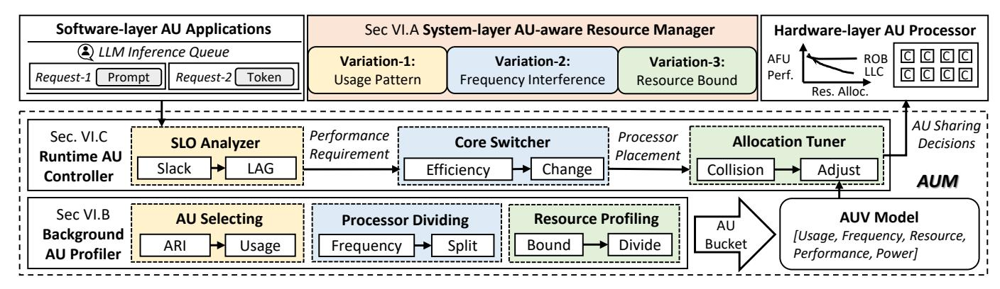

Fig. 11: Considerations of AUV and the workflow of two cooperative components of AUM.

loss of SMT performance [81], which lead to the widespread deployment of SMT sharing in production datacenters like ours in this paper.

## *C. Deficiency of Application-aware Resource Partitioning*

More advanced RP methods with application awareness cannot handle AUV and achieve optimal efficiency. RP controls shared resources via identifying application interference and allocating key resources (e.g., multi-level caches, memory bandwidth) separately [47]. We isolate three key backend resources between AU-accelerated LLM serving and SPECjbb to observe their exclusive and inclusive effects. As shown in Figure 10, we partition the L2 cache, LLC, and memory bandwidth based on software preferences [11] and normalize LLM serving performance to that under exclusive settings. We find that isolating backend resources separately can slightly relieve AU slowdown, but fails to achieve the optimal decision. Moreover, the critical backend bound is relieved differently by isolating various resources. Therefore, AUV-oblivious resource sharing cannot fully unleash the efficiency potential.

