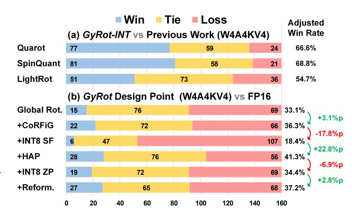
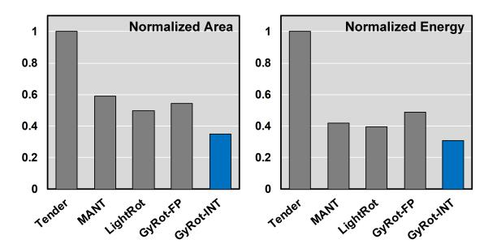
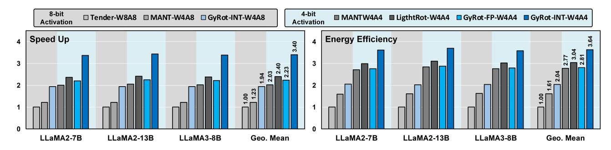
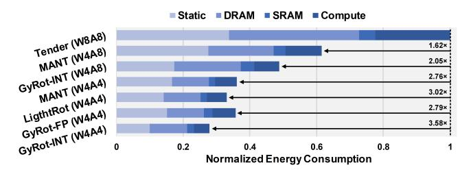

# *A. Experiment Setup*

Model and datasets. We evaluate *GyRot* on three families of LLMs, including LLaMA [43], LLaMA-2 [44], and LLaMA-3 [13], covering a range of model architectures and sizes. Depending on the evaluation objective, we select different LLaMA families to ensure fair and appropriate comparisons. To assess quantization quality, we first measure the perplexity (PPL) on the WikiText-2 dataset [38], a standard benchmark for evaluating a model's basic language generation capability. While PPL does not fully capture task-specific or conversational performance, it provides a quick and consistent metric for comparison with prior work in language modeling. For this evaluation, we include both LLaMA-1 and LLaMA-2 to maintain alignment with widely used baselines in the quantization literature.

For task-level evaluation, we conduct zero-shot inference on various benchmarks, including PIQA [2], ARC-e, ARC-c [6], BoolQ [5], HellaSwag [52], and WinoGrande [34], which collectively test commonsense reasoning, factual understanding, and logical inference. The evaluations are performed using the LM-Evaluation-Harness framework [12]. Since these tasks require stronger generalization and reasoning capabilities, we focus on more capable models such as LLaMA-2 and LLaMA-3. Finally, to evaluate the overall response quality and practical usefulness of quantized models, we adopt the MT-bench [56] framework, which utilizes LLM-as-a-Judge, a method that leverages strong reference models to assess human-likeness and interaction quality. For this setting, we use LLaMA-3-8B-Instruct, an instruction-tuned variant specifically optimized for dialogue-based use cases.

Quantization Method. We compare the quantization accuracy of *GyRot* against two hardware baselines that efficiently handle dynamic scales in LLMs by adjusting quantization granularity:

- Tender: LLM accelerator that mitigates outliers by chunking activation channels and grouping them such that adjacent scaling factors differ by a 1-bit shift, which is absorbed during accumulation.
- MANT: Applies group quantization using a flexible data format that supports diverse distributions. It adopts a group size of 64.

Since these baselines adopt bit-flexible architectures, we evaluate multiple design points: W4A4 for all cases, W8A8 for Tender, and W4A8 for MANT, to include high-precision configurations.

As rotation-based quantization is not yet widely adopted in hardware, we additionally compare against three algorithmic baselines and one hardware accelerator baseline, all evaluated under the W4A4 configuration to emphasize high-performance inference:

- Quarot (Algorithmic baseline): Applying Hadamard matrix as rotation matrix. It performs global rotation across all channels.
- SpinQuant (Algorithmic baseline): Extends Hadamard rotation matrices into a trainable space and uses Cayley optimization to improve rotation quality.
- DuQuant (Algorithmic baseline): Uses a two-stage local rotation with an intermediate permutation that globally redistributes outlier channels to further flatten the distribution.
- LightRot: Combines rotation and asymmetric group quantization with outlier-aware permutation at a granu-

larity of 128. (Similar to CoRFiG with R = G = 128) While effective, it relies on floating-point zero-points, resulting in high dequantization overhead and limited scalability to smaller group sizes such as 64 or 32.

Relationship to LightRot. LightRot introduces outlier direction aligning, effectively aligning prominent channels to the all-ones row of a Hadamard block under the constraint R=G. In contrast, GyRot decouples the rotation scope from the grouping granularity (CoRFiG, R=2g · G) and aligns outliers to multiple harmonic rows using HAP, which tightens per-group ranges and reduces the precision requirement of scale/zero-point. Together with our reformulated asymmetric quantization and ceiling-based ZP rounding, this enables fullyinteger dequantization (INT8 SF/ZP).

To ensure a fair comparison, all rotation-based baselines use dynamic, asymmetric, per-token quantization for activation values. The KV cache is quantized using asymmetric quantization with a group size of 128, and weights are symmetrically quantized using GPTQ [11] after applying rotation. *GyRot* is configured with a group size of 32 for both activation and weight, and 128 for the KV cache. It employs rotation with asymmetric group quantization, as detailed in Section IV.

Hardware implementation. We evaluate the performance and energy consumption of *GyRot* compared to baseline accelerators. The processing element (PE) and all associated components are implemented in RTL using SystemVerilog, and their functionality is verified through RTL simulation. We synthesize *GyRot* using Samsung's 28nm technology node with Synopsys Design Compiler [41], targeting an operating frequency of 1 GHz to match prior work [21]. On-chip SRAMs are generated using a commercial memory compiler with the same technology node. All accelerators are evaluated under iso-compute-area constraints, taking into account both the main computation and the dequantization logic. DRAM power is estimated using the DDR4 model from the Micron DRAM Power Calculator [28].

#### *B. Accuracy Evaluation*

Perplexity Comparison with Prior Work. To provide a quantitative comparison with prior implementations, Table I reports the PPL achieved under various quantization configurations. GyRot-FP and GyRot-INT represent two design points of *GyRot*, scaling factor (SF) and zero-point (ZP) are represented in FP16 or INT8, respectively.

Tender achieves comparable PPL to FP16 when using W8A8, but suffers a significant drop in accuracy at W4A4. MANT with W4A8 outperforms Tender-W8A8, yet GyRot-INT-W4A8 surpasses both, even with fully integer SF and ZP. At the W4A4 configuration, Quarot, SpinQuant and DuQuant recover much of the accuracy loss through the use of rotation, while MANT performs even better by applying group quantization. LightRot further improves accuracy by combining asymmetric group quantization with rotation. However, GyRot-FP achieves the best PPL with a smaller group size, and notably, GyRot-INT maintains competitive accuracy even under fully integer quantization of SF and ZP.

Fig. 9. Evaluation with LLM-as-a-Judge on MT-Bench [56], (a) Comparison with previous work (b) Progressive inclusion of our key contributions.

Zero-Shot Task Evaluation on Rotation Algorithms. To compare rotation-based quantization schemes under lowprecision settings, Table II presents zero-shot task accuracy with a consistent 4-bit configuration (W4A4KV4).

Across all model sizes, *GyRot-INT* consistently outperforms prior methods, including Quarot, SpinQuant, and LightRot, despite using fully integer SF and ZP. For example, on LLaMA-3-8B, while Quarot shows a 7.3% accuracy drop from fullprecision, *GyRot-INT* narrows this gap to just 1.2%, achieving 72.98%. These results confirm that *GyRot*'s quantization not only preserves perplexity but also delivers strong task-level accuracy under fully integer quantization.

Conversational Performance Evaluation with MT-Bench. Fig. 9(a) compares *GyRot-INT* with prior rotation-based methods under the W4A4KV4 configuration, using the MT-Bench framework with LLM-as-a-Judge across 160 turns. The adjusted win rate is computed by treating each tie as a 0.5 win. Based on this metric, *GyRot* consistently outperforms previous methods, achieving 66.6%, 68.8%, and 54.7% against Quarot, SpinQuant, and LightRot, respectively.

Fig. 9(b) presents a breakdown of how each design choice in *GyRot* contributes to the final performance, relative to full-precision (FP16) responses. All design points use group quantization with a group size of 32. Starting with global rotation alone, the win rate is 33.1%, but incorporating CoR-FiG improves performance by +3.1%p by better aligning rotation scope with group quantization. In contrast, directly quantizing SF to INT8 results in a substantial drop (–17.8%p). Adding HAP significantly recovers performance (+22.8%p), demonstrating its ability to preserve distribution locality even after rotation. Although quantizing ZP to INT8 reduces win rate (–6.9%p), the reformulated asymmetric quantization and ceiling-based ZP rounding recover performance, reaching 37.2% win rate. These results validate that each component of *GyRot*—particularly CoRFiG, HAP, and the reformulated asymmetric quantization—plays a critical role in preserving generation quality under low-precision settings (W4A4) with integer-quantized SF and ZP.

Design Point Analysis of CoRFiG+HAP. To intuitively analyze the effects of group size and rotation size, we conduct

TABLE I
COMPARISON OF PERPLEXITY (PPL) AND CONFIGURATION WITH PREVIOUS METHODS.

| Method    | W         | Precision A | KV     | Group SF | Quant. ZP | Rot.         | LLal 1-7B | MA-1 1-13B | LLa: 2-7B | MA-2 2-13B |
|-----------|-----------|----------------|--------|-------------|--------------|--------------|--------------|---------------|--------------|---------------|
| FP16      | 16        | 16             | 16     | -           | -            | -            | 5.68         | 5.09          | 5.47         | 4.88          |
| Tender    | 8-Tensor  | 8-Tokens       | 16     | -           | -            | _            | 5.87         | 5.28          | 5.77         | 5.09          |
| MANT      | 4-G64     | 8-G64          | 16     | FP16        | -            | _            | 5.79         | 5.20          | 5.57         | 4.96          |
| GyRot-INT | 4-G32     | 8-G32          | 4-G128 | INT8        | INT8         | -            | 5.76         | 5.16          | 5.60         | 4.98          |
| Tender    | 4-Tensor  | 4-Tokens       | 16     | l –         | - 1          | _            | 23.85        | 13.68         | 36.47        | 55.08         |
| Quarot    | 4-Channel | 4-Token        | 4-G128 | _           | -            | $\checkmark$ | 6.37         | 5.59          | 6.25         | 5.49          |
| Spinquant | 4-Channel | 4-Token        | 4-G128 | _           | -            | ✓            | 6.12         | 5.39          | 5.96         | 5.74          |
| DuQuant   | 4-Channel | 4-Token        | 4-G128 | _           | -            | ✓            | 6.18         | 5.47          | 6.08         | 5.33          |
| MANT      | 4-G64     | 4-G64          | 16     | FP16        | -            | _            | 6.09         | 5.38          | 5.92         | 5.24          |
| LightRot  | 4-G128    | 4-G128         | 4-G128 | FP16        | FP16         | $\checkmark$ | 5.95         | 5.27          | 5.73         | 5.08          |
| GyRot-FP  | 4-G32     | 4-G32          | 4-G128 | FP16        | FP16         | ✓            | 5.86         | 5.22          | 5.67         | 5.03          |
| GyRot-INT | 4-G32     | 4-G32          | 4-G128 | INT8        | INT8         | $\checkmark$ | 5.89         | 5.22          | 5.88         | 5.03          |

TABLE II
ZERO-SHOT TASK ACCURACY COMPARISON OF ROTATION-BASED QUANTIZATION METHODS UNDER W4A4KV4 CONFIGURATION.

| M 11         | M.d. 1         | W-A-KV    |       |       | Bench | mark  |         |        |       |
|--------------|----------------|-----------|-------|-------|-------|-------|---------|--------|-------|
| Model        | Method         | Precision | PIQA  | ARC-e | ARC-c | BoolQ | HellaS. | WinoG. | Avg.  |
|              | Full Precision | 16-16-16  | 79.16 | 74.33 | 46.42 | 77.71 | 75.94   | 69.53  | 70.52 |
| LLaMA-2-7B   | Quarot         | 4-4-4     | 76.50 | 69.32 | 41.30 | 72.66 | 72.09   | 63.54  | 65.90 |
| LLdWA-2-7D   | Spinquant      | 4-4-4     | 76.88 | 71.08 | 40.44 | 74.40 | 73.51   | 65.82  | 67.0  |
|              | LightRot       | 4-4-4     | 78.18 | 72.73 | 43.69 | 75.60 | 74.35   | 67.72  | 68.7  |
|              | GyRot-INT      | 4-4-4     | 77.69 | 74.28 | 44.54 | 77.19 | 74.65   | 68.98  | 69.5  |
|              | Full Precision | 16-16-16  | 80.63 | 77.53 | 49.15 | 80.58 | 79.39   | 71.90  | 73.2  |
| LLaMA-2-13B  | Quarot         | 4-4-4     | 78.84 | 73.32 | 44.37 | 77.58 | 75.73   | 68.90  | 69.7  |
| LLawin-2-13D | Spinquant      | 4-4-4     | 78.29 | 74.49 | 46.67 | 76.76 | 75.22   | 67.72  | 69.8  |
|              | LightRot       | 4-4-4     | 79.33 | 76.47 | 48.72 | 77.68 | 77.84   | 70.96  | 71.8  |
|              | GyRot-INT      | 4-4-4     | 79.33 | 76.22 | 48.21 | 80.52 | 78.15   | 71.82  | 72.3  |
|              | Full Precision | 16-16-16  | 80.63 | 77.74 | 53.50 | 81.10 | 79.18   | 73.01  | 74.1  |
| LLaMA-3-8B   | Quarot         | 4-4-4     | 76.06 | 70.58 | 43.17 | 72.66 | 72.53   | 66.77  | 66.9  |
| LLawin-3-0D  | Spinquant      | 4-4-4     | 79.16 | 73.57 | 46.33 | 76.15 | 75.43   | 68.75  | 69.9  |
|              | LightRot       | 4-4-4     | 80.25 | 78.49 | 49.40 | 79.66 | 76.67   | 70.09  | 72.4  |
|              | GyRot-INT      | 4-4-4     | 79.65 | 78.16 | 51.45 | 80.67 | 77.40   | 70.56  | 72.9  |

TABLE III PERPLEXITY ACCORDING TO DIFFERENT GROUP AND ROTATION SIZES.

| Model | LLaMA-3-8B |       |      |          |      |       |        |
|-------|------------|-------|------|----------|------|-------|--------|
| Group |            |       | ]    | Rotation | Size |       |        |
| Size  | R32        | R64   | R128 | R256     | R512 | R1024 | Global |
| G32   | 30.12      | 27.83 | 7.41 | 7.36     | 6.89 | 6.91  | 7.04   |
| G64   | -          | 36.33 | 7.55 | 7.52     | 7.00 | 7.00  | 7.19   |
| G128  | _          | -     | 7.69 | 7.60     | 7.10 | 7.10  | 7.31   |

a detailed design space exploration of *GyRot-INT* on LLaMA-3-8B, as shown in Table III. Even with global rotation, smaller group sizes yield better perplexity, highlighting the benefits of fine-grained group quantization. However, when both the group and rotation scopes are small, the ability of rotation to distribute outliers diminishes, and increased inter-group variance leads to PPL degradation under quantized SF and ZP. As the rotation size increases, PPL improves and saturates around R1024, ultimately outperforming global rotation. Based on this analysis, we select the G32–R1024 configuration as the default design point in our evaluation. These findings confirm that decoupling the granularity of rotation and group quantization enables a more flexible and accurate quantization design.

Scaling Factor and Zero-Point Quantization To understand how CoRFiG and HAP influence the precision re-

quirements of SF and ZP in asymmetric quantization, we analyze the perplexity sensitivity under different bit-widths. As shown in Table IV, standard group quantization (GQ-only) suffers substantial degradation when SFs are quantized to FP8 or INT8, requiring FP16 to maintain acceptable perplexity. CoRFiG alleviates this sensitivity, narrowing the gap between FP16 and FP8. With HAP, quantization becomes notably robust—INT8 SF yields nearly identical perplexity (6.80) to FP16, demonstrating the enhanced stability of the GyRot.

Table V examines the impact of asymmetric quantization schemes and ZP rounding strategies on different ZP precisions. While applying CoRFiG + HAP improves perplexity, it also increases sensitivity to ZP precision. Naive rounding in the conventional asymmetric quantization leads to significant degradation under INT8 precision. Reformulating the asymmetric quantization formula narrows the gap between FP16 and INT8, and further replacing rounding with a ceiling-based strategy restores INT8 performance to near parity with FP16 (6.91 vs. 6.81). These results demonstrate that *GyRot* can achieve low perplexity even with low-precision SF and ZP by carefully co-designing the quantization formulation and rounding mechanism.

Comparison of Rotation Algorithms under Group

TABLE IV EFFECT OF CORFIG AND HAP ON SCALING FACTOR PRECISION REQUIREMENTS.

| Model                | LLaMA-3-8B |              |              |              |                |
|----------------------|------------|--------------|--------------|--------------|----------------|
|                      |            | Size         |              | SF Precision |                |
| Method               | Group      | Rotation     | FP16         | FP8          | INT8           |
| GQ-only              | 32         | –            | 7.40         | 13.38        | 416.15         |
| CoRFiG CoRFiG+HAP | 32 32   | 1024 1024 | 6.91 6.80 | 7.03 6.84 | 364.17 6.80 |

TABLE V

IMPACT OF ASYMMETRIC QUANTIZATION SCHEMES AND ZP ROUNDING STRATEGIES ON ZERO-POINT PRECISION.

| Model                                  | LLaMA-3-8B                  |                                 |                      |                      |                      |  |
|----------------------------------------|-----------------------------|---------------------------------|----------------------|----------------------|----------------------|--|
| Method                                 | Formula                     | Asymmetric Quant. ZP Quant.  | FP16                 | ZP Precision FP8  | INT8                 |  |
| GQ-only                                | –                           | –                               | 7.21                 | 19.37                | 7.21                 |  |
| CoRFiG                                 | Conv.                       | Rounding                        | 6.96                 | 6.97                 | 6.96                 |  |
| CoRFiG+HAP CoRFiG+HAP CoRFiG+HAP | Conv. Reform. Reform. | Rounding Rounding Ceiling | 6.81 6.80 6.81 | 6.91 6.83 6.83 | 7.93 7.65 6.91 |  |

Quantization. Table VI highlights how rotation strategies interact with group quantization. Quarot (global rotation) benefits as groups get finer, but only modestly (7.31→7.04). DuQuant's two-stage rotation with global redistribution improves the per-channel case over Quarot yet shows *minimal* gains as group size shrinks (8.06→7.98), consistent with our analysis in Sec. IV-A that aggressively dispersing outliers is non-synergistic with fine-grained grouping. In contrast, LightRot and GyRot—both preserving locality—achieve substantially lower PPL under FP16 SF and ZP, with LightRot slightly leading and GyRot closely matching. Crucially, when SF/ZP are quantized to INT8, LightRot's reliance on high-precision zero-points leads to large degradation (7.69/36.33/30.12 at G=128/64/32), whereas GyRot maintains robustness (7.10/7.00/6.91) thanks to decoupled rotation scope (CoRFiG), harmonic alignment (HAP), and the reformulated asymmetric quantization.

Evaluation in an extremely Low-bit Setting. To further validate the robustness of GyRot in the low-bit regime, we evaluate its performance under a more aggressive 3 bit weight quantization (W3A4 configuration). As shown in Table VII, GyRot maintains strong performance even in this extremely low-bit condition, achieving comparable perplexity to LightRot and consistently outperforming Quarot across all model scales. In particular, GyRot-FP achieves 6.20/5.48 PPL

TABLE VI PERPLEXITY ACCORDING TO DIFFERENT GROUP SIZES.

| Model                   |       |         | LLaMA-3-8B         |       |       |
|-------------------------|-------|---------|--------------------|-------|-------|
| Configuration Method | SF/ZP | Per-Ch. | Group Size G128 | G64   | G32   |
| Quarot                  | FP16  | 8.16    | 7.31               | 7.19  | 7.04  |
| DuQuant                 | FP16  | 8.06    | 8.02               | 8.03  | 7.98  |
| LightRot                | FP16  | –       | 6.99               | 6.87  | 6.80  |
| GyRot                   | FP16  | –       | 7.01               | 6.91  | 6.81  |
| LightRot                | INT8  | –       | 7.69               | 36.33 | 30.12 |
| GyRot                   | INT8  | –       | 7.10               | 7.00  | 6.91  |

TABLE VII PERPLEXITY WITH LOW-BIT QUANTIZATION (W3A4).

| W3A4KV4   | 1-7B | 1-13B | LLaMA 2-7B | 2-13B | 3-8B |
|-----------|------|-------|---------------|-------|------|
| Quarot    | 6.67 | 5.82  | 6.91          | 5.89  | 9.17 |
| LightRot  | 6.30 | 5.54  | 6.16          | 5.44  | 8.00 |
| GyRot-FP  | 6.20 | 5.48  | 6.16          | 5.48  | 7.73 |
| GyRot-INT | 6.22 | 5.49  | 6.64          | 5.50  | 7.83 |

Fig. 10. PE area and energy comparison

on LLaMA-1-7B/13B, matching or surpassing prior rotationbased methods, while GyRot-INT shows only marginal degradation despite using fully integer scaling and zero-points. These results confirm that the cooperative rotation–group quantization design of GyRot remains effective even when bit precision is aggressively reduced, demonstrating its applicability beyond the standard 4-bit regime.

#### *C. Power, Performance and Area Evaluation*

PE-level evaluation. Fig. 10 presents the normalized area and energy consumption of different LLM accelerators under iso-throughput conditions. All designs are synthesized in 28nm at 1GHz, based on the configuration detailed in Table I. For a fair comparison, Tender is modified to use dedicated 8-bit datapaths, removing any reconfiguration overhead associated with 4-bit operations. All other designs operate with 4-bit precision using group quantization, and their respective dequantization units are integrated into the PE based on group sizes: 128 for LightRot, 64 for MANT, and 32 for GyRot. Tender, MANT, and LightRot adopt 2D systolic PE arrays, while *GyRot* utilizes a 3D tensor PE array with systolic dataflow, as detailed in Section V. Compared to Tender, *GyRot-FP* achieves a 45.6% area reduction and 51.0% energy savings by leveraging lowbit group quantization combined with rotation for accuracy. However, the small group size of 32 increases dequantization overhead, resulting in higher cost compared to MANT and LightRot. MANT and LightRot employ group quantization with floating-point SF—LightRot additionally uses floatingpoint ZP—leading to extra hardware cost from FP arithmetic. By contrast, *GyRot-INT* demonstrates the advantage of a fully integer implementation using INT8 SF and ZP, achieving the highest hardware efficiency with 65.2% area and 69.2% energy reduction over Tender.

System-level Performance and Energy Analysis. Fig. 11 presents the speedup and energy efficiency of *GyRot* compared to prior bit-flexible LLM accelerators under configurations that achieve similar accuracy levels, according to Table I. For 8-

Fig. 11. Speedup and energy efficiency comparison across accelerators on WikiText2 with various bit configurations.

Fig. 12. Energy breakdown of GyRot in contrast with the baseline accelerators. Energy consumption with the LLaMA3-8B inference is evaluated.

bit baselines, we compare against Tender-W8A8 and MANT-W4A8; for 4-bit settings, we include MANT-W4A4, LightRot-W4A4, and both FP and INT variants of GyRot-W4A4.

Across all LLaMA models, *GyRot-INT* consistently outperforms existing methods in both performance and energy efficiency. It achieves a geometric mean speedup of 3.40× and energy efficiency improvement of 3.64× over the 8-bit Tender baseline. Compared to other group quantization baselines (MANT and LightRot), *GyRot-INT* delivers 41.7–67.5% higher speedup and 19.8–31.4% better energy efficiency on average. These gains stem from two sources: the use of a pure integer tensor PE without complex number formats like those in MANT, and a fully integer-based dequantization unit that avoids the overhead of floating-point scaling, biasing, and accumulation found in both LightRot and MANT.

Fig. 12 shows the detailed energy breakdown when running LLaMA3-8B inference, categorized into static, DRAM, SRAM, and compute components. Compared to Tender, *GyRot-INT* achieves substantial energy savings primarily through reduced DRAM access enabled by 4-bit operations and lower static power consumption resulting from its higher area efficiency and throughput. While prior 4-bit accelerators such as MANT and LightRot reduce compute energy via group quantization, they still incur significant energy and area overhead from floating-point dequantization. In contrast, *GyRot-INT* leverages a fully integer-based dequantization pipeline to minimize this cost. Although the tensor PE architecture of GyRot slightly increases SRAM energy, this is outweighed by the greater reduction in compute energy, resulting in the lowest total energy consumption among all 4-bit accelerators.

Power and Area Breakdown. Table VIII summarizes the area and power distribution of the proposed *GyRot-INT* accelerator. The majority of the area is occupied by the 512KB global buffer (57.1%), which is shared across the chip

TABLE VIII AREA AND POWER BREAKDOWN OF THE PROPOSED ACCELERATOR

| Component   | Configuration         | Area [mm2 ] | Power [mW]      |
|-------------|-----------------------|----------------|-----------------|
| PE Array    | 8×8×32 INT Tensor     | 0.26 (12.4%)   | 410.24 (55.4%)  |
| PE Array    | 8×8 Dequant. + Accum. | 0.09 (4.2%)    | 118.40 (16.0%)  |
| W SUM unit  | 8×32-way Adder-Tree   | 0.01 (0.5%)    | 17.09 (2.3%)    |
| Input Buf.  | 64KB + 8KB (SF/ZP)    | 0.24 (11.4%)   | 82.43 (11.1%)   |
| Weight Buf. | 64KB + 4KB (SF)       | 0.23 (10.8%)   | 64.38 (8.7%)    |
| Global Buf. | 512KB                 | 1.20 (57.1%)   | 41.63 (5.6%)    |
| OVU         | 32-way + FHT unit     | 0.07 (3.5%)    | 6.78 (0.9%)     |
| Total       |                       | 2.10 (100.0%)  | 740.95 (100.0%) |

for activations and intermediate storage. The integer tensor PE accounts for 12.4% of the area and more than half of the total power consumption (55.4%), reflecting its central role in computation. The dequantization and accumulation logic, tightly integrated within each PE, introduces a modest overhead of 4.2% in area and 16.0% in power. The FVU, responsible for non-linear vector operations and rotation using FHT, contributes minimally to the overall cost, consuming only 3.5% of the area and 0.9% of the power.

