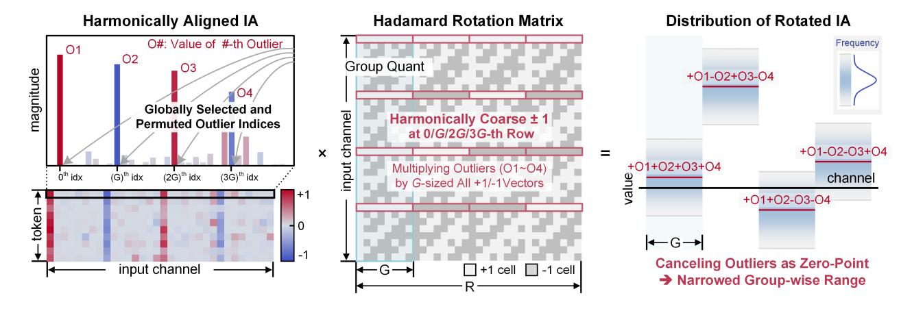
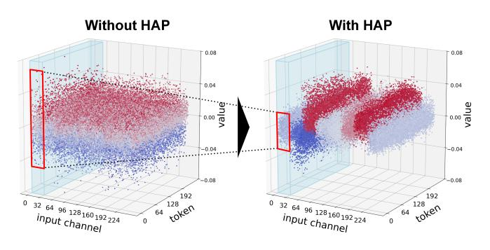
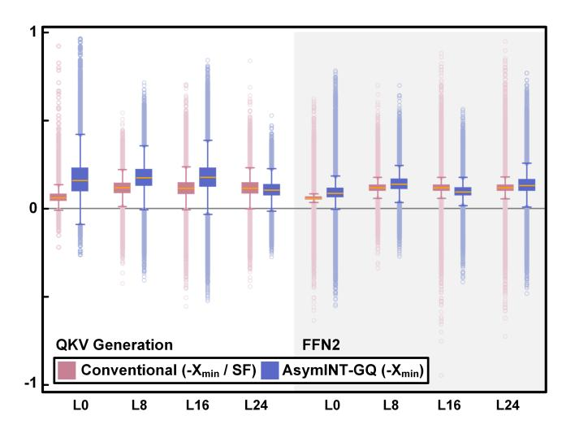
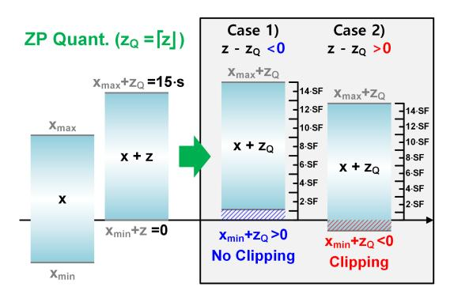
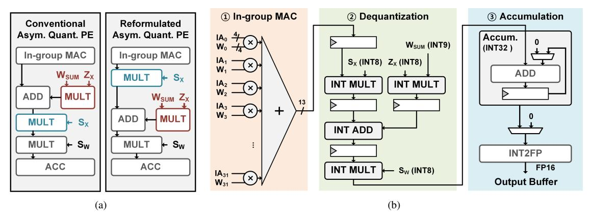
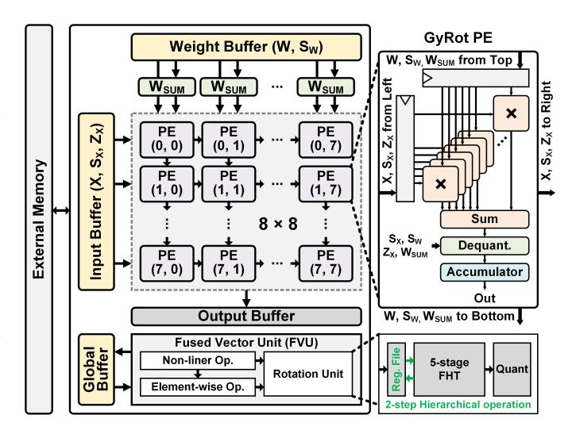

# *A. Rotation for Fine-grained Group Quantization*

Rotation and fine-grained group quantization are noncooperative by default because they take opposing approaches to improving quantizability. Rotation applies a transformation (e.g., a rotation matrix) to activations or weights, globally redistributing values across all channels. This operation naturally *amortizes the influence of outliers across the entire tensor*, thereby flattening the distribution and enhancing quantizability. In contrast, group quantization preserves the original structure of the data but partitions it into smaller groups, each quantized independently using its own scaling factor (and possibly zero-point). This approach *isolates the impact of outliers within each group*, allowing for finergrained adaptation to local distribution variations. Therefore, while group quantization focuses on containing outlier effects locally, rotation aims to spread them globally—revealing a fundamental mismatch that *undermines their compatibility* when applied together.

Building on this insight, we propose Coarse-Rotation Fine-Grouping (CoRFiG) and Harmonic-Aligned Permutation (HAP), as illustrated in Fig. 3, which tailor the rotation strategy to better cooperate with fine-grained group quantization.

Instead of applying global rotation across the entire channel dimension, CoRFiG performs rotation locally within a specified rotation scope R, where R = 2r < Nch for a positive integer r. To preserve the flattening benefits of rotation, CoRFiG chooses a sufficiently large R—referred to as coarse rotation. Specifically, it maintains the relation R = 2g · G, where G is the group size used for quantization and g is a positive integer. This design enables effective redistribution of outliers within the local scope R, achieving a flattened distribution

Fig. 3. Proposed quantization algorithm: Coarse-Rotation, Fine Grouping (CoRFiG) with Harmonic-Aligned Permutation (HAP). (G = 8, R = 32 case.)

Fig. 4. Effect of HAP on activation distribution after rotation.

and enhanced quantizability, while limiting the spread of each outlier to only R channels rather than the entire channel dimension. At the same time, by keeping the group size G small, CoRFiG preserves the benefits of fine-grained group quantization. This coarse–fine decoupling balances the tradeoff between outlier amortization and localized adaptation. Our evaluation in Section VI primarily focuses on the configuration R = 1024, G = 32.

While CoRFiG ensures sufficient flattening within R channels and isolates the influence of outliers across rotation scopes, HAP further improves quantizability by aligning group-wise ranges using the harmonic characteristics of the Hadamard matrix. As described in Equation (1), Hadamard matrices are recursively constructed. A Hadamard matrix of size 2 n+1 × 2 n+1, denoted Hn+1, is composed of two Hn matrices: the top half as [Hn, Hn] and the bottom half as [Hn, −Hn]. Due to this recursive structure, Hadamard matrices contain repeating "harmonically coarse" ±1 vectors—i.e., length-2 k vectors of all +1 or all −1—at regular strides of 2 k for k < n, forming structured harmonic patterns.

As illustrated in Fig. 3, HAP leverages these harmonic rows to separate the range of each group after rotation. For example, with G = 8 and R = 32, we have R = 2g · G with 2 g = 4, implying that there are four coarse harmonic rows (G, 2G, 3G, 4G-th row). By permuting globally selected high-magnitude outlier channels (O1 ∼ O4) to align with these harmonic rows prior to rotation, each outlier is multiplied with a consistent sign (all +1 or all −1) within its group. As a result, unlike the unaligned case where outliers are randomly mixed with both +1 and −1, HAP produces group-wise distributions that are tightly bounded with shifted biases, as shown in Fig. 4. This group-wise range reduction not only reduces quantization error but also significantly lowers the precision requirements of the scaling factors used for each group, thereby reducing dequantization overhead.

However, while distribution within each group becomes narrower, the post-rotation distribution within each group becomes considerably asymmetric, potentially increasing the precision requirements of zero-points. In this case, the central value of each group is determined by linear combinations of the rotated outlier channels (e.g., +O1 + O2 + O3 + O4, +O1 − O2 + O3 − O4, etc.). To mitigate this, CoRFiG uses a sufficiently large rotation scope R relative to group size G, and additional asymmetric quantization optimizations are applied.

#### *B. Further Optimizing Asymmetric Quantization*

While the CoRFiG+HAP combination effectively improves quantizability and mitigates scaling factor precision requirements, the resulting group-wise distributions often become highly biased and asymmetric. However, under such highly asymmetric distributions, conventional asymmetric quantization suffers from an expanded zero-point range, which limits hardware efficiency. In this section, we reformulate asymmetric quantization to better align with the characteristics of CoRFiG-HAP and adjust the rounding policy to further enhance robustness.

Reformulating Asymmetric Quantization. As explained in Equation (4), conventional asymmetric quantization performs scaling first, followed by zero-point biasing: xˆ = ⌊x/sx + zx⌉. In this formulation, the zero-point is defined in the scaled domain as zx = − min(xg)/sx. For typical activation distributions—where the degree of asymmetry is relatively mild compared to the full dynamic range—the resulting zeropoint values tend to stay within a narrow range. However,

Fig. 5. Comparison of zero-point distributions in conventional and reformulated quantization. The boxes represent the second and third quartiles and the median, the whiskers indicate the 1% and 99% percentiles, and the circle represents outliers. zero-points are normalized with per-layer power-of-two scale.

Fig. 6. Effect of zero-point quantization according to the sign of quantization error.

in cases of highly asymmetric activations—particularly under HAP—this formulation can produce extremely long-tailed zero-point distributions due to the small values of sx.

To address this issue, we reformulate the quantization procedure by reversing the order of zero-point biasing and scaling. Specifically, we define the quantized value as xˆ = ⌊(x + zx)/sx⌉, where the zero-point is computed directly from the unscaled domain as zx = − min(xg). This reformulation avoids division during zero-point calculation, thereby mitigating the amplification effect caused by small scaling factors.

As illustrated in Fig. 5, the proposed formulation yields significantly flatter zero-point distributions. The figure presents box plots of normalized zero-points across eight LLaMA-3- 8B layers, including QKV and FFN components. Unlike the conventional method, which exhibits long-tailed distributions with narrow box ranges and prominent outliers, our method produces wider box ranges, indicating shorter tails and lower kurtosis.

Rethinking the Rounding Strategy for Zero-Point. In addition to reformulation, we analyze the impact of the zeropoint rounding strategy on quantization error. Asymmetric quantization shifts the data range by adding a zero-point zx, mapping the minimum value to 0 and the maximum to 2 b −1. However, quantizing zx itself introduces a rounding error δz = z − zQ, which affects the placement of the minimum value, as illustrated in Fig. 6.

If δz ≤ 0, the shifted minimum xmin + zQ ≥ 0, and no clipping occurs—although some portion of the quantization range is wasted. In contrast, if δz > 0, then xmin + zQ < 0, resulting in range underflow and data clipping, which leads to significant quantization error.

To avoid this clipping behavior, we replace the conventional *rounding* operation with a *ceiling* function when quantizing the zero-point. This guarantees zQ ≥ z, ensuring that the shifted minimum remains within the valid range and eliminating the risk of underflow at the lower bound.

Final Formula. The reformulated group-wise asymmetric quantization is summarized as:

$$\hat{x}_i = \operatorname{clip}\left(\left\lfloor \frac{x_i + z_x}{s_x} \right\rceil, \ q_{\min}, \ q_{\max}\right),$$

$$z_x = \left\lceil -\min(x_g) \right\rceil, \quad s_x = \frac{\max(x_g) + z_x}{2^b - 1}.$$
(6)

This formulation also modifies the dequantization process used during matrix multiplication. When both weights and activations are quantized, the inner product is computed as:

$$y \approx \sum_{g \in \mathcal{G}} s_w^{(g)} \cdot \left( s_x^{(g)} \cdot \sum_{i \in g} \hat{x}_i \cdot \hat{w}_i - z_x^{(g)} \cdot \sum_{i \in g} \hat{w}_i \right)$$
 (7)

Compared to the conventional formulation in Equations (4) and (5), the only change lies in the order of operations: the scaling factor and zero-point are applied in reverse order. Note that we apply a *ceiling* function when computing the zeropoint to ensure range safety and prevent underflow during quantization.

In summary, we reformulate asymmetric quantization to align with CoRFiG-HAP, which introduces severe group-level asymmetry through localized outlier alignment.

#### V. GYROT MICROARCHITECTURE

This section outlines the microarchitectural details of *GyRot* that enable efficient and accurate low-bit LLM inference. Our accelerator integrates architectural components that support the combined use of rotation and group quantization, as described in Sec. IV-B. It also supports efficient computation with asymmetrically quantized input, as detailed in Sec. IV-C.

#### *A. Processing Element for Reformulated Asymmetric Quant.*

The use of asymmetric and group quantization requires large dequantization operations and inter-group accumulation. Moreover, as the group size decreases, the hardware cost (in area and energy) of dequantization becomes significant. By leveraging CoRFiG, HAP, and reformulated asymmetric quantization, *GyRot* utilizes a fully integer dequantization datapath with integer-quantized scaling factors and zero-points. As shown in Fig. 7(a), the reformulated dequantization operation derived from Equation 6 simply changes the order of

Fig. 7. GyRot PE. (a) Operation flow change for reformulated asymmetric quantization (Equa. 6).(b) Microarchitecture.

operations: the activation scaling factor SX is applied first, followed by the addition of the zero-point term (ZX ×WSUM). The detailed microarchitecture of the *GyRot* PE is depicted in Fig. 7(b): ⃝1 In each cycle, the PE performs a 32-way dot product between 4-bit integer input activations (X0∼31) and 4-bit integer weights (W0∼31). This configuration supports a minimum group size of 32 under INT4 quantization, and the resulting dot product yields a 13-bit partial sum. ⃝2 The partial sum is then processed through the dequantization stage. The activation scaling factor SX is applied to the partial sum; concurrently, the zero-point ZX is multiplied by the precomputed group-wise weight sum WSUM = P i∈g wˆi and added to the result. Finally, the weight scaling factor SW is applied to complete the dequantization. All arithmetic operations are pipelined, and the associated metadata (SX, ZX, SW ) are represented with 8-bit integer precision. ⃝3 Since the entire computation remains within the integer domain, the resulting value can be accumulated using a 32-bit integer accumulator. Before writing the final output to the buffer, the accumulated value is converted to FP16 to reduce the output bitwidth.

## *B. GyRot Accelerator*

Fig. 8 shows the architectural overview of the *GyRot* accelerator. The accelerator adopts an 8 × 8 systolic PE array, where each PE supports 32-way 4-bit dot products, with group quantization applied. This configuration allows the 8×8×32 tensor array to perform 2048 operations in parallel. The systolic array operates in an output-stationary manner. Each PE performs dot products for intra-group accumulation and applies dequantization to enable sequential inter-group accumulation. The input buffer stores input activations and their associated quantization metadata (X, SX, ZX), while the weight buffer stores weights and their scaling factors (W, SW ). The group-wise weight sum WSUM, required for asymmetric dequantization, is computed once and shared across the entire row. A multi-bank memory structure is employed for both input and weight buffers to provide sufficient bandwidth; dedicated banks are reserved for metadata.

Fig. 8. *GyRot* accelerator architecture.

The Fused Vector Unit (FVU) is integrated to support the rotation operations with CoRFiG and HAP, particularly when non-linear or element-wise functions are applied in between layers. While usual rotation operations can be fused into the weights of preceding or succeeding layers due to the rotationinvariance of matrix multiplication, certain rotations must instead be performed on-line when non-linear layers—such as self-gated activations [37] or embedding layers [39]—intervene between linear layers, as discussed in [1], [27]. To support such cases, a dedicated rotation and quantization unit is integrated within the FVU, enabling on-line rotation immediately after non-linear operations. When the FVU loads output activations from global memory, it performs the nonlinear or element-wise operation before applying the rotation; the results are then directly passed to the rotation units for fused execution. The rotation unit implements the Hadamard rotation using a fast Hadamard transform (FHT) [1], [19], requiring only O(n log2 n) additions and subtractions for rotating a vector of length n. We implement a 5-stage, 32 way FHT unit composed of 160 add/subtract units (32 units per stage). By incorporating a local register file and executing a two-stage scheme, the unit supports scalable rotations up to 32 × 32 = 1024 dimensions. Partial gating of the FHT lanes also enables sub-32 power-of-two sizes (2, 4, 8, 16, 32) without wasting energy. Thus, the FHT unit supports R to powers of two up to 1024, and the quantization group size G; under CoRFiG we choose R = 2g ·G with R ≤ 1024.

We implement a 5-stage, 32-way FHT unit composed of 160 add/subtract units (32 units per stage). By incorporating a local register file and executing a two-stage scheme, the unit supports scalable rotations up to 32 × 32 = 1024 dimensions. Partial gating of the FHT lanes also enables sub-32 powerof-two sizes (2, 4, 8, 16, 32) without wasting energy. Thus, the FHT unit supports rotation scopes R that are powers of two up to 1024, while the quantization group size G is chosen independently; under CoRFiG, we choose R = 2g ·G with R ≤ 1024.

Unlike rotation, the permutation required by HAP can be fused into the weights since both non-linear and elementwise operations are permutation-invariant. Therefore, by prepermuting the output channels of the weight matrix, the resulting activations become naturally permuted and can be directly passed to the FVU. Consequently, HAP introduces no additional run-time overhead, since its layer-specific permutations are pre-fused into the weights and require no online computation.

#### *C. Need of Dedicated Hardware for GyRot Algorithm*

While modern GPUs provide efficient tensor cores supporting low-bit integer or floating-point matrix multiplication, group-quantized inference still requires additional per-group scaling and zero-point biasing after the GEMM operation. These dequantization steps are executed on CUDA cores rather than tensor cores [25], [29], and thus are performed in floatingpoint precision. As a result, a software implementation on GPUs cannot fully exploit the efficiency of integer arithmetic, since intermediate results from integer GEMM must be converted to floating-point format for dequantization and accumulation. This mixed-precision execution path increases both latency and energy consumption, limiting the benefits of low-bit quantization.

In contrast, the proposed *GyRot* accelerator integrates a fully-integer dequantization datapath within each processing element. By performing all operations—including scaling and zero-point biasing—directly in the integer domain, GyRot eliminates frequent type conversions and floating-point overhead, achieving substantial improvements in hardware efficiency. Therefore, dedicated hardware support is essential to realize the full advantage of the GyRot algorithm.

