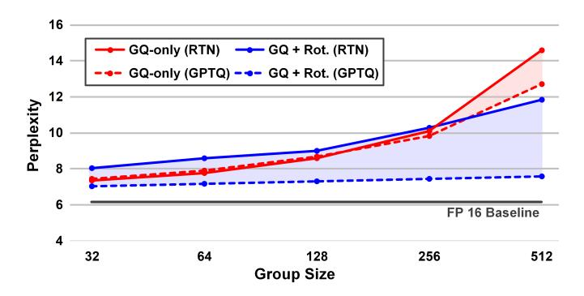
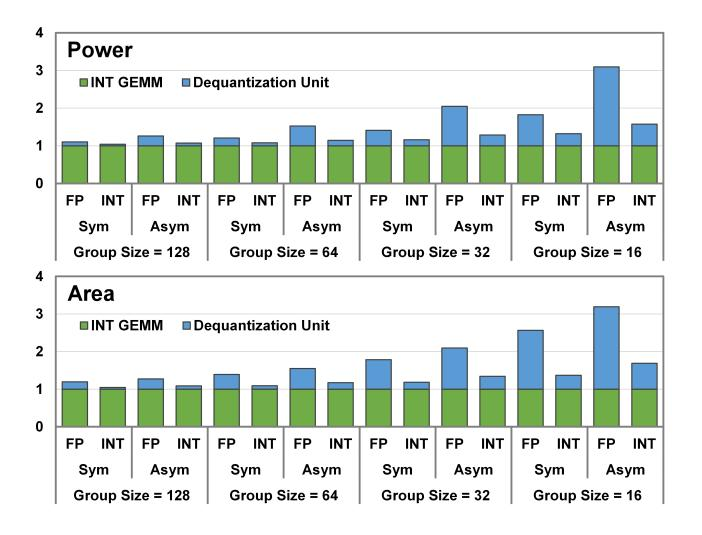

# I. INTRODUCTION

Large Language Models (LLMs) [13], [43], [44] have demonstrated breakthrough performance in various natural language understanding and generation tasks. However, their massive parameter count and computational intensity impose significant inference costs, especially in edge and datacenter environments with stringent latency, energy, and memory constraints. To address these challenges, low-bit quantization [1], [11], [16], [22]–[25], [27], [32], [33], [46]–[48], [50], [55] has emerged as a promising solution by compressing weights and activations to lower arithmetic precision.

Two of the most effective approaches for enhancing quantization accuracy are rotation-based quantization [1], [23], [27], [46], [47] and group quantization [4], [11], [16], [22], [24], [32], [33], [49], [55]. Rotation-based quantization employs orthogonal transformations, such as Hadamard matrices, to redistribute outliers and flatten directional variance, thereby improving quantizability. In contrast, group quantization divides channels into smaller groups, applying scaling factors and biases per group, which effectively balances numerical accuracy and hardware efficiency. Notably, recent trends have favored finer group sizes (16–64 channels) [4], [16], [20], [22], [32], [33], [49], moving away from the coarser sizes (128–1024 channels) used initially [11], [24], [55].

Despite their individual advantages, na¨ıvely combining rotation and group quantization often leads to non-cooperative interactions, especially at finer group sizes. Rotation inherently disperses outliers across channels, while group quantization thrives on localized scaling; merging these conflicting behaviors undermines scale coherence and increases quantization error. Recent studies, such as AMXFP [22], empirically validate this issue, showing accuracy deterioration when rotation is combined with small group sizes (e.g., 32 channels).

Moreover, fine-grained group quantization itself introduces frequent floating-point operations during dequantization. This overhead further escalates when asymmetric quantization is adopted, as it also requires per-group zero-point handling.

In this paper, we pose a fundamental question: *Can rotation and fine-grained group quantization be made cooperative—and if so, how can their synergy be effectively unlocked at both the algorithm and hardware levels?*

To answer this, we introduce GyRot, an algorithm-hardware co-design solution that effectively integrates rotation, group quantization, and asymmetric quantization for accurate and efficient low-bit LLM inference. We first identify that the primary cause of quantization degradation is the conflicting nature of rotation, which disperses outliers globally, and group quantization, which captures distribution locality. To resolve this misalignment, we propose precisely controlling the rotation scope, making it local enough to preserve group-level coherence. Moreover, by leveraging the harmonic characteristics of rotation matrices, we enforce locality even across groups, enabling effective integration of rotation with fine-grained group quantization under asymmetric quantization settings. This optimization also unveils hardware-level opportunities, such as reducing the required precision of scaling factors and zero-points, which significantly lowers the overhead of dequantization.

We propose GyRot with the following three contributions:

- We propose CoRFiG (Coarse Rotation, Fine Grouping), a novel method that applies rotation locally but at a coarser granularity compared to the quantization group size. This preserves local variances within quantization groups while still providing the benefits of distribution flattening.
- To further enhance this synergy, we introduce HAP (Harmonic-Aligned Permutation), which strategically

maps outlier channels to harmonic rows in the Hadamard matrix. HAP significantly improves quantization accuracy and reduces the precision requirements for scaling factors and zero-points.

- We reformulate asymmetric quantization to effectively mitigate the precision overhead caused by long-tailed zero-point distributions. Additionally, by carefully designing a zero-point rounding strategy, we eliminate zeropoint-induced clipping errors with minimal complexity, substantially alleviating the precision requirements of zero-points.
- We implement the GyRot accelerator, a systolic-arraybased inference engine featuring fully integer-based dequantization enabled by these algorithmic optimizations. Consequently, our design efficiently supports fine-grained group quantization (e.g., group size of 32) without incurring excessive floating-point overhead, achieving high throughput and energy efficiency while delivering stateof-the-art accuracy at 4-bit precision.

Experimental results demonstrate that GyRot outperforms state-of-the-art rotation and group quantization schemes in both accuracy and hardware efficiency. Across a range of LLM inference benchmarks, GyRot delivers higher quantization accuracy than prior algorithms such as Quarot [1] and SpinQuant [27], while our GyRot accelerator achieves a 1.42–3.40× speedup and 1.20–3.64× energy savings compared to recent designs like MANT [16], LightRot [19], and Tender [21].

#### II. BACKGROUND ON LLM QUANTIZATION

#### *A. Conventional LLM Quantization*

Quantizing LLMs is particularly challenging due to the prevalence of outliers in activation and weight distributions. While outlier-aware techniques have been explored in earlier neural networks [30], the issue has become more pronounced in transformer-based NLP models, which exhibit highly longtailed distributions [9], [26].

Initial approaches targeted fine-grained outliers at the element level, processing them separately to reduce quantization error [14], [15], [51]. In more recent LLMs, however, outliers tend to appear across channels [13], [42]–[44], [53], and addressing these channel-wise outliers is now widely adopted as the standard approach. For instance, Atom [55] identifies outlier channels and applies mixed-precision quantization by assigning higher bit-widths to them. In contrast, methods such as SmoothQuant [48] and AWQ [24] multiply each channel by an offline-determined scale to suppress inter-channel variance in input activations or weights, thereby improving quantizability.

## *B. Rotation-based Quantization*

Rotation-based quantization offers an alternative approach to distribution flattening by redistributing outliers across channels through a rotation transformation. A rotation matrix (e.g., the Hadamard matrix [1]) is applied to the input activation, effectively spreading the impact of large-magnitude values and reducing kurtosis, thereby making the input more quantizable. Notably, due to the rotation-invariance property of matrix multiplication, the inverse rotation can be fused into the weights, which guarantees computational equivalence, as formally demonstrated in [1].

Hadamard matrices, commonly constructed using Sylvester's method [1], provide a recursive and hardwareefficient way to generate orthogonal transformations. Starting from the base matrix, larger matrices can be constructed as follows:

$$H_1 = \begin{bmatrix} 1 & 1 \\ 1 & -1 \end{bmatrix}, \quad H_{n+1} = \begin{bmatrix} H_n & H_n \\ H_n & -H_n \end{bmatrix}$$
 (1)

This recursive structure allows for efficient computation using the Fast Hadamard Transform (FHT). Instead of directly multiplying a large rotation matrix Hn with O(n 2 ) operations, FHT requires only O(n log2 n) operations [45]. These properties enable efficient online rotation when required. Although parts of the rotation can be fused offline into the weights, online rotation remains necessary in layers with nonlinear operations (e.g., embedding, activation), making FHT a practical solution to minimize runtime cost [1], [19], [45].

Some recent works adopt trainable rotation matrices to better fit the data distribution and improve quantization quality [27]. Other methods explore multi-stage strategies that combine global, local, and permutation-based rotations for greater flexibility and quantizability [23], [47].

In contrast, LightRot [19] introduces a hardware-motivated approach by applying local rotation to reduce rotation cost. To compensate for its limited flattening effect, it permutes outlier channels to align with the all-ones row in the Hadamard matrix, improving the quantization range when combined with asymmetric quantization.

#### *C. Group Quantization*

Group quantization offers an alternative approach to suppressing outliers by applying a per-group scale and bias. This structure localizes the influence of outliers within smaller regions, thereby reducing their impact on quantization error and enabling accurate inference even at low bit widths.

Formally, for a group g, and bit-width b, group quantization can be expressed as:

$$\hat{x}_i = \text{clip}\left(\left\lfloor \frac{x_i}{s_x} \right\rfloor, \ q_{\min}, \ q_{\max}\right), \quad s_x = \frac{2 \cdot \max(|x_g|)}{2^b - 1}$$
 (2)

where g indexes a quantization group, and xg = {xi | i ∈ g} denotes the set of activation values within group g, sx is the scaling factor computed from the input activation values in group g, and qmin = −2 b−1 , qmax = 2b−1 − 1 are the lower and upper bounds for signed b-bit quantization (e.g., [−8, 7] for 4-bit).

Given group-wise quantized input xˆ and weight wˆ, the inner product is reconstructed as:

$$y \approx \sum_{g \in \mathcal{G}} s_x^{(g)} s_w^{(g)} \cdot \sum_{i \in g} \hat{x}_i \cdot \hat{w}_i, \tag{3}$$

where G denotes the set of all groups, and s (g) x , s (g) w are the scaling factors for input and weight in group g, respectively.

Due to its relative efficiency and hardware-friendliness, group quantization has become a standard strategy in modern LLM quantization pipelines [4], [7], [8], [10], [33]. The accuracy benefit of group quantization increases as the group size becomes smaller, enabling finer-grained suppression of channel variation. Consequently, while earlier methods typically used large groups (e.g., 128 or 256) to reduce scaling overhead, recent works have demonstrated that smaller groups (e.g., 32, 16, or even 8) can yield significantly better accuracy [4], [22], [31], [33]. Despite the increased hardware cost, this trend has been validated and adopted even in industry-grade formats [4], [8], [33], demonstrating its practical effectiveness.

#### *D. Asymmetric Quantization*

Asymmetric quantization is particularly effective when the data distribution is skewed, as it enables non-zero centering through the use of a zero-point. This allows for better utilization of the representational range compared to symmetric quantization. As a result, many algorithms and hardware implementations adopt asymmetric schemes to improve accuracy [1], [17], [25], [27], [35], [36], [40], [48], [49], [55].

Like symmetric quantization, asymmetric schemes can be applied at various granularities, such as per-tensor, perchannel, or per-group. However, in addition to scaling factors, a zero-point must also be stored and applied for each unit of granularity, which introduces non-negligible overhead at finer scales. Consequently, many designs use asymmetric quantization only at the per-tensor [18] or per-channel [17], [25], [35], [36], [40], [48] level to reduce metadata and computation cost.

Nonetheless, group-wise asymmetric quantization [19], [22], [54], [55] has also been explored due to its compatibility with group quantization. Because asymmetry is often more pronounced in small local groups than across entire channels or tensors, applying asymmetric quantization at the group level can significantly improve accuracy. For example, AMXFP [22] demonstrated that this combination yields a synergistic effect.

The group-wise asymmetric quantization of input activation can be expressed as:

$$\hat{x}_i = \operatorname{clip}\left(\left\lfloor \frac{x_i}{s_x} \right\rfloor + z_x, \ q_{\min}, \ q_{\max}\right),$$

$$s_x = \frac{\max(x_g) - \min(x_g)}{2^b - 1}, \quad z_x = \left\lfloor -\frac{\min(x_g)}{s_x} \right\rfloor \quad (4)$$

where sx and zx are the scale and zero-point for group g, and qmin = 0, qmax = 2b − 1 for b-bit asymmetric quantization (e.g., [0, 15] for 4-bit).

While this approach improves accuracy, the additional zx term in Equation (4) increases computational cost during inference. For this reason, it is rarely applied to both input and weight simultaneously [22]. Instead, many implementations apply asymmetric quantization to either activation [1], [17]– [19], [25], [27], [35], [40], [48], [55] or weight [3] only.

When applied only to input activations (with symmetric quantization for weights), the inner product is reconstructed as:

$$y \approx \sum_{g \in \mathcal{G}} s_x^{(g)} s_w^{(g)} \cdot \sum_{i \in g} \left( \hat{x}_i - z_x^{(g)} \right) \cdot \hat{w}_i$$

$$= \sum_{g \in \mathcal{G}} s_x^{(g)} s_w^{(g)} \cdot \left( \sum_{i \in g} \hat{x}_i \cdot \hat{w}_i - z_x^{(g)} \cdot \sum_{i \in g} \hat{w}_i \right)$$

$$(5)$$

This contrasts with the symmetric case in Equation (3), where no bias term is involved.

Asymmetric quantization is also used in floating-point quantization, where schemes such as [22], [54] avoid explicit zeropoint terms by assigning separate scaling factors for positive and negative values. However, as discussed in [22], when both input and weight are quantized in this way, the computing unit must handle four distinct scale combinations based on the sign of each operand, which increases computational and control complexity.

#### III. MOTIVATION

Rotation, fine group quantization, and asymmetric quantization have each proven effective in improving the accuracy and efficiency of LLM inference under low-bit constraints. In this section, we analyze the interplay between these quantization techniques from both model accuracy and hardware efficiency perspectives, and highlight several key insights that motivate the design of our proposed method.

#### *A. Model Accuracy Perspective*

Observation 1: Asymmetric quantization can be synergistic with fine group quantization and rotation. Recent studies have shown that smaller group sizes in group quantization lead to increasingly skewed value distributions. For instance, AMXFP [22] quantitatively demonstrates that per-group activation distributions become more asymmetric as the group size decreases, highlighting the benefit of applying asymmetric quantization at finer granularities. Furthermore, LightRot [19] shows that optimized rotation—while improving quantizability—exacerbates distributional asymmetry by redistributing outliers across channels. This skewness can be effectively mitigated through asymmetric quantization. These findings indicate that asymmetric quantization not only complements fine-grained group quantization, but also works synergistically with rotation-based transformations.

Observation 2: Fine-grained group quantization is noncooperative with rotation. Fig. 1 illustrates the quantization accuracy as a function of group size using both round-tonearest (RTN) and GPTQ [11] quantizers. For large group sizes, applying rotation clearly provides accuracy benefits. However, as the group size decreases, group quantization alone significantly improves perplexity, while combining it with rotation yields little to no improvement. This divergence becomes even more pronounced under the RTN baseline, where the error compensation effect of GPTQ is absent: at smaller group sizes, perplexity is actually reversed, leading

Fig. 1. Effect of data rotation with different quantization granularities. Perplexity measured with LLaMa3-8B [13] on WikiText-2 dataset [38]

Fig. 2. Hardware cost with different quantization granularity.

to worse accuracy when rotation is applied. Similar findings are reported in AMXFP [22], where applying rotation with a group size of 32 resulted in accuracy degradation, ultimately leading to the removal of rotation. This discrepancy stems from a fundamental mismatch between the two techniques: rotation globally redistributes values across all channels to flatten the overall distribution, while group quantization is designed to capture local variations across groups. This implies that there is still room for improvement when combining the two techniques, if their distinct optimization characteristics are carefully taken into account.

#### *B. Hardware Cost of Group Quantization*

Observation 3: Smaller group sizes increase hardware cost, further amplified by asymmetric quantization. Using smaller group sizes is effective in reducing quantization error, but it also leads to a larger number of groups, resulting in more frequent dequantization operations. While intra-group MAC operations are typically performed using low-bit integer arithmetic (e.g., INT4), *the dominant source of overhead is the floating-point dequantization datapath* used by prior designs to preserve accuracy when applying per-group scales and zeropoints. Fig. 2 separates INT GEMM from the dequantization unit and reports both *FP* and *INT* dequantization paths. As the group size decreases, the cost of the *FP* dequantization datapath grows sharply; this overhead becomes even larger with asymmetric quantization due to the additional zero-point term. By contrast, the *INT* dequantization path (with INT8 scale/zero-point) remains much smaller, motivating our fullyinteger design in Sec. V.

Based on these three observations, there is a clear need for a method that can effectively combine rotation, group quantization, and asymmetric quantization—each individually beneficial—for more efficient and accurate low-bit LLM inference. To address this challenge, we propose GyRot, an algorithm–hardware co-design solution that leverages the hidden synergy between rotation and fine-grained group quantization under an asymmetric quantization framework. In particular, GyRot explores cooperative optimization strategies between rotation and fine-grained group quantization to achieve higher accuracy, while also relaxing the precision requirements of scaling factors and zero-points. As a result, GyRot quantizes both the scale factor and zero-point to INT8 and applies them inside the PE as a fully integer dequantization path. This design choice results in reduced dequantization overhead and improved hardware efficiency.

#### IV. ALGORITHM-LEVEL OPTIMIZATION

