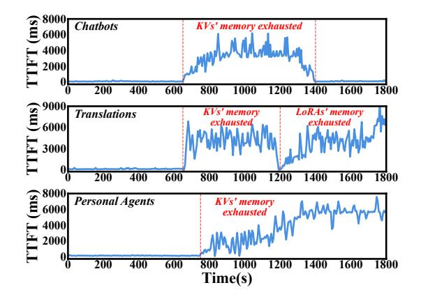
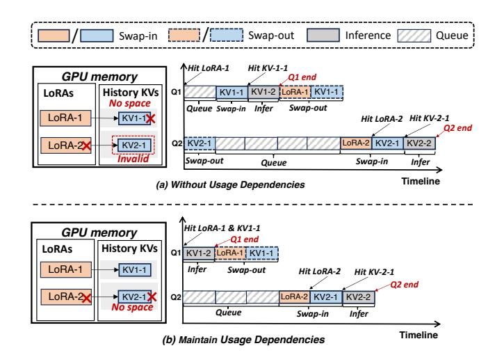

# *A. Multi-LoRA Serving with Caching*

Multi-LoRA. LoRA [20] is a popular method for efficiently fine-tuning pre-trained LLMs by adding lightweight adapters to original weights. Instead of updating all parameters, LoRA only learns a pair of low-rank matrices that modify the original weights. These matrices are much smaller than the original weight matrix, reducing computational and memory costs.

For the Multi-LoRA scenario, the pre-trained base model is loaded once, and multiple pairs of low-rank matrices are introduced, each corresponding to a specific task [21], [62]. For each task t, a unique pair of low-rank matrices At and Bt is learned, and the original weight matrix W is updated as:

$$W_t' = W + \Delta W_t = W + A_t B_t \tag{1}$$

For Multi-LoRA serving, based on the query's task, the corresponding LoRA matrices are loaded into the GPU memory before inferring. Queries using different LoRAs can be processed in a single batch using Segmented Gather Matrix-Vector multiplication (SGMV) [42], [9].

KV Caches for Multi-LoRAs. The LoRAs need to be loaded into the GPU memory during the inference [20], [42]. Moreover, most LLMs use a decoder-only transformer to predict the next token with KV caches computed from previous tokens [14], [11]. When a query matches an existing prefix, the stored history KV caches can be reused to eliminate redundant computations and reduce GPU memory usage.

Each LoRA adds a low-rank branch to the original weights, which affects the computations of the KV cache. For a hidden state h at a specific layer, the Key and Value matrices using LoRA t with original weights WK and WV are computed as:

$$K_t = (W_K + A_{t,K}B_{t,K})h, \quad V_t = (W_V + A_{t,V}B_{t,V})h$$
 (2)

Thus, the KV cache for each LoRA differs due to task-specific modifications in the matrices, which require separate storage of the KV caches for different LoRA adapters [13].

The separate storage increases contention for limited GPU memory space, and thus the KV caches and LoRAs are usually offloaded to main memory and swapped in or out on demand [15], [42]. This can cause cold starts when loading them back into GPU memory. To reduce this overhead, we can pre-cache "hot" KV caches and LoRAs into GPU memory.

Multi-LoRA Serving. For a new query, if the required LoRA is not in the GPU memory while the GPU memory is full, this query needs to queue to wait for other KV caches or LoRAs swapped out from the GPU memory, and then load the required LoRA. Similarly, if the required KV caches are not in GPU memory, they will be swapped in from the main memory. Once the required LoRA and KVs are properly loaded and matched, the inference begins to generate the next token.

LLM inference typically has prefill and decode stages [54], [1], [8], corresponding to two performance metrics, i.e., TTFT and TPOT. The above Multi-LoRA serving workflow can introduce overheads due to the queue waiting for the GPU memory space, LoRA cold-starts, and KV cache cold-starts, affecting both the TTFT and TPOT.

## *B. Application Scenarios for Investigations*

We built three commonly-used Multi-LoRA LLM inference applications based on real-world traces for investigations.

Chatbots. In each dialogue round, chatbots generate responses using full user history. Online services often let users choose specific scenarios (e.g., business analysis [47]), and apply Multi-LoRA inference to improve efficiency. We construct queries using LMSYS-33k dataset [63], which has 33,000 dialogues with model names, texts, and timestamps. Based on model names, we assign the target LoRA of each query and retain the original query distribution for different models. To form different query sending rates, we proportionally scale this dataset while preserving its original pattern [42], [52].

Multi-language Translations. This service uses Multi-LoRAs to dynamically select optimal models to enhance translation results [66]. We construct queries from the OPUS-100 dataset [56], which contains 55 million sentence pairs in 100 languages. We map each language translation pair to a specific LoRA, e.g., French to English. As the OPUS-100 dataset lacks timestamps, we adopt query arrival patterns from the Microsoft Azure function trace (MAFT) [40], [60], following previous works [52], [22]. We rank MAFT functions by invocation frequency, select the top-n query types, and map them to the n LoRAs to maintain query distribution.

Personal Agents. LLMs are widely used in this scenario, e.g., mobile assistants and home assistants, with Multi-LoRA enabling efficient multi-task support [31], [62]. We construct queries using the Google Taskmaster dataset [7], which features multi-turn, task-oriented dialogues that mirror real-world assistant interactions. We apply the same sampling based on MAFT as in the translation.

To adapt various LoRA numbers (n) to the above scenarios, we randomly choose the query patterns from n models, translation pairs, or task scenes in corresponding datasets and map to n LoRAs. Like other works [42], [52], we randomly select LoRAs from the HuggingFace repository of the corresponding LLMs, and this does not affect the serving performance [9]. The ranks of LoRAs in our evaluations are either 32 or 64.

The traces we utilized [63], [40], [56], [7] can capture the dynamics of queries accessing various LoRAs. As statistics, the required GPU memory for LoRAs (with corresponding KV caches) varies by 48.1% on average every 1 second, in which 73.9% variations are beyond 20% and others are below 20%.

TABLE II: Experiment specifications

|          | Specifications                                 |
|----------|------------------------------------------------|
|          | Intel Xeon Platinum 8480CL CPU, 256GB memory   |
| Hardware | NVIDIA H800 (each of 80GB GPU memory) ×8       |
|          | PCIe 5.0, 128GB/s interconnection bandwidth    |
|          | Llama3-8B, Llama2-34B, Llama3-70B,             |
| Software | LMSYS-33K [63], OPUS-100 [56], Taskmaster [7], |
|          | Microsoft Azure Function trace [40], [60]      |

Fig. 2: The TTFT of the vLLM for different scenarios.

## C. Low Multi-LoRA Serving Performance

In this subsection, three application scenarios described in Section III-B are used as benchmarks. We use the Llama3-8B, Llama2-34B, and Llama3-70B as base models, and evaluate them on eight NVIDIA H800 GPUs. We construct various LoRA numbers (20, 50, and 100) for each base model. Table II shows the hardware and software configurations.

We have tried to use the latest version of SGLang [61] that supported the Multi-LoRA serving but cannot reuse the history KV caches. However, evaluation results show the average TTFT of SGLang can be as high as 9568.9ms. This extremely low performance is similar to observations from others [19]. It has prevented us from further investigations, as we suspect it may be caused by poor Multi-LoRA compatibility of SGLang.

We therefore choose to use vLLM [48] that caches both LoRAs and history KVs as the representative serving system. vLLM integrates the Multi-LoRA serving kernels of Punica [9], [48], with more optimizations like prefix-caching to reuse history KV caches. It allocates fixed GPU memory space for LoRAs and KVs, and utilizes the LRU strategy to swap in or out LoRAs or KVs in the respective GPU memory area. vLLM sets a predefined allocation ratio of GPU memory space for LoRAs (empirically to be 0.2) and the memory block size to 32, referring to the vLLM latest version [48].

Fig. 2 shows the TTFT over time of vLLM for the three benchmarks with the Llama2-34B base model under the LoRA number of 50. Experiments with other base models show similar observations, as shown in Section VIII. With varying loads, we observe that vLLM experiences significantly high TTFT at certain periods, due to insufficient GPU memory space allocation for KV caches or LoRAs. As statistics, the TTFT of the three benchmarks are 1353.4ms, 2548.9ms, and

Fig. 3: Examples of serving two queries under: (a) without usage dependencies, and (b) maintaining usage dependencies.

2339.6ms on average, respectively. This is because the static GPU memory allocation of vLLM cannot dynamically adapt to the varying loads in Multi-LoRA serving. The GPU memory allocation is static because vLLM allocates memory blocks with different sizes for LoRAs and KVs according to their respective requirements [48]. Memory blocks in the GPU memory area of KV caches cannot be used for LoRAs, making it impossible to dynamically adjust the pool sizes.

While redeployment can change the GPU memory partition, it results in large overheads that can block normal inference for tens of seconds [5], [2]. Moreover, even if dynamic GPU memory allocation is achieved with fine-grained memory blocks [9], [42], [22], it is still hard to define an appropriate allocation policy with varying loads of LoRAs.

