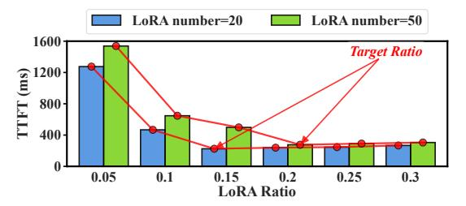
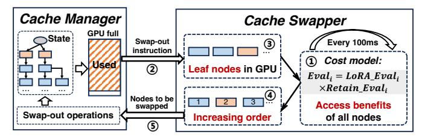
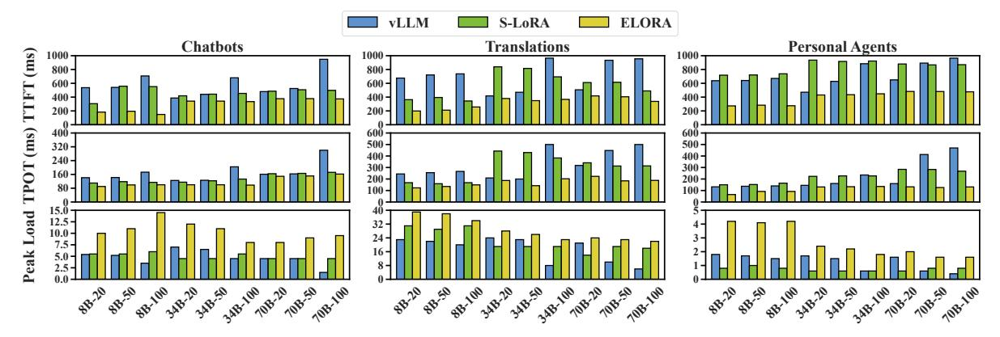

# B. Dependency Maintaining During Inference

To maintain the usage dependencies among LoRAs and KV caches during the query inference, we need to correctly match and update the LoRAs and KV caches in the dependency tree. Moreover, we need to swap in or swap out appropriate nodes in the dependency tree according to the cache swapper's decisions (Section VI) when the GPU memory is idle or busy.

For the matching and updating, as shown in Fig. 8(a), when a query arrives, it needs to match the required LoRAs and KV caches. This query will first match the LoRA node in the second layer. If the LoRA resides in the main memory, this node is swapped in the GPU memory asynchronously. Then, within the subtree of this LoRA branch, this query begins to match history KV caches according to Depth-First-Search (DFS) of the tree until the leaf node is reached or no

corresponding node can be found. During the KV matching process, if the required KV cache resides in the main memory, it will first be swapped into the GPU memory. Through the above prefix matching process, we can maximize the reuse of KV caches that have already been computed according to the usage dependencies. At last, this query generates a new token with a new KV cache, and we will insert it below the last matched node of its corresponding LoRA subtree. Also, during the decoding process, the new KV cache will be continuously inserted into the leaves of this LoRA branch.

When the GPU memory is idle or busy, some LoRAs or KV caches need to be swapped in or swapped out to fully utilize the GPU memory and main memory resources. As shown in Fig. 8(b), the cache manager will control the swapping-out to start from the leaf nodes in the GPU memory, as well as control the swapping-in to start from the root nodes of each subtree in the main memory. This is because, during the node matching process in the dependency tree, the nodes higher up will always be prioritized for matching, and all their children nodes depend on them. In this way, the usage dependencies among LoRAs and KV caches can be maintained during the inference, and all KV caches in the GPU memory are valid ones, thus the GPU memory space can be fully utilized.

It is worth noting that ELORA's usage dependency tree is different from the RadixAttention tree of SGLang [64], which only handles various KV reuse patterns without considering LoRAs. Moreover, based on the design of the usage dependency tree, ELORA further introduces a cost model tailored for comprehensively deciding the swap-in/out of both LoRAs and KV caches in Section VI.

## VI. PERFORMANCE-DRIVEN CACHE SWAPPER

In this section, we first analyze how the quantity of LoRAs in the GPU memory affects TTFT. Then, we introduce a cost model to assess benefits to TTFT of swapping in or out LoRAs and KVs. Lastly, we introduce the workflow of cache swapper.

## A. Considering the LoRA Quantity on TTFT

As the LoRA quantity used changes dynamically over time, the LoRA quantity in the GPU memory can impact the TTFT.

Fig. 9 shows the TTFT under the chatbot scenario with different static GPU memory allocation ratios for LoRAs in the vLLM. In this experiment, the used LoRA number in the traces is set at 20 and 50, as well as the average sending rate is 5 queries per second. We can observe that the TTFT reduces significantly before reaching a target ratio, and the target ratio increases when the required LoRA number changes from 20 to 50. This is because the query inference can only start once the required LoRA is matched in GPU memory, otherwise, the query is queued. An insufficient LoRA loading quantity in GPU memory can cause a large amount of LoRA cold-starts, leading to a significant increase in TTFT. Therefore, sufficient LoRA quantity is needed under different dynamic scenarios.

In realistic execution scenarios, ELORA does not need to utilize Fig. 9 to determine the "target ratio", but determines

Fig. 9: The TTFT of vLLM in the chatbot scenario under different GPU memory allocation ratios for LoRAs.

the required loaded LoRA quantity using the following estimation methods. The current required LoRA quantity is estimated based on two factors: the usage frequency probability  $prob_i$  of LoRA i, which is obtained from the recorded data in the dependency tree, and the recent inference batch size BS from the last 5 seconds. Using these data, we calculate the expected number of LoRAs required for inference ( $Low_{lora}$ ) as follows:

$$Low_{lora} = \sum_{i=1}^{n} fe_i = \sum_{i=1}^{n} \left( 1 - (1 - prob_i)^{BS} \right)$$
 (3)

In this equation,  $fe_i$  represents the probability that the LoRA i is present in the recent batch, i.e., 1 minus the probability that no queries in this batch use this LoRA. With the  $Low_{lora}$ , our cost model will encourage the loaded number of LoRAs in GPU to approach it in Section VI-B.

## B. Cost Model to Access Benefits to TTFT

When performing swap-in or out for LoRAs and KV caches, the goal is to retain the most valuable KVs and LoRAs in GPU memory as much as possible, thereby optimizing the TTFT for incoming queries. To achieve this goal, our key idea is to design a cost model to evaluate the expected benefits to TTFT of retaining a KV cache or LoRA in GPU memory. Our cost model is carefully built with following two parts.

Firstly, we should address the issues of high TTFT caused by pre-caching insufficient LoRAs, as analyzed in Section VI-A. The cost model needs to try to load a sufficient quantity of LoRAs. Thus, we first define  $LoRA\_Eval_i$  as the reward coefficient that encourages the loaded quantity of LoRAs to be close to  $Low_{lora}$  (Eq. 3) as:

$$LoRA\_Eval_i = min(1, \frac{Now_{LoRA_i}}{Low_{lora}})$$
 (4)

In this formula,  $Now_{LoRA_i}$  represents the number of LoRAs after the swap operation of node i. This formula encourages the number of LoRAs loaded in GPU to approach the expected LoRA number ( $Low_{lora}$ ). In our evaluations, for 94.8% of the time, ELORA can ensure the loaded LoRA number is within +-5% error relative to the  $Low_{lora}$ .

Secondly, we should estimate the expected cold-start latency reduction to TTFT for future queries when retaining each LoRA or KV cache in the GPU memory. As we analyzed in Section III-D2, we consider the performance metrics that include the visited frequency, the LRU, and the cost of swap-in or out of nodes. Therefore, we define  $Retain\ Eval_i$  as:

$$Retain\_Eval_i = cost_i \times visit_i \times (1 - sigmoid(t_i))$$
 (5)

Fig. 10: The execution workflow of the cache swapper with the swap-out instruction as examples.

In this formula, the first item transfer  $cost_i$  is computed using the PCIe bandwidth and size of the KV or LoRA, and the second item visit frequency probability  $visit_i$  is obtained based on the recorded data on the dependency tree. The third item is a time decay function similar to the forget-gates in the LSTM, whose  $t_i$  represents the time difference between the current time and the last recent usage time. The inclusion of visit frequency follows prior KV cache management studies [39], [58]. The sigmoid-based item considers the LRU, which ensures that less recently used KVs or LoRAs get higher eviction priority, as commonly used in prior work [45], [28].

Combining the formulas of the LoRA reward coefficient and the expected TTFT benefits of future queries, we finally design the cost model to access a KV cache or LoRA i as:

$$Eval_i = LoRA \ Eval_i \times Retain \ Eval_i$$
 (6)

As for the definition, a KV cache or LoRA with a higher  $Eval_i$  has more benefits to be stored in GPU memory, also meaning it incurs higher costs if it is swapped in GPU memory from the main memory. This cost model evaluates the relative relationship between each KV cache or each LoRA in terms of benefits to the TTFT when retaining them in the GPU memory. Then, we can use these relationships to decide their swap-in or out orders when the GPU memory is full or idle, respectively.

The cost model can handle varying KV block sizes across LoRA branches. This is because it conducts swap-in/out for each node in the usage dependency tree that represents a fixed-size memory block, which naturally accounts for the storage differences across branches (i.e., different numbers of nodes).

## C. Workflow of the Cache Swapper

Fig. 10 shows the operation workflow of the cache swapper. After each 100ms interval, the cache swapper first updates the accessing of benefits  $(Eval_i)$  of all nodes in the tree based on the cost model in Eq. 6 (①). At the same time, the cache manager calculates the GPU memory usage based on the storage state of the usage dependency tree. If the GPU memory is full, the cache manager will send the swap-out instruction to the cache swapper (②). According to Section V-B, the leaf nodes in the GPU memory will be sent as candidate nodes to the cache swapper (③). With the candidate nodes, the cache swapper sorts them in increasing order of  $Eval_i$  for the swapout (④). The cache manager continuously swaps out the nodes one by one according to the sorting result (⑤). Moreover, since the number of LoRAs in the GPU after each LoRA

node swapping could change, ELORA updates the evaluation function after each LoRA swapping.

Similarly, if GPU memory is idle (e.g., below 70% utilized), the cache manager sends the swap-in instruction to the cache swapper. The root nodes of each path in the main memory will be the candidate nodes. The decision process is the same, and just change the sorting orders of nodes to descending.

ELORA naturally supports both small and large GPU memory changes, since it updates  $Eval_i$  (Eq. 6) for each LoRA or KV and decides their swap-in or outs at every fine-grained 100ms. If a few LoRAs/KVs are required for inference with small changes, and GPU memory has space, ELORA is capable of directly loading them. Above methods are supported by the minimal  $Eval_i$  updating overhead of up to 3.1us, as well as ELORA's asynchronous swap-in/out implementations with the swapping overhead only up to 0.47ms in our evaluations.

#### VII. IMPLEMENTATION OF ELORA

ELORA can be adapted to popular LLM engines [64], [54], [1] by replacing their memory management module with few modifications. It applies to LLMs based on decoder-only transformer [46], [14], [11] that cover most practical scenarios. ELORA is implemented based on vLLM [48] with an extra 7856 and 1766 lines of Python and C++ codes. It uses Tensor Parallelism [42], [48] for distributed inference of LLMs. For serving queries that use LoRAs with various ranks, ELORA employs the SGMV operator [42], [9] to enable their batching.

Unified Caching Pool for LoRAs and KVs: We extend the BlockManager of vLLM [25], [64] to achieve this. During the initialization, both GPU and main memory are partitioned into memory blocks of the same size, which is similar to S-LoRA [42], but we also extend this pool to store history KV caches. We also perform block-wise partitioning of LoRAs along the rank dimension, while other dimensions of LoRAs align with those of the KV caches.

**Usage Dependency Tree:** Built on top of the unified memory, it is a data structure that merely logically records the memory addresses of different LoRA and KV cache memory blocks, while the actual data resides in their respective physical locations across GPU and main memory. We utilize an efficient trie tree [51] that is similar to SGLang [64] to implement this tree, whose node matching and updating are less than 1ms. Moreover, since operations (like search, insert, and delete) for this tree are executed by the CPU, it is stored in the main memory with a maximum 676.5KB memory usage. When the GPU and host memory are both exhausted, cold KV blocks are evicted, and their entries on the dependency tree are deleted.

Asynchronous Swapping: To further mitigate the cold start overhead, we adopt the asynchronous swap-in or out similar to other work [15], by using the Stream library in Torch [38]. After a query arrives, if its required LoRA or KV caches are not in GPU memory, we swap in the corresponding memory blocks and just let this query wait without blocking other queries' inference. This realizes the overlap of inference and data transferring with no extra swapping overhead.

Fig. 11: The average TTFT, TPOT, and supported peak load of ELORA, vLLM, and S-LoRA in various scenarios. The x-axis represents the model size and LoRA number, e.g., 8B-20 represents Llama3-8B model with the LoRA number of 20.

## VIII. EVALUATION OF ELORA

In this section, we first show the performance of ELORA under various Multi-LoRA applications. Then, we investigate the effectiveness of each module and scalability of ELORA.

#### A. Evaluation Setup

Table II has shown our experimental platform. The chatbot, translation, and personal agent are described in Section III-B. We use Llama3-8B, Llama2-34B, and Llama3-70B (8B, 34B, and 70B for short) as base models. Based on the parameter size, we use 1, 4, and 8 NVIDIA H800 GPUs to deploy them, respectively. Each H800 has 80GB GPU memory, which is the same as NVIDIA A100 or H100. Moreover, we use various LoRA numbers (20, 50, and 100) for each base model.

We use the state-of-the-art Multi-LoRA serving systems vLLM [25] and S-LoRA [42] as baselines. vLLM integrates the Multi-LoRA serving kernels of Punica [9], [48], with more optimizations like prefix-caching to reuse history KV caches. It partitions GPU memory and allocates static GPU memory space for LoRAs and KV caches, and uses the LRU to swap out the KV caches or LoRAs when GPU memory is full. Refer to vLLM's latest version [48], we set the GPU memory allocation ratio for LoRAs to 0.2. Moreover, S-LoRA utilizes a unified caching pool for LoRAs and KV caches. It does not reuse history KV caches and swaps in LoRAs on demand.

We do not select TensorRT-LLM [36] and SGLang [61] as baselines due to the following reasons. First, TensorRT-LLM requires all LoRAs to be pre-compiled with the base model, preventing dynamic loading at runtime under Multi-LoRA serving. Second, although SGLang integrates the kernel of S-LoRA [42], it cannot reuse history KV caches when the Multi-LoRA functionality is enabled. As we discussed in Section III-C, the TTFT of SGLang is as high as 9568.9ms on average. These may be caused by implementation issues [19].

All the experiments are conducted under continuous batching, which is the most popular LLM batching strategy [54]. ELORA focuses on optimizing the caching replacement, which is compatible with different batching strategies.

Following prior works [65], [52], we utilize the TTFT, TPOT, and supported peak load as performance metrics. The

TTFT and TPOT data in this paper are the average values for queries. The supported peak load is set as the supported maximum queries per second when the TTFT is below 500ms.

