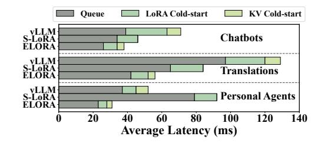
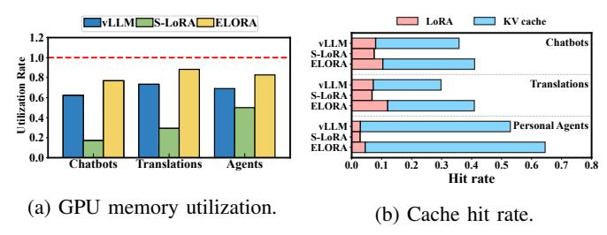
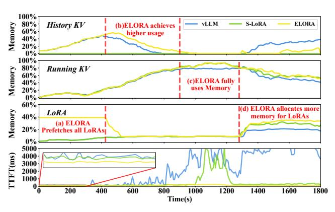
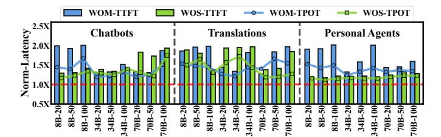
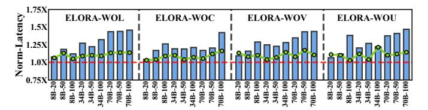

# B. Latency and Supported Peak Load

We first evaluate ELORA on the inference latency and the supported peak load. For each application scenario, the evaluations are conducted under various models and LoRA numbers. For each model with a specific LoRA number, we conduct 10 sets of sending rates from 0 to the supported peak load of ELORA. Fig. 11 shows the average TTFT, TPOT, and supported peak load of ELORA and baselines.

As observed, ELORA reduces the TTFT and TPOT, as well as improves the supported peak load in all test cases. The average reduction of TTFT and TPOT is 45.7% and 37.8% compared to vLLM, and 43.3% and 31.4% compared to S-LoRA. The average supported peak load of ELORA is increased by 78.9% and 49.9% compared to vLLM and S-LoRA, respectively. For each case, we also repeat it 20 times, and the standard error in all cases of ELORA is 1.7% on average. For the P99/P95, ELORA decreases the TTFT and TPOT by 73.8%/76.1% and 61.2%/62.1% compared to vLLM, respectively, while those values are 66.1%/68.7% and 57.3%/58.9% compared to S-LoRA. The Multi-LoRA serving performance increase of ELORA originates from maintaining the usage dependencies between LoRAs and KV caches and retaining the most beneficial LoRAs and KV caches in GPU memory to eliminate cold-starts.

The reasons for ELORA decreasing the TPOT are as follows. ELORA efficiently retains hot KV caches in GPU to accelerate prefill and reduce corresponding computations, while baselines with suboptimal caching discard certain KVs which requires recomputation of prefill with increased computations. Like other works [1], [17], [32], ELORA serves numerous queries simultaneously with prefill and decode using the timesharing GPU. Thus, the increased prefill computations block the decode of other queries in baselines, thereby increasing the TPOT compared to ELORA. In our evaluations, vLLM and S-LoRA lead to 1.38X and 1.87X computation time for the prefill compared to ELORA, respectively.

Fig. 12: The breakdown of the latency in TTFT.

Fig. 13: The average GPU memory usage and cache hit rate.

Moreover, compared to vLLM, ELORA decreases more TTFT (average 49.4%) in the translation scenario than others (average 43.8%). This is because the distribution of LoRAs in this scenario varies more with the OPUS-100 and MAFT datasets. vLLM's static GPU memory partition results in poorer cache management, while ELORA maintains consistent performance. Compared to S-LoRA, ELORA achieves the best TTFT reduction (average 53.2%) in the personal agent than others (average 38.4%). This is because this scenario has the longest conversation length, and S-LoRA's drawback of not retaining history KVs is signified. Due to the similar reason, S-LoRA is worse than vLLM in most cases of personal agents.

## C. Diving into the High Serving Performance

To better understand the source of performance improvement of ELORA, Fig. 12 shows the breakdown of the average queuing, LoRA cold-start, and KV cold-start latency in TTFT. We can observe that ELORA achieves the lowest queue, LoRA cold-start, and KV cold-start latency in all scenarios, indicating the highest GPU memory utilization efficiency.

For in-depth analysis, we sample the average GPU memory utilization of ELORA and baselines, shown in Fig. 13a. ELORA improves GPU memory utilization by 1.2X and 2.6X over vLLM and S-LoRA, respectively, due to its dynamic swapping of LoRAs and KV caches in a unified caching pool. By contrast, S-LoRA wastes GPU memory by not retaining history KV caches, while vLLM's static GPU memory partition makes the GPU memory for LoRAs or KVs under-utilized under dynamic loads. These factors also contribute to a lower queue and cold-start latency for ELORA, as shown in Fig. 12.

We also compare the average KV cache and LoRA hit rates of ELORA and baselines across different scenarios, as shown in Fig. 13b. ELORA increases the cache hit rate by 1.3X and 3.4X compared to vLLM and S-LoRA, respectively. This is because ELORA maintains the usage dependencies between LoRAs and KV caches to eliminate invalid KV caches, which

Fig. 14: GPU memory usage over time of different systems.

enhances the GPU memory utilization efficiency. Its efficient swapping strategy also prefetches appropriate KV caches and LoRAs into GPU memory. S-LoRA has the lowest hit rate because it does not reuse KV caches. As a result, ELORA achieves lower queue and cold-start latency in Fig. 12.

## D. Analysis of GPU Memory Usage Over Time

In this subsection, we compare GPU memory usage between ELORA and baselines. We take the example of using the Llama2-34B, LoRA number of 100 for the chatbot. Other scenarios have similar results. Fig. 14 shows the GPU memory usage for history KV caches, LoRAs, and running KV caches.

From 0s-400s shown in (a), ELORA proactively fetches all LoRAs into GPU memory based on the cost model to eliminate the cold-start overhead of LoRAs under low GPU memory pressure. In contrast, vLLM and S-LoRA load the LoRAs on demand, leading to a higher TTFT. From 400s-900s shown in (b), as the load increases, ELORA swaps out some LoRAs and retains the most history KV caches in GPU memory due to the unified caching pool. In contrast, vLLM's static GPU memory partition retains fewer history KVs while S-LoRA directly discards them, leading to poorer KV cache reuse and higher TTFT. Moreover, the history KVs gradually decrease in this period as they are swapped out to free GPU memory for running KVs when the load increases.

From 900s-1300s in (c), ELORA swaps out all history KV caches to free up GPU memory for running KV caches of the current inference. By contrast, the static GPU memory partition of vLLM results in the KV cache memory pool being exhausted to its maximum capacity (80%), leading to queuing and rapid growth of TTFT. Meanwhile, due to the increase of the load, directly discarding history KVs in S-LoRA causes lots of recalculations, resulting in a high TTFT. Lastly, from 1300s-1800s in (d), with the increase of the required number of LoRAs, the static memory space for LoRAs (20%) in vLLM is exhausted, leading to high TTFT of vLLM. In contrast, ELORA can allocate more memory for LoRAs, leading to higher GPU memory usage and lower TTFT.

## E. Effectiveness of the Cache Manager

In this subsection, we show the performance of ELORA-WOM, a variant of ELORA that does not maintain usage

Fig. 15: The TTFT and TPOT of ELORA's variants normalized to ELORA, represent by bars and curves, respectively.

Fig. 16: The TTFT and TPOT when eliminating different components of ELORA's cost model under the chatbot.

dependencies between LoRAs and KV caches in unified GPU memory with the cache manager. ELORA-WOM still uses the cache swapper to swap in or out LoRAs or KV caches.

The blue bars and curves of Fig. 15 show the TTFT and TPOT of ELORA-WOM normalized to ELORA. As observed, the TTFT and TPOT of ELORA-WOM are higher than ELORA in all cases, with an average increase of 1.51X and 1.34X, respectively. We also sample the history KV caches during the inference and find ELORA-WOM suffers from an average of 48.6% invalid KV caches. Moreover, the supported peak load of ELORA-WOM is also decreased by 19.3%.

When ignoring the usage dependencies, lots of invalid KV caches occupy the GPU memory, leading to low GPU memory utilization and low serving performance.

