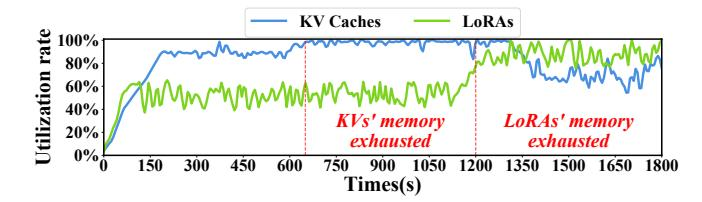
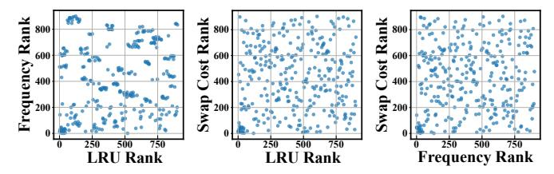
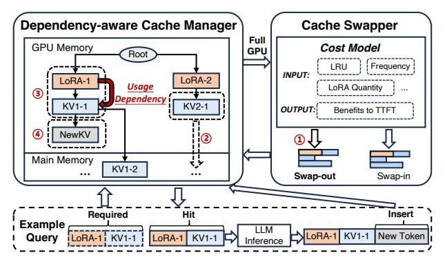
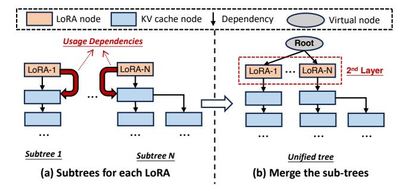

# D. Diving into Underlying Reasons

Our investigations show that the poor performance is caused by 1) inefficient GPU memory usage without considering intra-LoRA usage dependencies, and 2) inappropriate swap-in or out of KVs and LoRAs under the inter-LoRA varying loads.

1) Inefficient GPU memory Usage: Fig. 3 shows an example of serving two queries (Q1 and Q2) of two LoRA adapters (LoRA-1 and LoRA-2) under this kind of method.

As shown in Fig. 3(a), it is possible that KV2-1 is cached while the corresponding LoRA-2 is not in the GPU memory, without considering usage dependencies between LoRA and its KVs. Prior work like vLLM [25] allocated static GPU memory for LoRAs and KV caches, respectively, and managed their swap-in/out separately, which can lead to this situation. This occurs because, when queries access more LoRAs, the GPU memory allocated for LoRAs becomes insufficient, forcing most LoRAs (including those "hot" ones) to be swapped out. By contrast, the GPU memory for KV caches is excessive, thus some evicted LoRAs' KV caches reside in the GPU.

Under this case, KV2-1 is "invalid", since Q2 cannot run without the LoRA. At the same time, Q1 is also blocked although its required LoRA is cached, because it needs to wait

Fig. 4: The utilization rate of the GPU memory space allocated to LoRAs and KV caches over time in the translation scenario.

Fig. 5: The relationships among the visited frequency, swap costs, and LRU of the KV caches or LoRAs.

for the required KV1-1 to be swapped in, before which KV2-1 should be swapped out to free some GPU memory space. After Q1 returns, Q2 needs to swap in LoRA-2 and KV2-1 again to perform the inference. Neglecting the usage dependency, the system causes redundant swap-in/out, greatly increasing queuing overhead. From our evaluations in Section VIII, vLLM results in 42.4% invalid KV caches on average.

Fig. 3(b) shows a better caching case where LoRAs and KVs are managed based on the usage dependency. In this case, Q1 runs directly because both LoRA-1 and the KV1-1 are in the GPU memory. After Q1 returns, Q2 runs after LoRA-1 and KV1-1 are swapped out, and the required LoRA-2 and KV2-1 are swapped in. In this way, the redundant swap-in or out is eliminated, and the response time of both Q1 and Q2 reduces.

While prior work does not consider the usage dependency between LoRA and its KV caches, the limited GPU memory space is not efficiently used.

2) Inappropriate Swap-in or out of KV caches and LoRAs: Previous works [48], [64] manage LoRAs and KVs in GPU memory separately, and adopt caching strategies like LRU for swap-in or out. They cannot balance GPU memory usage for LoRAs and KVs when loads of different LoRAs change.

Take benchmark *translation* in Fig. 2 as an example. TTFT increases up to 6729.7ms and 8962.9ms during the period of 650s-1200s and 1200s-1800s, respectively. Correspondingly, Fig. 4 shows the GPU memory utilization rates of the LoRA and the KV parts. After looking into detailed serving trace, we find that the long TTFT originates from different reasons. During the 650s-1200s, the GPU memory space for KVs is exhausted while the utilization rate of GPU memory space for LoRAs is 59.2% on average. In this case, the frequent swap-in or out of KVs results in the long TTFT. During the 1200s-1800s, the GPU memory space for LoRAs is exhausted in contrast, because queries of more LoRAs are received during that period. According to the trace, queries of 29 LoRAs are received before 1200s, while that value is 48 after 1200s.

Fig. 6: Design overview of ELORA.

We should dynamically balance the GPU memory usage of LoRAs and KVs. However, even if the GPU memory space of LoRAs and KVs is dynamically managed through fine-grained memory blocks, relying on LRU for the swap-in or out is not efficient. This is because TTFT is related to many factors, like the swap cost and visited frequency. Fig. 5 shows the relationship between the visited frequency, LRU, and swap cost of each KV cache and LoRA. In the figure, each point represents a LoRA or KV cache, and its x or y-axis represents its corresponding ranks of LRU/Frequency/Swap Cost. As observed, the points are randomly distributed, which means that there is no clear correlation among these factors. Therefore, only considering the LRU strategy cannot represent the situations of other important metrics for serving performance.

Relying on the LRU to manage the GPU memory space for LoRAs and KV caches is not efficient to minimize the TTFT, even if dynamic GPU memory usage is enabled.

## IV. ELORA METHODOLOGY

Fig. 6 shows the design overview of ELORA. It mainly comprises two parts: a *dependency-aware cache manager* and a *performance-driven cache swapper*.

The most challenging part of ELORA is managing LoRAs and KV caches based on the usage dependencies to eliminate invalid KV caches. Thus, ELORA's cache manager introduces a tree-based scheme to address this problem, where nodes represent LoRAs or KV caches, and edges represent the usage dependencies among them. To maintain usage dependencies, this scheme places LoRAs on the second layer, and swaps out leaf nodes in the GPU memory and swaps in root nodes in the main memory during Multi-LoRA serving (Section V).

When the loads of queries using different LoRAs change, the used LoRA number can increase and the hotness of some KV caches of some LoRAs changes. ELORA's cache swapper periodically decides the swap-in or out of different LoRAs and KV caches based on metrics like LRU, visit frequency, and the LoRA quantity. The challenging part here is to build the cost model to directly evaluate the benefits to TTFT for swapping in or out each LoRA or KV cache (Section VI).

Specifically, ELORA works as follows. Firstly, the cache manager constructs the usage dependencies between LoRAs and KV caches into a tree-based structure. Secondly, during

Fig. 7: The construction process of the usage dependencies among LoRAs and KV caches.

serving, it inserts newly loaded LoRAs into the second layer of the tree and inserts or deletes KV caches at the leaves of their corresponding LoRA branches. Thirdly, after each monitor interval, the cache swapper retrieves the states of nodes from the cache manager and decides the swapped-in or out KV caches and LoRAs when the GPU memory is idle or busy, respectively. The swap-in or out decisions are sent back to the cache manager to perform memory operations.

We use an example for better explanations as shown in Fig. 6. ① As the GPU memory is full at the start, the cache swapper gets the states of the tree and utilizes the cost model to evaluate the nodes in this tree, and determine the most "cold" one "KV2-1". ② The cache manager swaps out the "KV2-1" from the GPU memory. ③ When a new query arrives, the cache manager fits its required LoRA and KV caches "LoRA-1" and "KV1-1" in the dependency tree. ④ This query then proceeds to generate the next new token, and lastly, the cache manager inserts its KV cache "NewKV" in the leaf of the corresponding LoRA branch in the tree.

