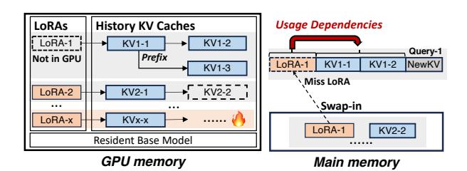

# ELORA: Efficient LoRA and KV Cache Management for Multi-LoRA LLM Serving

Jiuchen Shi1,2, Hang Zhang1, Yixiao Wang1, Quan Chen1, Yizhou Shan3, Kaihua Fu4, Wei Wang4, Minyi Guo1

1Shanghai Jiao Tong University, 2The Hong Kong Polytechnic University,

3Huawei Cloud, 4Hong Kong University of Science and Technology

shijiuchen@sjtu.edu.cn, morninglory@sjtu.edu.cn, yixiaowang@sjtu.edu.cn, chen-quan@cs.sjtu.edu.cn,

shanyizhou@huawei.com, fukaihua@ust.hk, weiwa@cse.ust.hk, guo-my@cs.sjtu.edu.cn

Abstract—Multiple Low-Rank Adapters (Multi-LoRA) are gaining popularity for task-specific Large Language Model (LLM) applications. For Multi-LoRA serving, caching hot LoRAs and KV caches in the GPU memory can improve inference performance. However, existing Multi-LoRA inference systems fail to optimize serving performance like Time-To-First-Token (TTFT), neglecting usage dependencies when caching LoRAs and KV caches. We therefore propose ELORA, a Multi-LoRA caching system to optimize the serving performance. ELORA comprises a dependency-aware cache manager and a performancedriven cache swapper. The cache manager maintains the usage dependencies between LoRAs and KV caches during inference with a unified caching pool. The cache swapper determines the swap-in or swap-out of LoRAs and KV caches based on a unified cost model, when the GPU memory is idle or busy, respectively. Experimental results show that ELORA reduces the TTFT by 45.7% on average, compared to state-of-the-art works.

## I. INTRODUCTION

Large Language Models (LLMs) are now widely used to understand and generate human-like text [6], [11]. While it is cost-inefficient to train LLMs for different tasks, parameter-efficient fine-tuning [20], [50] that freezes the large-scale base model and finetunes multiple Low-Rank Adapters (LoRAs) for various tasks is increasingly popular [13], [3]. For instance, in chatbot [37], [18], [12], multi-language translation [57], [56], and personal agents [4], [31], [49], multiple LoRA adapters (LoRA for short) can be tuned for different user demands and application scenarios. For these LLMs, Key-Value (KV) caches that store input context are often used to maintain coherence and speed up responses during extended interactions by avoiding repetitive computations [25], [1]. Researchers also reused history KV caches for queries with the same prefix [64], [16], [53], [55], boosting performance in iterative tasks.

To improve the serving performance of such Multi-LoRA applications, many works have investigated caching the base model, the KVs [55], [15], [39], [64] or "hot" LoRAs [52], [22], [29] in the GPU memory. vLLM [25] proposed to cache both LoRAs and history KV caches to improve inference performance. Fig. 1 shows an example of caching base model, LoRAs, and KVs. Different LoRAs have separate KV caches (e.g., LoRA-1 and LoRA-2). Moreover, vLLM statically partitioned the GPU memory for LoRAs and KVs, and managed their swap-in or out separately. This is because vLLM allocated different sizes of memory blocks for LoRAs and KVs, preventing their sharing with each other [48].

Fig. 1: An example caching state to show the *Usage Dependencies* between LoRAs and KV caches.

When a user query is received, the serving system checks whether the required LoRA and KVs are already in the GPU memory. If the required LoRAs and/or KVs are not cached, they are swapped in from the main memory. If the cache space for the LoRAs or KVs is full, some of them are swapped out with various caching policies. When queries use different LoRAs following stable distributions, this solution performs well because the optimal GPU memory space partition can be identified in a "brute-force" way. However, production traces [40], [60], [63] show that the distributions are dynamic. In this scenario, we observe that static GPU memory partition and independent cache management suffer from low efficiencies in intra-LoRA and inter-LoRA aspects.

In the intra-LoRA aspect, a query's KVs may remain cached while its required LoRA is swapped out. As shown in Fig. 1, when "Query-1" relying on LoRA-1 arrives, it can run only if LoRA-1 and its prefixed KV1-1 and KV1-2 are in the GPU memory. However, LoRA-1 is swapped out earlier due to the limited GPU memory space. In this case, the cached KVs are actually "invalid", because the query cannot run without the required LoRA, showing their inherent *usage dependencies*. If the GPU memory space of invalid KVs (e.g., KV1-3) were used to cache LoRA-1, Query-1 could run immediately. Invalid KVs of a LoRA may also prevent useful KVs of other LoRAs from being cached. For instance, KV2-2 is not cached while LoRA-1's KVs are invalid, preventing queries of LoRA-2 from running. Our experiments show that vLLM [25] suffers from 42.4% invalid KV caches on average.

In the inter-LoRA aspect, the required number of LoRAs and the hotness of KVs for different LoRAs change dynamically, due to the varying loads of different LoRAs. For the example in Fig. 1, more LoRAs (e.g., LoRA-x) need to be used

at the next time interval, and the KVs of LoRA-x become hot, but other LoRAs' KVs have occupied the GPU memory, which prevents them from being swapped in. However, with static GPU memory partitioning of LoRAs and KVs, their swapin or out can only be managed separately, making it hard to uniformly balance their usage in the GPU memory.

To address the above problems, a scheme is required to integrate the usage dependency for each LoRA and its corresponding KV caches with the unified management of GPU memory. We observe that the usage dependencies between a LoRA and its KV caches can be delicately denoted by a tree structure. We therefore introduce a tree-based scheme to maintain the usage dependencies during inference, where nodes are KVs or LoRAs and edges are their dependencies. This can keep more valid KVs in GPU memory to improve efficiency, and thus help in reducing the Time-To-First-Token (TTFT) and Time-Per-Output-Token (TPOT) of queries. Moreover, it is also challenging to balance the GPU memory usage for LoRAs and KVs under varying loads. A cost model is also required to assess the most beneficial LoRAs and KV caches to swap in or out during the Multi-LoRA serving.

We therefore propose ELORA, a Multi-LoRA caching system that appropriately manages the swap-in or out of LoRAs and KV caches at the scheduling level. ELORA aims to reduce the TTFT and TPOT, and maximize the supported peak load of Multi-LoRA applications. It comprises a *dependency-aware cache manager* and a *performance-driven cache swapper*. The cache manager maintains the usage dependencies between KV caches and LoRAs based on the tree-based scheme with a unified caching pool, where LoRAs or KV caches are inserted or removed from leaves in the GPU memory to keep the tree connected. Based on usage dependencies, the cache swapper periodically determines the swap-in or out of LoRAs and KVs by using a cost model, which precisely assesses the benefits of swap-in or out LoRAs and KVs to the serving performance of future queries. This paper makes three major contributions.

- Investigating caching management of LoRAs and KVs for the Multi-LoRA inference. The analysis motivates us to maintain usage dependencies between LoRAs and KV caches, and to unify the management of their swap-in or out based on their impact on inference performance.
- The design of a scheme that maintains the usage dependencies between LoRAs and KV caches. Considering the usage dependencies, more valid KVs are cached in GPU memory, eliminating the intra-LoRA inefficiency.
- The design of a cost model that guides the swapin or out of LoRAs and KVs. The model enables the unified swap-in or out of LoRAs and KVs, eliminating the inefficiency due to the inter-LoRA interference.

We evaluated ELORA with Llama3-8B, Llama2-34B, and Llama3-70B [46], [34] on 8 NVIDIA H800s with chatbot [35], [10], multi-language translation [56], and personal agents [7] scenarios. Compared to the state-of-the-art work, results show that ELORA reduces TTFT and TPOT by 45.7% and 37.8%, respectively, and improves the supported peak load by 78.9%.

TABLE I: Comparisons between ELORA and other works.

|                   | Multi-LoRA serving | Online LoRA (un)loading | History KV reuse | Dynamic manage KVs and LoRAs |
|-------------------|-----------------------|----------------------------|---------------------|---------------------------------|
| TensorRT-LLM [36] | "                     |                            | "                   |                                 |
| S-LoRA [42]       | "                     | "                          |                     |                                 |
| vLLM [48]         | "                     | "                          | "                   |                                 |
| ELORA             | "                     | "                          | "                   | "                               |

## II. RELATED WORK

LLM Fine-tuning. Recent studies have proposed efficient methods for fine-tuning LLMs [20], [30], [27], with LoRA adapters being among the most widely used. LoRA achieves fine-tuning with low costs by adding a low-rank branch [20]. Evolved models like DoRA [33] and AdaLoRA [59] that were developed based on LoRA, enhance fine-tuning efficiency by introducing flexible updates through weight decomposition and efficient trimming of insignificant singular values. These models share the same features as LoRA for the LLM inference, thus ELORA can adapt to them with minimal modifications.

KV Cache Management. Some engines like Orca [54] and FastTransformer [41] simply discarded requested KV caches after query processing, which forces recomputations for each new query. To reduce recomputations, FlexGen [43] offloaded the KV caches to host memory and disk for the reuse of subsequent queries. SGLang [64] introduced RadixAttention to handle various KV cache reuse via a global prefix tree and a Least Recently Used (LRU) policy, which is utilized as the underlying operator for ELORA's usage dependency tree implementation. ChunkAttention [64] improved GPU memory utilization by sharing KV caches for common prefixes across different queries. For multi-round dialogues, Attention-Store [15] and Pensieve [55] maintained a multi-level KV caching to store and manage all requested history KV caches to eliminate recomputations. Despite reusing history KV caches, these prior works failed to unify the management of KVs and LoRAs in a manner that accounts for their usage dependencies.

Multi-LoRA Serving Systems. TensorRT-LLM [36] supported Multi-LoRA serving with the reuse of history KVs, but required all LoRAs to be pre-compiled with the base model under its static graph compilation. This cannot support online loading or unloading during the Multi-LoRA serving.

To enable online LoRA loading into the GPU memory, Punica [9] introduced the operator to separate the base model from the task-specific adapter. S-LoRA [42] introduced a unified caching operator for LoRAs and running KV caches, which is utilized as ELORA's underlying operator. It did not reuse history KVs and swapped in LoRAs on demand. Punica and S-LoRA also realized that queries with various LoRAs can be batched to improve inference efficiency. Moreover, dLoRA [52] dynamically merged and unmerged adapters with the base model and migrated queries and adapters across replicas, which is orthogonal to our work. The above works did not consider reusing history KV caches to avoid recomputations.

SGLang [64] integrated the operator of S-LoRA [42] to support Multi-LoRA serving. However, it does not support reusing history KV caches when Multi-LoRA functionality is enabled due to unresolved compatibility issues in implementations [19]. Moreover, vLLM [48] integrated the operator of Punica for Multi-LoRA serving while reusing history KV caches. It utilized the LRU for LoRAs and KV caches. However, vLLM managed LoRAs and KVs in separate GPU memory spaces, failing to account for their usage dependencies and balance the GPU memory usage under dynamic scenarios.

Table I compares ELORA with representative works.

