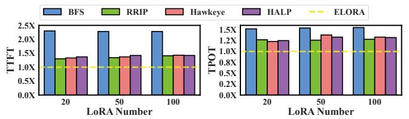

# F. Effectiveness of the Cache Swapper

In this subsection, we show the performance of ELORA-WOS, a variant of ELORA that uses a simple LRU policy to replace the cost model (Eq. 6) in the cache swapper. The usage dependencies between LoRAs and KV caches are still maintained with the cache manager during inference.

The green bars and curves of Fig. 15 show the TTFT and TPOT of ELORA-WOS normalized to ELORA. As observed, the TTFT and TPOT of ELORA-WOS are increased in all test cases, with an average increase of 1.42X and 1.29X, respectively. Moreover, the supported peak load of ELORA-WOS is also decreased by 18.6%.

Without ELORA's cost model, inappropriate LoRAs or KV caches will be swapped in or out when GPU memory is idle or busy, respectively. This results in more cold-starts of LoRAs and KVs, and decreases the performance.

## G. Effectiveness of Different Parameters of the Cost Model

In this subsection, we investigate the effectiveness in the serving performance of different parameters in ELORA's cost model (Eq. 6). We construct four variants by removing different components of the cost model, i.e., ELORA-

Fig. 17: The TTFT and TPOT of other caching policies.

WOL, ELORA-WOC, ELORA-WOV, and ELORA-WOU eliminates the caching of enough LoRAs (Eq. 4), swap cost  $(cost_i \text{ in Eq. 5})$ , the visit frequency  $(visit_i \text{ in Eq. 5})$ , and the LRU considerations  $((1-sigmoid(t_i)) \text{ in Eq. 5})$ , respectively.

The bars and curves of Fig. 16 show the TTFT and TPOT of the four variants normalized to ELORA for the chatbot, respectively. Other scenarios have similar results. All variants increase the TTFT and TPOT in all cases. ELORA-WOL, ELORA-WOC, ELORA-WOV, and ELORA-WOU averagely increase the TTFT by 1.21X, 1.19X, 1.25X, 1.21X, respectively, while values for TPOT are 1.11X, 1.09X, 1.15X, 1.14X. Moreover, the decrease of the supported peak load is 9.2%, 7.6%, 10.7%, and 9.3%.

Above results present that each parameter in the cost model has its individual effect to improve the serving performance.

## H. Comparing to Other Cache Replacement Policies

In this subsection, we compare ELORA's caching scheme to other advanced policies, including the BFS, RRIP [24], Hawkeye [23], and HALP [44]. Different from ELORA that conducts swapping in a DFS way, BFS is implemented by prioritizing to swap-in/out an entire LoRA branch. The selection is based on the largest/smallest summation of each node's  $Eval_i$  (Eq. 6) in this LoRA branch. For RRIP/Hawkeye/HALP, we utilize them to replace ERLOA's cost model, respectively. Fig. 17 shows the TTFT and TPOT of ELORA and other caching policies with the Llama2-34B in the chatbot scenario. Other models and scenarios have similar results.

We can first observe that BFS's TTFT and TPOT are 2.29X and 1.54X of ELORA's on average. The BFS that swaps the entire branch has coarse granularity compared to ELORA that swaps each node. Statistics show that a LoRA branch can occupy up to 35.6% of the GPU memory, causing BFS's GPU memory utilization to be reduced by 29.1% compared to ELORA's. The large branch swapping of BFS also causes high PCIE overhead, which is averagely 9.71X of ELORA's.

Moreover, results show the TTFT of RRIP/Hawkeye/HALP is 1.35X/1.38X/1.41X of ELORA, while the TPOT is 1.27X/1.31X/1.31X on average. This is because they are designed for other caching scenarios (e.g., content delivery network in Youtube [44]). By contrast, ELORA's caching scheme is customized for Multi-LoRA serving that incorporates more effective metrics (e.g., the loaded LoRA quantity).

