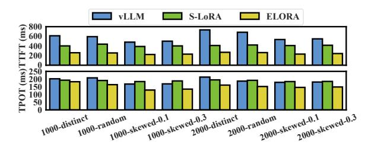
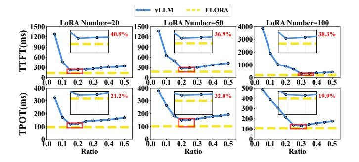
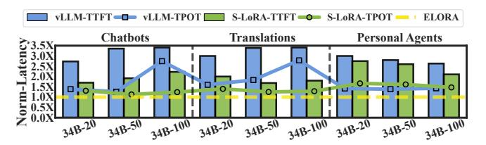

# I. Scalability with Lots of LoRAs

In this subsection, we investigate the effectiveness of ELORA under thousands of LoRAs, although real-world

Fig. 18: The TTFT and TPOT of ELORA and baselines with different combinations of LoRA numbers and distributions.

Fig. 19: The TTFT and TPOT of vLLM under different GPU memory allocation ratios for LoRAs in the chatbot scenario.

scenarios always only have tens of LoRAs [62], [4]. We also use the Llama2-34B model under the chatbot scenario as examples, and other scenarios have similar results. The LoRA number is 1000 or 2000, and we set the LoRA distributions to: 1) *Random*, each query randomly selects a LoRA to use. 2) *Distinct*, each query uses an individual LoRA. 3) *Skewed-x*, we construct queries using different LoRAs based on the Gaussian distribution and set different standard deviations x.

Fig. 18 shows the TTFT and TPOT of ELORA and baselines, respectively. We can observe that ELORA has the lower TTFT and TPOT in all test cases, with an average decrease of 48.7% and 21.9%, respectively. The above results present the scalability of ELORA under a large number of LoRAs.

## J. Comparing to vLLM with Oracle GPU Allocation Ratio

In this subsection, we compare ELORA to vLLM with the oracle GPU memory allocation ratio for LoRAs. We also use Llama2-34B in the chatbot scenario as examples. We brute-force profile the GPU memory allocation ratios for LoRAs with a 0.05 step to get the oracle vLLM's performance.

Fig. 19 shows the TTFT and TPOT of vLLM under different GPU allocation ratios in the chatbot scenario. We omit the data after the ratio of 0.5, since the TTFT and TPOT of vLLM continuously increase after 0.5. We can observe that the TTFT or TPOT is first decreased and then increased after reaching a specific ratio. Moreover, the specific ratio increases with the increase of the required LoRA number (20, 50, and 100). Moreover, TTFT and TPOT in this oracle configuration for vLLM remain higher than those of ELORA, with an average increase of 38.7% and 24.4%, respectively.

Fig. 20: The TTFT and TPOT of baselines normalized to ELORA's for the Llama2-34B when evaluating on NPUs.

The oracle vLLM is also equivalent to combining vLLM with S-LoRA (which can unifiedly manage GPU memory allocation for LoRAs and KV caches). Nevertheless, our results show that the oracle vLLM remains obviously inferior to ELORA. It is worth noting that such brute-force profiling to get the oracle vLLM is impractical in real dynamic serving.

## K. Scalability on NPUs

In this subsection, we extend ELORA to NPUs to show the hardware scalability. We also use the Llama2-34B as examples here, and test it on four of our in-house NPUs. Each NPU has 256 TFLOPS FP16 and 64GB global memory space, as well as the interconnected bandwidth of the 4 NPUs is 168GB/s.

Fig. 20 shows the TTFT and TPOT of baselines normalized to ELORA. ELORA still achieves the lowest TTFT and TPOT, with an average decrease of 69.8% and 38.4% compared to vLLM, and 49.4% and 26.2% compared to S-LoRA, respectively. The average supported peak load of ELORA is increased by 96.1% and 65.3% compared to vLLM and S-LoRA. These results show that ELORA has strong scalability and can achieve improvements on various hardware.

## L. Overhead of ELORA

Time Overhead: It mainly comes from the dependency tree matching and updating in the cache manager, and the swapping decisions of the cache swapper. For the cache manager, we employ an efficient trie tree for rapid matching and updating, which is commonly used in other works [26], [64]. Even if the GPU memory is fully utilized and the size of tree reaches the maximum, the average overhead for matching and updating of a query is less than 0.5ms. For swapping memory blocks of the cache swapper, the overhead during a query inference can be done within 5ms. The above overheads are acceptable relative to each query inference, which can take several seconds.

Memory Overhead: ELORA's cache manager records the memory address, visit frequency, last recent usage time, and size of each memory block, with an overhead of just 232Bytes per 16MB memory block (0.0014%). Moreover, ELORA's cache swapper stores the computed costs (Eq. 6) of memory blocks for swap-in or out decisions, with only 24Bytes per memory block (0.0001%). Both overheads scale linearly with the memory block number and are all negligible.

## IX. CONCLUSION

In this paper, we propose ELORA to optimize the caching of LoRAs and KV caches to improve the Multi-LoRA serving

performance. ELORA's cache manager maintains the usage dependencies between KV caches and LoRAs based on a tree-based scheme with a unified caching pool. Based on this scheme, the invalid KV caches are eliminated to improve the GPU memory utilization. ELORA's cache swapper periodically determines the swap-in or out of LoRAs and KVs by using the cost model which reflects the benefits to the performance of queries. The evaluation results show that ELORA reduces the TTFT and TPOT by 45.7% and 37.8% on average, respectively, compared to the state-of-the-art works.

## ACKNOWLEDGMENT

We sincerely thank our anonymous reviewers for their helpful comments and suggestions. This work is partially sponsored by the National Key Research and Development Program of China (2024YFB4505703), National Natural Science Foundation of China (62232011, 62302302), and Natural Science Foundation of Shanghai Municipality (25ZR1402241). Quan Chen is the corresponding author.

