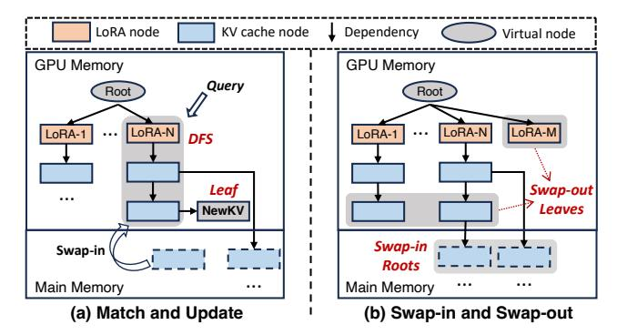

# V. DEPENDENCY-AWARE CACHE MANAGER

In this section, we first analyze how to construct the usage dependencies among LoRAs and KV caches, then introduce their maintenance during serving the queries.

## A. Usage Dependency Constructing

As we analyzed in Section III-D1, a LoRA and its corresponding KV caches have their inherent usage dependencies. When ignoring these dependencies, invalid KV caches will occupy the GPU memory space, leading to low performance for Multi-LoRA serving. We adopt a tree-based scheme to construct the usage dependencies. as shown in Fig. 7.

For each specific query, it will first match the required LoRA and then its corresponding KV caches. The KV caches corresponding to different tokens also have their matching orders. For instance, in the sentence "To be or not to be", the KV cache for the token "To" should be matched in front of "be". Therefore, as shown in Fig. 7(a), the LoRAs and subsequent KVs can be intuitively connected by a chain like the branch of LoRA-1, where nodes represent LoRAs or KV caches and edges represent the usage dependencies. Moreover, a KV cache for a token may have several possible subsequent KV caches. For instance, the subsequent tokens for the prefix

Fig. 8: Maintaining the usage dependencies among LoRAs and KV caches during the query inference.

sentence "To be" can be "or not to be" or "the best". Thus, the LoRA and its subsequent KV caches can also construct a subtree like the branch of LoRA-N in this figure.

Since these subtrees constructed above are still separate, we need to merge these subtrees into a unified one, as shown in Fig. 7(b). We use a virtual root node to connect the subtrees for different LoRAs to form a unified tree, with all LoRA nodes placed on the second layer of the tree. In this way, newly arrived queries can first match the required LoRA node in this tree, and then match the KV cache nodes in this LoRA branch. Through the construction of usage dependencies described above, the usage dependencies among LoRAs and KV caches within the same LoRA branch are established, while KV caches in different LoRA branches remain independent.

In the dependency tree, ELORA divides each LoRA or KV cache into the same fixed-size memory blocks, and a LoRA or KV cache block is represented by a node in the dependency tree. Thus, the specific LoRA rank or KV cache size does not impact ELORA's caching strategy. The node label for each KV cache node is the hash value of the token sequence, and for each LoRA node is the LoRA ID. For the swapping decisions in Section VI, we also record the related data for each node. Each node retains its corresponding information, i.e., the visit frequency, the last recent usage time, and the node size. These data will be updated when each node is generated, matched, or swapped in or out during the inference.

