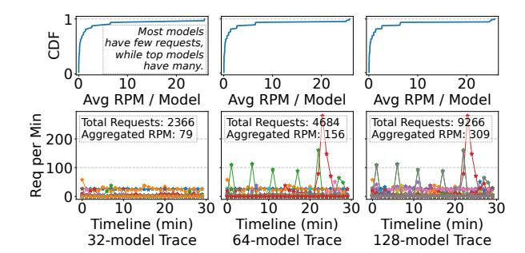
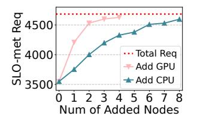
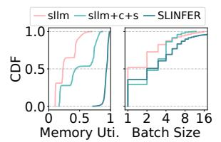

# *A. Proactive Consolidation with Preemption*

When the scale-up is hindered by neighboring instances, SLINFER allows an instance to preempt them to make room for the new request, as shown in Figure 20b. The requests of the preempted instances are then rescheduled to other nodes.

However, such preemption risks increasing fragmentation by disintegrating already-enlarged neighboring instances. To avoid this, SLINFER only allows an instance to preempt those with smaller batch sizes than itself and prioritizes the smallest one. Additionally, SLINFER also performs shadow validation to ensure preempted requests can still meet their SLOs after rescheduling, allowing preemption only when passed. As a result, even in a crowded environment, a small instance can still hold promise for growing into a larger one without affecting the existing large instances, thereby minimizing fragmentation.

### B. Reactive Consolidation with Bin-Packing

While fragmentation can be minimized proactively, scaling out may still be necessary. To reduce its impact, when multiple instances of the same model exist, SLINFER adopts a bin-packing strategy that preferentially routes new requests to the instance with the largest batch size. On one hand, large-batch instances have more opportunities to grow larger through preemption. On the other hand, small-batch instances are more likely to finish their remaining requests sooner, so avoiding them increases the chances of reclaiming them earlier.

Figure 20c illustrates this behavior. Suppose  $LLM_B$  needs to scale and creates a new instance on Node-2 with batch size bs=3, while an existing instance on Node-1 has bs=2. The Node-1 instance is now considered fragmented. Subsequent requests are preferentially scheduled to Node 2, allowing SLINFER to reclaim the Node-1 instance once its current requests are finished. Since SLINFER features shadow validation with precise token-level scheduling, it can guarantee SLOs while reducing fragmented instances.

### IX. EVALUATION

### A. Experimental Setup

**Testbed.** We use 4 32-core Intel Xeon 6462C @3.3 GHz CPU nodes and 4 NVIDIA A100-80GB GPU nodes, which are logically separated from two physical machines with 2 GPUs each.

**Models.** We use popular LLMs with 16-bit precision of different sizes: Llama-3.2-3B, Llama-2-7B, and Llama-2-13B. As the resource requirement is primarily determined by the model size, same scale models exhibit similar performance. For instance, the TTFT and TPOT (1-batch and 1K-length) of DeepSeek-R1-Distill-Qwen-7B (7.6B) on CPU is 650 ms and 74 ms, while Llama-2-7B (6.7B) is 567 ms and 71 ms.

Workloads and SLOs. The input and output length of each request are sampled from Azure LLM Conversation dataset [54] (depicted in Figure 34). In IIIIIIIIIIIIIIIIIIIIIIIIIIIIIIIIII

**Baselines.** (1) We treat ServerlessLLM [26] as the baseline, denoted as sllm, which only supports GPUs. (2) sllm+c is modified to also support the CPUs. (3) Based on sllm+c, we further extend it to support time-sharing on both CPU and GPU nodes, denoted as sllm+c+s. In this setting, each model instance (except for 13B-sized models on CPU) is allocated only half of the per-node resources.

**Systems Behavior and Fairness.** sllm+c, sllm+c+s, and SLINFER all prioritize the CPU nodes. All models are cached in CPU memory, and the cold-start procedure is similar across all systems, as SLINFER utilizes sllm's loader to

Fig. 21: Azure Trace under different number of models.

enable fast loading. Although sllm's loader has reduced the cold start latency to a few seconds (e.g., 1 second to load a 7B model in our environment), requests that experience cold-start may still violate the TTFT SLO. To address this, we relax the TTFT requirement for such requests by allowing a grace window equal to the cold-start duration. The keep-alive threshold is set to 1 s and all systems use same inference engines: vLLM 0.5.2 and OpenVINO 2024.6.0.

Unlike SLINFER's dynamic decision-making, sllm triggers instance scale-out based on a fixed concurrency limit of 2, which leads to extreme inefficiency. Based on the profiling, we tried our best to conservatively tailor a set of higher concurrency limits for sllm and sllm+c, which are (59, 15, 6) and (160, 32, 16) for the 3B, 7B, and 13B models on CPU and GPU, respectively. As for sllm+c+s, since the compute and memory shortages can easily occur when each instance is provisioned with constrained resources, the corresponding limits are (23, 4, 6) and (71, 12, 4).

### B. End-to-end Experiments

In this section, we present diverse performance metrics of SLINFER under different model sizes and quantities, comparing it with sllm and its variants. Figure 22a shows the results for the 3B-sized cases, where 32, 64, and 128 replica models are generated from Llama-3.2-3B and mapped to the Azure Trace (Figure 21 details the trace). Figure 22b and 22c depict the scenarios for the 7B-sized and the 13B-sized, respectively.

SLINFER uses less resources (Nodes Used) with higher per-node throughput (Decode Speed). When serving 32 3B-sized models in Figure 22a, SLINFER consumes only 3.0 CPUs with 0 GPU, whereas sllm requires 3.2 exclusive GPUs. sllm+c and sllm+c+s can also reduce GPU usage by leveraging CPUs and sharing resources, but it is less effective than SLINFER. Moreover, sllm+c+s can result in negative optimization effects due to the fixed resource partitioning (detailed in §IX-E). For example, when serving 32 7B-sized models in Figure 22b, sllm+c consumes 1.5 GPUs, while sllm+c+s consumes even more (2.0 GPUs), whereas SLINFER uses only 0.9 GPUs.

To further investigate the reasons behind SLINFER's resource savings, we measured the average decode throughput per node. Compared to sllm+c+s, SLINFER achieves higher throughput by 0% - 84% on CPUs and by (-4)% -

Fig. 22: Diverse performance metrics of each system under different model sizes and quantities.

88% on GPUs. Note that the improvements can be negative since SLINFER uses little GPUs when serving 32 models. The reasons for the improvements are twofold: First, SLINFER can achieve higher batch size (detailed in \$IX-F). Second, sllm and its variants waste the allocated compute resources during instance cold-start and keep-alive, while SLINFER can immediately reassign resources to other instances instead.

Finally, as the number of models increases or model size grows, the resource usage gap among four systems gradually narrows. For example, when serving 128 13B-sized models (Figure 22c), each system exhausts all nodes. This is because, on one hand, the excessive load begins to saturate each system, and on the other hand, larger models diminish the sharing potential of SLINFER (detailed in §IX-E).

SLINFER achieves superior serving capacity (SLO-met Req) with quick response (TTFT CDF). When serving 128 models, it improves the number of SLO-met requests by 86% - 154% compared to sllm, by 47% - 62% compared to sllm+c, and by 18% - 70% compared to sllm+c+s. Meanwhile, it maintains sub-second TTFT for most requests. This demonstrates the effectiveness of SLINFER's shadow validation and memory scaling mechanisms, ensuring that resource sharing does not compromise request SLOs. sllm+c+s does not exhibit significant improvement, as the fixed resource partitioning leads to resource inefficiency (detailed in §IX-F).

Note that sllm instead achieves a lower median TTFT when serving 32 models, since it only utilizes GPUs, whereas SLINFER prioritizes CPUs. Meanwhile, the CDFs of all systems do not always reach 1, as they proactively drop requests whose queuing delays exceed the TTFT SLO under heavy load. When serving 128 models, SLINFER's CDF curves flatten at much higher percentiles compared to sllm and its

Fig. 23: The resource usage and SLO compliance rate when disabling each component of SLINFER.

variants, indicating SLINFER's superior serving capacity.

### C. Ablation Study

We further study the effectiveness of SLINFER's design. Figure 23 shows the results when disabling each component when serving 64 7B-sized models. Disabling any component results in a increase in GPU resource usage. Notably, after disabling sharing, the SLO compliance rate drops substantially to 89%. This is because sharing is a key factor in increasing deployment density; without it, SLINFER struggles to handle such a large number of models simultaneously.

From the truncated timeline of GPU usage, we observe that after disabling the CPU, GPU usage is consistently high, whereas SLINFER-full rarely exhausts all four GPUs. Additionally, after disabling consolidation, when handling fluctuating loads (at 50 s and 250 s) and after load spikes, the GPU usage is notably higher compared to SLINFER-full. This is because it creates fragmented instances to handle the surge, which cannot be reclaimed promptly.

Fig. 24: CPU scalability.

Fig. 25: GPU efficiency.

Fig. 26: Performance when various sized models co-exist.

