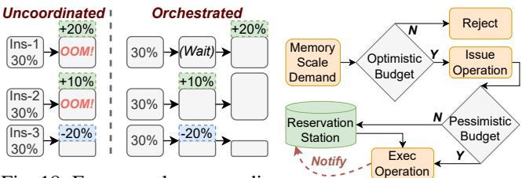

# B. KV-Cache Scaling via Watermark

As the KV-cache demand fluctuates with each received or completed request, SLINFER should dynamically respond by adjusting the allocated memory resource accordingly, rather than statically assigning the entire node memory to a single instance. However, we find that the adjusting procedure incurs non-negligible overhead. As demonstrated in Figure 16, based on the widely adopted paged-attention mechanism [37], scaling it requires re-allocating cache blocks, and copy the original KV-cache from old blocks to new blocks. As evaluated in Figure 17, scaling the original 32GB KV-cache blocks down to 16GB or up to 64GB requires 0.3 s and 1.9 s, respectively.

Given the scaling overhead and the memory underestimation risk, SLINFER adopts an early scale-up and lazy scale-down strategy. Specifically, it utilizes a watermark hyperparameter

Fig. 18: For example, uncoordinated memory scaling can spike usage to 120% (OOM).

Fig. 19: Flowchart of memory scaling operation.

w, which is used to calculate the recommended size of KVcache Mrecommend ← Mrequire · (1 + w%). Suppose the current KV-cache size is Mcur. When adding a new request and the current cache is insufficient (Mcur < Mrequire), SLINFER scales up directly to Mrecommend. This reserves space for upcoming requests and the bursty long outputs, as one long-output request can steal reserved memory from others. When a request completes, SLINFER defers scaling down the KV-cache unless the recommended size falls below the watermark (Mrecommend · (1 + w%) < Mcur). This helps mitigate the ping-pong effect caused by load fluctuations. We set the watermark to 25% and detail its sensitivity in §IX-I5.

