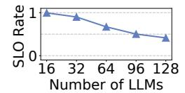
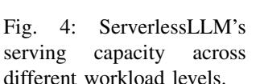
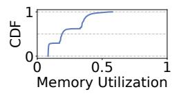
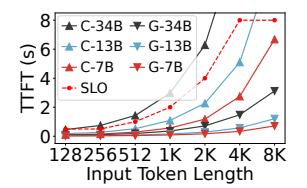
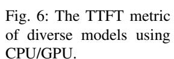
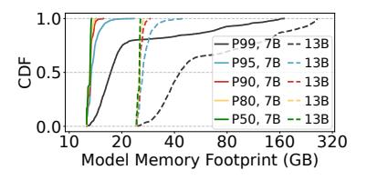
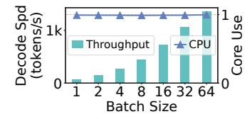
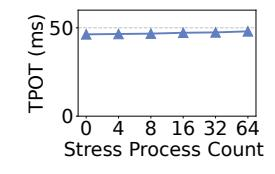

# B. Small- to Mid-Sized LLMs and Private Deployments

In practice, small- to mid-sized LLMs (e.g., 7B and 13B) have proven effective in addressing most application scenarios, while offering significantly lower operational costs [2], [57]. Meanwhile, increasing demands for customization, coupled with privacy concerns, have driven many users to adopt private deployments. For instance, the developers have created over 1,100 customized variants of Llama-2-7B alone [1]. A closer examination of this trend reveals two key characteristics:

• First, small- to mid-sized models dominate private deployments, as Figure 2 shows. HuggingFace data [5] indicates that models with fewer than 8 billion parameters constitute 60% of user preferences and 87% of total downloads, reflecting practical concerns about cost efficiency.

Fig. 5: GPU memory utilization when serving 128 LLMs with ServerlessLLM.

Second, invocations are infrequent and highly variable [26], [74], as Figure 3 shows. In the most popular multi-LLM dataset, *LMSYS-Chat-1M* [74], most models receive only a handful of requests per hour on average. This stems from private deployments serving limited user base, unlike the high-throughput public APIs [7], [13].

Given the growing demand for private LLM deployments, cloud providers have introduced one-stop hosting solutions [8]–[10], where users simply upload their models while offloading the complexity of infrastructure management.

### C. Problems with Existing Serverless LLM Solutions

To improve serving capacity in private deployments, researchers have begun exploring serverless architecture for orchestrating and managing multiple LLMs on the cloud. Representative systems such as ServerlessLLM [26], Medusa [72], and DeepServe [30] host multiple LLMs within a cluster and dynamically allocate GPUs to each model on demand. Upon receiving a request, the system launches a new model instance on an available GPU if none is currently running. If no GPU is idle, the request is queued for available resources.

However, we observe that existing solutions still struggle to handle large numbers of low-traffic, small- to mid-sized LLMs. Taking ServerlessLLM as a typical example: It enables fast model loading and utilizes vLLM [37] as the internal inference engine. We use it to host a mix of 3B, 7B, and 13B LLMs on four A100-80GB GPUs, following the same setup in § IX-A. As shown in Figure 4, it performs well at small scales. But as the number of LLMs increases, the SLO attainment rate drops sharply as requests heavily queue for limited GPUs.

This situation arises because existing serverless solutions over-provisioning GPU resources for each model: When being allocated the entire GPU memory, each instance utilizes only 23% of it on average, as shown in Figure 5. Moreover, the CPUs are mostly idle, as the computations happens on GPUs.

These observations motivate us to take a step back and reassess the evolving architectures and practical workload scales of small- to mid-sized LLMs. Instead of being constrained by scarce GPUs, alternative hardware like CPUs might offer viable solutions. Moreover, these heterogeneous resources could potentially enable efficient multi-model sharing, rather than being exclusively allocated. To this end, we next conduct a systematic investigation of heterogeneous architectures to explore the sharing opportunities in serverless LLM serving.

Fig. 7: The TPOT metric under different token length of Llama-2-7B.

Fig. 8: The TPOT metric under different token length of Llama-2-13B.

Fig. 9: The memory footprint of different models under real-world workloads.

Fig. 10: vLLM's GPU decode throughput and CPU core usage under different batch sizes.

Fig. 11: vLLM's TPOT slowdown under background CPU stress.

