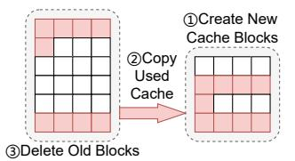

# C. Adding Request via Shadow Validation

Based on quantification, SLINFER can estimate the time of each iteration under various loads, we next focus on how the SLO violation could occur and how to avoid it. Specifically, as shown in Figure 15, when request-5 tries to join instance-3, there are three possible cases: (1) The prefill of the new request (R5-P) is finished too late, making R5's headroom negative with TTFT SLO violation. (2) Existing request (R1-D3) is delayed too late due to the prefill of new request, making R1's headroom negative with TPOT SLO violation. (3) After the new request, the target instance takes longer time to decode (R5-D1, D2), causing the aggregate time for a single decode iteration across all instances in the node to exceed TPOT SLO.

Fig. 16: KV-cache scaling.

Fig. 17: KV-cache scaling overhead on the GPU.

Therefore, when trying to add a new request to a target instance, SLINFER performs a shadow validation to virtually add and simulate the future compute procedure. This is particularly important because SLINFER prioritizes scheduling requests to compute-bound CPU instances. Considering the runtime fluctuations and the ever-growing token length during decode, SLINFER overestimates each iteration by 10%. Finally, the instance will only accept the request if none of the above cases occur in the simulation. Otherwise, SLINFER will retry the validation on other instances, including creating a new instance to serve the new request.

### VII. HAZARD-AWARE MEMORY SUBSYSTEM

### A. Characterizing Memory Demands

The memory demand of one instance consists of model weights and KV-cache of ongoing requests, while the latter is dynamic and hard to determine since the final output length is hard to know in advance. To avoid memory over-provisioning, SLINFER estimates that each request's final output length is *at least* the average output length  $\bar{O}$  obtained from the historical logs. Additionally, to improve robustness, it introduces a lower bound  $L_{min}$ , which is set to the maximum context length in practice.

Consider a model instance where each token's KV-cache occupies C bytes. If R requests are currently running, with the r-th request having an input length of  $I_r$  and having generated  $O_r$  tokens, assuming requests peak at the same time, the memory requirement of KV-cache is:

$$M_{require} = C \cdot \max(\sum_{r=1}^{R} (I_r + \max(O_r, \bar{O})), L_{min})$$
 (2)

