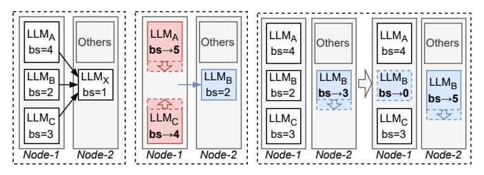

# *C. Inter-Instance Scaling Orchestration*

Since each instance dynamically scales its KV-cache while also handling model loading/unloading, multiple instances within a node would simultaneously undergo multiple memory scaling operations, all of which are inherently asynchronous due to their execution latency. To efficiently manage memory adjustments and respond to fluctuations in real time, as illustrated in Figure 19, SLINFER combines optimistic budgeting with pessimistic scheduling, enabling parallel execution of operations while avoiding OOM errors (e.g., Figure 18).

SLINFER maintains an optimistic total memory budget within a node. When handling a scale-down demand, it directly reduces the budget and issues a corresponding operation. This budget update is optimistic because the actual memory release only takes effect once the operation completes. Conversely, for a scale-up demand, it first checks whether the current budget can be increased to fit the needs. If it does, the budget is updated, and an operation is issued.

However, parallel execution introduces hazards, such as a scale-up immediately following a scale-down, which could lead to OOM errors. To avoid such risks, SLINFER employs a pessimistic global memory tracking mechanism to determine when to execute each issued operation. In this scheme, instances undergoing scale-down are accounted for based on their previous memory size. An issued scale-down operation will be executed directly. For a scale-up operation, if pessimistic tracking suggests a risk of OOM, the operation is placed in a reservation station rather than executing immediately. When a scale-down operation completes, it notifies the reservation station, which then reevaluates the risk and attempts to execute any pending operations accordingly.

(a) Fragmented (b) Proactive

(c) Reactive

Fig. 20: (a) By default, A's, B's, or C's new request will create a fragmented instance. (b) To avoid fragment, A's or C's new request can trigger in-place scale-up by *proactively* preempting B's instance. (c) When B holds multiple instances, its small-bs instance is *reactively* reclaimed by prioritizing new requests to large-bs instance. "bs" represents "batch size".

