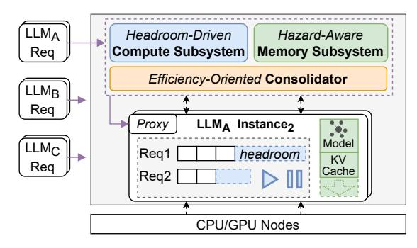
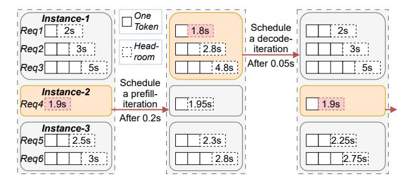
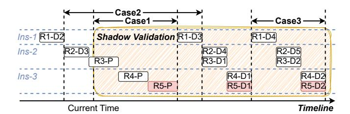

# *C. Summary and Challenges*

The above explorations reveal opportunities for resource sharing on both CPUs and GPUs. However, straightforward approaches—such as statically assigning a fraction of resources to each model instance—yield negligible improvement in serving capacity. This stems from the inability of small instances to effectively absorb bursty traffic, as large batches typically require full hardware access. For example, as shown in Table II, partitioning a GPU into three smaller instances when serving 7B LLMs achieves only about half the aggregate concurrency limit of a single large instance. Yet in serverless workloads, most requests originate from a few hot functions exhibiting bursty behavior [61]. As shown in Figure 12, the top 1% experiences concurrency levels ranging from 1 to over 128, and alone contributes to 26% of the total requests. This coexistence of burstiness, low frequency, and variability makes static partitioning fundamentally inefficient, which we further evaluate in Sections IX-B, IX-E, and IX-F.

Given the workload characteristics of small- to mid-sized LLMs, elastic and dynamic sharing based on each instance's real-time demand presents a promising approach to maximizing serving capacity. To realize such sharing, we closely examine the compute and memory behaviors of LLM instances and encounter three design challenges (recall Figure 1).

Challenge-1: Timely and precise compute resource allocation. The compute demand of an instance fluctuates sharply at token level. In Section IV-A2, Llama-2-7B running on a 32-core CPU takes 567 ms to generate the first token for a 1024-token input request, while subsequent tokens requires significantly less time (e.g., 71 ms). In addition, the token length and batching behavior introduces further variability. Unlike traditional setups with dedicated resources, *multi-model sharing under serverless scenarios requires the system to precisely budget and allocate compute resources on a pertoken basis, dynamically adjusting to fluctuating demands across concurrent instances to consistently meet SLOs.*

Challenge-2: Efficient and safe memory sharing. A model's memory demand is highly bursty—its peak can reach up to 12× in Figure 9. While dynamic memory resizing is essential for efficiency, we observe that such resizing incurs non-trivial overhead: under widely-used paged attention mechanism [37], changing the KV-cache requires allocating new matrices [56], [72] and migrating already-used cache pages (detailed in Figure 17). Moreover, frequent operations like model loading/unloading coexist with these resizes. When multiple instances co-reside, arbitrary operations can lead to OOM and compromise system stability. *Thus, the system should balance memory utilization and operational cost, constructing a global-orchestrated memory scaling mechanism.*

Challenge-3: Maintaining resource efficiency in shared environments. LLM inference relies on batching to improve compute efficiency, as larger batches yield sub-linear growth in compute cost (see Figure 7). To increase the batch size, an instance needs to scale up its compute and memory resources. However, in a shared setup, these resources may already be occupied by co-located models, forcing the instance to scale out by launching a fragmented replica on another node. This not only leads to scattered batches, but also incurs redundant memory overhead from duplicated model weights. *Therefore, it is essential to proactively identify potential fragmentation issues and assist instances in scaling up.*

Fig. 13: The design architecture of SLINFER.

### V. DESIGN OVERVIEW OF SLINFER

To address the above challenges, we present *SLINFER*, a <u>Serverless LLM Inference</u> scheme designed for small- to mid-sized LLMs in heterogeneous data centers. It transparently leverages diverse hardware and elastically shares resources on demand to maximize serving capacity.

Specifically, SLINFER coordinates multiple LLMs on both CPU and GPU nodes through the compute and memory subsystems, alongside a consolidation module, as shown in Figure 13. SLINFER follows an event-driven approach to deploy multiple instances, where instances are placed using a bin-packing strategy to minimize resource usage. It handles a request's prefill and decode within the same instance: the prefill runs independently, while the decode joins the instance's existing batch. Assuming an LLM already has several instances, we illustrate the components and workflow of SLINFER through a request lifecycle.

When a new request arrives, SLINFER first attempts to assign it to existing instances, prioritizing those on CPU nodes. Since CPU generations differ substantially in performance (see Table I), SLINFER excludes CPUs that lack dedicated matrix-acceleration (e.g., AMX) support. Moreover, as Section IV-A2 shows that CPUs can only serve a limited range of models and workloads, SLINFER profiles CPUs in advance and transparently falls back to GPU instances whenever a CPU cannot meet the request's SLO requirements.

Specifically, to schedule a new request, the compute subsystem performs shadow validation, checking whether a candidate instance can absorb the request without violating the SLOs of other requests on the same node by calculating per-request headroom. Simultaneously, the memory subsystem verifies whether the node has enough available memory to accommodate the request. If both checks succeed, the request is dispatched to the selected instance.

Subsequently, the compute subsystem orchestrates execution at token-level, focusing on request headroom (Challenge 1, see §VI). The memory subsystem employs a watermark-based scaling and a hazard-aware out-of-order operation strategy, ensuring efficient and safe sharing (Challenge 2, see §VII).

If no instance passes the validation, SLINFER introduces a consolidator, which attempts to proactively preempt resources from neighboring instances to avoid launching a new fragmented one, thereby improving overall efficiency (Challenge

Fig. 14: Procedure of token-level scheduling. At each cycle, SLINFER schedules the instance with the shortest *headroom*.

3, see §VIII). If all attempts fail, it falls back to creating a new instance, using the same validation procedure.

Upon request completion, SLINFER scales down the instance's KV-cache via the memory subsystem and reclaims the instance if it stays idle beyond a keep-alive threshold.

### VI. HEADROOM-DRIVEN COMPUTE SUBSYSTEM

### A. Headroom-based Token-level Scheduling

To schedule compute resources at token-level, SLINFER dynamically orchestrates the iterations of multiple instances, as each new token results from a prefill or decode iteration. Specifically, as illustrated in Figure 14, it selects one instance at a time to compute one iteration. Once complete, it moves on to the next instance for another iteration cycle and repeats.

By continuously assigning token-level tasks to instances, the node is full-time utilized without idle periods. However, it is still uncertain which instance should be selected for each scheduling cycle. To minimize SLO violations, SLINFER prioritizes the instance handling the most urgent request.

SLINFER introduces headroom to characterize the degree of urgency. Let  $TTFT_{SLO}$  and  $TPOT_{SLO}$  denote the SLO for TTFT and TPOT. Suppose a request started at time ST, has generated O tokens, and the current time is CT. The headroom of this request, which represents the maximal delay for generating the next token within the SLO, is given by:

$$headroom = ST + TTFT_{SLO} + TPOT_{SLO} \cdot O - CT$$
 (1)

Therefore, at each scheduling cycle, SLINFER selects the instance with the shortest request headroom and assigns it an iteration. In Figure 14, it first selects instance-2. Suppose the  $TPOT_{SLO}$  is 0.25 s and the iteration takes 0.2 s, the headroom then updates to 1.9-0.2+0.25=1.95 s. SLINFER then re-compares the headroom and repeats the process.

### B. Performance Quantification

Since headroom represents the time a request can delay its output, a negative headroom indicates that an SLO violation has occurred. To make sure this does not happen, it is essential to quantify the performance of each model instance, specifically the computation time per iteration under varying loads. Since a prefill iteration is significantly different from a decode iteration, SLINFER characterizes them separately.

Fig. 15: A shadow validation example with three cases.

**Quantify Prefill Time.** As shown in Figure 6, the prefill time is approximately linearly correlated with the input token length. Therefore, SLINFER uses linear interpolation. For a given model, SLINFER collects the TTFT results for an input length samples  $S_L$ . Then, for a new request of length L, it finds the two closest known points and applies the interpolation.

Quantify Decode Time. As evaluated in Figure 7 and Figure 8, the time of decode iteration is correlated with both length and batch size. This is because the computation involves both the attention and the feed-forward network: the former scales with the total token length in the batch, while the latter scales with the batch size. Thus, SLINFER uses these two factors as two dimensions and applies 2D linear interpolation. For a given model, SLINFER generates the batch size samples  $S_B$  and the average token length samples  $S_L$ . For each  $B' \in S_B$  and  $L' \in S_L$ , SLINFER collects the corresponding TPOT results. Then, for a batch size B and average token length L, it finds the four closest points and applies the interpolation.

Considering the hardware heterogeneity, SLINFER quantifies for each hardware type. To reduce sampling overhead, it uses  $2^X$  to generate  $S_L$  and  $S_B$ . If a model's maximum token length is  $L_{\rm max}$  (e.g., 4096) and the maximum batch size is  $B_{\rm max}$  (e.g., 256), SLINFER only needs to collect  $O(\log_{L_{\rm max}} \cdot \log_{B_{\rm max}})$  cases, which amounts to only a few hundred samples that can be completed within minutes, enabling it to quickly adapt to diverse platforms. Lastly, to evaluate the accuracy, we randomly generated 100 workloads with various batch sizes and token lengths. The average relative deviations between the actual TTFT/TPOT and the estimated values were only 5.9% and 3.9%, respectively.

