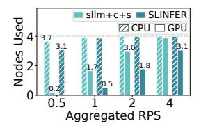
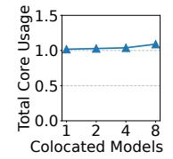
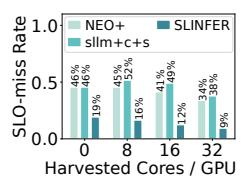
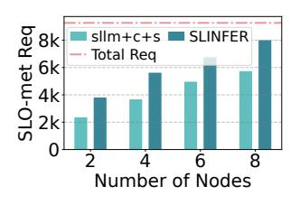
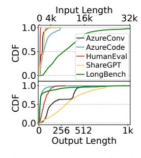
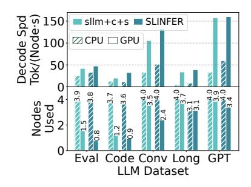

# G. Exploring Prefill-Decode Disaggregated Architecture

To minimize resource usage, we co-locate the prefill and decode stages of each request within the same instance. An alternative design, known as prefill-decode (PD) disaggregation [54], launches dedicated instances for each stage per model. Table III shows the performance impact of this approach. The cross-node communication bandwidth is 100 Gbps. We observe that PD disaggregation instead leads to increased resource usage and reduced serving capacity. This is because the prefill stage is short-lived, and infrequent requests result in prefill instances spending 93% of their lifetime on average in cold starts or idle. This finding aligns with DistServe [75], which also argues that PD disaggregation is ill-suited for resource-constrained scenarios.

### H. Scalability and Scheduling Overhead

As shown in Figure 32, we compare the serving capacity under the same workload while varying the number of nodes—from 1 CPU + 1 GPU to 4 CPU + 4 GPU. Across all configurations, SLINFER achieves a higher number of SLOmet requests. With four nodes, SLINFER delivers equivalent performance to sllm+c+s running on eight nodes. Note that performance gains show diminishing returns, as we evaluate SLO-met requests under fixed load with many infrequent and concurrent model invocations. For instance, a single node can serve ten requests from one model, but handling one request each from ten different models requires much more nodes.

GPUs

Fig. 27: The resource usage of BurstGPT under different load-levels.

Fig. 28: CPU usage during multimodel colocation.

Fig. 29: Performance under varying numbers of CPU cores.

Fig. 30: Performance under different keep-alive thresholds.

Fig. 31: KV-cache utilization and scaling overhead under different watermarks.

Fig. 32: Performance under different node counts.

Fig. 33: The scheduling overhead of SLINFER.

Fig. 34: Characterization Fig. 35: Eval of different datasets of different LLM datasets. when serving 64 8B-sized models.

We further analyze the scheduling overhead of SLINFER and find that it remains low, as shown in Figure 33. First, when a request arrives, it undergoes shadow validation to select an instance. The time cost slightly increases with the number of nodes, because a heavily loaded model tends to have more instances as the cluster scales, leading shadow validation to probe more candidates. Second, SLINFER dynamically schedules instances at token-level (recall Figure 14). This overhead remains stable regardless of the scales, since this scheduling decision is performed independently on each node.

### I. Sensitivity Analyses

Previously, we used Azure Conversation dataset and Azure Serverless Trace as workloads. Each CPU node was provisioned with 32 cores, the keep-alive threshold was set to 1 second, and SLINFER's KV-cache scaling watermark was set to 25%. In this section, we conduct a series of sensitivity analyses to evaluate how these settings affect system performance.

1) Length Patterns: We further evaluate on the Azure Code [54], HumanEval [20], ShareGPT [3], and Longbench [18] datasets. They are characterized in Figure 34. To support Longbench with up to 32k tokens, we use

Llama-3.1-8B models across all datasets. As shown in Figure 35, SLINFER consistently consumes fewer resources than sllm+c+s. We observe that datasets with longer outputs, such as ShareGPT, consume more resources but achieve higher decode throughput. This is because longer generations provides more batching opportunities. For LongBench, however, CPUs cannot satisfy the long-sequence TTFT SLO, so SLINFER does not prefer CPUs. In comparison, sllm+c+s fully utilizes CPUs but violates 63.4% of SLOs. Overall, CPUs can handle inputs up to 8.4k tokens within the 8s TTFT SLO.

- 2) Invocation Traces: In addition to serverless trace, we also experimented with an LLM trace, BurstGPT [66]. However, the LLM trace represents a centralized single-model invocation pattern, which does not match the multi-model scenarios. To emulate the serverless environments, we distributed all invocations across 64 models following a Pareto distribution. Figure 27 shows system resource utilization under different load levels by sampling various time segments from BurstGPT. SLINFER consistently consumes fewer resources. When the RPS increases to 4, sllm+c+s incurs 7.7% SLO violations, whereas SLINFER maintains only 1.0%.
- 3) CPU Resources: CPU resources may become constrained in shared environments. However, as shown in Figure 28, even when eight model instances are deployed on a single GPU, their total average CPU usage only slightly exceeds one core. This is because each instance takes turns to use the GPU and only keeps the CPU busy-waiting during GPU interactions. Apart from that, tasks such as data preprocessing consume negligible CPU resources (< 0.1 core).

Nevertheless, Figure 29 compares system performance under varying harvested CPU cores. In addition to being used independently, CPU resources can also assist GPU instances, as proposed in NEO [32]. We also compare this approach. Results show that SLINFER consistently achieves the lowest SLOmiss rate across all resource conditions. In contrast, NEO lags behind, as it is primarily optimized for single-instance, high-load scenarios, whereas in serverless multi-model settings, elastic and independent utilization of heterogeneous resources to increase deployment density is the top priority.

4) Keep-alive Threshold: A longer threshold leads to more idle instances and increased resource usage, as shown in Figure 30. Counterintuitively, extending the threshold can even worsen the TTFT, due to: (1) cold-start latency is already low, and (2) prolonged idle instances exacerbates resource contention, leading to requests queuing—particularly

for sllm+c+s. We therefore recommend a short threshold (e.g., 1 s) to balance resource efficiency and user experience.

*5) KV-cache Scaling Watermark:* As shown in Figure 31, setting a watermark is essential since disabling it (set to 0%) causes each instance to spend 11.3% of its lifetime on scaling due to frequent adjustments. Besides, even a low watermark can significantly reduce this overhead, as SLINFER leverages early scale-up to accommodate upcoming requests in a single event and delays scale-down to mitigate short-term fluctuations. Thus, we recommend using a low watermark (e.g., 25%), where scaling overhead is already minimal (1.4%), and the request migration rate due to underestimations is only 0–0.3%. Raising the watermark further provides negligible benefit but lowering KV-cache utilization, leading to memory inefficiency.

