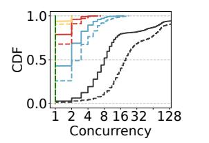

# IV. HETEROGENEOUS RESOURCE SHARING

Modern data centers are inherently heterogeneous [19], [33], [49]. Even a GPU cluster is equipped with CPU nodes for preprocessing tasks. Given the reported low CPU utilization on GPU nodes [31], [33] and the emerging CPU architecture [50], it is worth exploring the potential of idle CPU resources.

However, due to the fundamental architectural differences, CPUs typically offer limited parallelism and are well-known to be compute-bound for LLM inference [52], [62]. On the other hand, GPUs are often memory-bound due to their limited memory capacity [29], [63]. Therefore, it is crucial to evaluate the computation latencies in CPUs, and the memory footprints in GPUs to further assess the sharing potential.

### A. CPU Sharing Opportunity

1) Spare CPU Resources: We measured the CPU utilization of state-of-the-art inference engine vLLM [37] when serving Llama-2-7B model on an A100 GPU with a 32-core CPU.

In Figure 10, vLLM's throughput increases with batch size, but never consumes more than one CPU core. To further evaluate vLLM's CPU sensitivity, we launched background CPU stress processes while running it with a batch size of 64. As shown in Figure 11, even with 64 stress processes competing for 32 CPU cores, vLLM suffers only a 4% performance loss. Given that GPU nodes typically feature dozens or even hundreds of CPU cores [67], substantial CPU resources are waiting to be utilized under LLM inference scenarios.

2) CPU Computational Capability: Despite the presence of spare CPU resources, their feasibility for LLM inference remains uncertain due to stringent SLOs and high compute loads. However, it is worth noting that recent CPU architectures have integrated specialized components to accelerate the AI workloads. Starting with 4th-Gen Intel Xeon, Intel introduced Advanced Matrix Extensions (AMX) [15], [50], a dedicated hardware block designed for matrix operations.

"bs" denotes "batch size". Red cells indicate SLO violations.  $\frac{\text{TTFT (ms)}}{\text{CPU}} = \frac{\text{TTFT (ms)}}{256 \text{ 1K}} = \frac{\text{TPOT (ms)}}{\text{1bs-1K}} = \frac{\text{TPOT (ms)}}{\text{1bs-1K}} = \frac{\text{TPOT (ms)}}{\text{1bs-4K}} = \frac{\text{TPOT (ms)}}{\text{1bs-4K}} = \frac{\text{TPOT (ms)}}{\text{1bs-4K}} = \frac{\text{TPOT (ms)}}{\text{1bs-4K}} = \frac{\text{TPOT (ms)}}{\text{1bs-4K}} = \frac{\text{TPOT (ms)}}{\text{1bs-4K}} = \frac{\text{TPOT (ms)}}{\text{1bs-4K}} = \frac{\text{TPOT (ms)}}{\text{1bs-4K}} = \frac{\text{TPOT (ms)}}{\text{1bs-4K}} = \frac{\text{TPOT (ms)}}{\text{1bs-4K}} = \frac{\text{TPOT (ms)}}{\text{1bs-4K}} = \frac{\text{TPOT (ms)}}{\text{1bs-4K}} = \frac{\text{TPOT (ms)}}{\text{1bs-4K}} = \frac{\text{TPOT (ms)}}{\text{1bs-4K}} = \frac{\text{TPOT (ms)}}{\text{1bs-4K}} = \frac{\text{TPOT (ms)}}{\text{1bs-4K}} = \frac{\text{TPOT (ms)}}{\text{1bs-4K}} = \frac{\text{TPOT (ms)}}{\text{1bs-4K}} = \frac{\text{TPOT (ms)}}{\text{1bs-4K}} = \frac{\text{TPOT (ms)}}{\text{1bs-4K}} = \frac{\text{TPOT (ms)}}{\text{1bs-4K}} = \frac{\text{TPOT (ms)}}{\text{1bs-4K}} = \frac{\text{TPOT (ms)}}{\text{1bs-4K}} = \frac{\text{TPOT (ms)}}{\text{1bs-4K}} = \frac{\text{TPOT (ms)}}{\text{1bs-4K}} = \frac{\text{TPOT (ms)}}{\text{1bs-4K}} = \frac{\text{TPOT (ms)}}{\text{1bs-4K}} = \frac{\text{TPOT (ms)}}{\text{1bs-4K}} = \frac{\text{TPOT (ms)}}{\text{1bs-4K}} = \frac{\text{TPOT (ms)}}{\text{1bs-4K}} = \frac{\text{TPOT (ms)}}{\text{1bs-4K}} = \frac{\text{TPOT (ms)}}{\text{1bs-4K}} = \frac{\text{TPOT (ms)}}{\text{1bs-4K}} = \frac{\text{TPOT (ms)}}{\text{1bs-4K}} = \frac{\text{TPOT (ms)}}{\text{1bs-4K}} = \frac{\text{TPOT (ms)}}{\text{1bs-4K}} = \frac{\text{TPOT (ms)}}{\text{1bs-4K}} = \frac{\text{TPOT (ms)}}{\text{1bs-4K}} = \frac{\text{TPOT (ms)}}{\text{1bs-4K}} = \frac{\text{TPOT (ms)}}{\text{1bs-4K}} = \frac{\text{TPOT (ms)}}{\text{1bs-4K}} = \frac{\text{TPOT (ms)}}{\text{1bs-4K}} = \frac{\text{TPOT (ms)}}{\text{1bs-4K}} = \frac{\text{TPOT (ms)}}{\text{1bs-4K}} = \frac{\text{TPOT (ms)}}{\text{1bs-4K}} = \frac{\text{TPOT (ms)}}{\text{1bs-4K}} = \frac{\text{TPOT (ms)}}{\text{1bs-4K}} = \frac{\text{TPOT (ms)}}{\text{1bs-4K}} = \frac{\text{TPOT (ms)}}{\text{1bs-4K}} = \frac{\text{TPOT (ms)}}{\text{1bs-4K}} = \frac{\text{TPOT (ms)}}{\text{1bs-4K}} = \frac{\text{TPOT (ms)}}{\text{1bs-4K}} = \frac{\text{TPOT (ms)}}{\text{1bs-4K}} = \frac{\text{TPOT (ms)}}{\text{1bs-4K}} = \frac{\text{TPOT (ms)}}{\text{1bs-4K}} = \frac{\text{TPOT (ms)}}{\text{1bs-4K}} = \frac{\text{TPOT (ms)}}{\text{1bs-4K}} = \frac{\text{TPOT (ms)}}{\text{1bs-4K}} = \frac{\text{TPOT (ms)}}{\text{1bs-4K}} = \frac{\text{TPOT (ms)}}{\text{1bs-4K}} = \frac{\text{TPOT (ms)}}{\text{1bs-4K}} = \frac{\text{TPOT (ms)}}{\text{1bs-4K}} = \frac{\text{TPOT (ms)}}{\text{1bs-4K}} = \frac{\text{TPOT (ms)}}{\text{1bs-4K}} = \frac{\text{TPOT (m$ 

TABLE I: Llama-2-7B's performance under 3rd- (32-

core@2.7GHz) and 4th-Gen (32-core@3.3GHz) Xeon CPUs.

| CPU     | 11F1 (ms) |      |       | IPOI (ms) |         |        |         |
|---------|-----------|------|-------|-----------|---------|--------|---------|
| CFU     | 256       | 1K   | 4K    | 1bs-1K    | 32bs-1K | 1bs-4K | 32bs-4K |
| 3rd Gen | 1003      | 4113 | 18612 | 100       | 338     | 110    | 697     |
| 4th Gen | 149       | 567  | 2748  | 71        | 196     | 80     | 459     |
| Speedup | 6.7×      | 7.3× | 6.8×  | 1.4×      | 1.7×    | 1.4×   | 1.5×    |
|         |           |      |       |           |         |        |         |

Although using AMX has been shown to provide acceleration [48], detailed latency data under SLO constraints remains underexplored. To benchmark it, we replace vLLM's GPU backend with OpenVINO [11], the state-of-the-art for CPU inference. We use a AMX-equipped 32-core Intel Xeon 6462C CPU, testing three LLMs of varying sizes (Llama-2-7B, Llama-2-13B, and CodeLlama-34B) under different token lengths and batch sizes. Following previous works [16], [75], we set TTFT SLO to min(max(0.5, input\_length/512), 8) s and TPOT SLO to 0.25 s.

Figure 6 presents the TTFT data. The label "C-7B" denotes using CPU with Llama-2-7B. We compare the results with an A100 GPU and the SLO. CPUs can meet the SLOs of 7B and 13B LLMs under short inputs, which cover most usage scenarios—e.g., 97.9% of conversation and 85.9% of coding inputs in the Azure LLM trace are under 4K tokens [54].

We further examine the TPOT data of the 7B and 13B LLMs, which characterizes the per-token latency during decode, as shown in Figure 7 and Figure 8. The label "C-512" denotes using CPU with a token length of 512. We find that the CPU not only meets TPOT SLO with ease but can also utilize batching to improve throughput, similar to GPU. For example, serving 7B LLM on CPU with a token length of 1K, the TPOT for a 4-batch increases by only 14% compared to a 1-batch. We also find that the TPOT also correlates with token length. For instance, serving 13B LLM on CPU with a 32-batch results in a 2X increase in TPOT when the length increases from 512 to 2K, with the latter violating the SLO.

**Limitations and Applicable Scenarios.** Overall, although CPUs offer enhanced capability, they have several limitations: (1) *Dependence on newer hardware.* Older CPUs without specialized matrix acceleration block are generally unsuitable [36]. As shown in Table I, a 32-core 3rd Gen Xeon 8369B

| Fig. 12: CDF of work  |
|-----------------------|
| load concurrency. Leg |
| end same as Fig. 9.   |

| Scenarios 4× 1 | 4   | 3× 1 3 | 2× 1 2    | 1  |
|----------------|-----|-----------|--------------|----|
| C-7B-2K        | -   | 3×2       | 2×9          | 27 |
| C-7B-4K        | -   | 3×1       | 2×4          | 15 |
| G-7B-2K        | 4×6 |           | 3×12 2×26 66 |    |
| G-7B-4K        | 4×3 | 3×6       | 2×13 32      |    |
| G-13B-2K       | -   | -         | 2×7          | 33 |
| G-13B-4K       | -   | -         | 2×3          | 16 |

TABLE II: Aggregated concurrency limits of instances under varying resource specifications.

(without AMX) running Llama-2-7B with 1K inputs results in a TTFT of 4.1 s—far exceeding the SLOs. (2) *Sensitivity to model size and workload.* CPUs can only handle small LLMs (≤13B), short inputs (≤5.6K for a 13B model), and limited batch sizes. (3) *Inability under tight SLOs.* Under a 100 ms TPOT SLO, only 7B or smaller LLMs are feasible, with batch sizes limited to 9 for 1K-length and 3 for 4K-length. At 50 ms, even 7B LLMs become infeasible. Nevertheless, in serverless scenarios with many small- to mid-sized LLMs and infrequent requests, AMX-equipped CPUs present opportunities for resource sharing under moderate SLOs.

