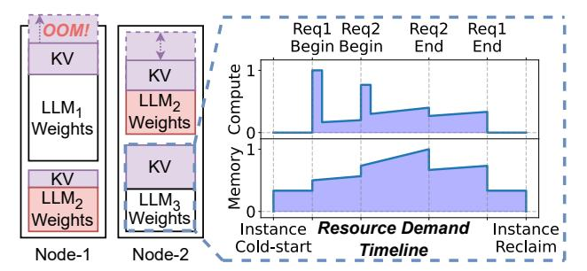

# Towards Resource-Efficient Serverless LLM Inference with SLINFER

Chuhao Xu†, Zijun Li†‡, Quan Chen†, Han Zhao†, Xueyan Tang‡, and Minyi Guo† Shanghai Jiao Tong University†, Nanyang Technological University‡ {barrin, lzjzx1122, chen-quan, zhaohan\_miven}@sjtu.edu.cn, asxytang@ntu.edu.sg, myguo@sjtu.edu.cn

Abstract—The rise of LLMs has driven demand for private serverless deployments, characterized by moderate-sized models and infrequent requests. While existing serverless solutions follow exclusive GPU allocation, we take a step back to explore modern platforms and find that: Emerging CPU architectures with built-in accelerators are capable of serving LLMs but remain underutilized, and both CPUs and GPUs can accommodate multiple LLMs simultaneously.

We propose SLINFER, a resource-efficient serverless inference scheme tailored for small- to mid-sized LLMs that enables elastic and on-demand sharing across heterogeneous hardware. SLINFER tackles three fundamental challenges: (1) precise, fine-grained compute resource allocation at token-level to handle fluctuating computational demands; (2) a coordinated and forward-looking memory scaling mechanism to detect out-of-memory hazards and reduce operational overhead; and (3) a dual approach that consolidates fragmented instances through proactive preemption and reactive bin-packing. Experimental results on 4 32-core CPUs and 4 A100 GPUs show that SLINFER improves serving capacity by 47% - 62% through sharing, while further leveraging CPUs boosts this to 86% - 154%.

### I. Introduction

Large Language Models (LLMs) have seen widespread adoption, with many providers (e.g., OpenAI [7], Anthropic [13]). Meanwhile, driven by the need for customization and privacy, individuals and enterprises are increasingly seeking to deploy private models on the cloud [6], [9], offloading the burden of infrastructure management. Consequently, cloud platforms are hosting a large number of LLMs and have turned to serverless approach [8], [10] to maximize serving capacity while meeting service-level objectives (SLOs).

A closer examination of this deployment reveals two key characteristics that closely align with the typical patterns of serverless [34], [61] workloads: (1) small- to mid-sized models dominate in popularity—87% of downloads on HuggingFace are for LLMs no larger than 8B parameters [5]; and (2) invocation patterns are highly variable and infrequent—For instance, LMSYS hosts diverse HuggingFace LLMs, 56% of which receive fewer than 5 requests per hour on average [74].

Given the high resource demands and the stringent SLOs, existing serverless LLM inference solutions [26], [30], [72] allocate exclusive GPUs to each model in an event-driven manner upon request arrival. However, they still struggle to handle the scenario where numerous small-sized LLMs are infrequently invoked. For instance, when using Serverless-LLM [26] to host 64 3B- to 13B-sized LLMs on 4 A100-80GB GPUs, 33% of the requests fail to meet their SLOs due

Fig. 1: Example of normalized resource demand variation for an instance under multi-LLM sharing. LLM2 is fragmented.

to long queuing, despite the average memory utilization per GPU being only 23%. The key issue lies in the scarcity of GPUs relative to the number of models, while the resource over-provisioning makes each model occupy an entire GPU.

Through systematic investigation of modern platforms, we re-examine the deployment characteristics for small- to mid-sized LLMs, revealing two key opportunities. First, clusters have abundant idle CPUs, and utilizing their built-in accelerators (e.g., Intel Advanced Matrix Extensions, AMX [15], [50]) can independently support them while meeting production-grade SLOs. Second, given the low-frequency, serverless-like workload patterns, individual LLMs usually do not fully saturate the entire CPU/GPU, making it practical to colocate multiple LLMs by provisioning resources on demand.

We are therefore motivated to design a serverless LLM inference scheme that embraces hardware-agnostic resource allocation and on-demand, elastic sharing across heterogeneous platforms. However, as illustrated in Figure 1, the dynamic and diverse patterns of per-instance compute and memory demands introduce three fundamental design challenges.

First, computational demand fluctuates sharply during token generation, especially as the first token of each request undergoes the prefill stage [16], [54]. Since instances continuously receive new requests [71], it becomes difficult to allocate just-enough compute resources. Over-provisioning for peak usage leads to wasted resources, while aggressive sharing risks violating SLOs. Furthermore, instances also go through startup and idle phases where compute demand is negligible.

Second, the memory demand per instance varies with the request load. Dynamically managing memory is non-trivial: each instance requires pre-allocated space for the KV-cache [37], and we find that resizing incurs noticeable overhead [72]. More

critically, other memory operations such as model weights loading and unloading are also frequent and sensitive. When multiple instances share a node, arbitrary memory adjustments can easily trigger out-of-memory (OOM) errors.

Third, in a congested shared environment, the vertical scalability of individual instances is often suppressed, resulting in fragmented deployments of the same model. In the example shown in Figure 1, multiple fragmented instances of LLM2 not only incur redundant memory overhead for model weights but also reduce batching opportunities that could have been leveraged by a single consolidated instance. This fragmentation degrades both compute and memory efficiency.

To address these challenges, we closely examine the compute and memory characteristics of LLM inference instances and their implications for resource efficiency. (1) Since compute demand varies at the granularity of tokens, there is potential to provision compute resources dynamically at the same granularity—provided that we can precisely quantify and budget per-instance demand. (2) Given the overhead of memory adjustments and the potential OOM risks, it is important to reconsider the trade-off between utilization and operational cost, while coordinating instances to ensure safe and efficient sharing. (3) Rather than blindly following serverless-style horizontal scaling that leads to fragmented, inefficient instances, identifying or even actively seeking opportunities for vertical scaling can significantly improve efficiency.

Based on above observations, we propose SLINFER, a Serverless LLM Inference scheme achieving the resourceefficient deployment for small- to mid-sized LLMs. SLINFER abstracts heterogeneous hardware into CPU/GPU nodes, decoupling resource management through compute and memory subsystems. The compute subsystem, driven by request headroom, efficiently schedules instances via shadow validation and real-time token-level resource provision. For memory subsystem, it performs watermark-based scaling considering the trade-off, and orchestrates multiple memory adjustments in a controlled and parallel manner to avoid OOM hazards. Lastly, to maintain efficiency, SLINFER introduces a dualapproach consolidator: prioritizing vertical scaling through proactive preemption while employing a bin-packing strategy to eliminate fragmentation.

The main contributions of this paper are as follows.

- Systematic investigation of LLM serving on heterogeneous resources. The identified CPU/GPU sharing opportunities motivate a resource-efficient design.
- Solutions for sharing small- to mid-sized LLMs under serverless paradigm. Based on investigation, we construct guidelines considering unique characteristics of LLM inference procedure and serverless workloads.
- A resource management system with unified hardware abstraction. Based on SLINFER, we implement two subsystems that transparently manage hardware while ensuring efficient and precise on-demand resource sharing.

We evaluate SLINFER with real-world LLM datasets [54] and serverless workloads [61]. Experimental results on 4 32 core CPU nodes and 4 A100-80GB GPU nodes demonstrate that SLINFER improves serving capacity by 47% - 62% through elastic sharing, and leveraging CPU resources further boosts this improvement to 86% - 154%.

