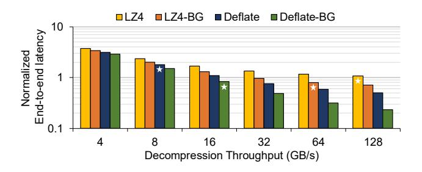

# B. Impact of Decompression Speed

**Decompression throughput.** Table I also reports the decompression throughput of LZ4 and Deflate, with and without byte-grouping, measured on a 128-core Intel GNR CPU.

TABLE I

COMPRESSION RATIO (CR, %) AND DECOMPRESSION THROUGHPUT (DT, GB/s) OF BF16 LLM PARAMETERS FOR DIFFERENT COMPRESSION ALGORITHMS WITH AND WITHOUT PREPROCESSING. DECOMPRESSION IS PERFORMED ON A 128-CORE GRANITE RAPIDS.

| Preprocessing | Compression Algorithm | Llama3-405B |       | DeepSeek-R1 |       |
|---------------|--------------------------|-------------|-------|-------------|-------|
| rreprocessing |                          | CR          | DT    | CR          | DT    |
| None          | LZ4                      | 100.4       | 149.8 | 100.4       | 194.2 |
|               | Deflate                  | 79.3        | 10.5  | 72.2        | 9.6   |
| Byte-grouping | LZ4                      | 87.3        | 55.1  | 87.3        | 64.1  |
|               | Deflate                  | 70.9        | 16.5  | 67.5        | 9.3   |

For cases with byte-grouping, the reported decompression throughput includes the cost of postprocessing, where the byte-grouped parameters are reassembled into the original BF16 format, a step referred to as BF16-reconstruction hereafter. The model parameters are concatenated and then partitioned into 128 equal-sized chunks, each decompressed in parallel across 128 cores to maximize throughput using Python zlib [17] 1z4 [11] libraries for Deflate and LZ4, respectively.

LZ4 without byte-grouping achieves impressively high decompression throughputs of 149.8 GB/s and 194.2 GB/s for Llama3-405B and DeepSeek-R1, respectively. However, such high throughputs are largely attributed to the near-zero compression ratios, effectively bypassing any meaningful decompression. With byte-grouping, the throughput of LZ4 drops to 55.1 GB/s and 64.1 GB/s for Llama3-405B and DeepSeek-R1, respectively, due to the additional overhead of BF16 reconstruction and increased decompression workload. Deflate exhibits lower decompression throughput overall, ranging from 9.3–16.5 GB/s depending on the model and whether bytegrouping is applied. This is because Deflate is a more complex compression algorithm than LZ4, involving multiple steps such as Huffman decoding and LZ77 back-referencing, thereby trading decompression speed for higher compression ratios. Note that the decompression performance is data-dependent, varying across models and whether byte-grouping is applied. Compressed LLM inference latency. Figure 5 projects the potential inference latency for a compressed Llama3-405B model operating under a 512 GB memory constraint, normalized to an uncompressed baseline. Our analysis evaluates various compression algorithms across a range of decompression throughputs, using an input/output of 256/32 tokens and a batch size of 1. The projected latency is obtained by summing the on-the-fly decompression and storage-offloading overheads with the baseline inference latency. The decompression cost is calculated from the assumed throughput, while the storageoffloading overhead is determined by the amount of data offloaded to meet the memory capacity limit. This offloaded amount depends on the total memory footprint (compressed parameters, KV cache, and activations).

The corresponding latency overhead is then characterized using HuggingFace Accelerate by offloading the same amount of data. For each algorithm, the decompression throughput

Fig. 5. Potential latency of compressed Llama3-405B inference under 512 GB memory for various algorithms, normalized to the uncompressed baseline. BG denotes byte-grouping; x-axis shows assumed decompression throughput; starred bars indicate CPU-based decompression cases.

achieved by CPU cores given in Table I is indicated by a starred bar, with values rounded to the nearest assumed level. Only modest latency reduction of up to  $1.2\times$  are observed for Deflate and LZ4 with byte-grouping, while the other methods rather increase latency. This is primarily due to limited decompression throughput, which offsets the benefits of reduced storage offloading. However, substantial latency reductions become possible as decompression throughput increases. For example, using Deflate with byte-grouping achieves  $5.0\times$  improvement when decompressed at  $128\,\mathrm{GB/s}$ . These findings underscore the importance of high-throughput decompression to ensure that the benefits of reduced storage access are not offset by decompression overhead.

**Insight-2:** While lossless compression has the potential to significantly reduce inference latency under memory constraints, its benefits are constrained by the limited decompression throughput of CPU cores.

