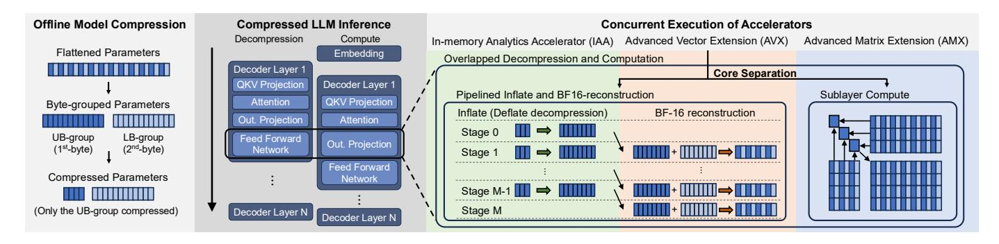

# C. Opportunities and Challenges with On-chip Accelerators

Intel's on-chip accelerators provide opportunities for accelerating the decompression of Deflate with byte-grouping, which shows the highest potential to benefit from compressed LLM inference. IAA offers hardware-accelerated decompression for Deflate, while AVX enables wide vectorized operations ideal for BF16 reconstruction. However, without careful tuning of accelerator operating parameters, efficient thread management, and coordinated orchestration, substantial performance variation and resource under-utilization can occur. For instance, differences in thread management implementations and accelerator operating parameters can cause up to  $2\times$ variation in decompression throughput (§IV-C). Moreover, lacking proper coordination between these accelerators can lead to significant idle time, yielding up to 1.9× lower performance without fine-grained pipelining and 1.6× lower performance without overlapping decompression and inference computation (§V-C). Therefore, fully exploiting these accelerators requires careful orchestration, thread management, and operating-parameter tuning to maximize decompression and compute efficiency, forming the motivation of our work.

Fig. 6. Overview of LILO.

